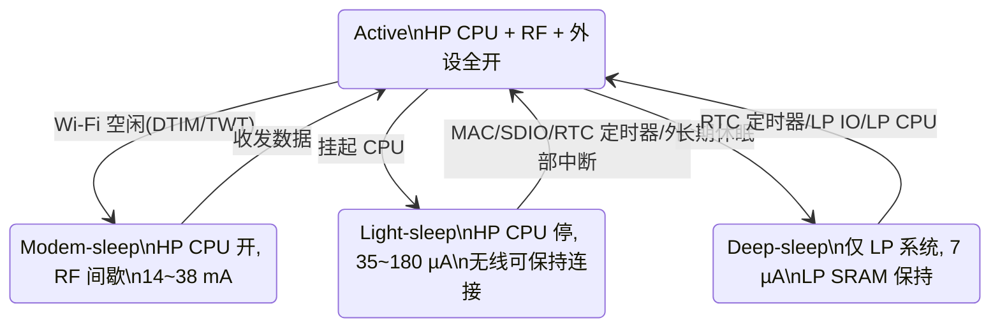

# ESP32-C6

> Espressif · HP RISC-V 160 MHz + LP RISC-V 20 MHz · WiFi 6 + BLE 5.3 + 802.15.4 三模 · 极低功耗 IoT SoC
> Datasheet: `F:\Projects\PCB\Library\Datasheet\Chip_Microcontroller_ESP32-C6.PDF`（技术规格书 v1.2，2024-08）

## 1. 身份选型

- **型号**: ESP32-C6 系列
- **内核**: HP RISC-V 32-bit（主核，RV32IMAC，160 MHz）+ LP RISC-V 32-bit 协处理器（低功耗核，20 MHz）
- **无线**: WiFi 6 (802.11ax，2.4 GHz)，Bluetooth 5 (LE)（通过 BT 5.3 认证），Zigbee 3.0，Thread 1.3 (802.15.4)
- **命名规则**: `ESP32-C6` + `F`（封装内 flash）+ `H/N`（flash 温度等级，H=高温/N=正常）+ `x`（flash 容量 MB）

| 订购代码 | 封装内 Flash | 环境温度 | 封装 |
|----------|-------------|----------|------|
| ESP32-C6 | —（外接 flash） | –40 ~ 105 °C | QFN40 (5×5 mm) |
| ESP32-C6FH4 | 4 MB (Quad SPI) | –40 ~ 105 °C | QFN32 (5×5 mm) |
| ESP32-C6FH8 | 8 MB (Quad SPI) | –40 ~ 105 °C | QFN32 (5×5 mm) |

- **车规**: —

> [!note] 封装内 flash 的隐性限制
> FH4/FH8 的封装内 flash 默认最高时钟 **80 MHz**，且**不支持自动暂停（auto-suspend）**——需要 120 MHz flash 时钟或自动暂停功能要联系乐鑫。QFN32 变体的 SPI 管脚未引出，无法再外接 flash。

### 同厂横向对比

| | ESP32-C6 | [[ESP32-S3]] | [[ESP8266EX]] |
|---|---|---|---|
| CPU | RISC-V 单核 160 MHz + LP 核 20 MHz | Xtensa LX7 双核 240 MHz | Xtensa L106 80/160 MHz |
| WiFi | **WiFi 6** (802.11ax, 20 MHz) | WiFi 4 (802.11n) | WiFi 4 (802.11n) |
| 蓝牙 | BLE 5.3 (2 Mbps / Coded PHY) | BLE 5.0 | — |
| 802.15.4 | ✅ Zigbee 3.0 / Thread 1.3 | — | — |
| SRAM | 512 KB HP + 16 KB LP | 512 KB | 160 KB |
| PSRAM | ❌ 不支持 | ✅ 最大 8 MB (Octal) | ❌ |
| GPIO | 30 (QFN40) / 22 (QFN32) | 45 | 17 |
| USB | Serial/JTAG（仅调试/下载） | OTG + Serial/JTAG | — |
| Deep-sleep | 7 µA（LP 存储保持） | ~7 µA | ~20 µA |
| 定位 | 低功耗三模 IoT 端节点 | 多媒体/AI 网关 | 上一代低成本 WiFi |

选型逻辑：需要 **Thread/Zigbee/Matter 边界路由**、**WiFi 6 TWT 电池设备**、或 **deep-sleep 下仍要跑逻辑（LP 核）**时选 C6；需要大 RAM（PSRAM）、摄像头 DVP、双核算力时选 [[ESP32-S3]]。

## 2. 极限工况

| 参数 | 范围 | 单位 |
|------|------|------|
| 输入电源管脚允许电压 | –0.3 ~ 3.6 | V |
| IO 输出总电流 | 最大 1000 | mA |
| 存储温度 | –40 ~ 150 | °C |

- **ESD 耐受**: HBM ±2000 V (JS-001)，CDM ±1000 V (JS-002)
- **闩锁**: 过电流 ±200 mA，过电压 1.5 × VDDmax (JESD78)
- **可靠性**: HTOL 125 °C/1000 h，TCT –65/150 °C 500 循环，uHAST 130 °C/85%RH/96 h，MSL 三级（30 °C/60%RH/192 h 浸泡 + 260 °C 回流 ×3）

## 3. 推荐工作条件

| 参数 | 最小 | 典型 | 最大 | 单位 |
|------|------|------|------|------|
| VDDA1 / VDDA2 / VDDA3P3（模拟） | 3.0 | 3.3 | 3.6 | V |
| VDDPST1（LP IO 电源域） | 3.0 | 3.3 | 3.6 | V |
| VDDPST2（HP IO 电源域） | 3.0 | 3.3 | 3.6 | V |
| VDD_SPI（输入模式） | 3.0 | 3.3 | 3.6 | V |
| 电源供流能力 IVDD | ≥ 0.5 | — | — | A |
| 环境温度 TA | –40 | — | 105 | °C |

- 片内两个 **1.1 V LDO**（HP / LP 各一）从 3.3 V 生成内核电压，外部只需单轨 3.3 V。
- VDD_SPI 由 VDDPST2 经内部 **RSPI ≈ 3 Ω** 供给 flash，需保证压降后仍满足 flash 最低工作电压。

> [!warning] 烧写 eFuse 时 VDDPST2 ≤ 3.3 V
> eFuse 烧录电路敏感，写 eFuse（Secure Boot / Flash 加密量产环节）时 VDDPST2 电压不得超过 3.3 V。

## 4. 功耗热特性

四级功耗模式（Active → Modem-sleep → Light-sleep → Deep-sleep），由 PMU 按电源域组合供电：

### Active 模式射频峰值电流（3.3 V / 25 °C，TX 100% 占空比）

| 射频 | 工况 | 峰值 (mA) |
|------|------|-----------|
| WiFi TX | 802.11b, 1 Mbps @ 21.0 dBm | **354** |
| WiFi TX | 802.11g, 54 Mbps @ 19.5 dBm | 300 |
| WiFi TX | 802.11n, HT20, MCS7 @ 18.5 dBm | 280 |
| WiFi TX | 802.11n, HT40, MCS7 @ 18.0 dBm | 268 |
| WiFi TX | 802.11ax, MCS9 @ 16.5 dBm | 252 |
| WiFi RX | 802.11b/g/n HT20 / ax HE20 | 78 |
| WiFi RX | 802.11n HT40 | 82 |
| BLE TX | @ 20 dBm / 9 dBm / 0 dBm / –15 dBm | 315 / 190 / 130 / 94 |
| BLE RX | — | 71 |
| 802.15.4 TX | @ 20 dBm / 12 dBm / 0 dBm / –15 dBm | 305 / 187 / 119 / 92 |
| 802.15.4 RX | — | 74 |

### Modem-sleep（HP CPU 保持运行，WiFi 时钟门控）

| CPU 频率 | CPU 状态 | 外设时钟全关 (mA) | 外设时钟全开 (mA) |
|----------|----------|------|------|
| 160 MHz | 工作 | 27 | 38 |
| 160 MHz | 空闲 | 17 | 28 |
| 80 MHz | 工作 | 19 | 30 |
| 80 MHz | 空闲 | 14 | 25 |

### 低功耗模式

| 模式 | 供电状态 | 典型值 |
|------|----------|--------|
| Light-sleep | CPU、无线断电，外设时钟关，GPIO 高阻 | 180 µA |
| Light-sleep | 上行基础上再关外设电源 | **35 µA** |
| Deep-sleep | 仅 RTC 定时器 + LP 存储器上电 | **7 µA** |
| 关闭 | CHIP_PU 拉低 | 1 µA |

### 唤醒源矩阵

| 唤醒源 | Modem-sleep | Light-sleep | Deep-sleep |
|--------|:---:|:---:|:---:|
| WiFi MAC（DTIM Beacon / TWT） | ✅ | ✅ | — |
| SDIO 主机 | ✅ | ✅ | — |
| RTC 定时器 | ✅ | ✅ | ✅ |
| 外部中断（GPIO） | ✅ | ✅ | ✅（LP IO） |
| LP CPU | ✅ | ✅ | ✅ |
| UART | ✅ | ✅ | — |

> [!tip] LP 核是 Deep-sleep 的灵魂
> Deep-sleep 下 HP 系统整体断电，但 **LP RISC-V 核 + 16 KB LP SRAM + LP UART / LP I2C** 可保持运行——LP 核能轮询传感器、判断阈值，只有需要联网时才唤醒 HP 核。无线连接上下文存放在 LP 存储器中，唤醒后快速恢复。这把"7 µA 待机"从纯睡眠升级成"7 µA 量级下仍有智能"。

> [!note] 隐性功耗坑
> Modem-sleep 下访问 flash 会额外增加功耗（cache miss 触发 SPI 读）；热阻 ΘJA / ΘJC 数据手册未给出（—）。

## 5. IO 接口特性

- **GPIO**: 30 个 (QFN40) / 22 个 (QFN32)；其中 **5 个为 strapping 管脚**、QFN40 上 **6 个用于连接 flash**
- **驱动能力**: 默认 20 mA（GPIO12/13 默认 40 mA）；IOH 典型 40 mA @ PAD_DRIVER=3，IOL 典型 28 mA
- **电平**: VIH ≥ 0.75×VDD，VIL ≤ 0.25×VDD；内部弱上/下拉均为 45 kΩ；管脚电容 2 pF
- **GPIO 交换矩阵**: 85 路外设输入 / 93 路输出信号可映射到任意 GPIO（灵活但有延迟）；IO MUX 直连（UART0/JTAG/SPI/SDIO）无此损失
- **LP IO MUX**: GPIO0~7 兼作 LP_GPIO0~7，Deep-sleep 下仍可用，承载 LP UART（LP_GPIO0~5）与 LP I2C（LP_GPIO6~7）

### 数字外设清单

| 外设 | 数量/规格 | 亮点 |
|------|----------|------|
| UART | 2 × HP + 1 × LP | 最高 5 MBaud，RS485/IrDA（HP），GDMA，唤醒源 |
| SPI | SPI0/1（flash 专用）+ SPI2 通用 | SPI2 主机 80 MHz / 从机 40 MHz，1/2/4 线，6 个 CS |
| I2C | 1 × HP + 1 × LP | 100/400 kbit/s，7/10 位寻址；LP I2C 仅主机 |
| I2S | 1 | TDM/PDM，BCK 最高 40 MHz，8~192 kHz 采样，A-law/µ-law |
| TWAI (CAN 2.0) | **2 个** | ISO 11898-1，1 kbit/s ~ 1 Mbit/s，11/29 位 ID，单/双过滤器 |
| SDIO 2.0 从机 | 1 | SPI / 1-bit / 4-bit，0~50 MHz，块 512 B，DMA，休眠保持连接 |
| USB Serial/JTAG | 1 | USB 2.0 全速 12 Mbit/s，CDC-ACM 虚拟串口 + JTAG 调试 + ROM 下载，内置 PHY |
| LED PWM (LEDC) | 6 通道 | 20 位精度，伽马渐变（16 段），**Light-sleep 下可继续输出** |
| MCPWM | 3 定时器 + 3 操作器 | 6 路 PWM 输出，可编程死区，故障保护，3 路 32 位捕获 |
| RMT 红外 | 4 通道 | 收发独立，乒乓模式，载波调制/解调 |
| PCNT | 4 计数器 × 2 通道 | 正交编码器计数，毛刺滤波 |
| PARLIO | 1 | 1/2/4/8/16 位并行总线，GDMA 直挂 |
| GDMA | 3 TX + 3 RX 通道 | SPI2/UART/I2S/AES/SHA/ADC/PARLIO 共享，链表描述符 |
| ETM 事件任务矩阵 | 50 通道 | 124 事件 → 130 任务，外设互触发**无需 CPU** |
| 定时器 | 52 位 SYSTIMER + 2×54 位 TIMG | 3 数字 WDT + 模拟超级看门狗 (SWD) |

### 模拟外设

| 参数 | 值 |
|------|----|
| ADC | 12 位 SAR，7 通道（GPIO0~6 = ADC1_CH0~6），最高 100 kSPS |
| DNL / INL | –8~+12 LSB / ±10 LSB |
| 校准后误差 | ATTEN0 (0~1000 mV) ±12 mV；ATTEN1 (0~1300) ±12；ATTEN2 (0~1900) ±23；ATTEN3 (0~3300) ±40 mV |
| 温度传感器 | –40 ~ 125 °C，硬件自动监测 + 阈值唤醒 |
| DAC | —（无） |

> [!warning] GPIO 预算非常紧张
> QFN32 只有 22 个 IO，扣掉 strapping（GPIO8/9/15 + MTMS/MTDI）、USB Serial/JTAG（GPIO12/13，默认 USB 上拉）、UART0（GPIO16/17）、6 个 SDIO 管脚后，随意可用的 IO 极少。ADC 只在 GPIO0~6，且与 32K 晶振（GPIO0/1）、JTAG（GPIO4~7）、LP 外设全部重叠——外设一多必须精打细算复用表。

## 6. 核心功能

![[_llm/raw/assets/datasheets/esp32c6/esp32c6_p15_full.jpg|640]]
*功能框图（数据手册 p15）：RISC-V 160MHz 主核 + LP 核 + WiFi 6 / BLE 5 / 802.15.4 三模射频*

### 6.1 双核体系：HP + LP 的分工

- **HP 核（主核）**: RV32IMAC，四级流水线，160 MHz，**CoreMark 464.36（2.90 CoreMark/MHz）**。带 BTB 静态分支预测、28 个向量外部中断（16 优先级）、PMP/PMA 各 16 区域、RISC-V Trace 1.0 指令追踪编码器、JTAG/USB 调试。跑协议栈和应用。
- **LP 核（协处理器）**: RV32IMAC，二级流水线，20 MHz，19 个向量中断。**Deep-sleep 下 HP 断电时保持上电**，可访问 HP/LP 全部存储器和所有外设空间，可唤醒 HP 核或向其发中断。
- 分工哲学：与其让 160 MHz 大核以 mA 级电流醒着轮询，不如让 20 MHz 小核以 µA 级电流盯着传感器——事件驱动唤醒大核。这是"始终感知、按需计算"的低功耗架构。

### 6.2 存储器组织

| 存储 | 容量 | 用途 |
|------|------|------|
| ROM | 320 KB | 启动代码 + 内核函数 |
| HP SRAM | 512 KB | 指令 + 数据（IRAM/DRAM 零等待访问） |
| LP SRAM | 16 KB | Deep-sleep 数据保持 + LP 核程序 |
| L1 Cache | 32 KB | flash 取指/取数加速，四路组相连，32 B 行，关键字优先 |
| eFuse | 4096 位（用户 1792 位） | 密钥、MAC、配置，一次性烧写 |
| 封装内 flash | 4/8 MB (FH4/FH8) | ≥10 万次擦写，≥20 年保持，默认 80 MHz |
| 封装外 flash | 最大 16 MB | SPI/Dual/Quad/QPI，XTS-AES 硬件加解密，指令/数据各 16 MB 按 64 KB 块映射 |

> [!warning] 没有 PSRAM 接口
> ESP32-C6 外部存储只支持 flash，**不支持 PSRAM 扩展**——大缓冲（音频/图像/大型 TLS 会话池）应用要么精打细算 512 KB SRAM，要么换 [[ESP32-S3]]。

### 6.3 三模射频与共存

- **单天线三协议**: WiFi 6 / BLE 5.3 / 802.15.4 **共用同一 ANT 管脚**，片内集成 balun、收发切换器、PA、LNA；共存由时分调度自动仲裁，无需外部射频开关。
- **发射能力**: 802.11b 最高 **+21 dBm**，802.11ax 最高 +19.5 dBm；BLE/802.15.4 范围 –15 ~ +20 dBm（高功率模式 20 dBm）。
- **接收灵敏度**（典型）: 802.11b 1 Mbps –99.2 dBm；11ax HE20 MCS0 –93.8 / MCS9 –69.0 dBm；BLE 125 Kbps Coded **–106 dBm**；802.15.4 –104 dBm @1% PER。
- **天线分集**: 支持 GPIO 控制外部射频开关做双天线选择，抗信道衰落。
- 内置校准（载波泄露消除、I/Q 相位匹配、基带/射频非线性抑制、天线匹配）缩短产测时间。
- 典型组合：BLE 做配网入口 + Thread/Zigbee 组 mesh + WiFi 回传——单芯片即可做 **Matter over Thread/WiFi** 设备或边界路由器。

### 6.4 WiFi 6 对嵌入式的实际价值

802.11ax 仅 20 MHz 带宽、非 AP 模式、1T1R（MCS0~9）——这不是"更快的 WiFi"，而是"更省、更稳的 WiFi"：

- **TWT（目标唤醒时间）**: 与 AP 协商唤醒调度表，芯片在约定时隙外深度休眠，不必每 DTIM 醒来监听 Beacon——电池型 WiFi 传感器的核心特性，休眠占比可提升一个数量级。
- **UL/DL OFDMA**: 一个 20 MHz 信道细分成多个 RU 子载波组，多设备并发收发小包，**高密度部署（几十上百节点）下时延和碰撞显著下降**——这正是 IoT 网络的典型流量形态。
- **DL MU-MIMO / Beamformee / DCM / 空间复用 / BSS Coloring**: 提升密集 AP 环境下的抗干扰与链路稳定性；DCM 双载波调制以速率换稳健。
- **更长 OFDM 保护间隔**（0.8/1.6/3.2 µs）：多径环境更稳。
- 向下兼容 802.11b/g/n（HT40 下最高 150 Mbps），WPA2/WPA3 个人及企业模式、GCMP/CCMP。
- **硬件 TSF**: 自动 Beacon 监测由硬件 TSF 定时器完成，CPU 可睡——同一定时器也是 [[通讯网络/TSF WiFi 时间同步]] 的 µs 级同步基准。
- 4 个虚拟接口，Station / SoftAP / Station+SoftAP / 混杂模式，802.11mc FTM 测距。

> [!note] Station 扫描会拖动 SoftAP 信道
> Station 模式扫描时 SoftAP 的信道会跟着切换（单射频时分复用的固有限制）——做配网热点 + STA 并存时要注意业务中断窗口。

### 6.5 BLE 5.3 与 802.15.4

- **BLE**: 1M/2M PHY + Coded PHY（125/500 Kbps 长距离），广播扩展、多广播集、CSA#2、LE Power Control、LE Privacy 1.2、数据包长度扩展、Bluetooth mesh；硬件 LBT。
- **802.15.4-2015**: OQPSK 250 Kbps @2.4 GHz（信道 11~26），硬件帧过滤/自动应答/自动帧等待、CSMA/CA、协调采样侦听 (CSL)，RSSI/LQI——支撑 **Thread 1.3、Zigbee 3.0、Matter、HomeKit**。

### 6.6 安全体系

- **Secure Boot** + **Flash 加密（XTS-AES，支持抗 DPA）**——代码保密与防篡改的量产基线
- **TEE 可信执行环境 + APM 访问权限管理**: 每个总线主设备（含 DMA）四种安全模式，16 地址区域权限
- 硬件加速器：AES-128/256（ECB/CBC/OFB/CTR/CFB）、ECC（P-192/P-256）、HMAC-SHA-256（eFuse 密钥，下行模式软件不可见）、RSA（模幂最高 3072 位）、SHA-1/224/256、数字签名 (DS)、真随机数 RNG
- eFuse 4096 位 OTP，支持读/写保护

### 6.7 时钟与复位

- **40 MHz 外部晶振为强制项**（无晶振芯片无法工作），片内 PLL 480 MHz
- 低速时钟：内部快速 RC 17.5 MHz、慢速 RC 136 kHz、32 kHz RC、外部 32.768 kHz 晶振（GPIO0/1）
- 四级复位：CPU 复位 / 内核复位 / 系统复位 / 芯片复位（仅芯片复位清 RAM）
- 看门狗：2 × MWDT + RWDT（四阶段可配超时动作）+ 模拟超级看门狗 SWD（~1 s）

## 7. 引脚典型连线

### 最小系统清单

| 要素 | 连接 |
|------|------|
| 电源 | VDDA3P3 ×2、VDDA1、VDDA2、VDDPST1、VDDPST2 全部接 3.3 V，每脚就近去耦 |
| CHIP_PU (EN) | RC 上电延时（电源稳定 ≥50 µs 后拉高）；**严禁浮空**；拉低 ≥50 µs 可复位 |
| 晶振 | XTAL_P/N 接 40 MHz（必需）；GPIO0/1 可接 32.768 kHz（RTC 精度需要时） |
| Flash (QFN40) | SPICS0/SPICLK/SPID/SPIQ/SPIWP/SPIHD 按 Quad SPI 连接，VDD_SPI 供电 |
| 下载/调试 | GPIO12/13 → USB D–/D+（免外部 USB 芯片），或 U0TXD/U0RXD 接串口 |
| 天线 | ANT 经 π 型匹配网络接 2.4 GHz 天线 |

### Strapping 管脚与启动模式

| Strapping 管脚 | 默认状态 | 作用 |
|----------------|----------|------|
| GPIO9 | 弱上拉（=1） | 启动模式（与 GPIO8 联合） |
| GPIO8 | 浮空 | 启动模式 + UART0 ROM 日志控制 |
| GPIO15 | 浮空（无内部上下拉，**必须外部驱动**） | JTAG 信号源选择 |
| MTMS / MTDI | 浮空 | SDIO 输入采样沿 / 输出驱动沿 |

| 启动模式 | GPIO8 | GPIO9 |
|----------|-------|-------|
| SPI Boot（默认，从 flash 运行） | 任意 | **1** |
| Joint Download Boot（USB-Serial-JTAG / UART / SDIO 下载） | 1 | 0 |

- 复位释放后 strapping 值被锁存器采样保持（保持时间 ≥3 ms），之后管脚恢复普通 GPIO 用途。
- JTAG 信号源由 GPIO15 + 3 个 eFuse 位共同决定：默认走 USB Serial/JTAG；`EFUSE_JTAG_SEL_ENABLE=1` 时 GPIO15=0 选 JTAG 管脚（MTMS/MTDI/MTCK/MTDO）、=1 选 USB。

> [!warning] Strapping 外围电路检查
> GPIO8/9/15 上若挂了外设（LED、按键、上/下拉），务必核对上电瞬间电平不会误触发下载模式或改变 ROM 打印/JTAG 路由。进下载模式的标准接法：GPIO9 按键接地 + GPIO8 上拉。

### 射频布局与供电去耦要点

- **3.3 V 轨按 ≥0.5 A 设计**（推荐工作条件的 IVDD 下限）：802.11b @21 dBm 峰值 354 mA，叠加系统电流后 LDO/DCDC 与储能电容必须扛住突发；欠压会导致发射时复位。
- VDDA3P3（pin 2/3，紧邻 ANT）是射频电源入口，去耦电容贴管脚放置，大容量储能电容就近。
- ANT 走线做 50 Ω 阻抗控制，预留 π 匹配（C-L-C）；天线净空区内禁铺铜。
- 40 MHz 晶振远离射频走线与高速数字线；底部 EPAD（pin 41/33 GND）多过孔接地——既是电气地也是散热通道。
- USB 差分对（GPIO12/13）等长、90 Ω 差分阻抗。

> [!note] USB Serial/JTAG 只是调试口
> 该控制器是固定功能 CDC-ACM + JTAG（全速 12 Mbit/s，不支持 480 Mbit/s 高速），**不是通用 USB OTG**，不能模拟 HID/MSC 等自定义设备类。GPIO12/13 默认被 USB 上拉占用，用作普通 GPIO 前需关闭 USB 功能。

## 8. 封装机械尺寸

| 封装 | 引脚数 | 尺寸 | 适用型号 |
|------|--------|------|----------|
| QFN40 | 40 + EPAD (GND) | 5 × 5 mm | ESP32-C6（外接 flash，30 GPIO） |
| QFN32 | 32 + EPAD (GND) | 5 × 5 mm | ESP32-C6FH4 / FH8（22 GPIO） |

- 管脚自 Pin 1 起逆时针编号（俯视）；乐鑫官网提供 PADS / Altium 可导入的推荐 PCB 封装源文件 (asc)。

## 参见

- [[ESP32-S3]] — 同厂高性能路线（双核 Xtensa + PSRAM + USB OTG）
- [[ESP8266EX]] — 上一代低成本 WiFi SoC，对照可见十年架构演进
- [[通讯网络/TSF WiFi 时间同步]] — 基于 C6/S3 硬件 TSF 定时器的 µs 级多节点同步方案
