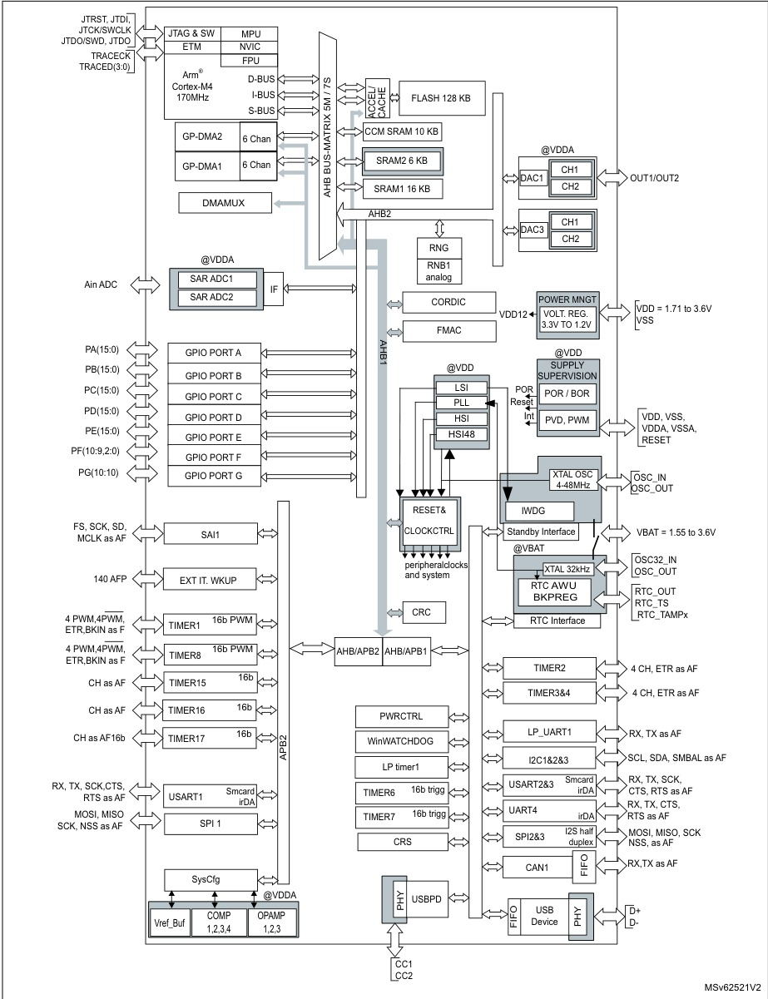
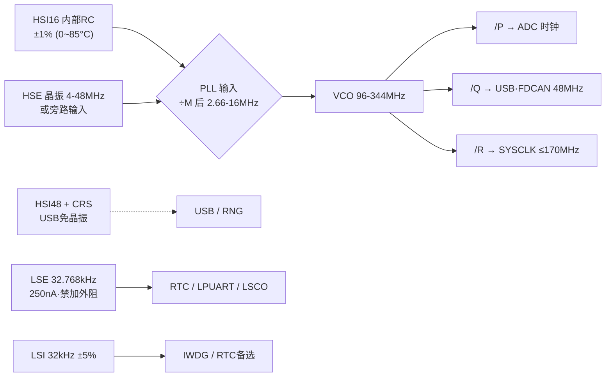

# STM32G431

STM32G431 是 ST **G4 系列的入门型号（Access line）**：Cortex-M4F @ 170 MHz + CORDIC/FMAC 数学加速器 + 大量高速模拟外设（4 Msps 双 ADC、运放、比较器、DAC）。它的基因不是"低功耗"也不是"大存储"，而是**实时控制**——电机 FOC、数字电源、伺服环路这类"采样→算→输出 PWM"的毫秒/微秒级闭环。相比 F103（72 MHz 无 FPU）、F303（72 MHz 模拟增强）、G071（64 MHz M0+），G431 把主频、模拟前端、硬件数学三者同时拉满，同价位段几乎就是为控制环路设计的。

## 1. 身份选型

- **型号**: STM32G431x6/x8/xB（本页覆盖全后缀，数据来自 DS12589 Rev 6，2021-10）
- **内核**: Arm Cortex-M4 + 单精度 FPU + DSP 指令 + MPU（8 区域），170 MHz / 213 DMIPS，ART 加速器实现 Flash 0 等待执行
- **存储**: 32/64/128 KB Flash（ECC，单 Bank）+ 1 KB OTP + 32 KB SRAM（16 KB SRAM1 + 6 KB SRAM2 + 10 KB CCM）
- **数学加速**: CORDIC（三角/双曲函数）+ FMAC（FIR/IIR 滤波 MAC）
- **无 AES 硬件加密**（G4 中带加密的是 G441/G483/G484）

命名解码（`STM32 G 431 V B T 6`）：

| 字段 | 含义 | 取值 |
|------|------|------|
| G | 产品线 | 通用型（Mainstream） |
| 431 | 子系列 | G431x6/x8/xB |
| 引脚数 | K/C/R/M/V | K=32，C=48/49，R=64，M=80，V=100 |
| Flash | 6/8/B | 6=32 KB，8=64 KB，B=128 KB |
| 封装 | T/U/I/Y | T=LQFP，U=UFQFPN，I=UFBGA，Y=WLCSP |
| 温度 | 6/3 | 6：-40~85°C（结温 105°C）；3：-40~125°C（结温 130°C） |

- **车规**: —（本手册为工业级；AEC-Q100 需查 STM32G431 车规版单独文档）

> [!note] 选型逻辑
> 同为 G4：需要 HRTIM（184 ps 高分辨率定时器）或 512 KB Flash → 选 G474；只做电机/信号链、128 KB 够用 → G431 是性价比选择。全系列引脚兼容，方案可平移。

## 2. 极限工况

绝对最大额定（超出即可能永久损坏）：

| 参数 | 限值 | 单位 |
|------|------|------|
| VDD − VSS（含 VDDA/VBAT/VREF+） | −0.3 ~ **4.0** | V |
| FT 引脚输入电压 | VSS−0.3 ~ min(VDD,VDDA)+4.0 | V |
| FT_c（UCPD）引脚输入电压 | VSS−0.3 ~ 5.5 | V |
| TT 引脚输入电压 | VSS−0.3 ~ 4.0 | V |
| ΣIVDD / ΣIVSS 总电流 | 150 | mA |
| 单个 VDD/VSS 引脚电流 | 100 | mA |
| 单 IO 灌/拉电流 | 20 | mA |
| ΣIIO 全部 IO 总电流 | 100 | mA |
| 注入电流（单脚 / 总和） | −5/0 / ±25 | mA |
| 存储温度 TSTG | −65 ~ +150 | °C |
| 最高结温 TJ | 150 | °C |

- **ESD 耐受**: HBM 2000 V（Class 2），CDM 250 V（Class C1）
- **闩锁**: JESD78E Class II level A（125°C）
- 各 VDDx 引脚间电位差、各 VSSx 间电位差均须 ≤50 mV

> [!warning] "5V 耐压"的三个前提
> FT 引脚耐 5 V 的条件：① 芯片已上电（上限公式含 min(VDD,VDDA)+4.0，掉电时 VDDA=0 上限骤降）；② 输入电压超过 min(VDD,VDDA)+0.3 V 时必须**关闭内部上下拉**；③ 正注入不可能发生但负注入（VIN < VSS）严格限 −5 mA。模拟引脚被负注入会拖垮相邻 ADC 通道精度，手册建议在有风险的模拟输入对地加肖特基二极管。

## 3. 推荐工作条件

| 电源轨 | 范围 | 说明 |
|--------|------|------|
| VDD | 1.71 – 3.6 V | IO、调压器、系统模拟（复位/时钟） |
| VDDA | 1.62 – 3.6 V | 模拟外设独立供电，可与 VDD 不同电位 |
| ├ ADC/COMP 使用 | ≥1.62 V | |
| ├ DAC 使用 | ≥1.71 V | |
| ├ OPAMP 使用 | ≥2.0 V | |
| └ VREFBUF 使用 | ≥2.4 V | |
| VBAT | 1.55 – 3.6 V | RTC + LSE + 备份寄存器，带充电电路 |
| VREF+ | VDDA<2 V 时必须=VDDA；≥2 V 时取 2 V~VDDA | ADC/DAC 基准输入 |
| fHCLK / fPCLK1 / fPCLK2 | 0 – 170 MHz | AHB/APB1/APB2 上限相同 |

**电源架构：纯 LDO，没有 SMPS。** 片内是两只线性调压器——主调压器 MR（Run/Sleep）与低功耗调压器 LPR（LP-Run/LP-Sleep/Stop），Standby/Shutdown 时全部关断。MR 支持动态电压调节（VCORE 三档）：

| 档位 | fCPU 上限 | 用途 |
|------|-----------|------|
| Range 1 Boost | 170 MHz | 满血模式 |
| Range 1 | 150 MHz | 常规高性能 |
| Range 2 | 26 MHz | 低压低耗（ADC 也随之限 26 MHz） |

- **BOR**: 5 档阈值（BOR0 1.66 V 固定使能 ~ BOR4 2.90 V，选项字节配置），Shutdown 外全模式有效，免外部复位芯片
- **PVD**: 7 档可编程（2.15 – 2.98 V）+ 上下穿越中断
- **PVM**: 监控 VDDA（PVM1 1.65 V 对应 ADC/COMP，PVM2 1.82 V 对应 OPAMP/DAC）
- **VREFBUF**: 内部基准缓冲输出 2.048 / 2.5 / 2.9 V 三档到 VREF+ 脚，可供片外器件；部分小封装 VREF+ 与 VDDA 双键合，此时 VREFBUF 不可用
- 掉电斜率要求：VDD/VDDA 下降 ≥10 µs/V（下降过快 BOR 可能来不及动作）

> [!note] 去耦规格（手册图 16 明确给值）
> 每个 VDD 脚 100 nF + 全局 4.7 µF；VDDA 10 nF + 1 µF；VREF+ 100 nF + 1 µF。VDDA 即使不用模拟外设也必须供电（建议接 VDD）。

## 4. 功耗热特性

G4 是高性能系列，静态电流明显高于 L 系（同温度 Stop 电流约为 L4 的数倍），选它就是拿功耗换算力。典型值（25°C，外设关闭，Flash 执行 + ART）：

| 模式 | 条件 | 典型电流 | 换算 |
|------|------|----------|------|
| Run（R1 Boost） | 170 MHz | 25.5 mA | ≈150 µA/MHz |
| Run（R1） | 150 MHz | 21.0 mA | 140 µA/MHz |
| Run（R1） | 48 MHz | 6.95 mA | 145 µA/MHz |
| Run（R2） | 26 MHz | 3.20 mA | 123 µA/MHz |
| LP-Run | 2 MHz（HSE） | 350 µA | LPR 供电，CPU 限 2 MHz |
| Sleep | 170 MHz | 7.40 mA | CPU 停、外设跑 |
| Stop 0 | 主调压器保持 | 150 µA | 唤醒最快 |
| Stop 1 | RTC 关 | 58.5 µA | SRAM/寄存器保持 |
| Stop 1 + RTC(LSI) | | ~60 µA | |
| Standby | RTC 关，3 V | 120 nA | SRAM 丢（SRAM2 可选保留） |
| Standby + IWDG | 3 V | 400 nA | |
| Shutdown | 3 V | 35 nA | BOR 也关，仅 RTC 域可活 |
| VBAT | RTC 关，3 V | 6 nA | |
| VBAT + RTC(LSE) | 3 V | ~0.7 µA | 纽扣电池走 RTC 的代价 |

高温惩罚显著：Stop 1 在 125°C 时典型飙到 1.9 mA（漏电指数增长），125°C 场景不要指望 Stop 模式省电。

唤醒时间（HSI16 唤醒，典型值）：

| 从哪唤醒 | 到 Run | 备注 |
|----------|--------|------|
| Sleep | 11 CPU 周期 | |
| Stop 0 | 5.8 µs（Flash）/ 2.8 µs（SRAM） | Range 1 |
| Stop 1 | 9.5 µs（Flash） | Range 2 下 21.9 µs |
| Standby | 29.7 µs | 程序重新从头跑 |
| Shutdown | 267.9 µs | 相当于冷启动 |

热阻（ΘJA，°C/W）：LQFP100 48.9 / LQFP80 49.7 / LQFP64 50.8 / LQFP48 58.4 / LQFP32 58.4 / UFBGA64 44.2 / **UFQFPN48 28.6**（底部散热焊盘）/ UFQFPN32 36.7 / WLCSP49 59。ΘJC 约 10~15（UFQFPN 底盘 3.1~3.4）。结温校验：TJ = TA + PD×ΘJA，满载 25.5 mA×3.3 V≈84 mW 在 LQFP48 上仅温升 ~5°C——纯 MCU 自热不构成问题，热预算主要留给同板功率器件。

## 5. IO 接口特性

- **GPIO**: 最多 86 个（LQFP100），全部可映射 EXTI，AHB2 直连支持高速翻转
- IO 结构类型：**FT**（5 V 耐压）/ **TT**（3.6 V）；后缀 `_a` 带 VDDA 供电模拟开关、`_f` 支持 Fm+ 20 mA 灌电流、`_c` UCPD CC 脚、`_d` UCPD 死电池、`_u` USB
- 静态特性：VIL ≤ 0.3×VDD，VIH ≥ 0.7×VDD，迟滞 200 mV，漏电 ±100 nA（FT，VIN≤VDD），内部上/下拉 25–55 kΩ（典型 40 kΩ），引脚电容 5 pF
- 驱动能力：标准 ±8 mA（VOL≤0.4 V）；放宽至 ±20 mA（VOL≤1.3 V）；FT_f 脚 Fm+ 模式 20 mA 灌电流仍保 VOL≤0.4 V
- 速度等级（OSPEEDR）：00 档 10 MHz → 11 档 120 MHz@30 pF / 180 MHz@10 pF（IO 本身能力，系统上限 170 MHz）
- **NRST**: 永久内置上拉 40 kΩ；<70 ns 脉冲被滤除，>350 ns 保证复位

### 片内模拟信号链（G431 的灵魂）

| 外设 | 数量 | 关键参数 |
|------|------|----------|
| ADC（SAR 12-bit） | 2 | fADC ≤60 MHz（Range 2 限 26 MHz），**4 Msps**@12bit，6-bit 时至 6.66 Msps；最短采样 41.67 ns；硬件过采样至 16-bit；单端/差分；ENOB 10.6，TUE 典型 5.9 LSB（差分 4.6），DNL 1.1 / INL 2.3 LSB；4 Msps 时 VDDA 耗流 590 µA |
| DAC1 | 2 通道 | 外部输出，带缓冲 1 MSPS，建立 1.7 µs，摆幅 0.2 V~VREF+−0.2 V（RL≥5 kΩ）；三角/噪声/锯齿波发生 |
| DAC3 | 2 通道 | **内部专用** 15 MSPS 无缓冲，直连比较器/运放——做斜坡补偿、动态阈值 |
| OPAMP | 3 | GBW 13 MHz，压摆 6.5 V/µs（高速模式 45），失调 ±1.5 mV@25°C（出厂修调），PGA 增益 ×2~×64 / 反相 −1~−63，轨到轨 |
| COMP | 4 | 传播延迟典型 **16.7 ns**（≤31 ns@VDDA≥2.7 V），8 档迟滞 0~63 mV，可从 Stop 唤醒、直接触发定时器刹车 |
| VREFINT | 1 | 1.212 V（1.182–1.232），出厂逐片标定值存 0x1FFF75AA |
| 温度传感器 | 1 | ADC1_IN16；两点标定 TS_CAL1@30°C（0x1FFF75A8）、TS_CAL2@130°C（0x1FFF75CA） |
| VBAT 监测 | 1 | ADC1_IN17，内部 1/3 分压 |

组合玩法：电流采样电阻 → OPAMP（PGA ×16，免外部仪表放大器）→ ADC 差分 4 Msps → 过采样提 SNR；同时 DAC3 生成过流阈值 → COMP → 硬件直达 TIM1 刹车——**整条保护链路不经过 CPU**，延迟纳秒级。这就是"rich analog"在电机/电源场景的实际意义。

> [!warning] ADC 使用要点
> ① 每次上电后执行校准（手册明确建议）；② 2.5 周期采样时源阻抗必须 ≤100 Ω，高阻信号先过运放跟随；③ VDDA <2.4 V 时要开 SYSCFG 的模拟开关升压位（BOOSTEN）；④ 4 Msps 只有"快通道"能达到，慢通道 2 Msps 封顶。

### 通信接口

| 接口 | 数量 | 能力 |
|------|------|------|
| USART | 3 | 同步模式、智能卡 ISO7816、LIN、IrDA、Modbus、自动波特率，Stop 唤醒，8 级 FIFO |
| UART | 1 | UART4（无同步/智能卡） |
| LPUART | 1 | 仅 LSE 时钟即可 9600 bps，Stop 下等帧唤醒 |
| SPI | 3 | 主 75 Mbps / 从 41 Mbps，4–16 bit 帧，硬件 CRC；SPI2/3 复用半双工 I2S |
| I2C | 3 | 全部支持 Fm+ 1 Mbit/s（20 mA 灌电流）、SMBus/PMBus、Stop 地址匹配唤醒 |
| FDCAN | 1 | ISO 11898-1 + CAN FD 1.0，1 KB 报文 RAM；收发器配 [TJA1044](../接口存储/TJA1044.md) |
| USB | 1 | 2.0 FS 设备，内置 PHY + DP 上拉 + BCD 电池充电检测 + LPM |
| UCPD | 1 | Type-C Rev 1.2 + PD Rev 3.0：Rp/Rd 内置、死电池、FRS 快速角色切换 |
| SAI | 1 | 双子块，I2S/PCM/TDM/AC'97/SPDIF out，8–192 kHz |
| IRTIM | 1 | TIM16(调制)+TIM17(载波) 硬件合成红外发射，输出 PB9/PA13 |

USB 48 MHz 时钟两条路：① HSI48 + CRS 从 SOF 自动微调——**免晶振**；② PLL Q 输出（要求 HSE 做源才够精度）。

## 6. 核心功能

*Figure 1 — STM32G431 系统框图：Cortex-M4 @170MHz + FPU + 数学加速器(CORDIC/FMAC) + 高级定时器*

### 存储体系

| 块 | 大小 | 地址 | 特性 |
|----|------|------|------|
| Flash | ≤128 KB | 0x08000000 | ECC 单纠双检，单 Bank，2 KB 页；RDP 三级读保护 / WRP / PCROP 只执行区 / Securable 启动密钥区 |
| SRAM1 | 16 KB | 0x20000000 | 全区硬件奇偶校验 |
| SRAM2 | 6 KB | 0x20004000 | Stop/Standby 可保留 |
| CCM SRAM | 10 KB | 0x10000000 | I/D 总线直连零等待，"Routine booster"；别名映射 0x20005800 供 DMA 访问；1 KB 粒度写保护 |

把控制环路 ISR 代码+关键数据放 CCM，跑满 170 MHz 无 Flash 等待、不与 DMA 抢总线——这是 G4 榨性能的标准姿势。Flash 耐久 1 万次擦写；数据保持 30 年@55°C（1 万次后）。编程速度：双字 81.7 µs，2 KB 页擦除 22 ms。

### 数学加速器——为什么控制环路快

- **CORDIC**: 24-bit 旋转引擎，Sin/Cos/Atan2/Modulus/Sqrt/Ln 等，收敛 4 bit/周期（20-bit 精度约 5 周期出双结果），16/32-bit 定点，AHB 从接口 + DMA。FOC 的 Park/Clark 变换每周期都要 sin/cos——软件查表+插值几十上百周期，CORDIC 无阻塞十几周期，且 CPU 可并行干别的。
- **FMAC**: 16×16 乘法器 + 26-bit 累加器 + 256×16 私有 RAM，硬件循环缓冲，直接实现 FIR/IIR（直接 I 型）。数字电源的 3p3z/2p2z 补偿器就是一个小 IIR——FMAC 从触发到出结果完全旁路 CPU（DMA 进出），把补偿器从 ISR 里挪出去。
- 两者本质是把"控制律里最重复的数学"变成外设：CPU 从算子变成调度者。

### 定时器体系（共 14 个）

| 定时器 | 位宽 | 通道 | 互补 | 定位 |
|--------|------|------|------|------|
| TIM1 / TIM8 | 16 | 4+2 | 4 | **高级电机控制**：死区插入、刹车 BRK/BRK2、0–100% 全调制、中心对齐 |
| TIM2 | 32 | 4 | — | 长周期捕获/编码器 |
| TIM3 / TIM4 | 16 | 4 | — | 通用 + 编码器 |
| TIM15 | 16 | 2 | 1 | 中档通用 |
| TIM16 / TIM17 | 16 | 1 | 1 | 通用 + IRTIM |
| TIM6 / TIM7 | 16 | 0 | — | 基本，DAC 触发专用 |
| LPTIM1 | 16 | 1 | — | Stop 模式存活，编码器模式，脉冲计数 |
| IWDG / WWDG / SysTick | | | | 看门狗 ×2 + RTOS 节拍 |

刹车源是硬件互联的精华：COMP 输出、PVD、CSS 时钟失效、SRAM 奇偶错、Flash ECC 错、CPU HardFault 都能**硬件直接**封 PWM 输出，不依赖软件响应。调试断点时计数器可冻结、PWM 可关断，防止功率管挂在导通态。

> [!warning] G431 没有 HRTIM
> 高分辨率定时器（184 ps）是 G474/G484 专属。G431 的 PWM 分辨率上限就是 TIM1/TIM8 在 170 MHz 下的 **5.88 ns**——100 kHz 开关频率下约 10.7 bit 占空比分辨率。做高频数字电源（>300 kHz）分辨率可能不够，需换 G474 或用抖动（dither）补偿。

### 时钟树

- 到 170 MHz 的典型路径：HSI16 ÷4 ×85 ÷2 = 170 MHz（免晶振方案），或 HSE 8 MHz ÷2 ×85 ÷2
- **>150 MHz 必须先切 Range 1 Boost**；PLL 锁定 15 µs 典型
- HSI16 精度：30°C ±0.6%，0~85°C 漂移 ±1%，全温 −2/+1.5%——UART 没问题，USB 不行（所以有 HSI48+CRS）
- CSS 时钟安全系统：HSE 失效自动切回 HSI16 + 中断 + 触发定时器刹车；LSE 也有独立 CSS
- 外设独立时钟：I2C/USART/LPTIM/ADC/SAI/RNG 时钟源与总线时钟解耦，Stop 下可由 HSI16 唤醒供时钟

### 启动与系统

- **启动配置**: BOOT0 电平（PB8 脚或 nBOOT0 选项位，由 nBOOT_SEL 选择来源）+ nBOOT1 选项位 → 三选一：主 Flash / 系统存储器 Bootloader / SRAM1。Bootloader 支持 USART、I2C、SPI、USB-DFU 烧录
- **互联矩阵**: 外设间硬件直连（定时器互触发、ADC 看门狗触发定时器、USB SOF 触发 TIM2 等），Sleep/LP-Run 下仍工作，延迟确定
- **DMA**: 2×6 通道 + DMAMUX 请求路由器——任意外设请求可映射到任意通道，还支持请求生成器（事件合成 DMA 触发）
- **RTC/TAMP**: BCD 日历、数字校准 0.95 ppm、17-bit 唤醒定时器；16×32-bit 备份寄存器，3 个防篡改脚（VBAT 域有效），篡改即擦备份寄存器
- **安全/标识**: 真随机数 RNG（HSI48 供时钟）、可编程多项式 CRC、96-bit 唯一 ID
- **调试**: SWD + JTAG（SWJ-DP 复用），ETM 指令跟踪

## 7. 引脚典型连线

最小系统清单（LQFP48 视角）：

| 项 | 引脚 | 连法 |
|----|------|------|
| 电源 | VDD/VSS ×n | 每对 100 nF + 全局 4.7 µF |
| 模拟电源 | VDDA/VSSA | 10 nF + 1 µF；磁珠或 RC 与 VDD 隔离后星形供电 |
| 基准 | VREF+ | 100 nF + 1 µF；用 VREFBUF 时此电容是其稳定条件 |
| 备份 | VBAT | 无电池时直连 VDD（1.55–3.6 V） |
| 复位 | PG10-NRST | 内置 40 kΩ 上拉；外接对地小电容（惯例 100 nF）滤寄生复位，电容贴近芯片 |
| 启动 | PB8-BOOT0 | 下拉 10 kΩ 保证从 Flash 启动；或烧 nBOOT_SEL 用选项位、释放 PB8 |
| 高速晶振 | PF0/PF1 | 4–48 MHz，CL1=CL2≈5–20 pF（按晶体 CL 计算，PCB+引脚寄生约 10 pF），走线最短 |
| 低速晶振 | PC14/PC15 | 32.768 kHz，4 档驱动强度可调 |
| 调试 | PA13/PA14 | SWDIO/SWCLK，复位后默认为调试功能 |
| USB | PA11/PA12 | DM/DP，内置上拉免外阻；免晶振需使能 CRS |

> [!warning] 布线三坑
> ① **LSE 两脚间禁止加反馈电阻**（手册原文 forbidden，加了反而起振失败）；② HSE 晶体与负载电容必须贴近 PF0/PF1，否则启动时间（典型 2 ms）与稳定性劣化；③ NRST 外部电容若拉得太远，快速毛刺（<70 ns 本应被内部滤波）可能经长走线耦合成有效复位。

- 未用 IO：悬空（复位后默认模拟态，功耗最低）或配模拟模式，不要配输入悬空长期跑
- 大电流 IO 分散布置：两个相邻电源脚之间的 IO 总电流不要超限（ΣIIO 规则）

## 8. 封装机械尺寸

共 **9 种封装**（32~100 脚）：

| 封装 | 引脚 | 尺寸 | GPIO | ADC 通道 | ΘJA (°C/W) |
|------|------|------|------|----------|------------|
| LQFP100 | 100 | 14×14 mm | 86 | 23 | 48.9 |
| LQFP80 | 80 | 12×12 mm | 66 | 23 | 49.7 |
| LQFP64 | 64 | 10×10 mm | 52 | 23 | 50.8 |
| UFBGA64 | 64 | 5×5 mm | 52 | 23 | 44.2 |
| LQFP48 | 48 | 7×7 mm | 38 | 17 | 58.4 |
| UFQFPN48 | 48 | 7×7 mm | 42 | 18 | 28.6 |
| WLCSP49 | 49 | pitch 0.4 | 41 | 18 | 59 |
| LQFP32 | 32 | 7×7 mm | 26 | 11 | 58.4 |
| UFQFPN32 | 32 | 5×5 mm | 26 | 11 | 36.7 |

- 唤醒脚数量随封装：32 脚 2 个 → 100 脚 5 个
- UFQFPN 底部带散热焊盘（ΘJC 低至 3.1），高温应用优先
- WLCSP49 的 0.4 mm 间距对 PCB 工艺要求高（需盲埋孔/激光孔）
- 详细机械图见手册 Section 6（DS12589 Rev 6，p160–189）
