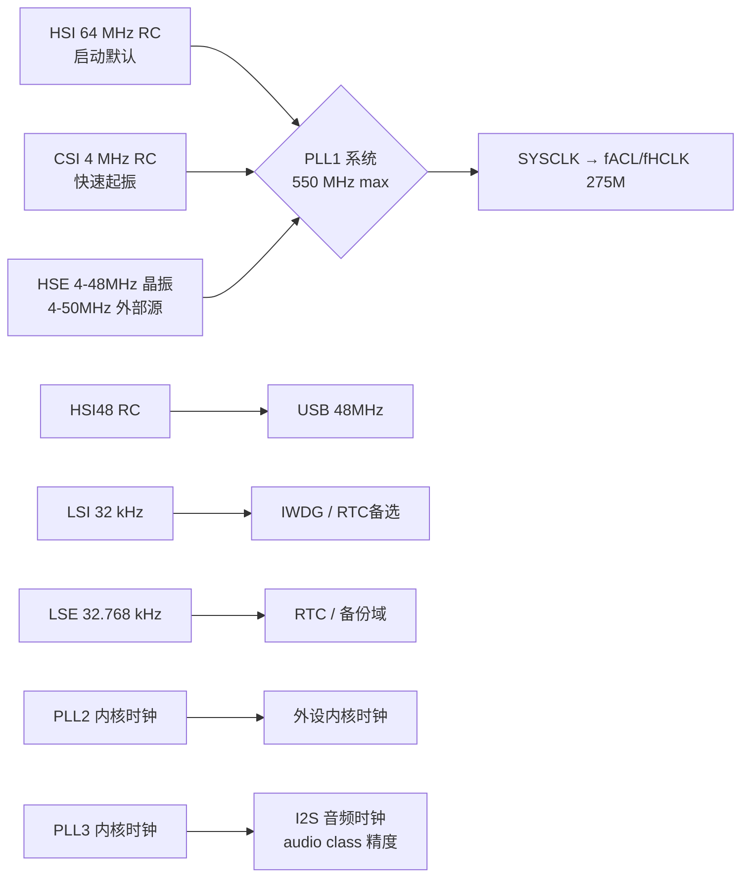

# STM32H723VE

STM32H723VE 是 ST **H7 高性能线的入门型号**：Cortex-M7 双精度 FPU @ 550 MHz + 1 MB Flash + 564 KB RAM + Chrom-ART 图形加速 + 3.6 MSps 16-bit ADC。它是 H723 系列的 LQFP100 变体（VGT/VET 列，数据来自 DS13313 Rev 5）。它的定位是"**H7 的性能骨架，砍掉安全与 DSP 溢价**"——没有 Crypto 硬件加密、没有 OTFDEC 在线解密、没有 SMPS 开关电源（纯 LDO）、LQFP100 上以太网只有 RMII——但算力、存储分层、数学加速器（CORDIC/FMAC）与满血 H743 同构。适合做图形 UI、电机控制、音频处理这类"要算力、不要安全外设"的主控。

## 1. 身份选型

- **型号**: STM32H723xE/xG，本页以 **VE**（LQFP100, 512 KB Flash）为核心（全系列数据来自 DS13313 Rev 5，2023 版）
- **内核**: Arm Cortex-M7 + 双精度 FPU + DSP 指令，6 级双发射流水线 + 动态分支预测，32 KB I-Cache + 32 KB D-Cache，MPU 16 区域（每区 8 子区，32 B~4 GB）（§3.1-3.2, p.20）
- **主频**: 最高 **550 MHz**（需 VOS0 + CPU_FREQ_BOOST）；不加速时 VOS0 限 520 MHz（Table 12, p.91）
- **存储**: 512/1024 KB Flash + 564 KB RAM（含 192 KB ITCM/AXI 共享）（p.17, p.21）
- **无加密**: 无 Cryptographic accelerator、无 OTFDEC（Table 1, p.18）
- **供电**: 纯 LDO，无 SMPS 降压转换器（Table 1, p.19）

命名解码（`STM32 H 723 V G T 6 TR`，§8, p.231）：

| 字段 | 含义 | 取值 |
|------|------|------|
| H | 产品线 | 高性能（High performance） |
| 723 | 子系列 | STM32H723 |
| 引脚数 | V / Z | V=100 脚，Z=144 脚 |
| Flash | E / G | E=512 KB，G=1024 KB |
| 封装 | T / I / H | T=LQFP，I=UFBGA 0.5mm，H=TFBGA（均 ECOPACK2） |
| 温度 | 6 | 工业级 −40 ~ +85°C（结温 −40 ~ +125°C） |
| 包装 | TR / 无 | 编带 / 托盘 |

四种封装变体（Table 1, p.17-19）：

| 变体 | 封装 | GPIO | Octo-SPI | Ethernet | 独立 VDD33USB | 工作电压下限 |
|------|------|------|----------|----------|---------------|--------------|
| VGH/VEH | TFBGA100 | 80 | 1 | RMII only | ✅ | 1.62 V |
| VGT/VET | LQFP100 | 80 | 1 | RMII only | ❌ | **1.71 V** |
| ZGT/ZET | LQFP144 | 112 | 2 | MII + RMII | ✅ | 1.62 V |
| ZGI/ZEI | UFBGA144 | 114 | 2 | MII + RMII | ✅ | 1.62 V |

- FMC 差异：144 脚有 NOR/SRAM 控制器 + 16-bit SDRAM 控制器；100 脚只有复用的 NOR + NAND（p.17）
- **LQFP100 没有 PDR_ON 脚**，PDR 不可关闭 → VDD 下限 1.71 V；有 PDR_ON 的封装可配外部监控器把下限降到 1.62 V（Table 12 注 1, p.91；Table 1, p.19）

> [!note] 选型逻辑
> H723 vs H743/H753：砍掉 Crypto/OTFDEC、DMA2D 之外的图形保持（LCD-TFT + Chrom-ART 都在）、少了 SMPS 与部分封装。要 SMPS 低功耗供电选 H725/H735；要硬件加密选 H753。H723 的甜点位是"性能不缩水、价格敏感"的 100 脚图形/控制方案。

## 2. 极限工况

绝对最大额定（超出即可能永久损坏，Table 9-11, p.88-89）：

| 参数 | 限值 | 单位 |
|------|------|------|
| VDDX − VSS（VDD/VDDLDO/VDDA/VDD33USB/VBAT） | −0.3 ~ **4.0** | V |
| FT 引脚输入电压 | VSS−0.3 ~ Min(Min(VDD,VDDA,VDD33USB,VBAT)+4.0, 6) | V |
| TT 引脚输入电压 | VSS−0.3 ~ 4.0 | V |
| BOOT0 引脚 | VSS ~ **9.0** | V |
| 其他引脚 | VSS−0.3 ~ 4.0 | V |
| ΣIVDD / ΣIVSS 总电流 | 620 | mA |
| 单个 VDD/VSS 引脚电流 | 100 | mA |
| 单 IO 灌/拉电流 | 20（Pxy_C 引脚仅 1） | mA |
| ΣI(PIN) 全部 IO 灌/拉总和 | 140 | mA |
| 注入电流（单脚，PA4/PA5 除外） | −5/+0 | mA |
| PA4 / PA5 注入电流 | −0/0（禁止注入） | mA |
| ΣIINJ 总注入电流 | ±25 | mA |
| 存储温度 TSTG | −65 ~ +150 | °C |
| 最高结温 TJ | 125 | °C |

- 同一电源域不同 VDDX 引脚间电位差、各地引脚间电位差均须 ≤50 mV（Table 9, p.88）
- FT 引脚耐 >4 V 时必须**关闭内部上下拉**（Table 9 注 4, p.89）
- **ESD**（Table 48, p.124）：HBM 2000 V（Class 2，全封装）；CDM 250 V（LQFP，Class C1）/ 500 V（BGA，Class C2a）

> [!warning] 三个易踩的坑
> ① FT 引脚上限公式含 **min(VDD,VDDA,VDD33USB,VBAT)**——掉电时该值趋 0，5 V 耐压随之消失，热插拔场景务必按最差情况算；② PA4/PA5 禁止正负注入（−0/0 mA），别在这两脚接可能被钳位的模拟输入；③ VOS0 + 内部 LDO 时结温限 **105°C**（不是 125°C），高环境温度下 550 MHz 全速跑先查这条（Table 13, p.92）。

## 3. 推荐工作条件

| 电源轨 | 范围 | 说明 |
|--------|------|------|
| VDD | 1.62 – 3.6 V | IO + 系统（LQFP100 无 PDR_ON：1.71 V 起） |
| VDDLDO | 1.62 – 3.6 V（≤VDD） | 内部调压器输入 |
| VDDA | 1.62 – 3.6 V | ADC/COMP 用 ≥1.62；DAC ≥1.8；OPAMP ≥2.0；VREFBUF ≥1.8；全不用可为 0 |
| VDD33USB | USB 用 3.0 – 3.6 V | USB 收发器独立供电脚（LQFP100 无此脚） |
| VBAT | 1.2 – 3.6 V | VSW 域（RTC/备份寄存器），VDD 存在时可降到 0 |
| VIN（FT 类 IO） | −0.3 ~ min(VDD,VDDA,VDD33USB)+3.6，<5.5 | 工作输入范围 |

**VCORE 电压调节（VOS 四档，LDO 开启时典型值，Table 12, p.90）**：

| 档位 | VCORE 典型 | fCPU 上限 | fACL/fHCLK | fPCLK |
|------|-----------|-----------|------------|-------|
| VOS0 | 1.36 V | 520 MHz（boost 后 550） | 275 MHz | 137.5 MHz |
| VOS1 | 1.21 V | 400 MHz | 200 MHz | 100 MHz |
| VOS2 | 1.10 V | 300 MHz | 150 MHz | 75 MHz |
| VOS3 | 1.00 V | 170 MHz | 85 MHz | 42.5 MHz |

- **VOS0 + LDO：最大 TJ 105°C，VDD 下限 1.7 V**；VOS1-3 + LDO：TJ 125°C，VDD 1.62 V；外部旁路供电（Regulator OFF）时 VOS0 也回到 125°C / 1.62 V（Table 13, p.92）
- 外部旁路模式：VCAP 脚直供 VCORE（VOS3 0.98~1.08 V … VOS0 1.33~1.40 V），启动时外部 VCORE ≥1.10 V 才能关内部 LDO（Table 12 注 4, p.91）
- **VCAP 电容：2×2.2 µF，ESR < 100 mΩ**；旁路模式换 2×100 nF（Table 14, p.92）
- 上电时序：VDD 低于 VPDR 期间 VDDA/VDD33USB 必须 ≤ VDD+300 mV；掉电时 VDD 可暂时低于其他轨，但注入能量 < 1 mJ（§3.7.1, p.24）；VDD/VDDA 掉电斜率 ≥10 µs/V（Table 15, p.93）
- **复位/监控**（Table 16, p.94）：POR/PDR 阈值 1.67 V 典型（上升）；BOR 3 档 2.10/2.41/2.70 V；PVD 7 档 1.96~2.86 V；VDDA 监控 AVD 4 档 1.71/2.12/2.50/2.83 V（Table 17, p.95）
- **VREFINT**：1.216 V 典型（1.180~1.255），温度系数 20~70 ppm/°C，3.0-3.6 V 区间电压系数 10~1370 ppm/V（Table 17, p.95）

## 4. 功耗热特性

H7 是性能线，Run 电流以百毫安计，低功耗模式的亮点在 Standby/VBAT（典型值 25°C，Table 20-28, p.98-102）：

| 模式 | 条件 | 典型电流 |
|------|------|----------|
| Run | VOS0+boost 550 MHz，全外设关（ITCM 执行） | **145 mA** |
| Run | VOS0 550 MHz，全外设开 | 215 mA |
| Run | VOS1 400 MHz | 90.5 mA |
| Run | VOS2 300 MHz | 63 mA |
| Run | VOS3 170 MHz | 32.5 mA |
| Sleep | VOS0 550 MHz | 36 mA |
| Stop | SVOS5（Flash 低功耗） | **0.52 mA** |
| Stop | SVOS3 | 1.15 mA |
| 自治模式 | Run + D1/D2Stop，VOS3 64 MHz | 3.6 mA |
| Standby | 3.3 V，RTC 关、备份 SRAM 关 | **2.8 µA** |
| Standby | 3 V，RTC(LSE) 开 | 2.85 µA（备份 SRAM 开 4.35 µA） |
| VBAT | 1.2 V，RTC 关 | **8 nA** |
| VBAT | 2 V，RTC(LSE) 开 | 0.5 µA |

- **CoreMark 2778 @ 550 MHz，52.2 µA/CoreMark**（Cache ON，ITCM/Flash/AXI 执行效率相同，Table 23, p.101）——Cache OFF 从 Flash 执行掉到 923 CoreMark（107.3 µA/CoreMark），**缓存对 H7 是刚需**
- 高温惩罚严重：Stop SVOS5 在 125°C 典型 72 mA（漏电指数增长）；Run 550 MHz 125°C 典型 330 mA（p.98, p.102）

热阻（Table 127, p.229）：

| 封装 | ΘJA | ΘJB | ΘJC |
|------|-----|-----|-----|
| **LQFP100**（14×14, 0.5mm） | 43.8 | 19.8 | 7.3 |
| LQFP144（20×20, 0.5mm） | 44.8 | 24.4 | 7.4 |
| TFBGA100（8×8, 0.8mm） | 43.2 | 24.8 | 13.2 |
| UFBGA144（7×7, 0.5mm） | 36.0 | 21.1 | 8.7 |

**温升速查表**（VDD=3.3 V，LQFP100 ΘJA=43.8 °C/W，ΔT = PD×ΘJA，TJ = TA + ΔT）：

| 工况（VOS 档位） | IDD 典型 (25°C) | 功耗 | ΔT | TA=25°C → TJ | TA=85°C → TJ |
|---|---|---|---|---|---|
| VOS0+boost 550 MHz，外设关 | 145 mA | 479 mW | 21°C | 46°C | 106°C ⚠️ |
| VOS0+boost 550 MHz，外设全开 | 215 mA | 710 mW | 31°C | 56°C | 116°C ⚠️ |
| VOS1 400 MHz | 90.5 mA | 299 mW | 13°C | 38°C | 98°C ✓ |
| VOS2 300 MHz | 63 mA | 208 mW | 9°C | 34°C | 94°C ✓ |
| VOS3 170 MHz | 32.5 mA | 107 mW | 5°C | 30°C | 90°C ✓ |

- 结温校验：TJ = TA + PD×ΘJA（p.229）；功耗数据来自 Table 20（p.98），热阻来自 Table 127（p.229）
- **常温跑 550 MHz 温升仅 21~31°C**；但 85°C 环境下结温 106~116°C，超过 **VOS0+LDO 的 105°C 结温限制**（Table 13, p.92）——高温场景必须降 VOS1 或换 UFBGA144（ΘJA 36，550 MHz 满载 ΔT≈26°C）
- **高温正反馈**：结温升至 105°C 时 IDD 典型值达 260 mA（外设关，Table 20），自热升至 38°C——漏电流随结温指数增长，这正是数据手册单独给 VOS0 设 105°C 上限的原因
- 上表未含 I/O 动态功耗：每个翻转脚再加 ISW = VDD×fSW×CL（p.103）；θJB 19.8 °C/W 表明 PCB 贴地散热有效
- 全速 CoreMark 满外设的功耗预算是热设计起点：约 2.6 µA/MHz·mA 级别的功耗密度，比 G4（~150 µA/MHz）高一个数量级

## 5. 存储体系

| 块 | 大小 | 域 | 特性 |
|----|------|-----|------|
| User Flash | ≤1 MB | — | 8 扇区×128 KB（4 K flash words）；266-bit 字 = 256 bit 数据 + 10 bit ECC（SECDED） |
| System Flash | 128 KB | — | 系统 Bootloader（USART/I2C/SPI/FDCAN/USB-DFU，AN2606） |
| Option bytes | 2 KB | — | 用户配置（BOOT_ADDx、BOR 阈值等） |
| ITCM RAM | 64 KB | D1 | 64-bit 接口零等待，关键实时代码；**另有 192 KB 可按 64 KB 粒度在 ITCM/AXI 间分配** |
| DTCM RAM | 128 KB | D1 | 2×64 KB 挂 2×32-bit 口，双发射并行访问；ISR/栈/堆首选 |
| AXI SRAM | 128 KB（+192 KB 共享） | D1 | AXI 总线，64-bit 访问，8 ECC bits/64-bit 字 |
| SRAM1 | 16 KB | D2 | 7 ECC bits/32-bit 字 |
| SRAM2 | 16 KB | D2 | 同上 |
| SRAM4 | 16 KB | D3 | 系统控制域，Standby 保留 |
| Backup SRAM | 4 KB | D3 | 写保护，Standby/VBAT 保留 |

- Flash 存储布局与 ECC：§3.3.1-3.3.2, p.21-22
- 启动选择：BOOT 脚 + BOOT_ADDx 选项字节，可指向 0x0000 0000~0x3FFF FFFF 内任意 Flash/RAM/系统 Bootloader 地址（§3.4, p.22）
- MDMA 可在 Sleep 模式下经 AHBS 口给 ITCM/DTCM 装代码/数据——"DMA 喂 TCM"是 H7 无等待执行的标配姿势（p.21）

> [!note] 执行位置影响性能与功耗
> Cache ON 时 ITCM/Flash/AXI 的 CoreMark 相同（2778），但 Cache OFF 后 Flash 923 / AXI 1271 / SRAM1 790（p.101）。中断密集代码放 ITCM（零等待确定性），大数组放 DTCM（双口并行），DMA 流放 AXI SRAM——这是 H7 存储分层的使用铁律。详细域架构见 [STM32H7 域架构与存储体系](../../知识/嵌入式系统/STM32H7%20域架构与存储体系.md)。

## 6. 电源域与时钟

### 域架构（D1/D2/D3）

- VCORE 分三个电源域：D1（Cortex-M7 + 部分外设）、D2（大部分外设）、D3（系统控制 RCC/PWR/EXTI + SRAM4/备份 SRAM）；**D1/D2 可独立断电**，D3 常驻（§3.7.1, p.24；§3.8, p.26）
- 低功耗模式分级：CSleep/CStop → DStop → Stop → DStandby → Standby；Stop 模式调压档位 SVOS3（UART/SPI/I2C/LPTIM 可唤醒）与 SVOS4/5（外设唤醒关闭，仅 GPIO/异步中断）（p.26）
- 系统 vs 域模式表：Table 2, p.27

### 时钟树

- 4 个内部振荡器（HSI 64 MHz / HSI48 / CSI 4 MHz / LSI 32 kHz）+ 2 个外部振荡器（HSE/LSE）+ **3 个 PLL**（1 系统 + 2 内核，§3.9.1, p.27）
- 系统从 HSI 启动；I2S 音频精度靠专用音频 PLL 或外部时钟同步（p.14）
- 总线上限（VOS0）：AXI/AHB 275 MHz，APB 137.5 MHz（Table 12, p.91）；框图标注 APB1-4 为 138 MHz（p.16）
- 通信外设双时钟域（总线时钟 + 内核时钟分离），改系统频率不影响波特率（p.27）

## 7. 外设全景

### 模拟信号链

| 外设 | 数量 | 关键参数 |
|------|------|----------|
| 16-bit ADC | 2（ADC1/2） | fADC 0.12~50 MHz（BOOST=11）；直连通道 3.6 MSps@16bit（VDDA>2.5V, TJ 90°C）→ 5.0@14bit → 5.5@12bit → 7.1@10bit → **8.3 MSps@8bit**；快通道 2.9@16bit / 4.3@12bit；慢通道 1.0 MSps@16bit（Table 80, p.163） |
| 12-bit ADC | 1（ADC3） | ⚠️ 存疑：Table 1 中 ADC3 直连/快/慢通道数各封装差异大（0~9 通道），且 12-bit 特性表（Table 83, p.171-174）本次未提取，用前请查原文 |
| 12-bit DAC | 1（2 通道） | VDDA ≥1.8 V（Table 12, p.90） |
| COMP | 2 | VDDA ≥1.62 V |
| OPAMP | 2 | VDDA ≥2.0 V |
| VREFBUF | 1 | VDDA ≥1.8 V；VREFINT 1.216 V（p.95） |
| 温度传感器 | 1 | ADC 通道，VREFINT 校准 |

- 16-bit ADC 输入范围 0~VREF+；共模 VREF/2±10%；VREF+ 范围 1.62 V~VDDA（VDDA≥2 V 时）（Table 80, p.162-163）
- BOOST 位决定 fADC 上限：11→50 MHz，10→25，01→12.5，00→6.25 MHz（p.163）
- 采样率随分辨率与 TJ 变化：全表见 Table 80（p.163）——16bit 满速只到 90°C，125°C 建议 ≤14bit/5.0 MSps 或降 fADC

### 通信与多媒体

| 接口 | 数量 | 能力 |
|------|------|------|
| USART/UART/LPUART | 5/5/1 | USART 自带 SPI 从模式；UART9/10 等总计 11 个 UART 类 |
| SPI/I2S | 5/4（100 脚）或 6/4（144 脚） | I2S 用音频 PLL 保证精度 |
| I2C | 5 | SMBus 支持 |
| SAI/PDM | 2/2 | 串行音频接口 |
| SPDIFRX | 1 | 4 输入 |
| FDCAN | 2 + 1 TT-FDCAN | ISO 11898-1；TT 版支持时间触发 |
| USB | 1× OTG_HS(ULPI) + 1× FS(PHY) | LQFP100 用 FS PHY；VDD33USB 独立供电（100 脚无） |
| Ethernet | 1 MAC | LQFP100 仅 RMII；144 脚 MII+RMII |
| SDMMC | 2 | — |
| MDIO | 1 | 以太网 PHY 管理 |
| SWPMI | 1 | 单线主机接口（SIM 卡类） |
| HDMI-CEC | 1 | — |
| LCD-TFT | 1 | RGB888 + 同步信号，直驱 TFT 屏 |
| Chrom-ART (DMA2D) | 1 | 图像填充/拷贝/格式转换/混合，4~32 bpp，YCbCr 支持 JPEG 解码输出（§3.13, p.30） |
| DCMI/PSSI | 1 | 摄像头接口 |
| FMC | 1 | 100 脚：复用 NOR + NAND；144 脚再加 NOR/SRAM + 16-bit SDRAM |
| Octo-SPI | 1（100 脚）/ 2（144 脚） | 带 Hyperbus 支持，DLYB 延迟块调相（p.162） |
| DFSDM | 1 | 4 通道 Σ-Δ 数字滤波 |

- **DMA 体系**（§3.12, p.30）：MDMA（D1 域，16 通道，主 AXI 口 + 专用 AHBS 口访问 TCM，链表传输）+ DMA1/DMA2（D2 域，8 流，FIFO + DMAMUX 请求路由）+ BDMA（D3 域）+ DMAMUX——请求可任意路由，还支持外设触发合成 DMA 请求
- **定时器**（Table 1, p.17）：32-bit GP×4（TIM2/5/23/24）、16-bit GP×10、高级 PWM×2（TIM1/8）、基本×2、低功耗×5、RTC、IWDG/WWDG
- **NVIC**：16 优先级，140 可屏蔽中断 + 16 内核异常，尾链优化（§3.14, p.31）；**EXTI**：80 线（26 可配置 + 54 直接事件）（§3.15, p.31）
- 数学加速：CORDIC（24-bit 引擎，圆/双曲、旋转/向量模式，Sin/Cos/Atan2/Mod/Sqrt/Ln，20-bit 精度，4 bit/周期）+ FMAC（16×16 MAC，26-bit 累加，256×16 本地 RAM，FIR/IIR 直接型 I，DMA 进出）（§3.5-3.6, p.22-23）

## 8. 引脚典型连线（LQFP100）

关键引脚（Table 7, p.57-71；LQFP100 列）：

| 项 | 引脚 | 连法 |
|----|------|------|
| 电源 | VDD/VSS ×4 组 | 17/27/50/75（VSS 16/26/49/74），每对 100 nF + 全局 4.7 µF |
| 内核稳压 | VCAP 48, 73 | **各接 2.2 µF，ESR <100 mΩ**（低 ESR 陶瓷），旁路模式换 100 nF |
| 模拟电源 | VDDA 21 / VSSA 19 | 10 nF + 1 µF，磁珠/RC 与 VDD 隔离 |
| 基准 | VREF+ 20 | 100 nF + 1 µF；可接 VREFBUF 输出或外部基准 |
| 备份 | VBAT 6 | 无电池直连 VDD（1.2~3.6 V） |
| 复位 | NRST 14 | 内置上拉；对地 100 nF 滤毛刺 |
| 高速晶振 | PH0-OSC_IN 12 / PH1-OSC_OUT 13 | 4~48 MHz 晶体，负载电容按 CL 计算，走线最短 |
| 低速晶振 | PC14-OSC32_IN 8 / PC15-OSC32_OUT 9 | 32.768 kHz，低驱动档 |
| 调试 | PA13(SWDIO) 72 / PA14(SWCLK) 76 | 复位后默认调试功能 |
| USB FS | PA11 70 / PA12 71（DM/DP），PA9 68 VBUS | 内置 FS PHY；LQFP100 无 VDD33USB 脚，USB 域从 VDD 供电 |
| 启动 | BOOT0（PH3 或选项字节 nBOOT_SEL） | ⚠️ 存疑：BOOT0 的 LQFP100 引脚号本次未逐行提取，查 Table 7（p.57-71）确认；默认建议选项字节控制 |

- LQFP144 额外有 VDD33USB（pin 95）、VCAP（71, 106）等——全表见 Table 7（p.57-71）
- 未用 IO 复位后默认模拟模式（低功耗），保持即可；不要配置成悬空输入
- 大电流 IO 分组限流：相邻电源脚之间的 IO 总电流受 ΣI(PIN) 140 mA 约束（Table 10, p.89）

> [!warning] LQFP100 布线三坑
> ① VCAP 电容 ESR 必须 <100 mΩ 且贴近引脚——这是 VCORE 稳压环路的稳定条件，用普通电解电容会振荡；② LQFP100 无 PDR_ON，VDD 掉到 1.71 V 以下必然复位，电池供电方案按 1.71 V 设计；③ 想用 USB 且 VDD 非 3.3 V 供电，必须选 144 脚（VDD33USB 独立脚），100 脚无此选择。

## 9. 封装机械尺寸

| 封装 | 引脚 | 尺寸 | 间距 | ΘJA (°C/W) |
|------|------|------|------|------------|
| **LQFP100** | 100 | 14×14 mm | 0.5 mm | 43.8 |
| LQFP144 | 144 | 20×20 mm | 0.5 mm | 44.8 |
| TFBGA100 | 100 | 8×8 mm | 0.8 mm | 43.2 |
| UFBGA144 | 144 | 7×7 mm | 0.5 mm | 36.0 |

- UFBGA144 PCB 规则：焊盘 0.28 mm，钢网开窗 0.28 mm / 厚 0.10-0.125 mm，引出线宽 0.12 mm（Table 126, p.228）
- 完整机械图见 §7（p.200-228）

## 提取完整性

| 类别 | 请求项 | 已提取 | 存疑 | 未提取 |
|------|--------|--------|------|--------|
| 绝对最大额定值 | 12 | 12 | 0 | 0 |
| 推荐工作条件 | 16 | 15 | 0 | 1（ADC3 12-bit 特性表） |
| 功耗各模式 | 8 表 | 6 表 | 0 | 2（外设电流 Table 29、I/O 动态电流） |
| ADC 特性 | 3 表 | 1（16-bit 主表） | 1（通道数/封装差异） | 2（12-bit 表、通道详表） |
| 时钟/复位/基准 | 12 | 12 | 0 | 0 |
| 引脚定义 | 全表 | 关键引脚 | 1（BOOT0 引脚号） | 其余 GPIO 复用 |
| 封装/热参数 | 4 封装 | 4 | 0 | 机械图细节 |

⚠️ 未提取和存疑项需人工从 PDF 原文（DS13313 Rev 5）补充。本页页码均为 PDF 页码（与印刷页码一致）。

## 相关页面

- [STM32H7 域架构与存储体系](../../知识/嵌入式系统/STM32H7%20域架构与存储体系.md) — 知识页：D1/D2/D3 域架构、TCM/AXI 存储分层、VOS 调压
- [STM32G431](../../元件/MCU无线/STM32G431.md) — 同门 G4 系列（Cortex-M4 实时控制线）对照
- [STM32F103C8T6](../../元件/MCU无线/STM32F103C8T6.md) — F1 经典入门款
- [2026-08-14 - STM32H723VE 数据手册](../../来源/2026-08-14%20-%20STM32H723VE%20数据手册.md) — 来源摘要
