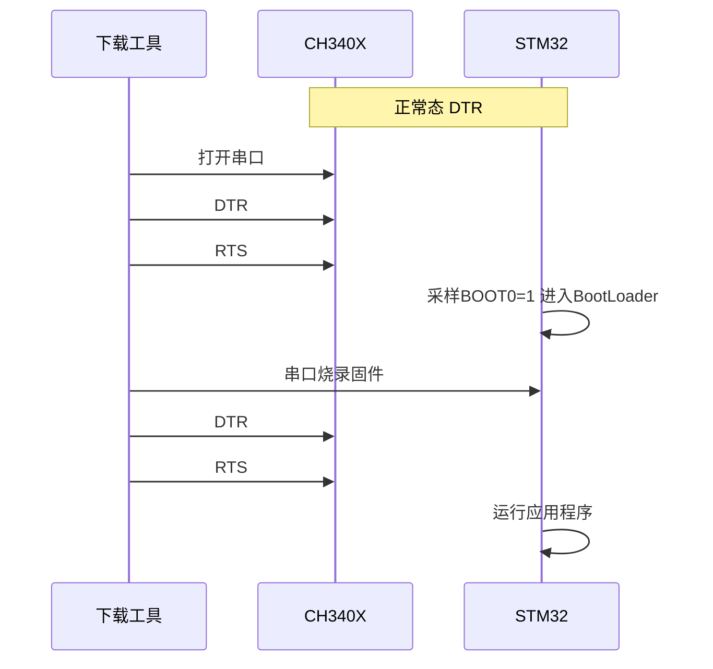

# CH340

> 沁恒（WCH）USB 总线转接芯片：USB 2.0 全速设备 ↔ 硬件全双工异步串口，波特率 50 bps～2 Mbps，提供全套 MODEM 联络信号。外加电平转换器件可扩展 RS232/RS485/RS422；CH340R 变体支持 IrDA SIR 红外。国产低成本 USB 转串口事实标准（手册版本 3D）。

## 1. 身份与选型

| 项目 | 内容 |
|------|------|
| 厂商 | 南京沁恒微电子（WCH） |
| 核心功能 | USB 2.0 全速（12 Mbps）设备 → 异步串口桥接；另有 USB 转打印口模式（见手册二 CH340DS2） |
| 串口能力 | 硬件全双工，内置收发缓冲区，50 bps～2 Mbps |
| MODEM 信号 | RTS、DTR、DCD、RI、DSR、CTS —— 用途由计算机应用程序软件定义 |
| 驱动 | 内置固件，软件兼容 CH341，直接使用 CH341 的 VCP 驱动程序 |
| 供电 | 5V 或 3.3V 单电源 |

### 变体全家桶对照

| 型号 | 封装 | 时钟 | 特有差异 |
|------|------|------|----------|
| CH340G | SOP-16 | 外置 12MHz 晶振 | 经典全功能款，带 R232 辅助 RS232 |
| CH340C | SOP-16 | 内置 | 引脚兼容 G：XI→NC（必须悬空）、XO→OUT#；批号 4 开头且末 3 位 >B40 者，8# 脚加 4.7kΩ 下拉可改为第二 DTR# |
| CH340B | SOP-16 | 内置 | 内置 EEPROM 可配序列号/VID/PID；XI→RST# 外部复位输入（低有效，内置上拉），XO→NC |
| CH340N | SOP-8 | 内置 | 最精简：仅 TXD/RXD/UD±/电源/RTS# |
| CH340K | ESSOP-10 | 内置 | 内置 3 只二极管防电流内灌；底板为可选 0# GND，3# GND 必接 |
| CH340E | MSOP-10 | 内置 | 微小型 0.5mm 间距，带 TNOW |
| CH340X | MSOP-10 | 内置 | 基于 E 改进：3.3V 供电时 IO 耐 5V；6# 脚 TNOW 可经外加电阻切换为 DTR#（见 6.4 节） |
| CH340T | SSOP-20 | 外置 12MHz 晶振 | 引脚最全：额外 ACT#、CKO、NOS#、R232 |
| CH340R | SSOP-20 | 外置 12MHz 晶振 | IrDA SIR 红外（2400～115200 bps）、TXD 与 MODEM 信号反极性。**已停产** |

> [!tip] 选型速记
> 成本敏感全功能 → G（需晶振）；免晶振直接替换 G → C；只要 TXD/RXD → N；一键下载电路 → X（DTR 增强模式）或批号 4 的 C；双电源防倒灌 → K；要自定义序列号 → B；单向 ≥1 Mbps 或双向 ≥500 kbps、需要硬件自动流控、或要更小体积 → 换 CH343（小体积选 CH343P）。

## 2. 极限工况

> [!warning] 临界或超过绝对最大值可能导致芯片工作不正常甚至损坏

| 参数 | 说明 | 最小 | 最大 | 单位 |
|------|------|------|------|------|
| TA | 工作环境温度 CH340G/T/R | -40 | 85 | °C |
| TA | 工作环境温度 CH340C/N/K/E/X/B | -20 | 70 | °C |
| TS | 储存环境温度 | -55 | 125 | °C |
| VCC | 电源电压 | -0.5 | 6.0 | V |
| VIO | 输入/输出引脚电压 | -0.5 | VCC+0.5 | V |

> [!note] 内置时钟变体（C/N/K/E/X/B）的工作温度上限只有 70°C，比晶振款（G/T/R）的 85°C 低——工业宽温场景仍需选 CH340G/T 外加晶振。

## 3. 推荐工作条件

| 参数 | 条件 | 最小 | 典型 | 最大 | 单位 |
|------|------|------|------|------|------|
| VCC（5V 模式） | V3 仅外接 0.1μF 电容，不连 VCC | 4.0 | 5 | 5.3 | V |
| VCC（3.3V 模式） | V3 连 VCC；CH340G/T/R | 2.9 | 3.3 | 3.6 | V |
| VCC（3.3V 模式） | V3 连 VCC；CH340C/N/K/E/X/B | 3.1 | 3.3 | 3.6 | V |
| FCLK | XI 输入时钟频率（G/T/R） | 11.98 | 12.00 | 12.02 | MHz |
| 波特率 | 全双工异步串口 | 50 | — | 2,000,000 | bps |

> [!warning] 3.3V 模式下，与 CH340 相连的其它电路工作电压不能超过 3.3V。例外：CH340X 和批号 4 开头的 CH340C/N 的 IO 支持 5V 耐压并防向内电流倒灌。

## 4. 功耗与供电体系

### 电气参数（TA=25°C，不含 USB 总线引脚）

| 参数 | 条件 | 5V 典型/最大 | 3.3V 典型/最大 | 单位 |
|------|------|------|------|------|
| ICC 工作电流 | CH340G/C/N/K/E/X/T/R | 7 / 20 | 4 / 12 | mA |
| ICC 工作电流 | CH340B | 6 / 15 | 3 / 9 | mA |
| ISLP 挂起电流 | CH340G/K/T/R/B | 0.09 / 0.2 | 0.08 / 0.2 | mA |
| ISLP 挂起电流 | CH340C/N/E/X | 0.05 / 0.15 | 0.04 / 0.15 | mA |
| VIL 低电平输入 | — | 0 ~ 0.9 | 0 ~ 0.8 | V |
| VIH 高电平输入 | — | 2.3 ~ VCC | 1.9 ~ VCC | V |
| VOL 低电平输出 | 5V 吸入 6mA / 3.3V 吸入 4mA | ≤0.5 | ≤0.5 | V |
| VOH 高电平输出 | 输出 2mA（复位期间仅 100μA/40μA） | ≥VCC-0.6 | ≥VCC-0.6 | V |
| IUP 内置上拉输入电流 | — | 3/150/300 | 3/70/200 | μA |
| IDN 内置下拉输入电流 | — | -40/-100/-300 | -30/-70/-200 | μA |
| VR 上电复位门限 | — | 2.4/2.6/2.8 | 2.4/2.6/2.8 | V |
| TPR 上电复位时间 | — | 20/35/50 | 20/35/50 | ms |

### V3 引脚与两种供电模式

V3 是芯片内部 3.3V 电源节点（USB 收发器工作电压）的引出端，接法决定供电模式：

1. **5V 模式**：VCC 接外部 5V，V3 只对地接 0.1μF 退耦电容——内部稳压产生 3.3V。
2. **3.3V 模式**：V3 与 VCC 短接，共同输入外部 3.3V 电源。

- USB 总线供电最大 500mA，CH340 及低功耗产品可直接用 VBUS 5V。
- 产品若有常备电源，CH340 应使用常备电源以避免与 USB 电源之间的 I/O 电流倒灌；如需同时使用 VBUS，用约 1Ω 电阻连接 VBUS 5V 与产品常备 5V，地线直连。
- CH340 自动支持 USB 挂起节能；NOS# 引脚（仅 SSOP-20）为低电平时禁止挂起。
- CH340G/C/T/K 的 DTR# 在 USB 配置完成前作为配置输入：外接 4.7kΩ 下拉电阻，可在枚举期间通过配置描述符向 USB 总线申请更大电源电流。

## 5. 通信/接口特性

| 参数 | 条件 | 值 |
|------|------|-----|
| USB 规范 | 全内置收发器 | USB 2.0 全速（12 Mbps） |
| 帧格式 | 起始位 | 1 个低电平起始位 |
| 数据位 | — | 5 / 6 / 7 / 8 bit |
| 停止位 | — | 1 / 2（高电平） |
| 校验 | — | 无 / 奇 / 偶 / 标志（Mark）/ 空白（Space） |
| 常用波特率 | — | 50、75、100、110、134.5、150、300、600、900、1200、1800、2400、3600、4800、9600、14400、19200、28800、33600、38400、56000、57600、76800、115200、128000、153600、230400、460800、921600、1500000、2000000 |
| 接收波特率容差 | — | 约 ±2% |
| 发送波特率误差 | CH340G/T/R（晶振） | <0.3% |
| 发送波特率误差 | CH340C/N/K/E/X/B（内置时钟） | <1.8% |
| 内置时钟频率误差 | TA=-5～55°C / -25～75°C | ±0.8%（限 ±1.2%）/ ±1.0%（限 ±1.8%） |
| 收发缓冲 | 容量手册未公开 | 内置独立收发缓冲区 |
| IrDA | 仅 CH340R | SIR 红外，2400～115200 bps |

> [!warning] CH340 **没有硬件自动流控**。RTS#/CTS# 等 MODEM 信号全部由计算机应用程序软件控制和定义。手册明确：单向 1 Mbps 及以上、或双向 500 kbps 及以上的应用，建议改用 CH343 启用硬件自动流控。
>
> 高波特率下（>120 kbps 双电源场景）建议 MCU 的 RX 引脚启用内置或外加 2k～22kΩ 上拉电阻。

## 6. 核心功能

### 6.1 USB-UART 桥接工作原理

CH340 的本质是一个"协议翻译 + 时钟域解耦"器件：USB 侧以全速设备身份挂在总线上，按主机轮询节拍成批收发数据包；UART 侧则按位定时连续收发。两侧速率与节拍完全不同，靠芯片内置的独立收发缓冲区做异步耦合——USB 数据包先落入缓冲区，再由 UART 状态机按设定波特率逐位移出，反向同理。因此：

- **波特率不是引脚配置的**：串口参数（波特率/数据位/校验/停止位）由计算机端打开串口时经 USB 控制命令下发，芯片上没有任何波特率设置引脚。改波特率无需改硬件。
- 串口输入空闲时 RXD 应为高电平；RXD 内置可控上拉和下拉电阻。串口输出空闲时 G/C/N/E/X/B/T 的 TXD 为高电平，CH340K 为微弱高电平（约 75kΩ 弱上拉维持），CH340R 为低电平（反极性）。
- TNOW 引脚以高电平指示"正在从串口发送数据"，发送完成变低——这是硬件实时状态，用于 RS485 半双工方向切换（见 6.5）。

### 6.2 驱动与 USB 描述符

- **不是 CDC-ACM**：CH340 使用厂商自定义协议，需 WCH 的 VCP 驱动（与 CH341 驱动通用，Windows 下即 CH341SER，Linux 内核自带 ch341 模块）。驱动仿真标准串口，绝大部分原串口应用程序无需修改。
- 默认 VID/PID = **1A86H / 7523H**（沁恒厂商识别码）。
- **CH340B 的 EEPROM 配置区**（专用上位机工具写入）：

| 地址 | 简称 | 说明 | 默认值 |
|------|------|------|--------|
| 00H | SIG | 配置有效标志，必须 5BH | 00H |
| 01H | MODE | 串口模式，必须 23H | 23H |
| 02H | CFG | 位 5：产品序列号字符串 0=有效 / 1=无效 | FEH |
| 03H | WP | 写保护，57H 则只读 | 00H |
| 05H~04H | VID | 厂商识别码（高字节在后；0000H/0FFFFH 用默认值） | 1A86H |
| 07H~06H | PID | 产品识别码 | 7523H |
| 0AH | PWR | 最大电源电流，2mA 为单位 | 31H（=98mA） |
| 17H~10H | SN | 序列号 ASCII×8（首字节非 21H~7FH 则禁用） | 12345678 |
| 3FH~1AH | PROD | 产品说明 Unicode 字符串 | 用默认说明 |

> [!note] 批量产品若不用 CH340B，所有芯片共享同一 VID/PID 且无序列号——同一台电脑插不同板子 COM 号会漂移。需要固定 COM 号/多设备区分时选 CH340B。

### 6.3 时钟与复位

- **晶振款（G/T/R）**：XI/XO 间接 12MHz 石英晶体，XI、XO 分别对地接 33pF 独石或高频瓷片电容。允许频偏仅 11.98～12.02 MHz（±0.167%）——USB 全速对时钟精度有硬要求。低成本陶瓷晶体须用厂家推荐容值（一般 47pF）；起振困难的晶体建议 XI 侧电容减半。CH340T 另有 CKO 时钟输出。
- **内置时钟款（C/N/K/E/X/B）**：免晶振免电容，省 3 个元件和布板面积。代价是频率误差 ±1.2%（-5～55°C）/±1.8%（-25～75°C），同比影响发送波特率——但仍在对端约 ±2% 的接收容差内，常规应用无碍；对波特率精度苛刻或宽温场景仍应选晶振款。
- 内置上电复位（门限 2.4～2.8V，复位时间 20～50ms）；CH340B 额外提供 RST# 外部复位输入（低有效，内置上拉）。
- IR#（CH340R）和 R232 引脚只在上电复位后检查一次，运行中改电平无效。

### 6.4 DTR/RTS 与 MCU 一键下载

CH340 的 DTR#/RTS# 由 PC 端下载工具经 USB 命令操控，可代替手工按复位/BOOT 键——这是 ESP32/ESP8266 开发板（NodeMCU 自动下载电路）和 STM32 串口 ISP 一键烧录的基础。

**CH340X 的 6# 引脚三态用法**（上电/复位期间弱上拉，默认 TNOW）：

1. **默认**：输出 TNOW，用于半双工收发切换。
2. **开源 DTR 增强模式**：6# 脚对 GND 接 4.7kΩ 下拉 → 自动切换为开源（开漏式）驱动的 DTR#，默认不输出、被电阻保持低电平，应用程序可置高或释放——适合 BOOT 默认低电平的 MCU（如 STM32F103 的 BOOT0）。
3. **推挽 DTR 增强模式**：6# 脚与 5# 脚之间接 4.7kΩ → 切换为推挽驱动 DTR#，可主动输出高/低——适合 BOOT 默认高电平的 MCU。

批号 4 开头且末 3 位 >B40 的 CH340C：8# 脚（OUT#）外接 4.7kΩ 下拉即进入开源 DTR 增强模式，成为第二 DTR# 接 BOOT0；13# 脚原 DTR# 仍可用于默认高电平的 BOOT 控制。

**一键下载时序**（以 STM32F103 为例，NRST 低有效复位，BOOT0 高电平进 BootLoader；CH340X 开源模式，4.7kΩ 下拉可选 3～5.6kΩ、兼做 BOOT0 下拉）：

> [!warning] 手册明确提示：**MODEM 数据与引脚电平是反相的**——下载工具中 set DTR=1 对应 DTR# 引脚输出低电平。写自动下载脚本时极易在此翻车。关闭串口前应保持 DTR# 不变。
>
> 如 NRST 还需支持手动按键复位，在 RTS# 与 NRST 之间串 1～2kΩ 电阻或阳极接 NRST 的二极管，避免按键短路 RTS# 输出。

### 6.5 RS232 / RS485 / RS422 电平扩展

- **标准 RS232（9 线）**：TTL 侧接 MAX213/ADM213/SP213/MAX211 等电平转换器，DB9 引脚与 PC 原生串口相同；3 线制用 MAX232/ICL232/SP232。只做 USB 转 TTL 时去掉转换器及其电容，仅连 RXD、TXD、GND 即可。
- **简版 RS232**：将 R232 引脚（G/C/T/R 具备）拉高启用辅助 RS232 功能——RXD 输入内部自动插入反相器（默认变为低电平），外部只需二极管、三极管、电阻电容即可代替专用电平转换芯片，输出幅度略低但成本更低。
- **RS485**：TNOW 引脚直接驱动 RS485 收发器的 DE（高有效发送使能）与 RE#（低有效接收使能）——发送期间 TNOW 为高自动切到发送方向，无需软件干预。

### 6.6 供电拓扑与电流倒灌防护

双电源系统（CH340 用 VBUS、MCU 用自身 VDD）中，任一侧失电时电流会经对方 IO 的体二极管倒灌，手册给出三级方案：

1. **统一供电（首选，7.6 节）**：CH340 与 MCU 共用同一 VCC（5V 或 3.3V），不用 VBUS，天然无倒灌。缺点：CH340 消耗数十 μA 睡眠电流。
2. **双电源 + 外部防灌（7.7 节）**：防外灌（CH340 有电、MCU 失电）用二极管 D6（TXD→MCU RXD 路径）、D7（RTS→BOOT 路径，可选）和 NMOS Q5（RXD 上拉→MCU TXD 路径）；二极管优先小功率肖特基 BAS70/BAT54/B0520，NMOS 优先小电容的 2SK3018 等。MCU 的 RXD 需启用内部上拉或外加 2k～22kΩ 上拉至 VDD。
3. **选防倒灌变体（7.8 节)**：CH340K/X 及批号 4 开头的 C/N 自动完全防内灌（MCU 有电、CH340 失电时不耗 MCU 电流）；CH340K 的 TXD/RTS#/RXD 内置防内灌二极管加约 75kΩ 弱上拉，对外灌也可限制在 150μA 以内。注意 **CH340K 的 DTR# 与 CTS# 未内置二极管，不防倒灌，一般不用于连接 MCU**。

DTR# 还可控制 VCC 向 VDD 供电的电源开关（4 种方案）：简化的单管方案 VDD≈VCC-0.8V、电流 ≤200mA（NMOS 宜选低 Vth）；完整方案用双管；串二极管 D10 可防 VDD 倒向 VCC。

> [!note] 手册结论：一般情况下**不建议** CH340 与 MCU 分开各自供电；确有必要时选 CH340K，或带 VIO 独立 IO 电源引脚的 CH343。

## 7. 引脚与典型连线

CH340G SOP-16 引脚（其余变体见变体表差异说明）：

| 引脚 | 名称 | 类型 | 功能 | 闲置处理 |
|------|------|------|------|----------|
| 1 | GND | 电源 | 公共接地，直连 USB 总线地线 | — |
| 2 | TXD | 输出 | 串行数据输出 | 悬空 |
| 3 | RXD | 输入 | 串行数据输入，内置可控上/下拉 | 悬空 |
| 4 | V3 | 电源 | 3.3V 模式连 VCC；5V 模式接 0.1μF 退耦电容 | 按模式 |
| 5 | UD+ | USB | 直连 USB D+，**不要串联电阻** | — |
| 6 | UD- | USB | 直连 USB D-，**不要串联电阻** | — |
| 7 | XI | 输入 | 12MHz 晶体输入（C 变体为 NC 必须悬空；B 变体为 RST#） | — |
| 8 | XO | 输出 | 12MHz 晶体输出（C 变体为 OUT#；B 变体为 NC 必须悬空） | — |
| 9 | CTS# | 输入 | MODEM 清除发送 | 悬空 |
| 10 | DSR# | 输入 | MODEM 数据装置就绪 | 悬空 |
| 11 | RI# | 输入 | MODEM 振铃指示 | 悬空 |
| 12 | DCD# | 输入 | MODEM 载波检测 | 悬空 |
| 13 | DTR# | 输出 | MODEM 数据终端就绪；枚举前兼做电流申请配置输入 | 悬空 |
| 14 | RTS# | 输出 | MODEM 请求发送 | 悬空 |
| 15 | R232 | 输入 | 辅助 RS232 使能，高有效，内置下拉 | 悬空 |
| 16 | VCC | 电源 | 正电源，外接 0.1μF 退耦电容 | — |

SSOP-20（T/R）额外引脚：ACT#（USB 配置完成指示，低有效）、NOS#（禁止 USB 挂起，低有效内置上拉）、CKO（CH340T 时钟输出）、TNOW/IR#（15 脚位，随变体而定）。CH340R 的 MODEM 信号为高有效（反极性）。

**典型连线**：USB VBUS/D+/D-/GND → CH340（VCC 加 0.1μF、V3 按模式处理、G 款加 12MHz 晶振+2×33pF）→ TXD/RXD 交叉接 MCU 的 RXD/TXD，共地。未用引脚一律可悬空。

- 芯片内置 USB 上拉电阻，UD± 直连总线即可，无需外部上拉。
- USB 收发器按 USB 2.0 全内置设计，UD+/UD- 建议不要额外串接电阻（区别于某些需串 22Ω 的老方案）。

## 8. 封装与 PCB 布局

| 型号 | 封装 | 塑体宽度 | 引脚间距 |
|------|------|----------|----------|
| CH340G / C / B | SOP-16 | 3.9mm (150mil) | 1.27mm (50mil) |
| CH340N | SOP-8 | 3.9mm (150mil) | 1.27mm (50mil) |
| CH340K | ESSOP-10（带底板） | 3.9mm (150mil) | 1.00mm (39mil) |
| CH340E / X | MSOP-10 | 3.0mm (118mil) | 0.50mm (19.7mil) |
| CH340T / R | SSOP-20 | 5.3mm (209mil) | 0.65mm (25mil) |

均为无铅封装，兼容 RoHS。CH340K 底板为 0# GND 可选连接（按走线方便决定），3# GND 必接。

**PCB 布局要点**（手册 7.1 节）：

- V3 与 VCC 的 0.1μF 退耦电容尽量靠近 CH340 对应引脚。
- **D+/D- 贴近平行布线**（差分对），两侧尽量提供地线或覆铜，减少外界干扰。
- XI/XO 走线尽量短，晶振周边环绕地线或覆铜抑制高频干扰。

---

参见：[接口存储](接口存储.md) · [晶振](../晶振/晶振.md) · USB 描述符与枚举 · 串口通信
