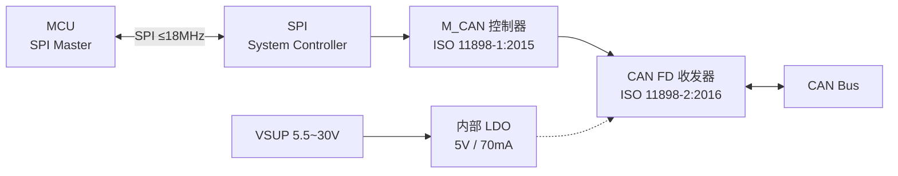

# TCAN4550

> TI 车规 CAN FD 系统基础芯片：**CAN FD 控制器 + CAN FD 收发器 + 5V LDO 三合一**，SPI 接口直连 MCU，单芯片完成 SPI→CAN FD 桥接。AEC-Q100 Grade 1，VQFN-20。

## 1. 身份与选型

| 项目 | 内容 |
|------|------|
| 核心功能 | SPI ↔ CAN FD 桥接（控制器 + 收发器集成，无需外挂 TJA1044 类收发器） |
| 关键卖点 | 单芯片方案；±58V 总线故障保护；VSUP 宽范围 5.5~30V 直接电池供电；集成 5V LDO 输出 70mA；VIO 适配 3.3V/5V MCU |
| 同类对比 | MCP2518FD 仅控制器需外挂收发器；TCAN4550-Q1 一步到位 |
| 协议 | 控制器：ISO 11898-1:2015 + Bosch M_CAN Rev 3.2.1.1；收发器：ISO 11898-2:2016 |
| 数据手册 | ZHCSJK5D Rev. D（中文版），英文版 SLLSEZ5 |

| 订购型号 | 封装 | 温度等级 | 说明 |
|---------|------|---------|------|
| TCAN4550-Q1 | VQFN-20 (RGY) | Grade 1：−40~+125°C | 车规标准型 |

## 2. 极限工况

> ⚠️ 超过即永久损坏（§6.1, p.5）

| 参数 | 最小 | 最大 | 单位 |
|------|------|------|------|
| VSUP 供电 | −0.3 | 42 | V |
| VIO I/O 供电 | −0.3 | 6 | V |
| VCCOUT 5V 输出 | −0.3 | 6 | V |
| VBUS (CANH/CANL) | −58 | 58 | V |
| VWAKE 唤醒输入 | −0.3 | 42 | V |
| VINH 禁止输出 | −0.3 | 42 | V |
| 逻辑输入 | −0.3 | 6 | V |
| 数字输出电流 IO(SO) | — | 8 | mA |
| INH 输出电流 | — | 4 | mA |
| 结温 TJ | −40 | 150 | °C |
| 存储温度 Tstg | −65 | 150 | °C |

### ESD / 瞬态（§6.2-6.3, p.5）

| 项目 | 能力 |
|------|------|
| HBM（CANH/CANL 除外） | ±4kV（AEC-Q100 3A 级） |
| HBM（CANH/CANL） | **±15kV**（H2 级） |
| CDM 全引脚 | ±750V（C5 级） |
| IEC 61000-4-2 接触/空气 | ±8kV / ±15kV |
| SAE J2962-2 接触/空气 | ±8kV / ±15kV |
| ISO 7637 脉冲 1/2/3a/3b | −100 / 75 / −150 / 100 V |

> CANH/CANL 自带 ±15kV HBM 和 ±8kV 接触 ESD——普通应用无需外加 TVS（与 [TJA1044](TJA1044.md) 的 ±8kV 同级或更强）。

## 3. 推荐工作条件（§6.4, p.6）

| 参数 | 最小 | 典型 | 最大 | 单位 |
|------|------|------|------|------|
| VSUP 供电 | 5.5 | — | 30 | V |
| VIO 逻辑供电 | 3.135 | — | 5.25 | V |
| C(FLTR) 滤波电容 | — | — | 300 | nF |
| C(VCCOUT) 输出电容 | — | — | 10 | µF |
| CWAKE 唤醒引脚电容 | — | — | 10 | nF |
| 热关断上升/下降 | — | 160 / 150 | — | °C |
| 热关断迟滞 | — | 10 | — | °C |

> **VSUP 直接接电池**（最高 30V），内部 LDO 生成 5V VCCOUT 供收发器，并可向外部负载提供最高 70mA。

## 4. 功耗特性（§6.6, p.7）

| 模式 | 条件 | 典型 | 最大 | 单位 |
|------|------|------|------|------|
| 正常-显性 | RL=60Ω，VCCOUT 空载 | 80 | — | mA |
| 正常-显性高负载 | RL=50Ω | 90 | — | mA |
| 正常-显性总线故障 | CANH=−25V | 180 | — | mA |
| 正常-隐性 | RL=60Ω | 15 | — | mA |
| 待机 | −40~85°C | 3.5 | — | mA |
| **睡眠** | SPI 时钟关断，VIO=0 | — | 25~42 | µA |
| IVIO 正常-显性 | CLKIN 40MHz / 晶振 40MHz | 0.8 / 3 | — | mA |
| IVIO 睡眠 | VIO=5V，时钟关断 | 9 | — | µA |

**欠压保护**（§6.6, p.7）：VSUP 上升 5.2~5.7V / 下降 4.5~5.0V；VIO 上升 2.45~2.6V / 下降 2.1~2.25V。

## 5. 热参数（§6.5, p.6）

| 参数 | 值 | 单位 |
|------|-----|------|
| RθJA | 35.2 | °C/W |
| RθJC(top) | 28.1 | °C/W |
| RθJB | 12.8 | °C/W |
| RθJC(bot) | **1.1** | °C/W |

> 底部焊盘热阻极低（1.1°C/W），散热焊盘必须焊接接地，热量主要从 PCB 底部导出。

## 6. CAN 收发器电气特性（§6.7, p.8-9）

### 驱动

| 参数 | 条件 | 最小 | 最大 | 单位 |
|------|------|------|------|------|
| 显性输出 CANH | 50~65Ω 负载 | 2.75 | 4.5 | V |
| 显性输出 CANL | 50~65Ω 负载 | 0.5 | 2.25 | V |
| 差分输出 VOD(D) | 50Ω≤RL≤65Ω | 1.5 | 3 | V |
| 差分输出 VOD(D) | 45Ω≤RL≤70Ω | 1.4 | 3 | V |
| 隐性差分 VOD(R) | RL=60Ω | −120 | 12 | mV |
| 对称性 VSYM | 250kHz~1MHz | 0.9 | 1.1 | V/V |
| 短路电流 IOS_DOM | CANH=−3~18V | −100 | 100 | mA |

### 接收

| 参数 | 条件 | 最小 | 最大 | 单位 |
|------|------|------|------|------|
| 显性阈值 VITdom | 偏置激活 | 0.9 | 8 | V |
| 隐性阈值 VITrec | 偏置激活 | −3.0 | 0.5 | V |
| 迟滞 VHYS | 正常模式 | — | 120 | mV |
| 共模范围 VCM | 正常/待机 | −12 | 12 | V |
| 差分输入阻抗 RID | 正常模式 | 60 | 100 | kΩ |
| 输入电容 CI / CID | — | — | 25 / 14 | pF |
| 失电总线泄漏 | VCANH/L=5V | — | 5 | µA |

### 集成 LDO（VCCOUT，§6.7, p.9）

| 参数 | 条件 | 值 |
|------|------|-----|
| 输出电压 | ICCOUT=−70~0mA，VSUP=5.5~18V | 4.75~5.25V |
| 压差 VDROP | VSUP=12V，70mA | 300~500mV |
| 线性调整率 | VSUP 5.5→30V | 50mV |
| 负载调整率 | 1→70mA | 60mV |

## 7. 时序特性（§6.8-6.9, p.11）

| 参数 | 最小 | 典型 | 最大 | 单位 |
|------|------|------|------|------|
| 待机→正常（SPI 写） | — | — | 70 | µs |
| 正常→睡眠 | — | — | 200 | µs |
| 唤醒→INH 有效 | — | — | 200 | µs |
| 唤醒→VCCOUT 上电 | — | — | 1.5 | ms |
| TXD→驱动隐性 tpHR | 50 | 85 | 110 | ns |
| TXD→驱动显性 tpLD | 35 | 75 | 100 | ns |
| 脉冲偏斜 tsk(p) | — | 30 | 40 | ns |
| 总线→RXD tpRH/tpDL | 35 | 55 | 90 | ns |
| 收发器环回 tLOOP | — | — | 235 | ns |
| 唤醒滤波 tWK_FILTER | 0.5 | — | 1.8 | µs |
| 显性超时 tTXD_INT_DTO | 1 | — | 5 | ms |

## 8. 核心功能

### 8.1 集成架构（§8.1-8.2, p.22-23）

- 控制器核心为 Bosch **M_CAN Rev 3.2.1.1**，CAN FD 数据速率最高 **8Mbps**（§1, p.1）
- 收发器物理层符合 ISO 11898-2:2016，支持 **5Mbps**（§8.1, p.22）——8Mbps 是控制器能力，物理层 5Mbps 是系统上限
- 推荐时钟 40MHz 以满足 5Mbps CAN FD（框图备注, p.23）；CLKIN 可由 MCU 提供或外接 40MHz 晶振

### 8.2 工作模式

| 模式 | 功耗 | 说明 |
|------|------|------|
| **正常** | 15~90mA | 全功能收发 |
| **待机** | 3.5mA | 低功耗接收器监测总线 WUP |
| **睡眠** | 25~42µA | SPI 时钟关断，WUP/LWU 唤醒，INH 控制系统电源 |
| **失效防护** | — | 欠压/热关断等异常自动进入 |

唤醒路径：CAN 总线 WUP（ISO 11898-2:2016 模式）或本地 WAKE 引脚。睡眠模式 INH 引脚拉低外部稳压器使能——整个节点断电，仅芯片自身 µA 级值守。

### 8.3 消息 RAM 与缓冲（§8.6.4.39, p.115）

M_CAN 消息 RAM 可自由分配：

| 资源 | 容量 |
|------|------|
| TX 缓冲总数 | **最多 32**（专用 TX 缓冲 + TX FIFO/队列任意划分，TFQS+NDTB≤32） |
| TX 数据字段 | 8/12/16/20/24/32/48/64 字节可配（TXESC.TBDS） |
| TX Event FIFO | 独立区域，自动记录发送事件 |
| RX FIFO | FIFO 0 + FIFO 1 双通道 |
| 过滤器 | 标准/扩展 ID 过滤 + 掩码 |

> [!warning] **ECC 上电注意（p.42）**
> 上电/复位/睡眠唤醒后消息 RAM 值未知，ECC 无效。必须**将 MRAM 清零**，且每个 TX 缓冲元素**至少写入 8 字节有效载荷**（即使 DLC < 8），否则触发 M_CAN BEU 错误并强制进入初始化模式。

## 9. 引脚（§5, p.4）

20-pin VQFN（RGY），4.5×3.5mm，底部散热焊盘：

| 引脚 | 名称 | 类型 | 功能 |
|------|------|------|------|
| 1 | OSC1 | I/O | 晶振输出或单端时钟输入 |
| 2 | nWKRQ | DO | 唤醒请求（低有效） |
| 3 | GPIO1 | DI/O | SPI 可配置 I/O |
| 4 | SCLK | DI | SPI 时钟 |
| 5 | SDI | DI | SPI 数据输入（MOSI） |
| 6 | SDO | DO | SPI 数据输出（MISO） |
| 7 | nCS | DI | SPI 片选 |
| 8 | nINT | DO | 中断输出（低有效，开漏） |
| 9 | GPO2 | DO | SPI 可配置输出 |
| 10 | CANL | HV I/O | CAN 低总线 |
| 11 | CANH | HV I/O | CAN 高总线 |
| 12 | WAKE | HVI | 本地唤醒输入（高压） |
| 13 | GND | GND | 地 |
| 14 | VSUP | HV In | 电池供电 5.5~30V |
| 15 | INH | HVO | 控制系统稳压器使能（开漏） |
| 16 | VCCOUT | Out | 5V LDO 输出 |
| 17 | VIO | In | 数字 I/O 电平（3.3V 或 5V） |
| 18 | FLTR | — | LDO 滤波，外接 300nF 到地 |
| 19 | RST | DI | 器件复位（低有效，脉宽 ≥30µs） |
| 20 | OSC2 | I | 晶振输入；单端时钟时接 GND |

> 散热焊盘和 GND 引脚**必须**焊接至地（§5 备注, p.4）。

## 10. 典型应用电路要点（§1 简化原理图, p.1）

- **VSUP**：电池直连，10µF + 100nF 去耦
- **VCCOUT**：10µF 输出电容
- **FLTR**：300~330nF 到地
- **WAKE**：10nF 电容（外部唤醒时 33kΩ/3kΩ 分压网络）
- **CANH/CANL**：标准 120Ω 终端（总线两端）；芯片自带 ±15kV HBM，一般无需外挂 ESD
- **时钟**：MCU CLKIN 40MHz 直供 OSC1（OSC2 接地），或 OSC1/OSC2 外接 40MHz 晶振（ESR≤60Ω）

## 11. 与 MCP2518FD 方案对比

| | TCAN4550-Q1 | MCP2518FD + TJA1044 |
|---|---|---|
| BOM | **1 颗 IC** | 2 颗 IC（+ 可选 ESD） |
| SPI 速率 | 18MHz | 20MHz |
| CAN FD 数据段 | 8Mbps（控制器）/ 5Mbps（物理层） | 8Mbps（控制器）/ 5Mbps（取决于收发器） |
| 供电 | 电池直连 5.5~30V | 需要 3.3V/5V 稳压 |
| 总线 ESD | ±15kV HBM 自带 | 收发器 ±8kV |
| 低功耗 | 睡眠 25µA + INH 电源管理 | 收发器待机 0.1µA |
| 协议引擎 | Bosch M_CAN 3.2.1.1 | Microchip 专有 |

> [!note] 选型建议
> 多路扩展时每路一颗 TCAN4550 最省 BOM；MCP2518FD 需要 MCU 已有稳定 5V/3.3V 电源且空间充裕。

## 提取完整性

| 类别          | 请求项 | 已提取 | 存疑  | 未找到                    |
| ----------- | --- | --- | --- | ---------------------- |
| 绝对最大额定值     | 11  | 11  | 0   | 0                      |
| 推荐工作条件      | 6   | 6   | 0   | 0                      |
| 电气特性（驱动/接收） | 14  | 14  | 0   | 0                      |
| 供电特性        | 12  | 12  | 0   | 0                      |
| 时序          | 11  | 11  | 0   | 0                      |
| 封装/热参数      | 6   | 6   | 0   | 0                      |
| 寄存器/中断/过滤器  | —   | 部分  | —   | 未全提取，需时回查 PDF p.55-140 |

⚠️ 寄存器级细节（中断配置、过滤器寄存器、SPI 帧格式）未完整提取，驱动开发时需回查数据手册 §8.5-8.6（p.42-140）。

---

- 接口存储 · 配套收发器对比 [TJA1044](TJA1044.md) · CAN 协议基础 [CAN 总线协议基础](../../知识/通讯网络/CAN%20总线协议基础.md)
