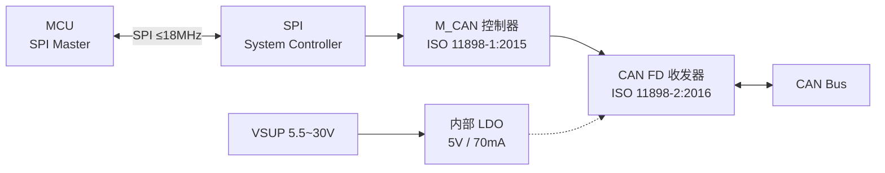
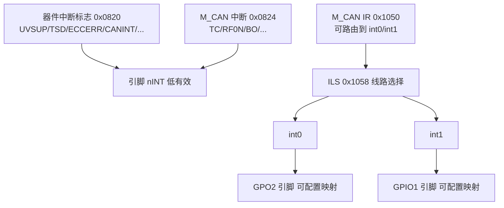

# TCAN4550

> TI 车规 CAN FD 系统基础芯片：**CAN FD 控制器 + CAN FD 收发器 + 5V LDO 三合一**，SPI 接口直连 MCU，单芯片完成 SPI→CAN FD 桥接。AEC-Q100 Grade 1，VQFN-20。

## 1. 身份与选型

| 项目 | 内容 |
|------|------|
| 核心功能 | SPI ↔ CAN FD 桥接（控制器 + 收发器集成，无需外挂 TJA1044 类收发器） |
| 关键卖点 | 单芯片方案；±58V 总线故障保护；VSUP 宽范围 5.5~30V 直接电池供电；集成 5V LDO 输出 70mA；VIO 适配 3.3V/5V MCU |
| 同类对比 | MCP2518FD 仅控制器需外挂收发器；TCAN4550-Q1 一步到位 |
| 协议 | 控制器：ISO 11898-1:2015 + Bosch M_CAN Rev 3.2.1.1；收发器：ISO 11898-2:2016 |
| 数据手册 | ZHCSJK5D Rev. D（中文版），英文版 SLLSEZ5 |

| 订购型号 | 封装 | 温度等级 | 说明 |
|---------|------|---------|------|
| TCAN4550-Q1 | VQFN-20 (RGY) | Grade 1：−40~+125°C | 车规标准型 |

## 2. 极限工况

> ⚠️ 超过即永久损坏（§6.1, p.5）

| 参数 | 最小 | 最大 | 单位 |
|------|------|------|------|
| VSUP 供电 | −0.3 | 42 | V |
| VIO I/O 供电 | −0.3 | 6 | V |
| VCCOUT 5V 输出 | −0.3 | 6 | V |
| VBUS (CANH/CANL) | −58 | 58 | V |
| VWAKE 唤醒输入 | −0.3 | 42 | V |
| VINH 禁止输出 | −0.3 | 42 | V |
| 逻辑输入 | −0.3 | 6 | V |
| 数字输出电流 IO(SO) | — | 8 | mA |
| INH 输出电流 | — | 4 | mA |
| 结温 TJ | −40 | 150 | °C |
| 存储温度 Tstg | −65 | 150 | °C |

### ESD / 瞬态（§6.2-6.3, p.5）

| 项目 | 能力 |
|------|------|
| HBM（CANH/CANL 除外） | ±4kV（AEC-Q100 3A 级） |
| HBM（CANH/CANL） | **±15kV**（H2 级） |
| CDM 全引脚 | ±750V（C5 级） |
| IEC 61000-4-2 接触/空气 | ±8kV / ±15kV |
| SAE J2962-2 接触/空气 | ±8kV / ±15kV |
| ISO 7637 脉冲 1/2/3a/3b | −100 / 75 / −150 / 100 V |

> CANH/CANL 自带 ±15kV HBM 和 ±8kV 接触 ESD——普通应用无需外加 TVS（与 [TJA1044](TJA1044.md) 的 ±8kV 同级或更强）。

## 3. 推荐工作条件（§6.4, p.6）

| 参数 | 最小 | 典型 | 最大 | 单位 |
|------|------|------|------|------|
| VSUP 供电 | 5.5 | — | 30 | V |
| VIO 逻辑供电 | 3.135 | — | 5.25 | V |
| C(FLTR) 滤波电容 | — | — | 300 | nF |
| C(VCCOUT) 输出电容 | — | — | 10 | µF |
| CWAKE 唤醒引脚电容 | — | — | 10 | nF |
| 热关断上升/下降 | — | 160 / 150 | — | °C |
| 热关断迟滞 | — | 10 | — | °C |

> **VSUP 直接接电池**（最高 30V），内部 LDO 生成 5V VCCOUT 供收发器，并可向外部负载提供最高 70mA。

## 4. 功耗特性（§6.6, p.7）

| 模式 | 条件 | 典型 | 最大 | 单位 |
|------|------|------|------|------|
| 正常-显性 | RL=60Ω，VCCOUT 空载 | 80 | — | mA |
| 正常-显性高负载 | RL=50Ω | 90 | — | mA |
| 正常-显性总线故障 | CANH=−25V | 180 | — | mA |
| 正常-隐性 | RL=60Ω | 15 | — | mA |
| 待机 | −40~85°C | 3.5 | — | mA |
| **睡眠** | SPI 时钟关断，VIO=0 | — | 25~42 | µA |
| IVIO 正常-显性 | CLKIN 40MHz / 晶振 40MHz | 0.8 / 3 | — | mA |
| IVIO 睡眠 | VIO=5V，时钟关断 | 9 | — | µA |

**欠压保护**（§6.6, p.7）：VSUP 上升 5.2~5.7V / 下降 4.5~5.0V；VIO 上升 2.45~2.6V / 下降 2.1~2.25V。

## 5. 热参数（§6.5, p.6）

| 参数 | 值 | 单位 |
|------|-----|------|
| RθJA | 35.2 | °C/W |
| RθJC(top) | 28.1 | °C/W |
| RθJB | 12.8 | °C/W |
| RθJC(bot) | **1.1** | °C/W |

> 底部焊盘热阻极低（1.1°C/W），散热焊盘必须焊接接地，热量主要从 PCB 底部导出。

## 6. CAN 收发器电气特性（§6.7, p.8-9）

### 驱动

| 参数 | 条件 | 最小 | 最大 | 单位 |
|------|------|------|------|------|
| 显性输出 CANH | 50~65Ω 负载 | 2.75 | 4.5 | V |
| 显性输出 CANL | 50~65Ω 负载 | 0.5 | 2.25 | V |
| 差分输出 VOD(D) | 50Ω≤RL≤65Ω | 1.5 | 3 | V |
| 差分输出 VOD(D) | 45Ω≤RL≤70Ω | 1.4 | 3 | V |
| 隐性差分 VOD(R) | RL=60Ω | −120 | 12 | mV |
| 对称性 VSYM | 250kHz~1MHz | 0.9 | 1.1 | V/V |
| 短路电流 IOS_DOM | CANH=−3~18V | −100 | 100 | mA |

### 接收

| 参数 | 条件 | 最小 | 最大 | 单位 |
|------|------|------|------|------|
| 显性阈值 VITdom | 偏置激活 | 0.9 | 8 | V |
| 隐性阈值 VITrec | 偏置激活 | −3.0 | 0.5 | V |
| 迟滞 VHYS | 正常模式 | — | 120 | mV |
| 共模范围 VCM | 正常/待机 | −12 | 12 | V |
| 差分输入阻抗 RID | 正常模式 | 60 | 100 | kΩ |
| 输入电容 CI / CID | — | — | 25 / 14 | pF |
| 失电总线泄漏 | VCANH/L=5V | — | 5 | µA |

### 集成 LDO（VCCOUT，§6.7, p.9）

| 参数 | 条件 | 值 |
|------|------|-----|
| 输出电压 | ICCOUT=−70~0mA，VSUP=5.5~18V | 4.75~5.25V |
| 压差 VDROP | VSUP=12V，70mA | 300~500mV |
| 线性调整率 | VSUP 5.5→30V | 50mV |
| 负载调整率 | 1→70mA | 60mV |

## 7. 时序特性（§6.8-6.9, p.11）

| 参数 | 最小 | 典型 | 最大 | 单位 |
|------|------|------|------|------|
| 待机→正常（SPI 写） | — | — | 70 | µs |
| 正常→睡眠 | — | — | 200 | µs |
| 唤醒→INH 有效 | — | — | 200 | µs |
| 唤醒→VCCOUT 上电 | — | — | 1.5 | ms |
| TXD→驱动隐性 tpHR | 50 | 85 | 110 | ns |
| TXD→驱动显性 tpLD | 35 | 75 | 100 | ns |
| 脉冲偏斜 tsk(p) | — | 30 | 40 | ns |
| 总线→RXD tpRH/tpDL | 35 | 55 | 90 | ns |
| 收发器环回 tLOOP | — | — | 235 | ns |
| 唤醒滤波 tWK_FILTER | 0.5 | — | 1.8 | µs |
| 显性超时 tTXD_INT_DTO | 1 | — | 5 | ms |

## 8. 核心功能

### 8.1 集成架构（§8.1-8.2, p.22-23）



- 控制器核心为 Bosch **M_CAN Rev 3.2.1.1**，CAN FD 数据速率最高 **8Mbps**（§1, p.1）
- 收发器物理层符合 ISO 11898-2:2016，支持 **5Mbps**（§8.1, p.22）——8Mbps 是控制器能力，物理层 5Mbps 是系统上限
- 推荐时钟 40MHz 以满足 5Mbps CAN FD（框图备注, p.23）；CLKIN 可由 MCU 提供或外接 40MHz 晶振

### 8.2 工作模式

| 模式 | 功耗 | 说明 |
|------|------|------|
| **正常** | 15~90mA | 全功能收发 |
| **待机** | 3.5mA | 低功耗接收器监测总线 WUP |
| **睡眠** | 25~42µA | SPI 时钟关断，WUP/LWU 唤醒，INH 控制系统电源 |
| **失效防护** | — | 欠压/热关断等异常自动进入 |

唤醒路径：CAN 总线 WUP（ISO 11898-2:2016 模式）或本地 WAKE 引脚。睡眠模式 INH 引脚拉低外部稳压器使能——整个节点断电，仅芯片自身 µA 级值守。

### 8.3 消息 RAM 与缓冲（§8.6.4.39, p.115）

M_CAN 消息 RAM 可自由分配：

| 资源 | 容量 |
|------|------|
| TX 缓冲总数 | **最多 32**（专用 TX 缓冲 + TX FIFO/队列任意划分，TFQS+NDTB≤32） |
| TX 数据字段 | 8/12/16/20/24/32/48/64 字节可配（TXESC.TBDS） |
| TX Event FIFO | 独立区域，自动记录发送事件 |
| RX FIFO | FIFO 0 + FIFO 1 双通道 |
| 过滤器 | 标准/扩展 ID 过滤 + 掩码 |

> [!warning] **ECC 上电注意（p.42）**
> 上电/复位/睡眠唤醒后消息 RAM 值未知，ECC 无效。必须**将 MRAM 清零**，且每个 TX 缓冲元素**至少写入 8 字节有效载荷**（即使 DLC < 8），否则触发 M_CAN BEU 错误并强制进入初始化模式。

## 9. 引脚（§5, p.4）

20-pin VQFN（RGY），4.5×3.5mm，底部散热焊盘：

| 引脚 | 名称 | 类型 | 功能 |
|------|------|------|------|
| 1 | OSC1 | I/O | 晶振输出或单端时钟输入 |
| 2 | nWKRQ | DO | 唤醒请求（低有效） |
| 3 | GPIO1 | DI/O | SPI 可配置 I/O |
| 4 | SCLK | DI | SPI 时钟 |
| 5 | SDI | DI | SPI 数据输入（MOSI） |
| 6 | SDO | DO | SPI 数据输出（MISO） |
| 7 | nCS | DI | SPI 片选 |
| 8 | nINT | DO | 中断输出（低有效，开漏） |
| 9 | GPO2 | DO | SPI 可配置输出 |
| 10 | CANL | HV I/O | CAN 低总线 |
| 11 | CANH | HV I/O | CAN 高总线 |
| 12 | WAKE | HVI | 本地唤醒输入（高压） |
| 13 | GND | GND | 地 |
| 14 | VSUP | HV In | 电池供电 5.5~30V |
| 15 | INH | HVO | 控制系统稳压器使能（开漏） |
| 16 | VCCOUT | Out | 5V LDO 输出 |
| 17 | VIO | In | 数字 I/O 电平（3.3V 或 5V） |
| 18 | FLTR | — | LDO 滤波，外接 300nF 到地 |
| 19 | RST | DI | 器件复位（低有效，脉宽 ≥30µs） |
| 20 | OSC2 | I | 晶振输入；单端时钟时接 GND |

> 散热焊盘和 GND 引脚**必须**焊接至地（§5 备注, p.4）。

## 10. 典型应用电路要点（§1 简化原理图, p.1）

- **VSUP**：电池直连，10µF + 100nF 去耦
- **VCCOUT**：10µF 输出电容
- **FLTR**：300~330nF 到地
- **WAKE**：10nF 电容（外部唤醒时 33kΩ/3kΩ 分压网络）
- **CANH/CANL**：标准 120Ω 终端（总线两端）；芯片自带 ±15kV HBM，一般无需外挂 ESD
- **时钟**：MCU CLKIN 40MHz 直供 OSC1（OSC2 接地），或 OSC1/OSC2 外接 40MHz 晶振（ESR≤60Ω）

## 11. 与 MCP2518FD 方案对比

| | TCAN4550-Q1 | MCP2518FD + TJA1044 |
|---|---|---|
| BOM | **1 颗 IC** | 2 颗 IC（+ 可选 ESD） |
| SPI 速率 | 18MHz | 20MHz |
| CAN FD 数据段 | 8Mbps（控制器）/ 5Mbps（物理层） | 8Mbps（控制器）/ 5Mbps（取决于收发器） |
| 供电 | 电池直连 5.5~30V | 需要 3.3V/5V 稳压 |
| 总线 ESD | ±15kV HBM 自带 | 收发器 ±8kV |
| 低功耗 | 睡眠 25µA + INH 电源管理 | 收发器待机 0.1µA |
| 协议引擎 | Bosch M_CAN 3.2.1.1 | Microchip 专有 |

> [!note] 选型建议
> 多路扩展时每路一颗 TCAN4550 最省 BOM；MCP2518FD 需要 MCU 已有稳定 5V/3.3V 电源且空间充裕。

## 12. SPI 编程接口（§8.5, p.42-46）

### 12.1 访问规则

| 规则 | 内容 |
|------|------|
| 访问宽度 | **固定 32 位字**。每次 SPI 事务必须是 32 的整数倍，否则末字被忽略且置 SPIERR（§8.5.1.3, p.43） |
| 地址对齐 | 寄存器按 32 位对齐，地址低 2 位被忽略（如 0x1004 可用 1004/1005/1006/1007 访问） |
| MRAM 寻址 | 配置 MRAM 起始地址时**无需 0x8000 前缀**（0x8634 → 写 0x0634） |
| 总线拓扑 | 必须**并行片选**操作，不支持 SPI 菊花链（§8.5.1.3 备注, p.43） |

### 12.2 SPI 帧格式

```
每个事务 = 命令字节 + 2 地址字节 + 1 长度字节 + N 个 32 位数据字
```

| 命令 | 操作码 | 说明 |
|------|--------|------|
| **WRITE_B_FL** | 0x61 | 突发写：`<0x61><地址[15:8]><地址[7:0]><长度><数据字×N>` |
| **READ_B_FL** | 0x41 | 突发读：`<0x41><地址[15:8]><地址[7:0]><长度>`，SDO 返回数据字 |

- 长度 0x00 = 256 个字（§8.5.2 备注, p.44）
- **SDO 输出流**：事务开始总是先移出 Global Status 字节（含 Global Fault Flag），随后才是数据（§8.5.1, p.42）
- **时序**：SPI Mode 0（CPOL=0, CPHA=0）——SDI 在 SCLK **上升沿采样**，SDO 在 SCLK **下降沿移出**（§8.5.1.2, p.43）
- **nCS 特性**：nCS 下降沿时 SDO 立即驱动，首比特即为 Global Fault Flag（§8.5.1.4, p.43）

### 12.3 SPI 错误检测（0x000C / 0x0010, p.51-52）

| 错误位 | 说明 |
|--------|------|
| SPI_end_error | SPI 事务未在字节边界结束 |
| Invalid_command | 收到无效 SPI 命令 |
| Write_overflow / write_underflow | 写序列数据过多 / 过少 |
| Read_overflow / read_underflow | 读序列数据过多 / 过少 |
| Write_fifo_overflow / Read_fifo_underflow / Read_fifo_empty | 内部 FIFO 异常 |

> [!note] SPI 下溢在**下一次 SPI 事务开始时**才被报告（p.60 备注）。SPIERR 标志 = 0x000C[30:16] 任一置位；0x0010[30:16] 为对应掩码。

## 13. 寄存器分区（§8.5.2, p.43-44）

| 地址范围 | 区域 |
|----------|------|
| 0x0000 ~ 0x000C | 器件 ID 与 SPI 寄存器 |
| 0x0800 ~ 0x083C | 器件配置寄存器 + 中断标志 |
| 0x1000 ~ 0x10FC | M_CAN 内核寄存器 |
| 0x8000 ~ 0x87FF | MRAM（**2KB**，TX/RX 缓冲/FIFO 全可配置） |

> [!warning] **MRAM 上电 ECC 初始化（§8.5, p.42）**
> 上电/复位/睡眠唤醒后 MRAM 值未知，ECC 无效。必须清零整个 MRAM；每个 TX 缓冲元素至少写 8 字节有效载荷（即使 DLC<8），否则触发 BEU 错误 → 芯片进入初始化模式，需人工干预。

## 14. 器件 ID 与配置寄存器（§8.6.1-8.6.2, p.47-56）

| 地址 | 寄存器 | 复位值 | 说明 |
|------|--------|--------|------|
| 0x0000 | DEVICE_ID1 | 0x4E414354 | 字符 "TCAN" |
| 0x0004 | DEVICE_ID2 | 0x30353534 | 字符 "4550" |
| 0x0008 | Revision | 0x00110201 | SPI 版本 / 器件主次版本 |
| 0x000C | Status | — | SPI 状态与错误标志（W1C 清除） |
| 0x0010 | SPI Error mask | 0x00000000 | SPI 错误中断掩码 |
| 0x0800 | Mode & Pin Config | 0xC8000468 | 模式/唤醒/看门狗/引脚配置（见下） |
| 0x0804 | Timestamp Prescaler | 0x00000002 | 写即清零时间戳计数器，CAN 时钟分频 = 值×8 |

### 0x0800 关键字段（p.53-55）

| 位 | 字段 | 复位 | 说明 |
|----|------|------|------|
| 7:6 | MODE_SEL | 01 | 00=睡眠 / 01=待机 / **10=正常** |
| 31:30 | WAKE_CONFIG | 11 | WAKE 引脚：00=禁用 / 01=上升沿 / 10=下降沿 / 11=双边沿 |
| 29:28 | WD_TIMER | 00 | 看门狗周期：00=60ms / 01=600ms / 10=3s / 11=6s |
| 27 | CLK_REF | 1 | 0=20MHz / **1=40MHz**（须与实际时钟一致） |
| 3 | WD_EN | 1 | 看门狗使能（默认开！超时动作见 WD_ACTION） |
| 17:16 | WD_ACTION | 00 | 00=置中断标志 / 01=脉冲 INH 并进待机 / 10=脉冲 WD 输出引脚 |
| 2 | DEVICE_RESET | 0 | 写 1 = 软件复位（同 RST 引脚功能） |
| 1 | SWE_DIS | 0 | 1=禁用睡眠唤醒错误（4 分钟定时器） |
| 23:22 | GPO2_CONFIG | 00 | GPO2 引脚：00=无 / 01=MCAN_INT0 / 10=WD 输出 / 11=镜像 nINT |
| 11:10 | GPIO1_GPO_CONFIG | 01 | GPIO1 输出：00=SPI 故障 / 01=MCAN_INT1 / 10=欠压/热事件 |
| 15:14 | GPIO1_CONFIG | 00 | GPIO1 方向：00=GPO / 10=GPI（自动成为 WD 输入触发） |
| 19 | nWKRQ_VOLTAGE | 0 | nWKRQ 缓冲电压轨：0=内部轨 / 1=VIO（变为开漏，需外部上拉） |
| 9 | INH_DIS | 0 | 1=禁用 INH 引脚 |
| 13 | FAIL_SAFE_EN | 0 | 1=使能失效防护模式 |

> [!note] 模式切换副作用（p.55 备注）
> 写 MODE_SEL 切换到正常模式时，硬件**自动**写 CCCR.INIT=0；切出正常模式时自动写 CCCR.INIT=1（挂起 TX/RX 处理）。UVIO/UVCCOUT/TSD 故障时同样自动置 INIT=1 保持内核已知状态（§8.4.6.7.3, p.42）。

> [!warning] **WD_EN 默认开启**，复位值 1。若 MCU 启动不喂狗（写 1 到 0x0800[18] WD_BIT_SET），60ms 后触发 WD_ACTION——默认只置标志，但驱动初始化时必须处理。

## 15. 中断系统（§8.6.3, p.59-63）

### 15.1 中断层级



### 15.2 器件中断标志（0x0820，p.59-60）

| 位 | 标志 | 说明 |
|----|------|------|
| 31 | CANBUSNOM | CAN 总线正常标志（非中断）——正常模式首个显→隐跳变后置位 |
| 23 | SMS | 睡眠模式状态（仅 WKERR/UVIO 超时/UVIO+TSD 进入睡眠时置位） |
| 22 / 21 | UVSUP / UVIO | VSUP+VCCOUT / VIO 欠压 |
| 20 | PWRON | 上电标志（复位值 1） |
| 19 | TSD | 热关断 |
| 18 | WDTO | 看门狗超时 |
| 16 | ECCERR | 不可纠正 ECC 错误 |
| 15 / 14 / 13 | CANINT / LWU / WKERR | 总线唤醒 / 本地唤醒 / 唤醒错误 |
| 10 / 8 | CANSLNT / CANDOM | CAN 静默 / CAN 钳位显性故障 |
| 7 | GLOBALERR | 0x0820-0x0824 全部故障的逻辑或 |
| 6 | WKRQ | CANINT + LWU + WKERR 的逻辑或 |
| 5 | CANERR | CANSLNT + CANDOM 的逻辑或 |
| 3 | SPIERR | SPI 状态寄存器 0x000C[30:16] 任一置位 |
| 1 | M_CAN_INT | M_CAN 全局中断 |
| 0 | VTWD | UV + TSD + WDTO + ECCERR 的逻辑或 |

### 15.3 M_CAN 中断标志（0x0824，p.61-62）

| 位 | 标志 | 位 | 标志 |
|----|------|----|------|
| 29 | ARA 保留地址访问 | 9 | TC 发送完成 |
| 28 / 27 | PED / PEA 数据段/仲裁段协议错误 | 8 | HPM 高优先级消息 |
| 26 | WDI 看门狗 | 7~4 | RF1L/F/W/N — Rx FIFO1 丢失/满/水印/新消息 |
| 25 / 24 | BO / EW 总线关闭/警告 | 3~0 | RF0L/F/W/N — Rx FIFO0 丢失/满/水印/新消息 |
| 23 / 22 | EP / ELO 错误被动/错误日志溢出 | 15~12 | TEFL/TEFF/TEFW/TEFN — Tx 事件 FIFO |
| 21 / 20 | BEU / BEC ECC 不可纠正/已纠正 | 11 | TFE Tx FIFO 空 |
| 19 | DRX 消息存入专用 RX 缓冲 | 10 | TCF 发送取消完成 |
| 18 | TOO 超时发生 | 16 | TSW 时间戳回绕 |
| 17 | MRAF 消息 RAM 访问失败 | | |

### 15.4 M_CAN 中断路由（0x1050/1054/1058/105C，p.95-97）

| 寄存器 | 作用 |
|--------|------|
| IR (0x1050) | M_CAN 中断标志（与 0x0824 同集） |
| IE (0x1054) | 中断使能 |
| **ILS (0x1058)** | **中断线路选择**：每位 0→int0 / 1→int1 |
| ILE (0x105C) | 线路使能：EINT0 / EINT1 |

- **int0** 可通过 GPO2 引脚输出（0x0800 GPO2_CONFIG=01）
- **int1** 可通过 GPIO1 引脚输出（0x0800 GPIO1_GPO_CONFIG=01）
- 不配引脚时，两线都汇入 nINT 引脚（低有效）

## 16. CAN FD 寄存器映射（§8.6.4, p.64-66）

| 地址 | 符号 | 名称 | 复位值 | 访问 |
|------|------|------|--------|------|
| 1000 | CREL | 内核版本 | — | R |
| 1004 | ENDN | 字节序测试值 | 87654321 | R |
| 1008 | CUST | 用户自定义 | 0 | R |
| 100C | DBTP | **数据位时序 + 预分频** | 00000A33 | RP |
| 1010 | TEST | 测试（LBCK 回环） | 0 | RP |
| 1014 | RWD | RAM 看门狗 | 0 | RP |
| 1018 | CCCR | **CC 控制**（INIT/CCE/FDOE/BRSE/MON/...） | 00000019 | RWP |
| 101C | NBTP | **标称位时序 + 预分频** | 06000A03 | RP |
| 1020 | TSCC | 时间戳计数器配置 | 0 | RP |
| 1024 | TSCV | 时间戳计数器值 | 0 | RC |
| 1028 | TOCC | 超时计数器配置 | FFFF0000 | RP |
| 102C | TOCV | 超时计数器值 | 0000FFFF | RC |
| 1040 | ECR | 错误计数器（TEC/REC） | 0 | R |
| 1044 | PSR | 协议状态 | 00000707 | R |
| 1048 | TDCR | 发送延迟补偿（TDC） | 0 | RP |
| 1050 | IR | 中断标志 | 0 | RW |
| 1054 | IE | 中断使能 | 0 | RW |
| 1058 | ILS | 中断线路选择 | 0 | RW |
| 105C | ILE | 中断线路使能 | 0 | RW |
| 1080 | GFC | 全局过滤器配置 | 0 | RP |
| 1084 | SIDFC | 标准 ID 过滤器配置 | 0 | RP |
| 1088 | XIDFC | 扩展 ID 过滤器配置 | 0 | RP |
| 1090 | XIDAM | 扩展 ID AND 掩码 | 1FFFFFFF | RP |
| 1094 | HPMS | 高优先级消息状态 | 0 | R |
| 1098 / 109C | NDAT1 / NDAT2 | RX 缓冲 0-31 / 32-63 新数据标志（写 1 清零） | 0 | RW |
| 10A0 | RXF0C | **Rx FIFO 0 配置** | 0 | RP |
| 10A4 | RXF0S | Rx FIFO 0 状态（F0FL/F0GI/F0PI） | 0 | R |
| 10A8 | RXF0A | Rx FIFO 0 确认（F0AI） | 0 | RW |
| 10AC | RXBC | Rx 缓冲起始地址（RBSA） | 0 | RP |
| 10B0 | RXF1C | **Rx FIFO 1 配置** | 0 | RP |
| 10B4 | RXF1S | Rx FIFO 1 状态 | 0 | R |
| 10B8 | RXF1A | Rx FIFO 1 确认（F1AI） | 0 | RW |
| 10BC | RXESC | RX 缓冲/FIFO 元素数据字段尺寸 | 0 | RP |
| 10C0 | TXBC | **TX 缓冲配置**（TBSA/TFQS/NDTB） | 0 | RP |
| 10C4 | TXFQS | TX FIFO/队列状态 | 0 | R |
| 10C8 | TXESC | TX 缓冲数据字段尺寸（TBDS） | 0 | RP |
| 10CC | TXBRP | TX 请求挂起 | 0 | R |
| 10D0 | TXBAR | **TX 添加请求**（写 1 请求发送） | 0 | RW |
| 10D4 | TXBCR | TX 取消请求 | 0 | RW |
| 10D8 | TXBTO | TX 已发送 | 0 | R |
| 10DC | TXBCF | TX 取消完成 | 0 | R |
| 10E0 | TXBTIE | TX 发送中断使能 | 0 | RW |
| 10E4 | TXBCIE | TX 取消完成中断使能 | 0 | RW |
| 10F0 | TXEFC | **TX 事件 FIFO 配置**（EFSA/EFS/EFWM） | 0 | RP |
| 10F4 | TXEFS | TX 事件 FIFO 状态 | 0 | R |
| 10F8 | TXEFA | TX 事件 FIFO 确认 | 0 | RW |

> 关键位时序寄存器：**NBTP**（仲裁段/标称速率）与 **DBTP**（数据段速率）决定 CAN FD 双速率；CCCR.FDOE 使能 CAN FD、CCCR.BRSE 使能双速率、CCCR.INIT 进入初始化态（改位时序前必须置位）。

## 17. 过滤器与接收路径（§8.6.4.23-38, p.99-114）

### 17.1 全局过滤器（GFC 0x1080, p.99）

| 字段 | 位 | 说明 |
|------|----|------|
| ANFS | 5:4 | **标准 ID 不匹配帧**处理：00→收进 FIFO0 / 01→收进 FIFO1 / 10、11→丢弃 |
| ANFE | 3:2 | **扩展 ID 不匹配帧**处理：同上 |
| RRFS | 1 | 1=丢弃全部标准 ID 远程帧 |
| RRFE | 0 | 1=丢弃全部扩展 ID 远程帧 |

### 17.2 过滤器列表（p.100-103）

| 寄存器 | 容量 | 字段 |
|--------|------|------|
| SIDFC (0x1084) | 标准 ID 过滤器 **1~128 条** | LSS=数量，FLSSA=列表在 MRAM 起始地址 |
| XIDFC (0x1088) | 扩展 ID 过滤器 **1~64 条** | LSE=数量，FLSEA=列表在 MRAM 起始地址 |
| XIDAM (0x1090) | 扩展 ID AND 掩码 | 与接收帧 29 位 ID 相与后过滤——专为 **SAE J1939** 设计；复位全 1=掩码无效 |

> M_CAN 过滤器是**列表式**（每条含 ID + 存储目标），不是 MCP2515 的掩码式。每条过滤器元素直接指定匹配帧存入 FIFO0 / FIFO1 / 专用 RX 缓冲或丢弃。匹配结果（过滤器索引、目标 FIFO、缓冲索引）可经 HPMS (0x1094) 读取。

### 17.3 RX FIFO（p.107-113）

| 字段 | 说明 |
|------|------|
| F0OM / F1OM | 0=阻塞模式（满则丢新帧，置 RFxL）/ 1=覆盖模式（覆盖最旧帧，不置丢失标志） |
| F0WM / F1WM | 水印中断阈值（1~64，0=禁用，>64=禁用） |
| F0S / F1S | FIFO 深度 **1~64 元素**（0=无此 FIFO） |
| F0SA / F1SA | MRAM 起始地址（32 位对齐，免 0x8000 前缀） |
| F0FL / F1FL | 当前填充数（状态） |
| F0PI / F0GI | 写入/读取指针（状态） |
| F0AI / F1AI | 确认索引——**读完消息后写最后读的元素索引**，硬件把 Get Index 推至 FxAI+1 |

### 17.4 专用 RX 缓冲（p.105-110）

- RXBC (0x10AC) 的 RBSA 定义专用 RX 缓冲区在 MRAM 的起始地址
- 最多 64 个专用 RX 缓冲，新数据标志在 NDAT1/NDAT2（0x1098/0x109C）——写 1 清零
- 专用缓冲适合关键帧（如电机反馈），FIFO 适合突发帧

### 17.5 数据字段尺寸（RXESC 0x10BC / TXESC 0x10C8, p.114,117）

| 编码 | 数据字段 | 编码 | 数据字段 |
|------|---------|------|---------|
| 000 | 8 字节 | 100 | 24 字节 |
| 001 | 12 字节 | 101 | 32 字节 |
| 010 | 16 字节 | 110 | 48 字节 |
| 011 | 20 字节 | 111 | **64 字节** |

- RXESC：RBDS（专用缓冲）/ F1DS（FIFO1）/ F0DS（FIFO0）独立配置
- TXESC：TBDS 统一配置；DLC 超过 TBDS 的部分按 0xCC 填充发出（p.117 备注）

## 18. 发送路径（§8.6.4.39-43, p.115-120）

- **TXBC (0x10C0)**：TBSA=TX 缓冲起始地址；NDTB=专用 TX 缓冲数（1-32）；TFQS=TX FIFO/队列数；**NDTB+TFQS ≤ 32**
- **发送流程**：写 TX 缓冲元素（含 ID/数据/长度）→ 置 TXBAR 对应位（可一次置多位）→ 硬件按**最低 ID 优先**扫描发送（p.118）→ 完成后 TXBTO 置位 + TXBRP 清零
- **取消**：写 TXBCR 位 → TXBCF 报告完成
- **TX Event FIFO**（TXEFC 0x10F0）：自动记录每次发送事件（时间戳/ID/结果），用于日志与诊断；EFS 1-32 元素
- 中断使能：TXBTIE（逐缓冲发送完成）、TXBCIE（取消完成）

> [!warning] **TCAN4550 初始化的完整顺序（综合 p.42-120）**
> ① 读 0x0000/0x0004 确认 DEVICE_ID="TCAN4550" → ② 配 0x0800（MODE_SEL=正常、CLK_REF 匹配实际时钟、关或配置看门狗）→ ③ **清零全部 2KB MRAM** → ④ 置 CCCR.INIT=1（自动已置位），配置 NBTP/DBTP → ⑤ 配置 GFC/SIDFC/XIDFC 过滤器（SIDFC.LSS 等写入前 INIT 须有效）→ ⑥ 配置 RXF0C/RXF1C/TXBC/TXEFC 各区域地址与尺寸 → ⑦ 写 XIDAM（需要时）→ ⑧ 置 CCCR.FDOE=1（CAN FD）、BRSE=1（双速率）→ ⑨ 清 CCCR.INIT=0 → ⑩ 配置 IE/ILS/ILE + 0x0830 中断使能，等待 CANBUSNOM 置位后开始通信。

## 19. 位时序配置（§8.6.4.4-8.6.4.8, p.73-78）

### 19.1 CCCR 控制寄存器全字段（0x1018, p.76-77）

| 位 | 字段 | 复位 | 说明 |
|----|------|------|------|
| 0 | INIT | 1 | 1=初始化模式（改位时序/保护寄存器前必须置位） |
| 1 | CCE | 0 | 配置改变使能（INIT=1 时写 1 才能改保护寄存器） |
| 2 | ASM | 0 | 受限操作模式（MRAF 后自动进入，写 0 退出） |
| 3 | CSA | 1 | 时钟停止应答（只读） |
| 4 | CSR | 1 | 时钟停止请求——**不要写 1**，硬件自行处理（p.77 备注） |
| 5 | MON | 0 | 总线监控模式（只收不发） |
| 6 | DAR | 0 | 1=禁用自动重发 |
| 7 | TEST | 0 | 测试模式使能（使能后 TEST 寄存器可写） |
| 8 | FDOE | 0 | **CAN FD 使能** |
| 9 | BRSE | 0 | **双速率切换使能**（仲裁段/数据段速率不同） |
| 12 | PXHD | 0 | 1=禁用协议异常处理 |
| 13 | EFBI | 0 | 1=硬同步边沿需连续 2 个显性 tq |
| 14 | TXP | 0 | 发送器暂停 |
| 15 | NISO | 0 | 1=非 ISO CAN FD 帧格式（Bosch V1.0），0=ISO 11898-1:2015 |

### 19.2 NBTP 标称位时序（0x101C, p.78）——仲裁段速率

| 字段 | 位 | 范围 | 含义 |
|------|----|------|------|
| NBRP[8:0] | 24:16 | 0~511 | 标称位速率预分频（实际分频 = 值+1） |
| NSJW[6:0] | 31:25 | 0~127 | 标称同步跳变宽度（实际 = 值+1） |
| NTSEG1[7:0] | 15:8 | 1~255 | 采样点前段（实际 = 值+1） |
| NTSEG2[6:0] | 6:0 | 1~127 | 采样点后段（实际 = 值+1） |

```
f_仲裁段 = f_CLK / [(NBRP+1) × (1 + NTSEG1+1 + NTSEG2+1)]
采样点   = (1 + NTSEG1+1) / (1 + NTSEG1+1 + NTSEG2+1)
```

复位值 0x06000A03：NBRP=0(+1=1)、NTSEG1=0xA(+1=11)、NTSEG2=3(+1=4)、NSJW=3(+1=4)。40MHz 时钟 → 40MHz/(1×16)=**2.5Mbps**，采样点 12/16=75%。

### 19.3 DBTP 数据位时序（0x100C, p.73）——数据段速率

| 字段 | 位 | 范围 | 含义 |
|------|----|------|------|
| DBRP[4:0] | 20:16 | 0~31 | 数据位速率预分频（实际 = 值+1） |
| DTSEG1[4:0] | 12:8 | 1~31 | 采样点前段（实际 = 值+1） |
| DTSEG2[3:0] | 7:4 | 0~15 | 采样点后段（实际 = 值+1） |
| DSJW[3:0] | 3:0 | 0~15 | 数据同步跳变宽度（实际 = 值+1） |
| TDC | 23 | 0 | **发送延迟补偿使能**（高速 CAN FD 必须开） |

```
f_数据段 = f_CLK / [(DBRP+1) × (1 + DTSEG1+1 + DTSEG2+1)]
```

复位值 0x00000A33：DBRP=0(+1=1)、DTSEG1=0xA(+1=11)、DTSEG2=3(+1=4)、DSJW=3(+1=4)。40MHz → 2.5Mbps。

> [!note] 常用速率参考（40MHz 时钟，需按公式自算验证）
> 仲裁段 1Mbps（采样点 ~80%）：NBRP=1、NTSEG1=29、NTSEG2=9 → 40M/(2×40)=500k… ⚠️ 存疑：此列值为示例推演，请按公式与 TI 工具确认。数据段 5Mbps：DBRP=0、DTSEG1=4、DTSEG2=3 → 40M/(1×8)=5M ✅（此组合公式自洽，非手册明文）

### 19.4 TDCR 发送延迟补偿（0x1048, p.67）

| 字段 | 位 | 说明 |
|------|----|------|
| TDCF[6:0] | 6:0 | 延迟补偿滤波窗长度（滤波掉总线毛刺的窗口，单位 tq） |
| TDCO[6:0] | 14:8 | 补偿偏移（TXD 到 RXD 的环回延迟测量值） |

TDC 由 DBTP.TDC 使能。原理：数据段高速率下发送节点在采样点读回总线时会读到自己发出的电平而非对方应答，TDC 把采样点平移 TDCO 补偿收发器环回延迟（TDCV 实测值见 PSR 0x1044[22:16]）。

## 20. 状态/测试/计数器（p.74-82）

### 20.1 TEST 测试寄存器（0x1010, p.74）

| 位 | 字段 | 说明 |
|----|------|------|
| 7 | RX | 只读：0=总线显性 / 1=总线隐性 |
| 6:5 | TX[1:0] | 控制 TXD：00=正常 / 01=采样点监测 / 10=强制显性 / 11=强制隐性 |
| 4 | LBCK | **回环模式**：1=内部 TX→RX 回环（驱动自测，无需外部收发） |

### 20.2 RWD RAM 看门狗（0x1014, p.75）

WDC[7:0]=配置，WDV[7:0]=计数器值。用于检测 MRAM 访问异常（与器件级 WD_TIMER 是两套独立机制）。

### 20.3 时间戳（TSCC 0x1020 / TSCV 0x1024, p.79-80）

| 字段 | 说明 |
|------|------|
| TSS[1:0] | 00=恒 0；**01=按 TCP 递增**（常用）；10=外部时间戳；11=恒 0 |
| TCP[3:0] | 时间单位 = CAN 位时间的 1~16 倍 |
| TSC[15:0] | 帧起始（收发均）采样时间戳；回绕置 IR.TSW；写清零 |

### 20.4 超时计数器（TOCC 0x1028 / TOCV 0x102C, p.81-82）

| 字段 | 说明 |
|------|------|
| TOS[1:0] | 00=连续模式；01=由 TX Event FIFO 控制；10=由 RX FIFO0 控制；11=由 RX FIFO1 控制 |
| ETOC | 使能超时计数器 |
| TOP[15:0] | 计数初值（向下计数） |

计数到 0 置 IR.TOO 并停止。FIFO 控制模式下：FIFO 空→载入 TOP，存入首元素→开始递减——用于**帧超时检测**。

### 20.5 错误与协议状态（ECR 0x1040 / PSR 0x1044, p.67）

| 寄存器 | 字段 | 说明 |
|--------|------|------|
| ECR | TEC / REC | 发送/接收错误计数器（决定错误主动/被动/总线关闭状态） |
| ECR | CEL | CAN 错误日志 |
| PSR | BO / EW / EP | 总线关闭 / 警告 / 错误被动状态 |
| PSR | ACT | 活动状态（收发中） |
| PSR | LEC / DLEC | 最近一次错误码（仲裁段/数据段，⚠️ 存疑：错误码枚举值本中文版未逐条提取，见 Bosch M_CAN 规范） |
| PSR | RFDF | 收到 FD 帧标志 |
| PSR | RBRS | 收到 BRS 切换帧标志 |
| PSR | TDCV[6:0] | TDC 实测补偿值 |

### 20.6 TX Event FIFO（TXEFC 0x10F0 / TXEFS 0x10F4 / TXEFA 0x10F8, p.127-129）

| 字段 | 说明 |
|------|------|
| EFS[5:0] | FIFO 深度 **1~32** 元素（0=禁用） |
| EFWM[5:0] | 水印 1~32 |
| EFSA | MRAM 起始地址（32 位对齐） |
| EFFL / EFPI / EFGI | 填充数 / 写指针 / 读指针（0~31） |
| EFAI[4:0] | 读完写最后元素索引 → Get Index 前移 |
| TEFL / EFF | 元素丢失 / 满标志 |

## 21. 应用设计要点（§9-11, p.131-140）

### 21.1 时钟选择（§9.1.1, p.131）

- 2/5Mbps CAN FD 要求时钟精度 **±0.5%**
- **2Mbps 最低 20MHz**；**5Mbps 推荐 40MHz**
- 手册评估用晶振：NX2016SA 20MHz / 40MHz

### 21.2 总线负载与节点数（§9.1.2, p.131）

- 典型总线最长 **40m**，桩线最长 **0.3m**
- 输入阻抗最低 30kΩ → 理论上单段可挂 **167+ 收发器**（30kΩ∥167 节 ≈ 180Ω 差分负载）；实际节点数受布线/时序/地偏限制远低于此
- 相关网络标准：ARINC825、CANopen、DeviceNet、SAE J2284、SAE J1939、NMEA2000

### 21.3 终端与偏置（§9.1.3, p.131-134）

- 标准端接：总线两端各 120Ω
- **分裂端接**：2×60Ω + 中点 4.7nF 电容到地——抑制共模电压波动，改善 EME
- 总线偏置：正常模式 2.5V；低功耗模式 GND；自动偏置状态机在正常/待机/睡眠间切换

### 21.4 供电建议（§10, p.138）

| 引脚 | 电容要求 |
|------|---------|
| VSUP / VIO | 就近 100nF（+ 系统级大容量） |
| FLTR | **≥300nF** 到地（内部数字轨滤波，必须） |
| VCCOUT | **≥10µF** 到地（最小，考虑老化降额） |

> ⚠️ 热警告（§9.2.3, p.136-137）：TA=125°C + VSUP=20V + VCCOUT 满载 70mA + 总线显性 → 触发热关断。VSUP 越高、环境越热，LDO 负载要越小。

### 21.5 布局要点（§11.1, p.139-140）

- TVS/滤波电容**贴连接器放**，信号路径方向布置防护器件
- nINT(8脚)/GPO2(9脚) 开漏 → 外部上拉 2~10kΩ 至 VIO
- WAKE(12脚)：10nF 到地 + 33kΩ/3kΩ 分压网络
- INH(15脚)：不用可悬空，推荐 100kΩ 下拉
- 晶振走线：OSC1/OSC2 等长匹配，串阻 R8（详见 TCAN455x Clock Optimization 应用笔记）
- 旁路电容就近 + 至少 2 过孔降电感

## 提取完整性

| 类别 | 请求项 | 已提取 | 存疑 | 未找到 |
|------|--------|--------|------|--------|
| 绝对最大额定值 | 11 | 11 | 0 | 0 |
| 推荐工作条件 | 6 | 6 | 0 | 0 |
| 电气特性（驱动/接收） | 14 | 14 | 0 | 0 |
| 供电特性 | 12 | 12 | 0 | 0 |
| 时序 | 11 | 11 | 0 | 0 |
| SPI 时序（tCSS/tCSH/tCSD） | 3 | 3 | 0 | 0 |
| 封装/热参数 | 6 | 6 | 0 | 0 |
| SPI 协议与帧格式 | 8 | 8 | 0 | 0 |
| 寄存器映射（全部 60 条 + 全字段） | 60 | 60 | 0 | 0 |
| 中断系统 | 40 | 40 | 0 | 0 |
| 过滤器/RX FIFO/TX/事件 FIFO | 25 | 25 | 0 | 0 |
| 位时序（CCCR/NBTP/DBTP/TDCR） | 15 | 15 | 1 | 0 |
| 状态/测试/计数器（PSR/ECR/TSCC/TOCC…） | 12 | 12 | 1 | 0 |
| 应用设计（时钟/总线/端接/供电/布局） | 15 | 15 | 0 | 0 |
| MRAM 元素字级布局 | — | — | — | **原文未提供**，指向 Bosch M_CAN 规范 |

⚠️ 存疑项：(1) §19.3 速率示例表中 1Mbps 组合值为推演非手册明文；(2) PSR.LEC/DLEC 错误码枚举值未逐条提取。未找到项：MRAM 元素（TX/RX/过滤器元素）字级结构布局在本数据手册中无表格，驱动开发需参考 Bosch M_CAN Rev 3.2.1.1 规范或 TI 示例代码。

---

- 接口存储 · 配套收发器对比 [TJA1044](TJA1044.md) · CAN 协议基础 [CAN 总线协议基础](../../知识/通讯网络/CAN%20总线协议基础.md)
