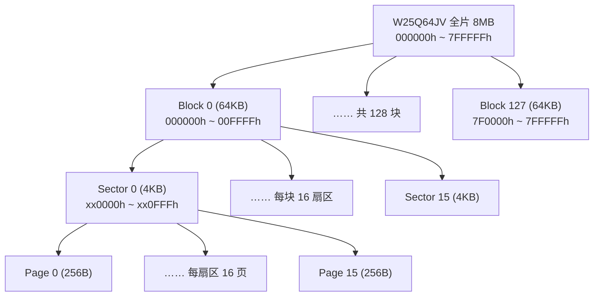
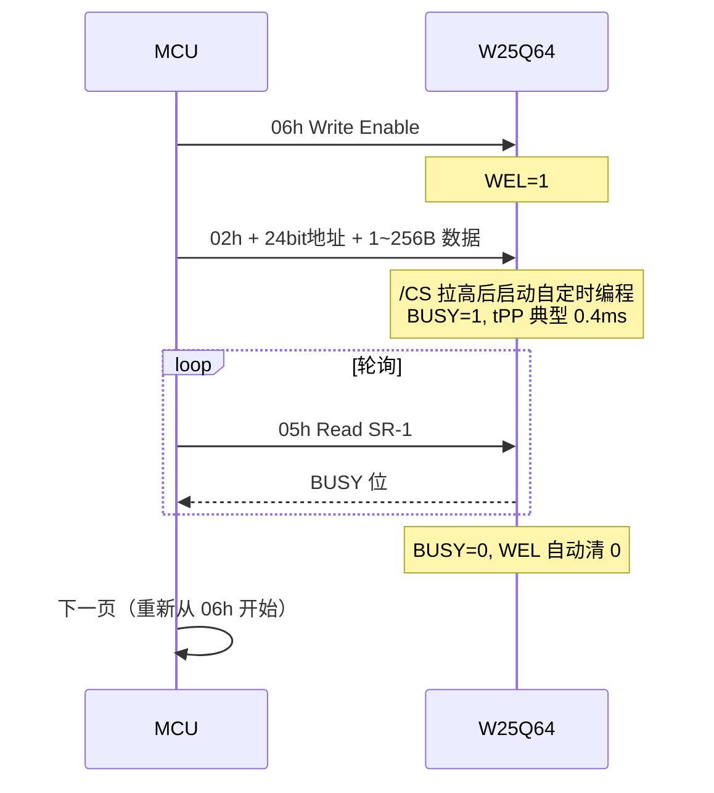

# W25Q64
> Winbond 64Mbit (8MB) SPI NOR Flash。支持 Standard/Dual/Quad SPI，133MHz 时钟（Quad 等效 532MHz）。4KB 小扇区架构，10 万次擦写、20 年数据保持。SOIC-8 等多种封装。
> 依据 W25Q64JV 数据手册 Rev J（2018-03-27）整理。

## 1. 身份与选型

| 项目 | 内容 |
|------|------|
| 型号 | W25Q64JV 系列 |
| 核心功能 | 64Mbit (8MB) SPI NOR Flash 存储器 |
| 关键卖点 | Quad SPI 高速读取（等效 532MHz）、4KB 小扇区、擦写挂起/恢复、独立块锁、20 年数据保持、≥100K 擦写寿命 |
| 供电 | 2.7–3.6V 单电源 |
| JEDEC ID (9Fh) | IQ/JQ 后缀：EF 40 17；IM/JM 后缀：EF 70 17 |
| 设备 ID (ABh/90h) | 16h |

**订购后缀解码**（`W25Q64JV` + 封装码 + 温度 + 包装）：

| 字段 | 含义 |
|------|------|
| 封装码 | SS = SOIC-8 208mil；SF = SOIC-16 300mil；ZP = WSON 6×5mm；ZE = WSON 8×6mm；XG = XSON 4×4mm；TB/TC = TFBGA 8×6mm；BY = WLCSP-12 |
| I / J | I = 工业级 -40~+85°C；J = 工业级加强 -40~+105°C |
| Q / M | **Q：QE 位出厂固定为 1**（/HOLD 功能不可用，兼容旧 FV 系列）；**M：QE 位默认 0、可编程**（新设备 ID 7017h） |

> [!warning] 选型坑：Q 后缀的 QE 位是出厂锁定的
> 常见的 `W25Q64JVSSIQ` 其 QE=1 **固定不可清除**，/HOLD 与 /WP 引脚永久作为 IO3/IO2 使用——硬件写保护（/WP 拉低锁状态寄存器）和 HOLD 暂停功能在 Q 后缀器件上不可用。需要 /WP 硬件保护时必须选 M 后缀并保持 QE=0。

> [!note] 本页对应标准 JV 版本
> DTR（双沿采样）与 QPI（4-4-4 全四线指令）仅 **W25Q64JV-DTR** 变体支持，标准 JV 不支持，见 §5.2。

## 2. 极限工况

> ⚠️ 超过即可能永久损坏（绝对最大额定值）

| 参数 | 符号 | 条件 | 范围 | 单位 |
|------|------|------|------|------|
| 电源电压 | VCC | — | -0.6 ~ +4.6 | V |
| 任意引脚电压 | VIO | 相对 GND | -0.6 ~ VCC+0.4 | V |
| 引脚瞬态电压 | VIOT | <20ns 瞬态 | -2.0 ~ VCC+2.0 | V |
| 存储温度 | TSTG | — | -65 ~ +150 | °C |
| ESD 耐压 | VESD | HBM (JESD22-A114A) | ±2000 | V |

## 3. 推荐工作条件

| 参数 | 条件 | 最小 | 典型 | 最大 | 单位 |
|------|------|------|------|------|------|
| VCC | FR = 133MHz | 3.0 | 3.3 | 3.6 | V |
| VCC | FR = 104MHz | 2.7 | — | 3.0 | V |
| 时钟频率 FR（除 03h 外所有指令） | 3.0–3.6V | D.C. | — | 133 | MHz |
| 时钟频率 FR（除 03h 外所有指令） | 2.7–3.0V | D.C. | — | 104 | MHz |
| 时钟频率 fR（仅慢读 03h） | — | D.C. | — | 50 | MHz |
| TA（I 后缀） | 工业级 | -40 | — | +85 | °C |
| TA（J 后缀） | 工业级加强 | -40 | — | +105 | °C |

> [!warning] 两个频率坑
> 1. **03h 慢读只能跑到 50MHz**——超过必须换 Fast Read（0Bh，多 8 个 dummy 时钟）。
> 2. **2.7–3.0V 供电时最高只有 104MHz**，133MHz 指标要求 VCC ≥ 3.0V。

## 4. 功耗与供电特性

| 参数 | 符号 | 条件 | 典型 | 最大 | 单位 |
|------|------|------|------|------|------|
| 读电流 (Single/Dual/Quad) | ICC3 | 50MHz, DO 开路 | 8 | 15 | mA |
| 读电流 | ICC3 | 80MHz | 10 | 18 | mA |
| 读电流 | ICC3 | 104MHz | 12 | 20 | mA |
| 页编程电流 | ICC5 | /CS=VCC | 20 | 25 | mA |
| 扇区/块擦除电流 | ICC6 | /CS=VCC | 20 | 25 | mA |
| 整片擦除电流 | ICC7 | /CS=VCC | 20 | 25 | mA |
| 写状态寄存器电流 | ICC4 | /CS=VCC | 20 | 25 | mA |
| 待机电流 | ICC1 | /CS=VCC | 10 | 50 | μA |
| 深度掉电电流 | ICC2 | B9h 指令后 | 1 | 15 | μA |
| 输入低/高电平 | VIL / VIH | — | ≤0.3×VCC / ≥0.7×VCC | — | V |

**上电时序要求**（表征值）：

| 参数 | 符号 | 值 | 含义 |
|------|------|-----|------|
| VCC(min) 到首次 /CS 拉低 | tVSL | ≥ 20 μs | 上电后至少等 20μs 才能发第一条指令 |
| 上电后写禁止延时 | tPUW | ≥ 5 ms | 上电后 5ms 内所有擦写类指令被忽略（只能读） |
| 写禁止阈值电压 | VWI | 1.0–2.0 V | VCC 低于此阈值时芯片保持复位、拒绝一切操作 |
| 进入掉电模式 | tDP | ≤ 3 μs | B9h 后 /CS 拉高起计 |
| 掉电唤醒（不读 ID） | tRES1 | ≤ 3 μs | ABh 后 /CS 需保持高 |
| 软件复位时间 | tRST | ≈ 30 μs | 66h+99h 序列后不接受任何指令 |

> [!warning] 上电坑：/CS 必须跟随 VCC
> 上电/掉电斜坡期间 /CS 必须跟踪 VCC 电平（加 /CS 上拉电阻到 VCC 实现），否则可能误锁存指令。且 bootloader 若上电立即写配置区，会撞上 tPUW=5ms 写禁止窗——写前先轮询或延时。深度掉电模式下除 ABh 外一切指令（含读状态）都被忽略，这也是一种"最强写保护"。

## 5. 通信/接口特性

### 5.1 存储组织：块 → 扇区 → 页

8MB 阵列按三级组织：**128 块 × 16 扇区 × 16 页 × 256B**。

24 位地址 A23–A0（有效 A22–A0）天然分段：

| A22–A16 | A15–A12 | A11–A8 | A7–A0 |
|---------|---------|--------|-------|
| 块号 0–127 | 块内扇区号 0–15 | 扇区内页号 0–15 | 页内字节 0–255 |

| 粒度 | 大小 | 数量 | 对应操作 |
|------|------|------|----------|
| 页 Page | 256 B | 32,768 | 编程（写入）最小批量单位 |
| 扇区 Sector | 4 KB | 2,048 | **擦除最小单位**（20h） |
| 块 Block | 32 / 64 KB | 256 / 128 | 大块擦除（52h / D8h） |
| 全片 Chip | 8 MB | 1 | 整片擦除（C7h/60h） |

> [!note] 为什么擦除以扇区为单位、写入以页为单位？
> NOR Flash 的编程（Program）是逐位把 1 变 0——通过热电子注入浮栅，可以精确到位；而擦除（Erase）是把 0 变回 1——靠 FN 隧穿把整个阱区的浮栅电荷抽走，高压施加在共享阱上，**物理上只能整片区域一起动作**，最小就是一个 4KB 扇区。因此"改写一个字节"实际是：读出整扇区 → 擦除扇区（全变 FFh）→ 回写。这也是文件系统（如 LittleFS）以 4KB 为分配单位、以及"4KB 小扇区适合参数存储"的原因——扇区越小，改写小数据的搬运代价越低。

### 5.2 IO 访问模式：Standard / Dual / Quad（QPI 仅 DTR 版）

模式用 **(指令-地址-数据) 线数** 记法。133MHz 下 1 线 = 133Mbps ≈ 16.6MB/s：

| 模式 | 线型 | 代表指令 | 数据引脚 | 最高时钟 | 有效带宽 |
|------|------|----------|----------|----------|----------|
| 慢读 | 1-1-1 | Read 03h | DI→DO 单向 | 50 MHz | 6.25 MB/s |
| 快读 | 1-1-1 | Fast Read 0Bh | DI→DO 单向 | 133 MHz | 16.6 MB/s |
| Dual 输出 | 1-1-2 | 3Bh | IO0/IO1 双向 | 133 MHz | 33.3 MB/s |
| Dual I/O | 1-2-2 | BBh | IO0/IO1（地址也 2 线） | 133 MHz | 33.3 MB/s，随机访问开销更低 |
| Quad 输出 | 1-1-4 | 6Bh | IO0–IO3 | 133 MHz | 66.5 MB/s |
| Quad I/O | 1-4-4 | EBh | IO0–IO3（地址也 4 线） | 133 MHz | **66.5 MB/s（等效 532MHz）** |
| QPI | 4-4-4 | — | — | — | **标准 JV 不支持**，见下 |

- **引脚复用**：QE=1 后 /WP → IO2、/HOLD → IO3，8 脚封装无需增脚即获得 4 线带宽。
- **QE 使能位**：Status Register-2 的 bit1（S9），非易失。所有 Quad 指令（6Bh/EBh/32h/94h）都要求 QE=1。
- **指令开销对比**（这就是 1-4-4 对 XIP 重要的原因）：EBh 的地址期仅 6 个时钟（24bit÷4）+ M 字节 2 时钟 + 4 个 dummy 时钟；而 6Bh 地址期要 24 个时钟 + 8 dummy。随机小块读取时 EBh 首字节延迟低得多。
- Dual/Quad 仅加速**读取**；编程带宽受制于内部 tPP，Quad Page Program (32h) 只对 <5MHz 慢时钟系统有意义。

> [!warning] 从 FV 迁移的坑：JV 无连续读模式（Continuous Read）
> W25Q64FV 支持 M5-4=(1,0) 进入连续读（后续访问免去 EBh 指令码，XIP 性能更高）；**标准 JV 已删除该功能，M7-M0 必须固定发 Fxh**。为 FV 写的 QSPI 驱动若配置了 continuous read / "XIP mode bit"，在 JV 上会失效。需要 QPI/DTR/连续读时选 W25Q64JV-DTR 版本。MCU 侧 memory-mapped XIP 仍可正常工作（控制器每次自动重发 EBh）。

### 5.3 指令集速查表

| 类别 | 指令 | 码 | 地址 | Dummy | 说明 |
|------|------|----|------|-------|------|
| 写控制 | Write Enable | 06h | — | — | WEL 置 1，每次擦写前必发 |
| 写控制 | Volatile SR Write Enable | 50h | — | — | 易失写状态寄存器（不耗寿命、不置 WEL） |
| 写控制 | Write Disable | 04h | — | — | WEL 清 0 |
| 读 | Read Data | 03h | 24bit | 0 | ≤50MHz |
| 读 | Fast Read | 0Bh | 24bit | 8 clk | ≤133MHz |
| 读 | Fast Read Dual Output | 3Bh | 24bit | 8 clk | 数据 2 线 |
| 读 | Fast Read Dual I/O | BBh | 24bit(2线) | M 字节 | 地址+数据 2 线 |
| 读 | Fast Read Quad Output | 6Bh | 24bit | 8 clk | 数据 4 线，QE=1 |
| 读 | Fast Read Quad I/O | EBh | 24bit(4线) | M+4 clk | 地址+数据 4 线，QE=1 |
| 读 | Set Burst with Wrap | 77h | — | 24 clk | 设 8/16/32/64B 回卷，配合 EBh |
| 写 | Page Program | 02h | 24bit | — | 1–256B，页内写 |
| 写 | Quad Input Page Program | 32h | 24bit | — | 数据 4 线入，QE=1 |
| 擦 | Sector Erase (4KB) | 20h | 24bit | — | tSE 典型 45ms |
| 擦 | Block Erase (32KB) | 52h | 24bit | — | tBE1 典型 120ms |
| 擦 | Block Erase (64KB) | D8h | 24bit | — | tBE2 典型 150ms |
| 擦 | Chip Erase | C7h/60h | — | — | tCE 典型 20s |
| 挂起 | Erase/Program Suspend | 75h | — | — | tSUS ≤20μs |
| 挂起 | Erase/Program Resume | 7Ah | — | — | 恢复被挂起操作 |
| 状态 | Read SR-1/2/3 | 05h/35h/15h | — | — | BUSY 期间 05h 仍可用 |
| 状态 | Write SR-1/2/3 | 01h/31h/11h | — | — | 先发 06h（非易失）或 50h（易失） |
| 功耗 | Power-down | B9h | — | — | 进入 <1μA 深度掉电 |
| 功耗 | Release Power-down / ID | ABh | — | 3 字节 | 唤醒；带 dummy 可读 ID 16h |
| ID | JEDEC ID | 9Fh | — | — | EF 40 17（IQ/JQ） |
| ID | Manufacturer/Device ID | 90h | 000000h | — | EF + 16h |
| ID | Read Unique ID | 4Bh | — | 4 字节 | 64bit 出厂唯一序列号 |
| ID | Read SFDP | 5Ah | 24bit | 8 clk | 256B 参数表（JESD216） |
| 安全 | Erase Security Register | 44h | 24bit | — | 擦除 1 个 256B 安全寄存器 |
| 安全 | Program Security Register | 42h | 24bit | — | 编程安全寄存器 |
| 安全 | Read Security Register | 48h | 24bit | 8 clk | 读安全寄存器 |
| 块锁 | Individual Lock / Unlock | 36h / 39h | 24bit | — | WPS=1 时的独立块锁 |
| 块锁 | Read Block Lock | 3Dh | 24bit | — | LSB=1 表示锁定 |
| 块锁 | Global Lock / Unlock | 7Eh / 98h | — | — | 全局锁/解锁 |
| 复位 | Enable Reset + Reset | 66h + 99h | — | — | 必须连发两条，tRST≈30μs |

### 5.4 状态寄存器详解（SR1 / SR2 / SR3）

**SR-1**（读 05h / 写 01h）：

| 位 | 名称 | 属性 | 说明 |
|----|------|------|------|
| S7 | SRP | 非易失 | 与 SRL、/WP 组合控制状态寄存器写权限（见下表） |
| S6 | SEC | 非易失 | BP 保护粒度：0 = 64KB 块，1 = 4KB 扇区 |
| S5 | TB | 非易失 | 保护方向：0 = 顶部（高地址），1 = 底部（低地址） |
| S4–S2 | BP2–BP0 | 非易失 | 保护区域大小（2 的幂级递增） |
| S1 | WEL | 只读 | 写使能锁存；06h 置 1，任何擦写完成后自动清 0 |
| S0 | BUSY | 只读 | 擦/写/写寄存器进行中；=1 时仅 05h 与 75h 有效 |

**SR-2**（读 35h / 写 31h）：

| 位 | 名称 | 属性 | 说明 |
|----|------|------|------|
| S15 | SUS | 只读 | 挂起状态；75h 置 1，7Ah 或重新上电清 0 |
| S14 | CMP | 非易失 | 保护区域取反（补集保护） |
| S13–S11 | LB3–LB1 | **OTP** | 安全寄存器 3/2/1 永久锁，置 1 后不可逆 |
| S10 | (R) | — | 保留 |
| S9 | QE | 非易失 | Quad 使能；IQ/JQ 出厂固定 1，IM/JM 默认 0 可编程 |
| S8 | SRL | 非易失 | 状态寄存器锁：=1 后锁定到下次掉电重启 |

**SR-3**（读 15h / 写 11h）：

| 位 | 名称 | 属性 | 说明 |
|----|------|------|------|
| S22–S21 | DRV1–DRV0 | 非易失 | 输出驱动强度 00=100% / 01=75% / 10=50% / 11=25%（默认 25%） |
| S18 | WPS | 非易失 | 写保护方案：0 = BP 位组合（默认），1 = 独立块锁 |
| 其余 | — | — | 保留 |

**状态寄存器写权限**（SRP + SRL + /WP 组合）：

| SRL | SRP | /WP | 模式 | 效果 |
|-----|-----|-----|------|------|
| 0 | 0 | X | 软件保护 | /WP 无作用，WEL=1 即可写（出厂默认） |
| 0 | 1 | 0 | 硬件保护 | /WP 拉低时状态寄存器锁定不可写 |
| 0 | 1 | 1 | 硬件解锁 | /WP 拉高时可写 |
| 1 | X | X | 上电锁定 | 锁定到下次掉电-上电循环 |

**BP/TB/SEC/CMP 保护区域组合**（WPS=0，节选；完整表见手册 §7.1）：

| SEC | TB | BP2 | BP1 | BP0 | CMP=0 保护范围 | CMP=1 保护范围（取反） |
|-----|----|----|----|----|----------------|------------------------|
| X | X | 0 | 0 | 0 | 无 | 全片 8MB |
| 0 | 0 | 0 | 0 | 1 | 顶部 128KB（块 126–127） | 下部 63/64 |
| 0 | 0 | 0 | 1 | 1 | 顶部 512KB（上 1/16） | 下部 15/16 |
| 0 | 0 | 1 | 1 | 0 | 上半 4MB（块 64–127） | 下半 4MB |
| 0 | 1 | 0 | 0 | 1 | 底部 128KB（块 0–1） | 上部 63/64 |
| 0 | 1 | 1 | 1 | 0 | 下半 4MB（块 0–63） | 上半 4MB |
| 1 | 0 | 0 | 0 | 1 | 顶部 4KB（块 127 末扇区） | 除顶部 4KB 外全部 |
| 1 | 1 | 0 | 0 | 1 | 底部 4KB（块 0 首扇区） | 除底部 4KB 外全部 |
| X | X | 1 | 1 | 1 | 全片 8MB | 无 |

设计逻辑：**BP2-0 定大小（按 2 的幂），TB 定方向（顶/底），SEC 把粒度从 64KB 块换成 4KB 扇区（此时最大 32KB），CMP 对整个结果取补集**。典型用法：bootloader 放底部 → TB=1 + BP 选 128KB，即保护 000000h–01FFFFh。

**独立块锁方案**（WPS=1）：126 个 64KB 块（除首末块）+ 首末块内 32 个 4KB 扇区各有一个易失锁位，用 36h/39h 按地址逐个锁/解锁，7Eh/98h 全局操作，3Dh 读回。

> [!warning] 独立块锁的坑：上电即全锁
> WPS=1 时所有锁位上电默认 = 1（**全片写保护**），必须先 39h/98h 解锁才能擦写。另一个隐蔽坑：**对受保护区域的擦写指令会被静默忽略**——没有错误标志，BUSY 甚至不会置起，只能靠回读校验发现。

> [!note] 易失写与兼容性
> 用 50h（代替 06h）+ 01h 可**易失性**修改保护位——速度快（tSHSL2=50ns 级）、不耗状态寄存器寿命、掉电即恢复非易失值，适合"临时解锁-写入-自动回锁"模式。另外 01h 保留了老系列的 16bit 写法（一条指令连写 SR1+SR2）；JV 上只发 8bit 则 SR2 不受影响，但老 FV 系列会把 CMP/QE 清零——跨代兼容代码要注意。

### 5.5 写入与擦除流程

标准写入流程（固件必背）：

- **WEL 每次都要重新置位**：任何编程/擦除/写寄存器完成后 WEL 自动清 0，这是防误写的设计。
- **页编程不能跨页**：地址 + 数据长度超过页边界（A7-0 溢出）时会**回卷到本页开头覆盖**，不会进入下一页。写整页时低 8 位地址应为 00h。
- 编程只能 1→0：对已有数据"追加写"（同一字节再编程把更多位清 0）合法，但 0→1 必须擦除。

**时序关键参数**（AC 特性）：

| 操作 | 符号 | 典型 | 最大 | 单位 |
|------|------|------|------|------|
| 页编程 (256B) | tPP | 0.4 | 3 | ms |
| 扇区擦除 (4KB) | tSE | 45 | 400 | ms |
| 块擦除 (32KB) | tBE1 | 120 | 1,600 | ms |
| 块擦除 (64KB) | tBE2 | 150 | 2,000 | ms |
| 整片擦除 | tCE | 20 | 100 | s |
| 写状态寄存器 | tW | 10 | 15 | ms |
| 挂起响应 | tSUS | — | 20 | μs |
| 擦写寿命 | — | ≥100,000 次/扇区 | — | — |
| 数据保持 | — | >20 年 | — | — |

数量级直觉：擦除比编程慢 100 倍，比读取慢 10^6 倍。全片重写 ≈ 128×150ms（按 64KB 块擦）+ 32768×0.4ms（编程）≈ 19s + 13s；若逐扇区擦则擦除部分要 2048×45ms ≈ 92s——**大范围擦除永远优先用大粒度指令**。

**Suspend/Resume（75h/7Ah）的用途**：一次扇区擦除典型 45ms、最坏 400ms，期间芯片 BUSY 拒绝一切读写。若代码（XIP）或关键数据与待擦区域同芯片，就会饿死 CPU。挂起机制允许 ≤20μs 内暂停擦除/编程，去读（或擦写）**其他**扇区/块，再 7Ah 恢复：

- 只能挂起扇区/块擦除和页编程；**整片擦除（C7h/60h）不可挂起**。
- 挂起态（SUS=1）下不允许再发 01h 及同类擦/编程指令；Resume 后需间隔 ≥tSUS 才能再次 Suspend。
- 挂起期间意外掉电：被挂起的扇区/页数据可能损坏，系统设计需考虑掉电保护。

### 5.6 安全寄存器、唯一 ID 与 SFDP

| 特性 | 规格 | 访问 |
|------|------|------|
| 安全寄存器 | 3 × 256B，独立于主阵列 | 擦 44h / 写 42h / 读 48h，地址 A15-12 = 1/2/3 |
| OTP 锁 | SR2 的 LB3–LB1，一次性 | 置 1 后对应安全寄存器**永久只读** |
| 唯一 ID | 64bit 出厂序列号 | 4Bh + 4 dummy 字节 |
| SFDP | 256B 参数表（JESD216） | 5Ah，供通用驱动自动发现参数 |

典型用法：安全寄存器存产品序列号/密钥/校准数据，写完置 LB 位防篡改；唯一 ID 做防克隆绑定（licence 与 UID 绑定）；SFDP 让通用 QSPI 驱动（如 Zephyr/Linux）免查手册自动配置。

### 5.7 Burst Wrap 与 XIP 要点

- **Set Burst with Wrap（77h）**：设定后续 EBh 读在 8/16/32/64B 边界内回卷。用途：CPU cache line 填充——先取 critical word，随后在固定长度内自动回卷补齐整个 cache line，无需多条读指令。W4=0 使能，W6-5 选长度；默认 W4=1（关闭）。
- **XIP（就地执行）**：MCU QSPI 控制器 memory-map 模式下用 EBh (1-4-4) 随机读，指令开销最小。标准 JV 每次访问都需重发指令码（无连续读模式，见 §5.2 callout），M7-0 固定发 Fxh。
- **Quad 读 4 字节对齐**：手册注明 Quad 读起始地址建议 [A1,A0]=(0,0)（4 字节对齐）。
- 软件复位（66h+99h）会丢失所有易失设置（易失 SR 位、WEL、挂起状态、Wrap 设置）；复位前先确认 BUSY=0 且 SUS=0，否则可能损坏数据。

## 6. 核心功能

![[_llm/raw/assets/datasheets/w25q64/w25q64_p11_fig1.jpg|560]]
*Figure 2 — Flash 存储阵列方框图：块/扇区组织 + SPI 控制逻辑*

- **SPI 多线架构**：Standard / Dual / Quad SPI 读取，Quad 等效 532MHz、66.5MB/s → SPI 接口协议
- **三级存储组织**：128 块(64KB) × 16 扇区(4KB) × 16 页(256B)，页编程 / 扇区、块、整片擦除
- **擦写挂起/恢复**：75h/7Ah，≤20μs 响应，解决擦除期间的读饿死问题
- **双写保护方案**：WPS=0 用 BP/TB/SEC/CMP 组合区域保护；WPS=1 用独立块锁逐块控制
- **安全特性**：64bit 唯一 UID、3×256B 安全寄存器（LB 位 OTP 锁定）、SFDP 参数表 → Flash 安全特性
- **低功耗**：待机 10μA（典型），深度掉电 1μA（典型），B9h/ABh 进出
- **状态寄存器**：SR1/SR2/SR3，非易失位 + 易失写通道（50h），SRP/SRL 多级锁
- **JEDEC ID**：EF 40 17（IQ/JQ）/ EF 70 17（IM/JM）

## 7. 引脚与典型连线

![[_llm/raw/assets/datasheets/w25q64/w25q64_p6_fig2.jpg|480]]
*Figure 1a — SOIC-8 208mil 引脚分配*

| 引脚 (SOIC-8) | 名称 | 功能 | 闲置处理 |
|---------------|------|------|----------|
| 1 | /CS | 片选（低有效） | 上拉至 VCC（必须跟随 VCC 上电斜坡） |
| 2 | DO (IO1) | 数据输出 / Dual/Quad IO1 | — |
| 3 | /WP (IO2) | 写保护（低有效）/ Quad IO2 | 上拉至 VCC |
| 4 | GND | 地 | — |
| 5 | DI (IO0) | 数据输入 / Dual/Quad IO0 | — |
| 6 | CLK | 串行时钟 | — |
| 7 | /HOLD (IO3) | 保持（低有效）/ Quad IO3 | 上拉至 VCC |
| 8 | VCC | 2.7–3.6V | 100nF 去耦电容就近放置 |

**应用要点**：

- **标准 SPI 连线**：MCU 的 CS/CLK/MOSI/MISO 分别接 /CS、CLK、DI、DO；/WP 与 /HOLD 各接 10k–100k 上拉——悬空的 /HOLD 被噪声拉低会**静默暂停总线**（DO 高阻、忽略 CLK/DI），是经典疑难杂症。
- **QSPI 连线**：/WP、/HOLD 改接控制器的 IO2/IO3（弱上拉可保留，兼作总线空闲态钳位）。QE=1 后 /HOLD 功能自动失效，不会误触发。
- **MCU QSPI 控制器对接**（如 STM32 QUADSPI / ESP32 SPI）：读命令 EBh，地址 24bit 四线，alternate/mode 字节 = FFh（四线 2 周期），dummy = 4 周期，数据四线；或简化用 6Bh（地址单线 + 8 dummy）。SPI 模式 0 或 3 均可。
- **信号完整性**：133MHz 下走线尽量短且等长；默认驱动强度 25%，负载重、边沿缓时可通过 SR3 的 DRV 位提高到 50/75/100%。
- **多片共享总线**：/HOLD 的设计初衷即多设备共享 SPI 时暂停当前传输（仅 Standard/Dual 模式可用）。
- SOIC-16/TFBGA 封装额外提供专用硬件 /RESET 引脚（内置上拉，低电平 ≥1μs 复位，优先级高于一切 SPI 信号）；8 脚封装只能用 66h+99h 软件复位。

## 8. 封装

| 参数 | 值 |
|------|-----|
| 封装选项 | SOIC-8 208mil (SS) / SOIC-16 300mil (SF) / WSON 6×5mm (ZP) / WSON 8×6mm (ZE) / XSON 4×4mm (XG) / TFBGA 8×6mm (TB/TC) / WLCSP-12 (BY) |
| SOIC-8 尺寸 | 5.28 × 5.28 mm（本体），引脚间距 1.27mm |
| WSON 散热焊盘 | 与内部信号无连接，可悬空或接 GND；**焊盘下避免裸露过孔** |
| /RESET 引脚 | 仅 SOIC-16 与 TFBGA 封装提供 |

---

- [[接口存储]] · SPI 接口协议 · Flash 安全特性 · NOR Flash 存储器
