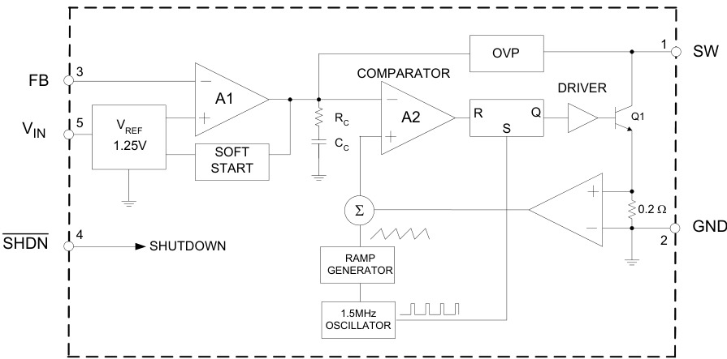
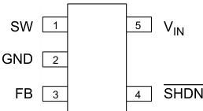
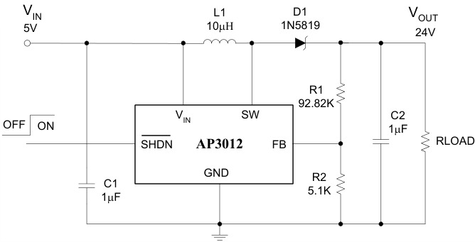

# AP3012
> 1.5MHz 恒频电流模式升压 (Boost) DC-DC，内置 36V/500mA 双极型开关管，输出可调至 29V，带 OVP 与软启动。SOT-23-5。

## 1. 身份与选型

| 项目 | 内容 |
|------|------|
| 型号全称 | AP3012（本库实物为 AP3012KTR：K = SOT-23-5，TR = 卷带） |
| 原厂 | BCD Semiconductor（2013 年被 Diodes 收购，现以 Diodes 品牌在售） |
| 核心功能 | 异步升压 (Boost) DC-DC，电流模式 PWM，内置开关管，需外部肖特基整流 |
| 关键卖点 | 1.5MHz 高频 → 小电感低矮外围；输入 2.6–16V；输出最高 29V；内置软启动 + 29V OVP |
| 典型应用 | LCD/OLED 偏压电源、LCD 背光白光 LED 驱动、手机 |
| 订购型号 | AP3012KTR-E1（无铅，丝印 E6B）/ AP3012KTR-G1（绿色封装，丝印 G6B），-40~85°C，卷带 |
| 车规 | ❌ |

> [!note] 拓扑定位
> 与 [DC-DC降压转换器](../../知识/电源电子/DC-DC降压转换器.md) (Buck) 相反：Boost 升压，输出 > 输入。且为**异步**结构——续流器件是外部肖特基而非内部同步管，二极管压降直接计入效率损耗；峰值效率 81%，明显低于同步 Buck 的 90%+。

## 2. 极限工况

| 参数 | 符号 | 值 | 单位 |
|------|------|------|------|
| 输入电压 | VIN | 20 | V |
| SW 引脚电压 | VSW | 38 | V |
| FB 引脚电压 | — | 5 | V |
| SHDN 引脚电压 | — | 16 | V |
| 热阻（结-环境，无散热） | RθJA | 265 | °C/W |
| 工作结温 | TJ | 150 | °C |
| 存储温度 | TSTG | -65 ~ 150 | °C |
| 引脚焊接温度（10s） | TLEAD | 260 | °C |
| ESD (HBM / MM) | — | 2000 / 250 | V |

> [!warning] SW 节点裕量很薄
> SW 绝对最大 38V，OVP 阈值 29V——设 24V 输出时，SW 上叠加的振铃尖峰只剩约 14V 裕量。Boost 的 SW 关断瞬间振铃可达数伏，布局（见 §7）必须压缩热回路面积；输出接近 29V 上限时更需实测 SW 波形。

## 3. 推荐工作条件

| 参数 | 最小 | 典型 | 最大 | 单位 |
|------|------|------|------|------|
| VIN | 2.6 | — | 16 | V |
| VOUT（受 OVP 限制） | > VIN | — | 29 | V |
| 环境温度 TA | -40 | — | 85 | °C |

> [!note] Boost 不能"降压"
> 异步 Boost 在停机时输入经 L-D 直通输出，VOUT 最低即 VIN − VD；因此 VOUT 必须设定高于 VIN，且使能拉低后输出**不会**掉到 0V。

## 4. 功耗与热特性

| 参数 | 符号 | 条件 | 典型 | 最大 | 单位 |
|------|------|------|------|------|------|
| 工作电流 | ICC | VSHDN=VFB=VIN，不开关 | 2.5 | 3.5 | mA |
| 关断电流 | IQ | VSHDN=0V | 0.1 | 1.0 | µA |
| 开关管饱和压降 | VCESAT | ISW=250mA | 300 | — | mV |
| 开关漏电流 | — | VSW=5V | 0.01 | 5 | µA |
| θJA / θJC | — | SOT-23-5 | 265 / 69.57 | — | °C/W |
| 峰值效率 | η | — | 81 | — | % |

**效率去哪了**（VOUT=24V、L=10µH 实测曲线，Fig 11）：

- **开关管导通损耗**：内置的是**双极型 (BJT)** 开关而非 MOSFET，VCESAT≈300mV 恒定压降 + 基极驱动电流（体现为 2.5mA 的 ICC），轻载时占比尤其高
- **肖特基压降**：1N5819 的 VF≈0.45V，占 24V 输出约 1.9% 固定损耗；输出电压越低此项占比越大
- **开关损耗**：1.5MHz 高频换来小电感，代价是每周期开关损耗 ×1.5M；VIN 越高效率越好（D 更小，开关管导通时间短）
- **温度**：效率随结温升高而下降（Fig 8），85°C 环境下按曲线预留 3~5% 退化

> [!warning] SOT-23-5 散热能力有限
> θJA=265°C/W——芯片内耗散 250mW 即温升 66°C。按 500mA 开关电流、VCESAT 300mV、D=80% 估算开关管导通损耗已约 120mW，加上驱动与开关损耗，满负荷时结温裕量不大，85°C 环境下应实测。

## 5. I/O 接口特性

| 参数 | 符号 | 条件 | 最小 | 典型 | 最大 | 单位 |
|------|------|------|------|------|------|------|
| 反馈基准电压 | VFB | VIN=5V, VOUT=24V, IOUT=30mA | 1.17 | 1.25 | 1.33 | V |
| FB 偏置电流 | — | VFB=1.25V | 10 | 45 | 100 | nA |
| 开关频率 | f | — | 1.1 | 1.5 | 1.9 | MHz |
| 最大占空比 | DMAX | — | 85 | 90 | — | % |
| 开关电流限值 | ILIM | D=80% | 500 | — | — | mA |
| SHDN 高电平（开） | VTH | — | 1.5 | — | — | V |
| SHDN 低电平（关） | VTL | — | — | — | 0.4 | V |
| SHDN 引脚偏置电流 | — | — | — | 55 | — | µA |
| OVP 阈值 | VOVP | — | — | 29 | — | V |
| 软启动时间 | — | — | — | 550 | — | µs |

> [!warning] SHDN 不是高阻输入
> SHDN 引脚偏置电流典型 55µA，且随驱动电压升高显著增大（10V 驱动时可达约 300µA，Fig 5）。用 MCU GPIO 驱动没问题，但若经大阻值上拉接 VIN 使能，需核算分压——上拉电阻过大可能拉不到 1.5V 门限。

> [!note] 基准精度 ±6.4%
> VFB 极限 1.17~1.33V，对应输出电压 ±6.4% 的初始容差（不含电阻误差）。做 LCD/OLED 偏压这类对电压敏感的负载时要把这一容差算进系统预算；温度漂移本身很小（-50~100°C 内约 1.25→1.28V，Fig 10）。

## 6. 核心功能

*Figure 3 — 功能方框图*

### 6.1 异步 Boost 拓扑工作原理

每个 1.5MHz 周期分两相：

1. **储能相（Q1 导通，时长 D·T）**：SW 被内部 BJT 拉到地，VIN 全压加在电感上，电感电流线性上升，能量存入磁场；此时输出侧完全靠输出电容 C2 独立供电，肖特基 D1 反偏隔离
2. **续流相（Q1 关断，时长 (1−D)·T）**：电感电流不能突变，SW 节点电压飞升直到 D1 正偏导通，电感以 VIN 串联电感电压的方式向输出泵电——这就是"升压"的来源

稳态伏秒平衡给出理想传输比：

$$V_{OUT} = \frac{V_{IN}}{1-D} \quad\Longleftrightarrow\quad D = 1 - \frac{V_{IN}}{V_{OUT}}$$

- **"异步"** 指续流由外部肖特基完成（对比同步 Boost 用内部 MOSFET），BOM 多一个二极管但结构简单、成本低
- 关键推论：**输出电流全部由 (1−D) 时间段内的电感电流脉冲提供**，所以 VOUT/VIN 比越大（D 越大），同样的开关电流限值下可用输出电流越小（见 §6.5）

### 6.2 电流模式 PWM 控制环路

对照方框图，双环结构：

- **外环（电压环）**：FB 分压与 1.25V 基准送入误差放大器 A1，内置 RC + CC 补偿网络（**无需外部补偿元件**），输出误差电压作为电流环的目标值
- **内环（电流环）**：Q1 发射极串 **0.2Ω 检流电阻**，A2 放大电流信号，与斜坡发生器 (Ramp Generator) 输出在 Σ 处叠加——斜坡叠加即**斜率补偿**，抑制 D>50% 时电流模式固有的次谐波振荡（本片 D 常在 80% 上下，必不可少）
- **逐周期逻辑**：1.5MHz 振荡器置位 RS 锁存器 → Q1 开通；电感电流爬升到误差电压对应门限时比较器复位锁存器 → Q1 关断。电流模式的好处：逐周期天然限流、单极点特性易补偿、线电压前馈响应快

### 6.3 1.25V 反馈与输出设定

$$V_{OUT} = 1.25\,\text{V} \times \left(1 + \frac{R_1}{R_2}\right)$$

设计流程：先定 R2，再算 R1 = R2·(VOUT/1.25 − 1)。

- **R2 上限**：FB 偏置电流最大 100nA，为使其引入误差 <0.5%，分压器电流应 ≥ 20µA，即 R2 ≤ 60kΩ 左右；典型电路取 R2=5.1kΩ（分压电流 245µA），精度优先
- **R2 下限**：分压器电流是纯损耗，24V/98kΩ ≈ 245µA≈5.9mW——对 30mA 级负载可忽略，但对追求轻载效率的应用可适当增大 R2
- FB 走线是高阻敏感节点，布局远离 SW（见 §7）

### 6.4 保护功能

- **OVP（29V）**：SW/输出电压超过 29V 阈值时器件**进入停机模式**——这是防反馈开路（分压电阻脱焊时 FB=0，环路会全力升压直到击穿）的最后防线
- **软启动（550µs）**：内部软启动限制启动瞬间的电感浪涌电流，避免拖垮前级电源
- **逐周期限流**：电流模式控制天然具备，每个周期开关电流触顶即关断，≥500mA（D=80% 时）
- 通用保护概念 → [电源保护机制](../../知识/电源电子/电源保护机制.md)

> [!warning] OVP 触发后不会自恢复
> OVP 停机后必须靠 **SHDN 引脚一个低→高脉冲**或 **VIN 重新上电 (POR)** 才能重启——系统若把 SHDN 硬连 VIN，OVP 触发后只能断电恢复，固件无法干预。
> 另注意：手册**没有**热关断 (Thermal Shutdown) 功能，过热保护完全靠设计裕量。

### 6.5 最大输出能力估算

两条硬约束：

**① 占空比约束**：DMAX 最小 85%，理想升压比上限约

$$\frac{V_{OUT}}{V_{IN}}\bigg|_{max} = \frac{1}{1-D_{MAX}} \approx 6.7\times$$

**② 开关电流限值约束**：电感平均电流 = IOUT/(1−D)，峰值再叠加半个纹波，不得超过 ILIM：

$$I_{OUT(max)} \approx \left(I_{LIM} - \frac{\Delta I_L}{2}\right)(1-D)\cdot\eta$$

**算例**（典型电路 VIN=5V → VOUT=24V, L=10µH）：

- D ≈ 1 − 5/24 ≈ 79%
- ΔIL = VIN·D/(L·f) = 5×0.79/(10µH×1.5MHz) ≈ 0.26A
- IOUT(max) ≈ (0.5 − 0.13)×0.21×0.8 ≈ **62mA**——与 Fig 11 效率曲线覆盖到 40~45mA 的范围吻合，30mA 工作点裕量健康

> [!warning] 低 VIN + 高 VOUT 是危险组合
> 3.0V 锂电池升 24V 需要 D≈87.5%，已超出 DMAX 最小值 85%（典型 90% 可覆盖，但无法保证全部器件/全温度）；且开关电流限值随占空比升高而降低（Fig 9）。此工况典型可用（Fig 11 给了 VIN=3.0V 曲线），但属于"典型能跑、极限不保"，量产设计建议 VIN≥3.6V 或降低 VOUT/负载。

## 7. 引脚与典型连线

*Figure 2 — 引脚分布（顶视图）*

*Figure 12 — LCD/OLED 偏压驱动典型电路*

| 引脚 | 名称 | 功能 | 闲置 |
|------|------|------|------|
| 1 | SW | 开关节点，接电感与肖特基阳极；电压勿超 29V（OVP 阈值） | — |
| 2 | GND | 地，直接接局部地平面 | — |
| 3 | FB | 反馈输入，内部比较 1.25V，接 R1/R2 分压 | 不可悬空 |
| 4 | SHDN | 使能：≥1.5V 开、≤0.4V 关（名为 SHDN，实为**高有效使能**） | 接 VIN（注意 55µA 偏置电流） |
| 5 | VIN | 2.6–16V 输入，必须就近旁路 | — |

**典型电路 BOM**（5V → 24V/LCD 偏压，Fig 12）：L1=10µH（SUMIDA CDTH3D14/HPNP-100NC 或同级）、D1=1N5819、C1=C2=1µF（X5R/X7R 陶瓷）、R1=92.82kΩ、R2=5.1kΩ → VOUT=1.25×(1+92.82/5.1)=1.25×19.2=24V。

### 外围设计流程

**① 电感**：1.5MHz 高频下 10µH 即够。纹波电流

$$\Delta I_L = \frac{V_{IN} \cdot D}{L \cdot f_{SW}}$$

电感**饱和电流必须大于峰值电流** IL,peak = IOUT/(1−D) + ΔIL/2（算例中 ≈0.27A@30mA 负载）；饱和会使电流失控上冲、逐周期限流失效风险增大。DCR 越小效率越高。

**② 肖特基二极管**：反向耐压 > VOUT（24V 输出选 40V 的 1N5819 合适）；平均电流额定 > IOUT；选低 VF、低结电容的肖特基——1.5MHz 下普通硅二极管反向恢复损耗不可接受。

**③ 输出电容**：Boost 输出电流不连续（只在 (1−D) 段有电流注入），纹波比 Buck 更依赖输出电容：

$$\Delta V_{OUT} \approx \frac{I_{OUT} \cdot D}{C_{OUT} \cdot f_{SW}} + I_{L,peak} \cdot ESR$$

手册明确要求**低 ESR 陶瓷电容（X5R/X7R）**；1µF@1.5MHz 对 30mA 负载容值项纹波 ≈16mV，主导项通常是 ESR。注意陶瓷电容 24V 直流偏压下容值缩水，标称 1µF 实际可能只剩一半，纹波敏感时并两颗或升容。

**④ 输入电容**：Boost 输入电流连续（经电感），1µF 陶瓷就近旁路 VIN 即可。

### PCB 布局（Boost 热回路）

Boost 的高 di/dt 热回路是 **SW → D1 → C2 → GND → 芯片 GND**（Q1 关断瞬间电流路径突变的回路），不是输入侧：

1. **D1 + C2 紧贴芯片**，热回路面积最小化——这是压制 SW 振铃（§2 的 38V 裕量）和 EMI 的第一优先级
2. **SW 节点铜皮尽量小**：它是本板最强的 dv/dt 噪声源，面积大即天线
3. C1 就近跨接 VIN-GND
4. **FB 分压电阻靠近 FB 引脚**，反馈走线远离 SW 和电感
5. GND 引脚直连局部地平面，功率地与信号地在芯片 GND 单点汇合

## 8. 封装

| 参数 | 值 |
|------|-----|
| 封装 | SOT-23-5（K 封装） |
| 本体尺寸 | 约 2.9 × 1.6 mm，高度 ≤1.45mm |
| 引脚间距 | 0.95mm |
| 丝印 | E6B (-E1 无铅) / G6B (-G1 绿色) |

- [DC-DC降压转换器](../../知识/电源电子/DC-DC降压转换器.md) · [电源保护机制](../../知识/电源电子/电源保护机制.md)
