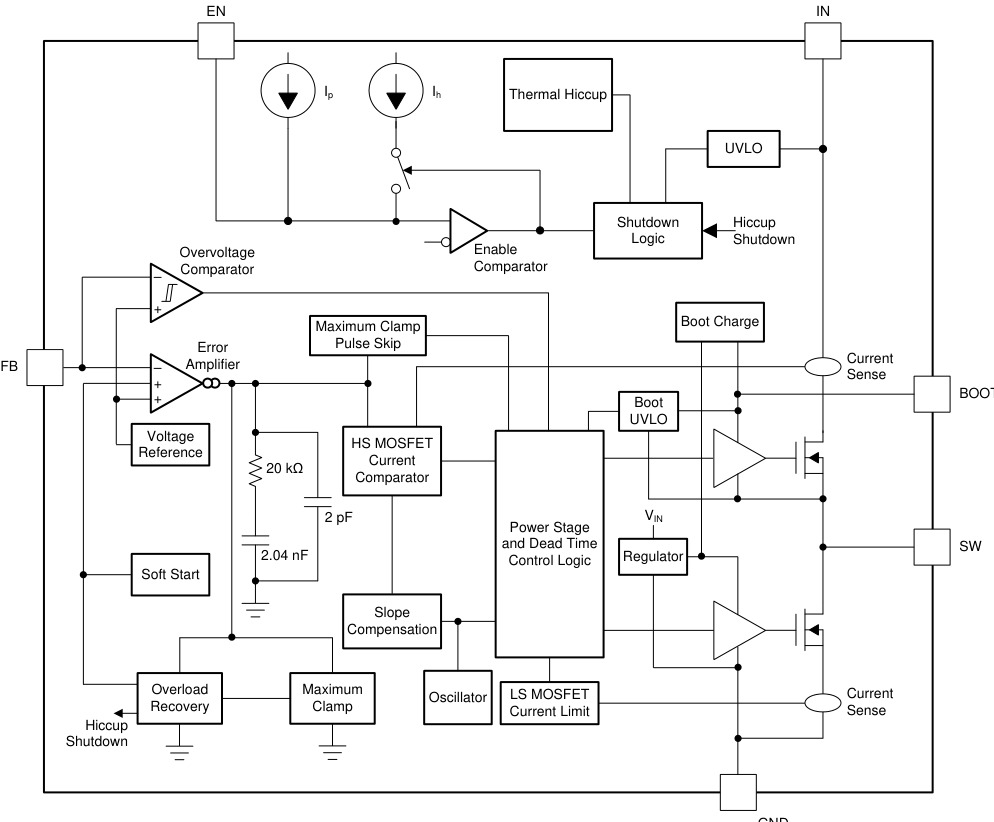
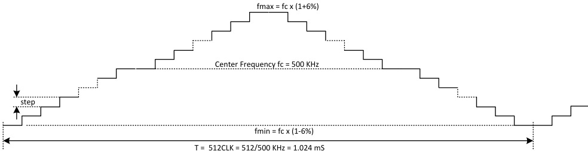
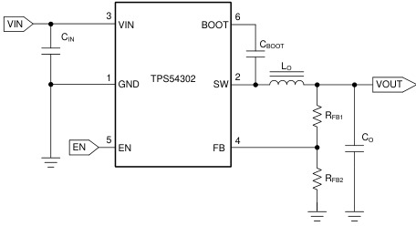
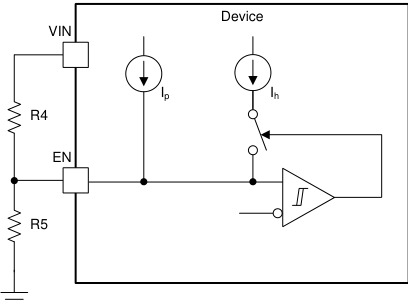
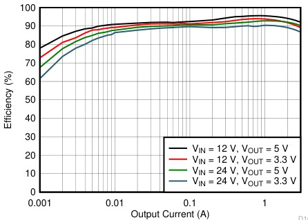

# TPS54302
> TI 4.5V–28V、3A、同步降压。内部补偿 + 展频谱 EMI，SOT-23-6。

## 1. 身份与选型

| 项目 | 内容 |
|------|------|
| 型号全称 | TPS54302DDCR（3000 只卷带）/ TPS54302DDCT（250 只小卷带） |
| 核心功能 | 同步降压 DC-DC，集成 85mΩ 高侧 / 40mΩ 低侧 NMOS |
| 关键卖点 | 展频谱 EMI、Eco-mode 脉冲跳跃、内部环路补偿、内部 5ms 软启动 |
| 控制方式 | 固定 400kHz 峰值电流模式，内部补偿 |
| 后缀 | DDC = SOT-23-THIN；R = 大卷带；T = 小卷带 |
| 丝印 | `4302` |
| MSL | Level-1-260C-UNLIM，RoHS |
| 车规 | ❌（工作温度 -40~125°C 工业级） |
| 手册 | ZHCSF83C（英文 SLVSDG6），2016-05 首发，2026-03 Rev C |

> [!note] Rev C（2026-03）修订了多个关键参数，旧资料对不上先查版本
> - 热关断典型值 165°C → **160°C**
> - HBM ESD ±4000V → **±2500V**
> - EN 阈值：上升 1.21V → **1.23V**，下降 1.19V → **1.16V**
> - 高侧限流最大值 5.9A → **6A**

## 2. 极限工况

> ⚠️ 超过即永久损坏

| 参数 | 最小 | 最大 | 单位 |
|------|------|------|------|
| VIN | -0.3 | 30 | V |
| EN、FB | -0.3 | 7 | V |
| BOOT-SW（差压） | -0.3 | 7 | V |
| SW | -0.3 | 30 | V |
| SW（20ns 瞬态） | -5 | 30 | V |
| 结温 TJ | -40 | 150 | °C |
| 存储温度 | -65 | 150 | °C |
| ESD (HBM) | — | ±2500 | V |
| ESD (CDM) | — | ±1500 | V |

> [!tip] SW 允许 20ns 内 -5V 瞬态——这是给死区期间低侧体二极管续流负尖峰留的余量。若实测 SW 负尖峰超 -5V（布局电感太大），会侵蚀该裕量。

## 3. 推荐工作条件

| 参数 | 最小 | 最大 | 单位 |
|------|------|------|------|
| VIN | 4.5 | 28 | V |
| EN、FB | -0.1 | 5.5 | V |
| BOOT-SW | -0.1 | 5.5 | V |
| SW | -0.1 | 28 | V |
| 结温 TJ | -40 | 125 | °C |

- 持续输出电流最高 **3A**；输出下限由基准 0.596V 决定，上限受 100% 占空比模式（见 §6.6）限制。

## 4. 功耗与热特性

| 参数 | 值 |
| ------------- | ---------- |
| 关断电流 IOFF（EN=GND） | 2μA（典型） |
| 非开关静态 IQ（EN=5V, VFB=1V） | 45μA（典型） |
| RDS(on) 高侧/低侧（25°C） | 85 / 40 mΩ |
| RθJA（JEDEC 标准板） | 118.9 °C/W |
| RθJC(top) | 58.3 °C/W |
| RθJB | 35.0 °C/W |
| ψJT / ψJB | 14.0 / 34.8 °C/W |
| RθJA（官方 EVM 实板） | 57.2 °C/W |

> [!note] θJA 118.9°C/W 是 JEDEC 标准板值，EVM 实测 57.2°C/W——SOT-23 封装散热几乎全靠 PCB 铜箔。估算导通损耗 $P_{cond}\approx I_{OUT}^2\times[D\cdot R_{HS}+(1-D)\cdot R_{LS}]$：12V→5V@3A 时 D≈0.42，等效电阻约 59mΩ，导通损耗约 0.53W，加上开关损耗后按 EVM 级布局温升约 40~50°C。3A 满载 + 高环温时务必铺铜 + 打孔散热（§7.5）。

## 5. I/O 接口特性

| 参数 | 条件 | 最小 | 典型 | 最大 | 单位 |
|------|------|------|------|------|------|
| VFB 反馈基准 | VIN=12V | 0.581 | 0.596 | 0.611 | V |
| VEN 上升阈值 | — | — | 1.23 | 1.28 | V |
| VEN 下降阈值 | — | 1.1 | 1.16 | — | V |
| EN 上拉电流 Ip | VEN=1V | — | 0.7 | — | μA |
| EN 迟滞电流 Ih | VEN=1.5V | — | 1.55 | — | μA |
| VIN UVLO 上升 | — | 3.8 | 4.1 | 4.4 | V |
| VIN UVLO 下降 | — | 3.3 | 3.6 | 3.9 | V |
| VIN UVLO 迟滞 | — | 400 | 480 | 560 | mV |
| BOOT-SW UVLO | — | — | 2.1 | — | V |
| fSW 开关频率 | — | 290 | 400 | 510 | kHz |
| 最短导通时间 | 90%~90%、1A | — | 110 | — | ns |
| 软启动时间 | 内部固定 | — | 5 | — | ms |
| 高侧限流（峰值） | — | 4 | 5 | 6 | A |
| 低侧限流（谷值） | — | 3.1 | 4 | 5.5 | A |
| 脉冲跳跃阈值 I(SKIP) | 12V→5V, L=10µH | — | 500 | — | mA |
| 误差放大器跨导 | — | — | 240 | — | µA/V |

## 6. 核心功能

*功能模块图：峰值电流模式控制环 + 内部补偿（20kΩ + 2.04nF + 2pF）+ 展频振荡器 + BOOT 自举驱动*

### 6.1 峰值电流模式环怎么闭合

一个开关周期内的事件序列：

1. 内部振荡器时钟沿 → **高侧管开通**，电感电流线性上升，片内电流检测把高侧电流转成电压斜坡；
2. 电流斜坡（叠加斜率补偿）达到误差放大器输出（COMP，纯内部节点）→ **高侧关断、低侧开通**，电感电流经低侧管续流下降；
3. 下一个时钟沿重复。占空比由 COMP 电平隐式决定：负载加重 → VOUT 微跌 → FB 低于基准 → COMP 上抬 → 允许更高的峰值电流。

外环（电压环）是跨导误差放大器（gm = 240µA/V），比较 FB 与 **内部软启动电压和 0.596V 基准中的较小者**——这就是软启动的实现方式。内环（电流环）逐周期比较开关电流，天然具备逐周期限流和快速输入前馈（VIN 变化直接改变电流斜坡斜率，不必等电压环响应），这是峰值电流模式对线性/负载瞬态友好的原因 → [环路补偿](../../知识/电源电子/环路补偿.md)。

COMP 被钳位在最大电平即为限流；手册还提到"超小钳位"（COMP 下限钳位），防止轻载时 COMP 掉太低、负载突增时要爬很久——改善瞬态恢复。

斜率补偿：占空比 > 50% 时峰值电流模式会分谐波振荡（一周期大一周期小），内部斜坡叠加消除之，且设计成 **峰值限流值在全占空比范围恒定**（不会像简单斜率补偿那样高占空比限流缩水）。

### 6.2 内部补偿意味着什么设计约束

补偿网络固定在片内（框图：误差放大器输出对地 20kΩ 串 2.04nF，并 2pF，零点约 3.9kHz——由框图元件值推算）。省掉 3 个外围件的代价是 **LC 滤波器参数必须落在补偿设计窗口内**：

- 交越频率 $f_o \approx \dfrac{5.1}{V_{OUT}\times C_O}$（CO 单位 F，结果 Hz），**必须 < 40kHz**——CO 太小交越太高，相位裕度不足；
- CO 是陶瓷电容（ESR 极低）时没有 ESR 零点帮忙抬相位，需在上分压电阻 R2 上并联前馈电容 C6 补相位（公式见 §7.3）；
- 电容一定要按直流偏置/温度降额后的 **有效容值** 代入，X5R/X7R 在偏压下缩水 30~50% 很常见。

### 6.3 Eco-mode 轻载脉冲跳跃

→ [轻载效率模式](../../知识/电源电子/轻载效率模式.md)

- **进入判据**：电感 **峰值** 电流 < 500mA（典型，12V→5V、L=10µH 条件）。因为比较的是峰值而非平均电流，实际进入跳跃的负载点随 L 和工作条件变化（CCM 下 $I_{OUT} \approx I_{PK} - \Delta I_L/2$）。
- **进入后**：COMP 被钳位，高侧停止开关；电感电流降到 0A 时低侧管也关断（二极管仿真），SW 呈 DCM 波形，输出靠 COUT 维持缓慢下垂；FB 跌到需要能量时再打一组脉冲。表观开关频率随负载减小而降低，脉冲间隔拉长。
- **退出判据**：电感峰值电流需求回升到 500mA 以上，恢复固定频率 CCM。
- 收益：开关损耗正比于开关次数，跳跃后静态电流仅 45µA 主导轻载功耗——效率曲线在 10mA 以下仍能维持较高水平（见首页效率图，§7.6）。

> [!note] 代价：跳跃模式纹波比 CCM 大（低频包络），且频率不再固定——对音频、低噪声轨敏感的应用要评估。本器件无强制 CCM 模式可选。

### 6.4 展频如何降 EMI

*展频频谱图：中心频率 ±6% 三角波扫频，扫频周期 512 个时钟*

→ [展频谱与EMI抑制](../../知识/电源电子/展频谱与EMI抑制.md)

开关频率不锁死在 400kHz，而是在 **±6%（约 376~424kHz）** 范围内以 **fSW/512 的速率** 缓慢扫动（一个调制周期 = 512 个开关周期，400kHz 时约 1.28ms）。原本集中在 400kHz 及其谐波上的窄带能量被摊到 ±6% 的频带内，EMI 接收机（9kHz/120kHz RBW）测得的峰值/准峰值显著下降，且谐波次数越高摊开的绝对带宽越宽、衰减越明显。

> [!tip] 展频是"摊薄"不是"消灭"——总能量不变。对平均值检波帮助有限，且输出纹波会带有 1/512 调制频率（约 780Hz）的微弱包络，极敏感的模拟负载需留意。

### 6.5 启动行为：EN → UVLO → 软启动 → 预偏置

- **EN 悬空即使能**：内部 0.7µA 上拉电流 Ip 把引脚拉高；需要外控时用开漏/集电极开路拉低即可。
- **两级 UVLO**：VIN 内部 UVLO 固定（上升 4.1V/下降 3.6V，迟滞 480mV）；需要更高启动电压时用 R4/R5 分压到 EN（公式见 §7.3），EN 越过阈值后追加 Ih = 1.55µA 迟滞电流，让 UVLO 迟滞可通过 R4 设计。
- **内部 5ms 软启动**：误差放大器跟踪内部缓升的 SS 电压而非基准，输出单调爬升，浪涌电流被摊到 5ms 内。不可调、不可外部延长——需要更慢启动或跟踪时序的场合选别的料。
- **预偏置安全启动**：输出已有残压时（如背靠背电源、大电容未放完），软启动电压低于 FB 期间 **两管都不开**——低侧管不会把预偏置电压往地里灌，避免启动瞬间倒灌电流。

### 6.6 BOOT 自举与 100% 占空比

高侧是 NMOS，栅驱需高于 SW 的电压：BOOT-SW 间 0.1µF 电容在低侧导通期间由内部自举稳压器充电。BOOT-SW 电压 < 2.1V（典型）时触发 BOOT UVLO，强制关高侧一个周期给电容补电。

反过来，BOOT-SW > 2.1V 时器件支持 **100% 占空比长开**——输入掉到接近输出时不切换直通，压差极限 $V_{OUT(max)} \approx V_{IN} - I_{OUT}\times(R_{HS} + DCR_L)$。这对电池供电末期、输入跌落穿越很有用。

> [!tip] 最短导通时间 110ns 限制了最小占空比：$D_{min} = t_{ON(min)}\times f_{SW} \approx 4.4\%$（400kHz 典型值）。28V 输入时可稳定调节的最低输出约 1.2~1.6V（考虑频率上限 510kHz 时取大值）；再低会进入被动跳周期，纹波变大。高压差 + 低压输出的组合要先算这一条。

### 6.7 保护机制：OCP / OVP / 热关断

→ [电源保护机制](../../知识/电源电子/电源保护机制.md)

**双向逐周期限流 + 打嗝（hiccup）**：
- 高侧峰值限流 5A（典型）：电流斜坡到达钳位值即关高侧——限制每周期峰值电流；
- 低侧谷值限流 4A（典型）：每个时钟周期末检查低侧电流，谷值仍超限则 **跳过高侧脉冲**、低侧继续导通泄流，直到谷值降回限值以下才恢复开高侧——防止"电流失控"（高侧限流只封顶不降流，若 VOUT 短路导致电感放电极慢，电流会周期累积，谷值限流兜底）；
- **打嗝判据**：过载持续超过 **512 个开关周期**（约 1.28ms）→ 停止开关 **16384 个周期**（约 41ms）→ 重新软启动。短路时占空比约 512/16896 ≈ 3%，器件和电感的平均功耗被压到很低，可长期承受硬短路；故障移除后自动恢复。

**OVP**：FB > 108% × Vref（约 0.64V）→ 强制关高侧；FB < 104%（约 0.62V）→ 恢复。用于快速甩负载/故障恢复时压制过冲。注意这只是"不再打进能量"，不会主动放电（低侧不反向导通拉沉）。

**热关断**：TJ > 160°C（典型）停止开关；降回 150°C 以下后热打嗝计时器计数 **32768 个周期**（约 82ms）再重新执行上电时序。10°C 迟滞 + 长冷却窗口，避免在温度边缘快速抖动。

---

## 7. 引脚与典型连线

| 引脚  | 名称   | 功能         | 闲置    |
| --- | ---- | ---------- | ----- |
| 1   | GND  | 低侧管源极 + 控制地，FB 分压地单点接此 | —     |
| 2   | SW   | 开关节点（内部高/低侧中点）       | —     |
| 3   | VIN  | 4.5–28V 输入，高侧管漏极 | —     |
| 4   | FB   | 反馈输入，外接分压至输出    | —     |
| 5   | EN   | 使能，上升 1.23V/下降 1.16V   | 悬空（内部上拉自动使能） |
| 6   | BOOT | 自举电容至 SW   | 0.1μF 必装 |

> [!note] EN 绝对最大额定仅 7V，**不能直接接 VIN**（VIN 可到 28V）。悬空即使能；要跟随 VIN 启停就用 R4/R5 分压（顺便实现可调 UVLO）。

*数据手册首页简化原理图：6 个外围件即构成完整降压电路*

**参考设计（8~28V 输入 → 5V/3A，图 7-1）**：L1=10µH，C4=C5=22µF/25V X7R，R2=100kΩ，R3=13.3kΩ，C6=75pF，CIN=10µF+0.1µF，CBOOT=0.1µF，R4=511kΩ/R5=105kΩ（UVLO），R1=49.9Ω 串在 FB 分压顶端——留作环路测试注入点，量产可保留。

### 7.1 外围设计流程

**① FB 分压定输出**（推荐 1% 电阻，上电阻 R2 从 100kΩ 起步）：

$$V_{OUT} = V_{ref}\times\left(1+\frac{R2}{R3}\right),\qquad R3 = \frac{R2\times V_{ref}}{V_{OUT}-V_{ref}},\qquad V_{ref}=0.596\,V$$

R2 取更大可省轻载损耗，但太大易受噪声、FB 输入电流偏差变明显。

**② 电感**——先定纹波系数 $K_{IND}$（纹波电流/最大输出电流，陶瓷输出电容可取大些，高 ESR 电容取 0.2）：

$$L_{MIN} = \frac{V_{IN(max)}-V_{OUT}}{I_{OUT}\times K_{IND}}\times\frac{V_{OUT}}{V_{IN(max)}\times f_{SW}}$$

示例：$K_{IND}=0.35$，28V→5V/3A 算得 9.78µH → 取 10µH。校验饱和电流与温升：

$$\Delta I_L = \frac{V_{OUT}(V_{IN(max)}-V_{OUT})}{V_{IN(max)}\times L\times f_{SW}},\qquad I_{L(PK)} = I_{OUT(max)} + \frac{\Delta I_L}{1.6}$$

$$I_{L(RMS)} = \sqrt{I_{OUT(max)}^2+\frac{1}{12}\left(\frac{\Delta I_L}{0.8}\right)^2}$$

示例 ΔIL≈1.03A、IL(PK)≈3.64A——**电感饱和电流还必须扛住限流值**（高侧限流最大 6A），否则短路瞬间电感饱和电流失控。L 大 → 纹波小、瞬态慢；L 小反之。

**③ 输出电容**——取三项约束的最严值：

- 负载阶跃（环路约 2 个周期后才响应，期间靠 CO 扛）：$C_O > \dfrac{2\,\Delta I_{OUT}}{f_{SW}\times\Delta V_{OUT}}$ → 1.5A 阶跃/±0.25V 要 30µF
- 纹波：$C_O > \dfrac{1}{8 f_{SW}}\times\dfrac{\Delta I_L}{V_{ripple}}$ → 30mVpp 要 10.7µF；ESR 需 $R_{ESR} < V_{ripple}/\Delta I_L$ ≈ 29.2mΩ（陶瓷轻松满足）
- 环路：$f_o \approx \dfrac{5.1}{V_{OUT}\times C_O} < 40kHz$

示例取 2×22µF（44µF 标称，降额后仍 >30µF），每颗电容 RMS 纹波电流约 296mA（手册计算值），远低于 22µF X7R 能力。

**④ 前馈电容 C6**（陶瓷 CO 低 ESR 时补相位裕度，并联在 R2 上）：

$$C6 = \frac{1}{2\pi\, f_o\times R2}$$

示例 fo≈23kHz、R2=100k → 68.6pF → 取 75pF。CO 为高 ESR 电解时不需要 C6；中等 ESR 时酌情减小。

**⑤ 输入电容**：≥10µF 陶瓷去耦 + 可选 0.1µF 高频旁路，耐压 > VIN(max)。RMS 电流按最坏情况 $I_{CIN(RMS)}\approx I_{OUT(max)}/2$（本例 1.5A）选型；输入源远（几英寸以上）时再加约 47µF 电解做储能。输入纹波校验：

$$\Delta V_{IN} = \frac{I_{OUT(max)}\times 0.25}{C_{BULK}\times f_{SW}} + I_{OUT(max)}\times ESR_{MAX}$$

**⑥ BOOT 电容**：0.1µF X7R/X5R 陶瓷，BOOT-SW 之间，无可省。

**⑦ EN 分压设可调 UVLO**（图 6-1，R4 接 VIN-EN，R5 接 EN-GND）：

*可调 VIN 欠压锁定：Ip 常上拉 + 越阈值后追加 Ih，实现可设计的迟滞*

$$R4 = \frac{V_{START}\left(\frac{V_{ENfalling}}{V_{ENrising}}\right)-V_{STOP}}{I_p\left(1-\frac{V_{ENfalling}}{V_{ENrising}}\right)+I_h},\qquad R5 = \frac{R4\times V_{ENfalling}}{V_{STOP}-V_{ENfalling}+R4\,(I_p+I_h)}$$

其中 $I_p=0.7\,\mu A$、$I_h=1.55\,\mu A$、$V_{ENrising}=1.23V$、$V_{ENfalling}=1.16V$。外部 UVLO 迟滞建议 >500mV。参考设计 R4=511k/R5=105k 按公式反推约对应 6.9V 启动 / 5.7V 停止。

### 7.2 推荐元件值速查（表 7-2，R2=100kΩ）

| VOUT (V) | L (µH) | COUT (µF) | R3 (kΩ) | 前馈电容 (pF) |
|------|------|------|------|------|
| 1.8 | 4.7 | 66 | 49.9 | 33 |
| 2.5 | 5.6 | 66 | 31.6 | 47 |
| 3.3 | 6.8 | 44 | 22.1 | 47 |
| 5 | 10 | 44 | 13.3 | 75 |
| 12 | 15 | 44 | 5.23 | 100 |

### 7.3 PCB 布局要点（手册 §7.4 提炼）

- **热回路最小化**：CIN 紧贴 VIN-GND 引脚——高侧开关瞬间的 di/dt 环路（CIN→VIN→SW→低侧→GND→CIN）是 EMI 首要源；
- SW 走线 **短而宽**，减小辐射；开关电流 **不得从器件正下方流过**；SW 铜可在内层/底层扩铜散热（打孔连接）；
- VIN、GND 尽量宽/大面积，兼顾阻抗与散热；输入/输出电容打足过孔；
- **FB 是最敏感节点**：走线尽量短小，远离 SW/BOOT 高压摆率走线，最好有地屏蔽；分压电阻的地与 GND 引脚开尔文连接；上分压电阻用独立走线接到输出电容之后的 VOUT（远端采样点）；
- COUT 到 GND 引脚的地回路尽量宽。

### 7.4 应用曲线解读

*效率 vs 输出电流（12V/24V 输入、3.3V/5V 输出）：对数横轴下 1mA~3A 全程平缓，轻载段靠 Eco-mode 撑住*

- **效率**：同输出下 12V 输入优于 24V（开关损耗正比 VIN²）；同输入下 5V 输出优于 3.3V（固定损耗占比小）。轻载段曲线不跳水是 Eco-mode + 45µA IQ 的直接体现。
- **调整率**（图 7-3/7-4）：线性调整率与负载调整率均在 ±0.5%/±0.8% 坐标窗口内近乎平直——峰值电流模式的输入前馈 + 高直流环路增益所致，供电 MCU/逻辑无需再加 LDO 修整。
- **纹波**（图 7-6~7-9）：0A/10mA 轻载时为 Eco-mode 的低频突发包络；100mA 以上回到 400kHz 开关纹波形态。
- **瞬态**（图 7-11）：0.75→2.25A 阶跃（250mA/µs）下输出偏摆在 100mV/div 一格上下量级，与 ±5% 设计目标相符。
- **启停**（图 7-12~7-15）：EN 或 VIN 使能后输出沿 5ms 软启动单调爬升，无过冲。

## 8. 封装

| 参数 | 值 |
|------|-----|
| 封装 | SOT-23-THIN (DDC)，JEDEC MO-193 |
| 引脚 | 6，间距 0.95mm |
| 本体 | 2.9 × 2.8 mm（含引脚 3.05 × 2.75/1.75 max） |
| 高度 | ≤1.1mm |
| 焊盘 | 推荐 1.1 × 0.6mm，钢网 0.125mm 厚 1:1 开孔 |
| 卷带 | R：3000/盘；T：250/盘，8mm 带宽 |

- [DC-DC降压转换器](../../知识/电源电子/DC-DC降压转换器.md) · [展频谱与EMI抑制](../../知识/电源电子/展频谱与EMI抑制.md) · [轻载效率模式](../../知识/电源电子/轻载效率模式.md) · [电源保护机制](../../知识/电源电子/电源保护机制.md) · [环路补偿](../../知识/电源电子/环路补偿.md)
