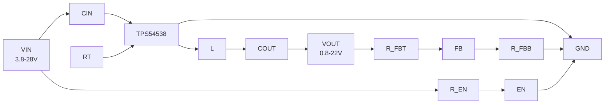

# TPS54538
> TI 3.8V–28V、5A、同步降压。MINT 1 低 EMI + 内部补偿 + 展频谱，QFN-9 2×1.5mm。

## 1. 身份与选型

| 项目 | 内容 |
|------|------|
| 型号全称 | TPS54538（同系列：TPS54438/4A、TPS54338/3A） |
| 核心功能 | 同步降压 DC-DC，集成 47mΩ 高侧 / 21mΩ 低侧 NMOS |
| 关键卖点 | MINT 1 低 EMI 架构、展频谱、内部补偿、内部自举电容、支持单层 PCB |
| 控制方式 | 固定频率峰值电流模式，内部补偿 |
| 输入电压 | 3.8V – 28V（绝对最大 30V） |
| 输出电压 | 0.6V – 22V（基准 600mV ±1%） |
| 输出电流 | 5A（TPS54538）/ 4A（TPS54438）/ 3A（TPS54338） |
| 开关频率 | 200kHz – 2.2MHz 可调（RT 电阻设定，支持外部时钟同步） |
| 封装 | QFN-9（RQF），1.5mm × 2.0mm |
| 丝印 | `38` |
| 车规 | ❌（工作结温 -40°C ~ 150°C） |
| 手册 | ZHCSQW6C（英文 SLUSF22），2024-11 首发，2026-06 Rev C |

> [!note] TPS54x38 系列 vs TPS54302
> - TPS54302：固定 400kHz、SOT-23-6、内置 BOOT 电容❌、展频 ±6%
> - TPS54x38：200kHz–2.2MHz 可调、QFN-9 2×1.5mm、内置自举电容✅、MINT 1 低 EMI 架构、支持外部时钟同步+相移、PFM/FCCM 可选

## 2. 极限工况

> ⚠️ 超过即永久损坏

| 参数 | 最小 | 最大 | 单位 |
|------|------|------|------|
| VIN | -0.3 | 30 | V |
| EN、FB、SS/PG、MODE、RT/SYNC | -0.3 | 6 | V |
| SW（DC） | -0.3 | 30 | V |
| SW（瞬态 <10ns） | -5 | 34 | V |
| 结温 TJ | -40 | 150 | °C |
| 存储温度 | -65 | 150 | °C |
| ESD (HBM) | — | ±3000 | V |
| ESD (CDM) | — | ±1000 | V |

## 3. 推荐工作条件

| 参数 | 最小 | 典型 | 最大 | 单位 |
|------|------|------|------|------|
| VIN | 3.8 | — | 28 | V |
| EN、FB、SS/PG、MODE | -0.1 | — | 5.5 | V |
| VOUT | 0.8 | — | 22 | V |
| IOUT（TPS54538） | 0 | — | 5 | A |
| 结温 TJ | -40 | — | 150 | °C |

## 4. 功耗与热特性

| 参数 | 值 |
|------|-----|
| 非开关静态 IQ（PFM） | 28µA（典型）/ 34µA（最大） |
| 非开关静态 IQ（FCCM） | 40µA（典型）/ 47µA（最大） |
| 关断电流 ISHDN | 3µA（典型）/ 5.5µA（最大） |
| RDS(on) 高侧 / 低侧（25°C） | 47mΩ / 21mΩ |
| RθJA（JEDEC 标准板） | 89.9 °C/W |
| RθJA（官方 EVM 实板） | 46.5 °C/W |
| RθJC(top) | 79.6 °C/W |
| RθJB | 23.1 °C/W |
| ψJT / ψJB | 2.5 / 23 °C/W |

> [!note] QFN-9 封装热阻明显优于 TPS54302 的 SOT-23（EVM RθJA 46.5 vs 57.2°C/W），但 5A 满载导通损耗更大（D≈0.42 时等效约 33mΩ × 25 ≈ 0.83W），仍需充分铺铜散热。

## 5. 电气特性

| 参数 | 条件 | 最小 | 典型 | 最大 | 单位 |
|------|------|------|------|------|------|
| **输入** | | | | | |
| VIN 工作电压 | — | 3.8 | — | 28 | V |
| VIN UVLO 上升阈值 | — | 3.4 | 3.6 | 3.8 | V |
| VIN UVLO 下降阈值 | — | 3.2 | 3.4 | 3.6 | V |
| VIN UVLO 迟滞 | — | — | 200 | — | mV |
| **使能** | | | | | |
| EN 上升阈值 | — | — | 1.22 | — | V |
| EN 下降阈值 | — | 0.9 | 1.0 | — | V |
| EN 上拉电流 Ip | VEN=1.0V | — | 0.7 | — | µA |
| EN 迟滞电流 Ih | — | — | 1.76 | — | µA |
| **反馈** | | | | | |
| VFB 基准（25°C） | — | 596 | 600 | 604 | mV |
| VFB 基准（0–85°C） | — | 595 | 600 | 605 | mV |
| VFB 基准（-40–150°C） | — | 594 | 600 | 606 | mV |
| FB 输入漏电流 | VIN=12V, VFB=0.8V | — | 0.1 | — | µA |
| **电流限制** | | | | | |
| 高侧 MOSFET 限流 | VIN=12V | 7 | 8.1 | 9.4 | A |
| 低侧 MOSFET 限流 | VIN=12V | 5 | 6 | 7 | A |
| 反向电流限制 | VIN=12V | 2 | 3 | 4.2 | A |
| 最小峰值电感电流 | VIN=12V | — | 0.7 | — | A |
| **开关** | | | | | |
| fSW 中心频率 | RT 悬空 | 450 | 500 | 550 | kHz |
| fSW 中心频率 | RT=GND | 870 | 1000 | 1130 | kHz |
| 最短导通时间 tON_MIN | — | — | 70 | — | ns |
| 最短关断时间 tOFF_MIN | — | — | 114 | — | ns |
| 最大导通时间 tON_MAX | — | — | 8 | — | µs |
| 最大占空比 | — | — | 98% | — | — |
| 展频范围 | — | — | ±8% | — | — |
| 展频调制频率 | — | — | 10 | — | kHz |
| **软启动** | | | | | |
| SS 充电电流 | — | 3.5 | 5.5 | 6.5 | µA |
| 固定内部软启动时间 | 0%→90% VOUT | — | 3.6 | — | ms |
| **电源正常（PG）** | | | | | |
| PG 上升阈值 | VFB 百分比 | — | 90% | — | — |
| PG 下降阈值 | VFB 百分比 | — | 85% | — | — |
| PG 上升延迟 | — | — | 70 | — | µs |
| PG 下降延迟 | — | — | 13 | — | µs |
| PG 有效最小 VIN | — | 2 | 2.5 | — | V |
| **保护** | | | | | |
| OVP 阈值 | — | 112% | 115% | 118% | VFB |
| OVP 迟滞 | — | — | 8% | — | — |
| UVP 阈值 | — | — | 65% | — | VFB |
| UVP 迟滞 | — | — | 6% | — | — |
| 热关断 | — | — | 165 | — | °C |
| 热关断迟滞 | — | — | 30 | — | °C |

## 6. 引脚与功能

> [!note] QFN-9 封装（顶视图，1.5mm × 2.0mm）

| 引脚 | 名称 | 类型 | 功能 | 闲置处理 |
|------|------|------|------|----------|
| 1 | RT/SYNC | 模拟 | 频率设定电阻 / 外部时钟同步 | 悬空=500kHz；接GND=1MHz |
| 2 | EN | 模拟 | 使能输入（上升1.22V / 下降1.0V） | 悬空=内部上拉使能 |
| 3 | FB | 模拟 | 输出反馈（分压至600mV基准） | — |
| 4 | GND | 地 | 功率地+信号地 | — |
| 5, 6 | VIN | 电源 | 3.8–28V 输入 | — |
| 7 | MODE | 模拟 | 轻载模式选择 / PG或SS功能 | 见模式选择表 |
| 8 | SW | 电源 | 开关节点（高/低侧中点） | — |
| 9 | SS/PG | 模拟 | 软启动电容 / 电源正常指示 | 见MODE配置 |

### MODE 引脚功能选择

| MODE 连接 | 轻载模式 | SS/PG 功能 |
|-----------|----------|------------|
| 接 GND | FCCM（强制连续导通） | SS（软启动，外接电容） |
| 悬空 | PFM（脉冲频率调制） | PG（电源正常，开漏输出） |
| 接 VIN | FCCM | PG |

## 7. 核心功能

### 7.1 峰值电流模式 + 内部补偿

- 固定频率峰值电流模式控制，内部补偿网络固定，**无需外部补偿元件**
- 补偿设计窗口：交越频率 $f_o$ 必须 < 40kHz（CO 太小会相位裕度不足）
- 电感选型需满足 $f_o \approx \frac{5.1}{V_{OUT} \times C_O}$ 约束

### 7.2 MINT 1 低 EMI 架构

- 展频范围 ±8%（比 TPS54302 的 ±6% 更宽），EMI 衰减更明显
- 优化的引脚排列减少热回路辐射
- 有助于符合 CISPR 25 Class 5 标准
- 支持外部时钟同步（200kHz–2.2MHz）+ 相移功能

### 7.3 启动与保护

- **EN 悬空即使能**：内部 0.7µA 上拉；可外接分压实现可调 UVLO
- **内部 3.6ms 软启动**：比 TPS54302 的 5ms 更快
- **预偏置安全启动**：输出有残压时低侧管不会灌电流
- **集成自举电容**：无需外部 BOOT 电容，支持单层 PCB 布局
- **双向逐周期限流**：高侧 8.1A / 低侧 6A（典型）
- **打嗝保护（hiccup）**：过载持续 256µs → 停止开关 9.8 周期 → 重新软启动
- **OVP**：115% VFB
- **UVP**：65% VFB
- **热关断**：165°C，30°C 迟滞

### 7.4 轻载模式

| 模式 | 特点 | 适用场景 |
|------|------|----------|
| PFM | 轻载自动跳频，IQ=28µA，效率高 | 电池供电、待机功耗敏感 |
| FCCM | 固定频率，纹波可预测，噪声低 | 音频/模拟供电、对EMI敏感 |

## 8. 典型应用

### 8.1 输出电压设定

$$V_{OUT} = V_{ref} \times \left(1 + \frac{R_{FBT}}{R_{FBB}}\right), \quad V_{ref} = 0.6V$$

推荐 $R_{FBB}$ 从 10kΩ–100kΩ 起步。

### 8.2 开关频率设定（RT/SYNC 引脚）

| RT 电阻 | 开关频率（典型） |
|---------|-----------------|
| 悬空 | 500 kHz |
| 接 GND | 1 MHz |
| 外部电阻 | 200kHz–2.2MHz 可调 |
| 外部时钟 | 200kHz–2.2MHz 同步 |

### 8.3 简化原理图

### 8.4 效率（VIN=24V，fSW=500kHz）

| 输出电压 | 负载范围 | 峰值效率 |
|---------|---------|---------|
| 3.3V | 0.001–5A | ⚠️ 图片读取：请回原文确认 |
| 5V | 0.001–5A | ⚠️ 图片读取：请回原文确认 |
| 12V | 0.001–5A | ⚠️ 图片读取：请回原文确认 |

> ⚠️ 图片读取：效率曲线来自手册首页图表，请回原文确认具体数值。

## 9. 与 TPS54302 对比

| 参数 | TPS54302 | TPS54538 |
|------|----------|----------|
| 输入范围 | 4.5–28V | 3.8–28V（更宽） |
| 输出电流 | 3A | 5A |
| RDS(on) HS/LS | 85/40 mΩ | 47/21 mΩ（更低） |
| 开关频率 | 固定 400kHz | 200kHz–2.2MHz 可调 |
| 外部时钟同步 | ❌ | ✅（支持相移） |
| 轻载模式 | 仅 Eco-mode（脉冲跳跃） | PFM / FCCM 可选 |
| BOOT 电容 | 外部 0.1µF | 内置（无需外部） |
| 软启动时间 | 5ms（固定） | 3.6ms（固定）/ 可调 |
| PG 引脚 | 无 | ✅（开漏输出） |
| EMI 架构 | 展频 ±6% | MINT 1 + 展频 ±8% |
| 封装 | SOT-23-6（2.9×2.8mm） | QFN-9（1.5×2.0mm） |
| RθJA（EVM） | 57.2°C/W | 46.5°C/W |
| 高侧限流 | 5A（典型） | 8.1A（典型） |
| UVLO 上升 | 4.1V | 3.6V（更低） |
| 适用场景 | 低功耗、低成本 | 高电流、低 EMI、紧凑布局 |

## 10. 设计要点

> [!tip] 关键设计约束
> 1. **内部补偿限制 CO 范围**：$f_o \approx \frac{5.1}{V_{OUT} \times C_O}$ 必须 < 40kHz
> 2. **QFN 焊盘需回流焊**：1.5×2.0mm 封装手工焊接困难，需热风/回流
> 3. **VIN 欠压可调**：通过 EN 分压电阻实现，公式同 TPS54302
> 4. **MODE 引脚三态**：悬空=PFM+PG，接GND=FCCM+SS，接VIN=FCCM+PG
> 5. **集成 BOOT 电容**：单层 PCB 布局友好，无需额外 BOOT 走线

---

## 参考

- [DC-DC降压转换器](../../知识/电源电子/DC-DC降压转换器.md) · [展频谱与EMI抑制](../../知识/电源电子/展频谱与EMI抑制.md) · [轻载效率模式](../../知识/电源电子/轻载效率模式.md) · [电源保护机制](../../知识/电源电子/电源保护机制.md) · [环路补偿](../../知识/电源电子/环路补偿.md)
- TI 产品页：https://www.ti.com/product/TPS54538
- WEBENCH® Power Designer：https://webench.ti.com

## 提取完整性

| 类别 | 请求项 | 已提取 | 存疑 | 未找到 |
|------|--------|--------|------|--------|
| 绝对最大额定值 | 7 | 7 | 0 | 0 |
| 推荐工作条件 | 5 | 5 | 0 | 0 |
| 电气特性 | 28 | 28 | 0 | 0 |
| 封装/热参数 | 6 | 6 | 0 | 0 |
| 效率数据 | 3 | 0 | 3 | 0 |

⚠️ 效率数据来自图表（⚠️ 图片读取），需人工从原文确认。
