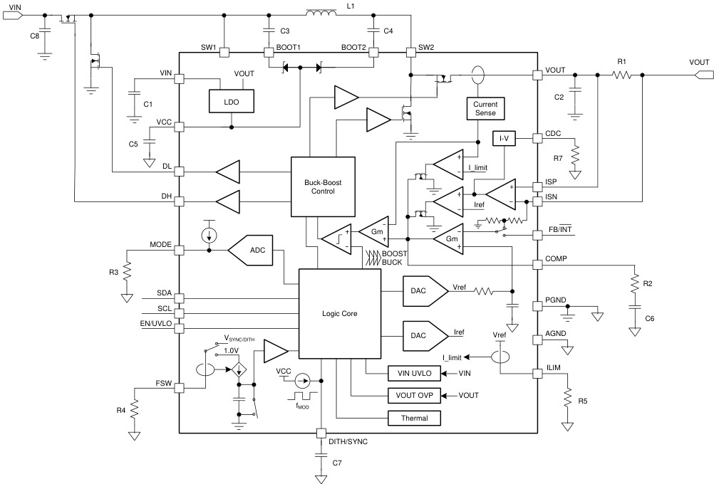
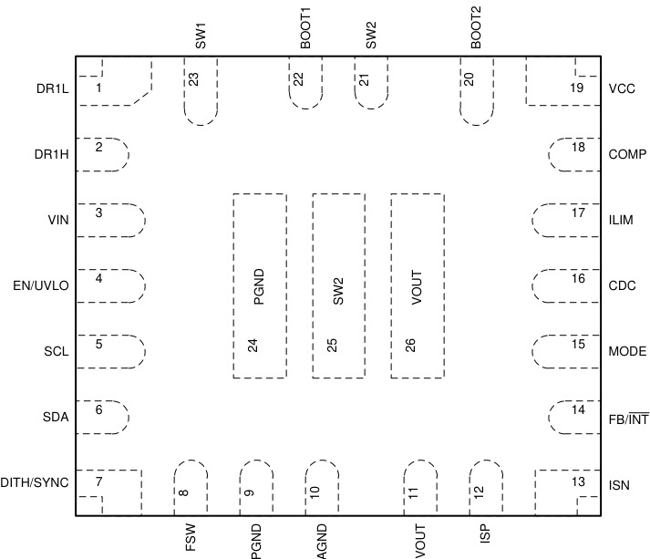
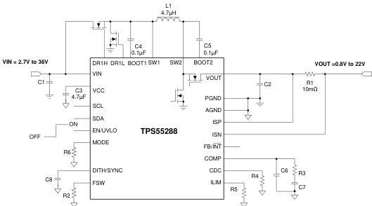
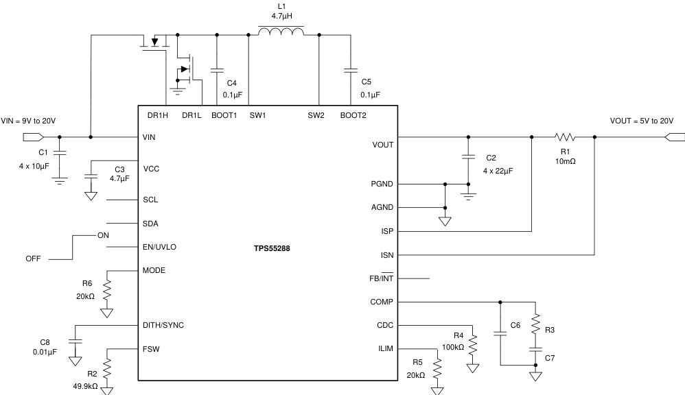
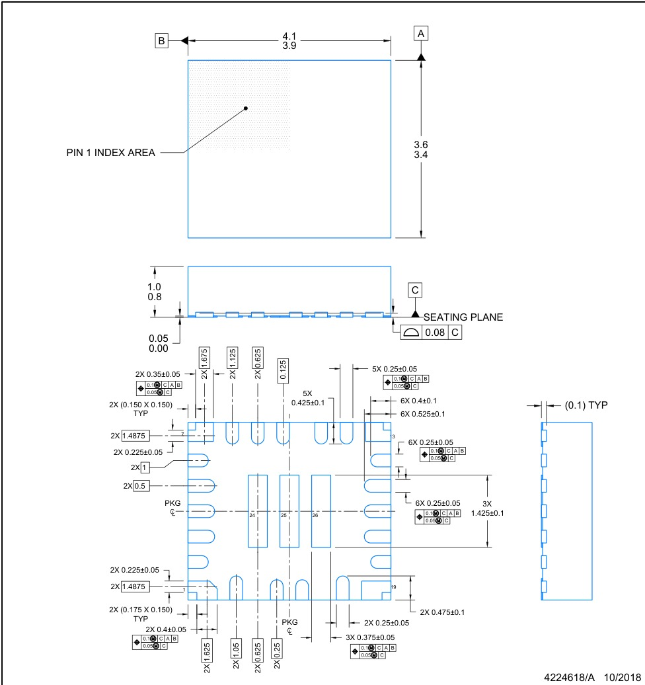

# TPS55288
> TI I2C 升降压转换器。USB PD PPS 支持。开关电流 16A ≠ 输出电流 6.35A。升压桥臂 MOSFET 内置，降压桥臂需两颗外部 NMOS。

## 1. 身份与选型

| 项目 | 内容 |
|------|------|
| 型号全称 | TPS55288（卷带订购号 TPS55288RPMR） |
| 核心功能 | 同步四开关升降压 (Buck-Boost) DC-DC，I2C 可编程输出 |
| 拓扑集成度 | 升压桥臂两颗 16A MOSFET 内置（低边 7.1mΩ / 高边 7.6mΩ）；降压桥臂为**外部 NMOS** + 内置栅极驱动 (DR1H/DR1L) |
| 控制方式 | 固定频率**平均电流模式**（内环内部补偿，外环 COMP 外部补偿） |
| 关键卖点 | USB PD PPS：VOUT 0.8–22V/20mV 步进 + 限流 0–6.35A/50mA 步进；97% 峰值效率；PFM/FPWM 双模；±7% 展频 |
| I2C 地址 | 74h / 75h（MODE 电阻或寄存器选择），Fast-mode Plus 1 Mbit/s |
| 车规 | ❌（车规版本为 TPS55288-Q1） |
| 数据手册 | ZHCSKY4B（英文 SLVSF01），2018-11 发布，2020-12 Rev B |

> [!note] 选型陷阱：16A 是**电感（开关）电流**限值，不是输出电流。升压比越大输出能力越低——12V 输入最多约 100W。6.35A 是按 10mΩ 检流电阻折算的输出限流编程上限（63.5mV / 10mΩ）。

## 2. 极限工况

| 参数 | 最小 | 最大 | 单位 |
|------|------|------|------|
| VIN、SW1 | -0.3 | 40 | V |
| VOUT、SW2、ISP、ISN | -0.3 | 25 | V |
| ISP、ISN（相对 VOUT） | VOUT−6 | VOUT+6 | V |
| EN/UVLO | -0.3 | 20 | V |
| BOOT1（相对 SW1） | -0.3 | +6 | V |
| BOOT2（相对 SW2） | -0.3 | +6 | V |
| VCC、DR1L、SCL、SDA、ILIM、FSW、COMP、FB/INT、MODE、CDC、DITH/SYNC | -0.3 | 6 | V |
| 结温 TJ | -40 | 150 | °C |
| 存储温度 | -65 | 150 | °C |
| ESD (HBM) | — | ±2000 | V |
| ESD (CDM) | — | ±500 | V |

> [!note] VOUT/SW2 绝对最大 25V，而 OVP 阈值典型 23.5V（最大 24.5V）——OVP 只是最后防线，设定电压不要超过 22V。TJ 长期高于 125°C 会降额寿命。

## 3. 推荐工作条件

| 参数 | 最小 | 典型 | 最大 | 单位 |
|------|------|------|------|------|
| VIN | 2.7 | — | 36 | V |
| VOUT | 0.8 | — | 22 | V |
| 有效电感量 L | 0.7 | 4.7 | 13 | µH |
| 有效输入电容 CIN | 4.7 | 22 | — | µF |
| 有效输出电容 COUT | 10 | 100 | 1000 | µF |
| 结温 TJ | -40 | — | 125 | °C |

可编程范围：

| 参数 | 范围 | 备注 |
|------|------|------|
| 输出限流 | 0–6.35 A，50mA 步进 | RSNS = 10mΩ 时 |
| 平均电感限流 | ≤16.5 A (typ) | RILIM 电阻设定 |
| fSW | 200–2200 kHz | RFSW 电阻设定，可外同步 |

> [!note] 表中电容/电感均指偏压与温度降额后的**有效值**——MLCC 在高直流偏压下容量常腰斩，按有效值配足。手册规定的温度限制是结温 TJ（-40~125°C），不是环境温度。

## 4. 功耗与热特性

| 参数 | 值 | 条件 |
|------|-----|------|
| 效率峰值 | 97% | VIN=12V → VOUT=20V / 3A |
| 静态电流 IQ | 760 µA typ / 860 µA max | 使能不开关（流入 VIN 或 VOUT） |
| 关断电流 ISD | 6.8 µA typ / 10 µA max | EN 拉低 |
| RDS(on)（升压桥臂） | 低边 7.1 mΩ / 高边 7.6 mΩ | VCC = 5.2V |
| RθJA | 47.5 °C/W（JEDEC 标准板）/ 25.8 °C/W（EVM 4 层 2oz 铜） | VQFN-HR 26 |
| RθJC(bot) | 7.8 °C/W | — |
| ΨJB | 12.7 °C/W | — |
| 热关断 | 175°C 触发，20°C 迟滞自恢复 | 寄存器值保留 |

> [!tip] 大功率应用建议 fSW < 500kHz 压开关损耗；若系统必须 >500kHz，手册建议同时下调电感限流以保热性能。HotRod 封装散热依赖 PGND / VOUT 引脚下方过孔阵列（见第 15 节）。

## 5. I/O 接口特性

| 参数 | 条件 | 值 |
|------|------|-----|
| VOUT 编程分辨率 | 内反馈 INTFB=11b | 20 mV/步（10 位 DAC，LSB = 1.129mV） |
| 基准电压精度 | REF=03C0h | ±1%（1.117–1.141 V） |
| VOUT 满量程精度 | 20V 设定 | ±1.5%（19.7–20.3 V） |
| 输出电流监测精度 | VSNS = 50mV | ±5% |
| 软启动时间 | 固定 | 4 ms typ（3–5 ms） |
| EN 逻辑高 / 低 | — | >1.15 V / <0.4 V |
| EN/UVLO 基准 | 可编程 UVLO | 1.23 V（1.20–1.26），迟滞电流 5 µA |
| I2C 电平 | VIH / VIL | 1.2 V / 0.4 V（IO 范围 1.7–5.5V） |
| I2C 速率 | 标准 / Fast-mode Plus | 100k–1000 kbit/s，支持时钟延展 |
| FB/INT（内反馈） | 开漏故障指示，低有效 | 灌 4mA 时 ≤0.1 V |
| FB/INT（外反馈） | 反馈输入 | VREF 45mV–1.2V 可编程 |

VCC 内部 LDO 输出 5.2V / 60mA，供电源在 VIN/VOUT 间自动切换（6.2V 上升 / 5.9V 下降阈值）：

| 条件 | LDO 输入 |
|------|---------|
| VOUT > VIN 且 VIN > 6.2V | VIN |
| VOUT > VIN 且 VIN < 5.9V | VOUT |
| VIN > VOUT 且 VOUT > 6.2V | VOUT |
| VIN > VOUT 且 VOUT < 5.9V | VIN |

> [!tip] VIN、VOUT 都高时内部 LDO 压差损耗大。可通过 MODE 电阻选择外部 5V（4.75–5.5V，≥100mA）供 VCC，把驱动功耗移出芯片，明显降温。

## 6. 核心功能

*功能方框图（数据手册 §7.2）：四开关 Buck-Boost 功率级 + I²C 接口*

- **四开关 Buck-Boost** 拓扑 → [DC-DC降压转换器](../../知识/电源电子/DC-DC降压转换器.md)（buck 原理的延伸：buck、boost 两桥臂共用一颗电感）
- **平均电流模式控制**：误差放大器输出直接命令平均电感电流——限流量即控制变量，天生具备输入电压前馈与快速负载响应
- **I2C 可编程输出**：0.8–22V（20mV 步进）+ 输出限流 0–6.35A（50mA 步进），完整支持 USB PD PPS 的 CV/CC 两态
- **PFM/FPWM 双模式** → [轻载效率模式](../../知识/电源电子/轻载效率模式.md)
- **展频 ±7% + 外部时钟同步** → [展频谱与EMI抑制](../../知识/电源电子/展频谱与EMI抑制.md)
- **保护**：可编程 UVLO、平均+峰值双重限流、输出恒流环、OVP、短路打嗝、热关断 → [电源保护机制](../../知识/电源电子/电源保护机制.md)

## 7. 引脚与典型连线

*VQFN-HR 封装引脚分布*

| 引脚 | 名称 | I/O | 功能 |
|------|------|-----|------|
| 1 | DR1L | O | buck 桥臂低边外部 NMOS 栅极驱动（VCC 供电） |
| 2 | DR1H | O | buck 桥臂高边外部 NMOS 栅极驱动（BOOT1 自举供电） |
| 3 | VIN | PWR | 输入电源 |
| 4 | EN/UVLO | I | 使能 + 可编程 UVLO（>1.15V 使能，1.23V UVLO 基准） |
| 5 | SCL | I | I2C 时钟 |
| 6 | SDA | I/O | I2C 数据 |
| 7 | DITH/SYNC | I | 展频电容 / 外同步时钟输入（接地或 >1.2V 禁用展频） |
| 8 | FSW | O | 频率设定电阻（内部钳位 1V） |
| 9, 24 | PGND | PWR | 功率地（内部低边管源极） |
| 10 | AGND | PWR | 信号地 |
| 11, 26 | VOUT | PWR | 转换器输出 |
| 12 | ISP | I | 输出检流放大器正输入 |
| 13 | ISN | I | 输出检流放大器负输入（与 ISP 短接到 VOUT 可禁用输出限流） |
| 14 | FB/INT | I/O | 外反馈：分压中点输入；内反馈：开漏故障指示（低有效） |
| 15 | MODE | I | 电阻编码：VCC 源 / I2C 地址 / PFM-FPWM（见第 10 节表） |
| 16 | CDC | O | 电流监测输出 + 外部线缆补偿电阻接入点 |
| 17 | ILIM | O | 平均电感限流设定电阻 |
| 18 | COMP | I | 误差放大器输出，接环路补偿网络 |
| 19 | VCC | O | 内部 LDO 输出，≥4.7µF 陶瓷电容到 AGND |
| 20 | BOOT2 | O | boost 高边自举电源，0.1µF 到 SW2 |
| 21, 25 | SW2 | I | boost 侧开关节点（内部桥臂） |
| 22 | BOOT1 | I | buck 高边自举电源，0.1µF 到 SW1 |
| 23 | SW1 | I | buck 侧开关节点（外部桥臂） |

*首页典型应用电路（全输入范围 2.7–36V）*

*图 8-1 — USB PD 供电典型应用（9–20V 输入）*

**最小 BOM**（按手册 9–20V → 5–20V / 5A 设计示例）：
- 功率级：L = 4.7µH（XAL1010-472ME 等，饱和电流需大于电感峰值电流）；**2 颗外部 NMOS**（buck 桥臂）；RSNS = 10mΩ（大封装，注意 I²R 功耗）
- 电容：CIN = 4×10µF、COUT = 4×22µF（MLCC 按有效容量）、CVCC ≥ 4.7µF、CBOOT1/CBOOT2 = 0.1µF
- 电阻：RFSW = 49.9kΩ（400kHz）、RILIM = 20kΩ（16.5A）、RMODE 按第 10 节表、COMP 补偿网络 RC+CC（必要时并 CP）、CDITH = 0.01µF（可选展频）、I2C 上拉

## 8. 封装

*RPM0026A 封装机械图*

| 参数 | 值 |
|------|-----|
| 封装 | VQFN-HR (HotRod)，图号 RPM0026A |
| 尺寸 | 4.0 × 3.5 mm，高度 ≤1.0 mm，0.5mm 引脚间距 |
| 引脚 | 26 |
| MSL | Level-2，260°C |
| 包装 | 卷带 3000 pcs |

HotRod = 倒装芯片直接凸点连接引线框，无键合线 → 寄生电感小、EMI 低；但没有中央大裸焊盘，散热经多个功率引脚进入 PCB。

## 9. 三区域工作原理

四开关命名：buck 桥臂（外部 Q1 高边 / Q2 低边，开关节点 SW1）+ boost 桥臂（内部 Q3 低边 / Q4 高边，开关节点 SW2），电感横跨 SW1–SW2。

| 区域 | 条件 | buck 桥臂 (Q1/Q2) | boost 桥臂 (Q3/Q4) | 等效电路 |
|------|------|------|------|------|
| Buck | VIN > VOUT | PWM 开关 | Q4 常通、Q3 常闭 | 同步降压，D ≈ VOUT/VIN |
| Buck-Boost 过渡 | VIN ≈ VOUT | 一周期 buck | 一周期 boost | 两桥臂**逐周期交替**开关 |
| Boost | VIN < VOUT | Q1 常通（DR1H 恒高）、Q2 常闭 | PWM 开关 | 同步升压，D ≈ 1−VIN/VOUT |

- 任意时刻只有一个桥臂在开关 → 开关损耗接近单一 buck 或 boost，这是三区域方案对"双桥臂同时斩波"的效率优势
- **过渡区**：一周期 buck + 一周期 boost 的交替使等效纹波频率减半、纹波增大；MODE 寄存器 FSWDBL=1 可让过渡区开关频率加倍来补偿（fSW > 1.6MHz 时 TI 不建议启用）
- **自举维持**：某桥臂高边常通时其 BOOT 电容无法靠开关刷新，芯片内置充电通路（VOUT+BOOT2 → BOOT1、VIN+BOOT1 → BOOT2）维持高边常通不掉压
- **极限占空比**：buck 最小导通时间 130ns (max)、boost 最小关断时间 145ns (max)——高 fSW 且输入输出压差大时会提前进入过渡区
- STATUS 寄存器 [1:0] 实时回读当前区域：00=Boost、01=Buck、10=Buck-Boost
- 轻载 PFM 时反向电流阻断的开关不同：buck 区电感电流过零时关**低边 Q2**，boost 区过零时关**高边 Q4**；FPWM 则允许电感电流反向（频率恒定、无音频噪声，但轻载效率低，能量会从输出倒灌回输入）

## 10. I2C 编程与寄存器速查

从机地址 74h / 75h，支持单字节与多字节读写、时钟延展。寄存器一览：

| 地址 | 名称 | 默认 | 内容 |
|------|------|------|------|
| 00h | REF_LSB | D2h | VREF[7:0] |
| 01h | REF_MSB | 00h | VREF[9:8]；**写 01h 才把 10 位装载进 DAC** |
| 02h | IOUT_LIMIT | E4h | bit7 限流使能；[6:0] VSNS 目标，LSB 0.5mV（默认 50mV） |
| 03h | VOUT_SR | 01h | [5:4] OCP_DELAY：128µs / 3.1ms / 6.1ms / 12.3ms；[1:0] 摆率 1.25 / 2.5 / 5 / 10 mV/µs |
| 04h | VOUT_FS | 03h | bit7 FB：0=内反馈（FB/INT 作故障指示）1=外反馈；[1:0] INTFB 分压比 |
| 05h | CDC | E0h | bit7/6/5 = SC/OCP/OVP 指示屏蔽；bit3 CDC 内/外选择；[2:0] 补偿幅度 |
| 06h | MODE | 20h | OE · FSWDBL · HICCUP · DISCHG · VCC · I2CADD · PFM · MODE |
| 07h | STATUS | 03h | bit7/6/5 = SCP/OCP/OVP（读后清零）；[1:0] 工作区域 |

**输出电压设定**（内反馈）：

$$V_{OUT} = \frac{V_{REF}}{K_{INTFB}}, \qquad V_{REF} = 45\,\mathrm{mV} + N \times 1.129\,\mathrm{mV},\quad N = 0 \ldots 1023$$

| INTFB[1:0] | 分压比 | 满量程（REF=03C0h） | VOUT 步进 |
|------|------|------|------|
| 00b | 0.2256 | 5 V | 5 mV |
| 01b | 0.1128 | 10 V | 10 mV |
| 10b | 0.0752 | 15 V | 15 mV |
| 11b（默认） | 0.0564 | 20 V | 20 mV |

默认 REF=0D2h（282mV）÷ 0.0564 = 5.0V。编程 20V：INTFB=11b，REF=03C0h（写 00h=C0h、01h=03h）。外反馈（FB=1）时：

$$V_{OUT} = V_{REF} \times \left(1 + \frac{R_{FB\_UP}}{R_{FB\_BT}}\right)$$

RFB_UP 推荐 100kΩ；代价是 FB/INT 不再输出故障指示。

**上电编程流程**：EN 拉高（VIN > 3V）→ 芯片采样 MODE 电阻确定 VCC 源 / I2C 地址 / PFM → 主控配置 00h–05h → 置 MODE.OE=1 → 内部基准 4ms 爬升软启动。运行中改电压按 SR[1:0] 摆率斜坡过渡（PPS 平滑换挡的关键）。

> [!tip] 两个高频踩坑点：① 只写 00h **不生效**——必须再写 01h 才触发 DAC 装载（用多字节连写 00h→01h 最稳妥）。② OE 位或 Current_Limit_EN 位从 0→1 时 OCP_MASK 必须先清 0，待置位完成后再把 OCP_MASK 置 1 打开 OCP 指示，否则启动瞬间会误报过流。

**MODE 引脚电阻配置表**（10µA 源电流检测，使能时采样一次；之后可由寄存器 MODE.MODE=1 接管）：

| RMODE (kΩ) | VCC 源 | I2C 地址 | 轻载模式 |
|------|------|------|------|
| 0（短接） | 内部 | 74h | FPWM |
| 6.19 | 内部 | 74h | PFM |
| 14.3 | 内部 | 75h | FPWM |
| 24.9 | 内部 | 75h | PFM |
| 51.1 | 外部 | 74h | FPWM |
| 75.0 | 外部 | 74h | PFM |
| 105 | 外部 | 75h | FPWM |
| 开路 | 外部 | 75h | PFM |

**关断行为**：EN < 0.4V → 完全关断且**寄存器复位为默认值**（重新上电必须重配）；EN 高 + OE=0 → 停止开关但 I2C 保活，若 DISCHG=1 则内部 100mA 恒流把输出放电到 0.8V 以下（PD 换挡放电用）。

## 11. 输出限流环与电缆压降补偿 (CDC)

**限流环行为**：RSNS（典型 10mΩ）串在输出，寄存器 02h 设定 ISP–ISN 目标压差（0–63.5mV，0.5mV 步进）。输出电流触及限值后，一个**慢速恒流环**接管：输出电压跌落、电流稳在限值——即 CC 恒流源特性，这正是 USB PD PPS 恒流模式的硬件实现。

$$R_{SNS} = \frac{V_{SNS}}{I_{OUT\_LIMIT}}$$

- OCP_DELAY（03h[5:4]）允许短时过流：默认 128µs 立即限流，可放宽至 3.1 / 6.1 / 12.3 ms，用于容忍负载浪涌（电机、热插拔电容）
- ISP/ISN 一起短接到 VOUT，或 Current_Limit_EN=0 → 禁用输出限流
- 检流电阻功耗 P = I²R（5A × 10mΩ = 0.25W，推算），选大封装

**电流监测**：CDC 引脚输出与负载电流成正比的电压，可直接给 MCU ADC：

$$V_{CDC} = 20 \times (V_{ISP} - V_{ISN})$$

RSNS = 10mΩ 时即 0.2 V/A（5A → 1V），50mV 检测点精度 ±5%。

**电缆压降补偿**：按负载电流抬升 VOUT，抵消线缆电阻压降，使线缆远端电压恒定。两种方式：
- **内部补偿**（内反馈时推荐）：写 CDC[2:0]，在 VISP−VISN=50mV 时输出抬升 0–0.7V（0.1V/挡）
- **外部补偿**（外反馈时推荐，精度更高）：CDC 引脚到 AGND 接 RCDC：

$$\Delta V_{OUT\_CDC} = 3 \times R_{FB\_UP} \times \frac{V_{ISP} - V_{ISN}}{R_{CDC}}$$

推算：RFB_UP=100kΩ、RSNS=10mΩ、RCDC=30kΩ 时补偿系数 = 0.1 V/A，恰好补平约 100mΩ 的 1m USB-C 线阻。

## 12. 保护机制

| 保护 | 阈值 | 行为 |
|------|------|------|
| VIN UVLO（固定） | 2.9V 上升 / 2.65V 下降 (typ) | 低于即禁用芯片 |
| EN/UVLO（可编程） | 1.23V 基准 + 5µA 迟滞电流 | 分压电阻设定，见下式 |
| 平均电感限流 | RILIM=20kΩ → 16.5A typ（14–19A） | 电流环内限幅，持续钳位平均电流 |
| 峰值电感限流 | 25A typ | 逐周期，防瞬态冲击超出器件能力 |
| 输出限流 OCP | 02h 设定（≤63.5mV/RSNS） | 恒流环接管 + STATUS.OCP 置位 |
| 输出 OVP | 23.5V typ（22.5–24.5V），迟滞 1V | **关两个高边管、开两个低边管**直至回落 |
| 短路保护 SCP | 平均限流触发 **且** VOUT < 0.8V | 打嗝：停 76ms → 4ms 软启动重试（HICCUP 默认开） |
| 热关断 | 175°C，迟滞 20°C | 自动重启；寄存器值保留（区别于 EN 关断） |

$$V_{UVLO(on)} = 1.23\,\mathrm{V} \times \left(1 + \frac{R_1}{R_2}\right), \qquad \Delta V_{HYS} = 5\,\mu\mathrm{A} \times R_1$$

$$I_{AVG\_LIMIT} = \min\left(1,\ 0.6 \times V_{OUT}\right) \times \frac{330000}{R_{ILIM}}\ \mathrm{(A)}$$

> [!note] min(1, 0.6·VOUT) 项意味着 VOUT < 1.67V 时平均限流**自动降额**（VOUT=0.8V 时只剩 48%，推算）——低压大电流输出场景必须复核限流余量。RILIM=20kΩ → 16.5A，60kΩ → 5.5A。

> [!note] 打嗝判据是"双条件与"：限流触发**且** VOUT<0.8V。持续过载但 VOUT 仍 >0.8V 时不会打嗝，而是停在恒流态持续发热——需靠 OCP_DELAY 与主控轮询 STATUS（FB/INT 中断）主动干预。

→ [电源保护机制](../../知识/电源电子/电源保护机制.md)

## 13. 开关频率、同步与展频

$$R_{FSW}(\mathrm{k\Omega}) = \frac{1000}{0.05 \times f_{SW}(\mathrm{kHz})}$$

| fSW | RFSW | 适用 |
|------|------|------|
| 200 kHz | 100 kΩ | 大功率 / 最高效率 |
| 400 kHz | 49.9 kΩ | USB PD 100W 甜点（手册示例） |
| 2.2 MHz | 9.09 kΩ | 最小体积 / 避开 AM 频段 |

- FSW 引脚内部钳位 1V，电阻只允许 9.09k–100kΩ
- **外部同步**：时钟注入 DITH/SYNC——占空比 30–70%、低电平 <0.4V、最小脉宽 50ns、频率须在 RFSW 设定值 ±30% 内，且 RFSW 电阻必须保留
- **展频**：DITH/SYNC 挂电容 → 1V 中心三角波以 ±7% 调制开关频率，调制频率建议 <1kHz：

$$C_{DITH} = \frac{1}{2.8 \times R_{FSW} \times F_{MOD}}\ \mathrm{(F)}$$

（49.9kΩ + 0.01µF → 约 716Hz，推算。）DITH/SYNC 接地或拉高 >1.2V 即禁用展频；使用外同步时展频自动禁用 → [展频谱与EMI抑制](../../知识/电源电子/展频谱与EMI抑制.md)

## 14. 外围 LC 与环路补偿设计流程

以手册设计示例（VIN 9–20V，VOUT 5–20V，限流 5A，纹波 ±50mV，fSW=400kHz）为线索：

**① 电感**——buck、boost 两种模式分别校核纹波，取更苛刻者：

$$L_{buck} = \frac{(V_{IN(max)}-V_{OUT}) \times V_{OUT}}{\Delta I_{L(P\text{-}P)} \times f_{SW} \times V_{IN(max)}}, \qquad L_{boost} = \frac{V_{IN} \times (V_{OUT(max)}-V_{IN})}{\Delta I_{L(P\text{-}P)} \times f_{SW} \times V_{OUT(max)}}$$

- buck 纹波最大点在 VOUT = VIN(max)/2；boost 纹波最大点在 VIN = VOUT(max)/2；纹波经验值取平均电感电流的 20–40%
- 内部电流环约束：**L > 1.2/fSW**（fSW 以 MHz 计得 µH；400kHz → ≥3µH，故选 4.7µH）
- boost 模式电感直流与峰值电流：

$$I_{L(DC)} = \frac{V_{OUT} \times I_{OUT}}{V_{IN} \times \eta}, \qquad I_{L(P)} = I_{L(DC)} + \frac{\Delta I_{L(P\text{-}P)}}{2}$$

- 推算最劣点（9V→20V/5A，η=0.95）：IL(DC) ≈ 11.7A，ΔIL ≈ 2.6A，峰值 ≈ 13A → 饱和电流须 >13A，平均限流 16.5A 留有裕量
- 手册推荐电感：Coilcraft XAL1010-472ME（4.7µH/10mΩ/25.4A）、Vishay IHLP5050EZER4R7（17.8A）、Sumida 125CDMCCDS-4R7MC（22A）

**② 输入电容**（buck 模式纹波电流最恶劣）：

$$I_{CIN(RMS)} = I_{OUT} \times \frac{\sqrt{V_{OUT} \times (V_{IN}-V_{OUT})}}{V_{IN}} \le \frac{I_{OUT}}{2}$$

有效 20µF 起步（示例用 4×10µF MLCC）。

**③ 输出电容**（boost 模式纹波电流最恶劣，示例最大 5.5A RMS）：

$$I_{COUT(RMS)} = I_{OUT} \times \sqrt{\frac{V_{OUT}}{V_{IN}} - 1}$$

输出纹波两个来源，据 ±50mV 目标反解最小 COUT：

$$V_{RIPPLE(ESR)} = \frac{I_{OUT} \times V_{OUT}}{V_{IN}} \times R_{ESR}, \qquad V_{RIPPLE(CAP)} = \frac{I_{OUT} \times \left(1 - V_{IN}/V_{OUT}\right)}{C_{OUT} \times f_{SW}}$$

**④ 环路补偿**（COMP 对 AGND 接 RC 串 CC，必要时并 CP）——boost 模式存在右半平面零点 (RHPZ)，比 buck 更严苛，按 boost 最劣工况设计：

$$f_P = \frac{2}{2\pi R_{LOAD} C_{OUT}}, \qquad f_{ESRZ} = \frac{1}{2\pi R_{ESR} C_{OUT}}, \qquad f_{RHPZ} = \frac{R_{LOAD}(1-D)^2}{2\pi L}$$

穿越频率上限：

$$f_C \le \min\left(\frac{f_{SW}}{10},\ \frac{f_{RHPZ}}{5}\right)$$

$$R_C = \frac{2\pi V_{OUT} R_{SENSE} C_{OUT} f_C}{(1-D) \times V_{REF} \times G_{EA}}, \qquad C_C = \frac{R_{LOAD} C_{OUT}}{2 R_C}, \qquad C_P = \frac{R_{ESR} C_{OUT}}{R_C}$$

内部等效检流电阻 RSENSE = 0.055Ω，误差放大器跨导 GEA = 190µA/V；CP < 10pF 时可省略。目标相位裕度 >45°、增益裕度 >10dB。原理详见 [环路补偿](../../知识/电源电子/环路补偿.md)。

> [!tip] 平均电流模式的内环已在片内补偿，设计者只需补外部电压环——省去峰值电流模式的斜坡补偿，但 RHPZ 仍是 boost 区的带宽天花板：**重载 + 最低 VIN** 时 fRHPZ 最低，按该工况取 fC。

## 15. PCB 布局要点

- **两个热回路分别最小化**：buck 热回路 = 输入电容 ↔ 外部两颗 NMOS ↔ PGND——输入电容紧贴 buck 高边管漏极与低边管源极；boost 热回路 = 内部桥臂 ↔ 输出电容 ↔ PGND——输出电容须同时紧贴 VOUT 引脚**和** PGND 引脚（压 SW2/VOUT 过冲）
- SW1/SW2 走线最短、面积最小；第一内层放完整 PGND 平面抑制层间耦合
- ISP/ISN 检流走线平行、紧贴、等长（开尔文接法），远离开关节点防噪声耦合
- AGND 与 PGND **单点连接**，连接点在 VCC 电容端子处——驱动器地弹不进入模拟控制地
- PGND 引脚与 VOUT 引脚下方打过孔阵列，分别连 PGND 平面 / 大面积 VOUT 铜皮散热（HotRod 无裸焊盘，这是主要散热路径）
- 输入电源距离超过几英寸时，VIN 侧追加约 100µF 铝电解补能

---
- [DC-DC降压转换器](../../知识/电源电子/DC-DC降压转换器.md) · [展频谱与EMI抑制](../../知识/电源电子/展频谱与EMI抑制.md) · [轻载效率模式](../../知识/电源电子/轻载效率模式.md) · [电源保护机制](../../知识/电源电子/电源保护机制.md) · [环路补偿](../../知识/电源电子/环路补偿.md)
