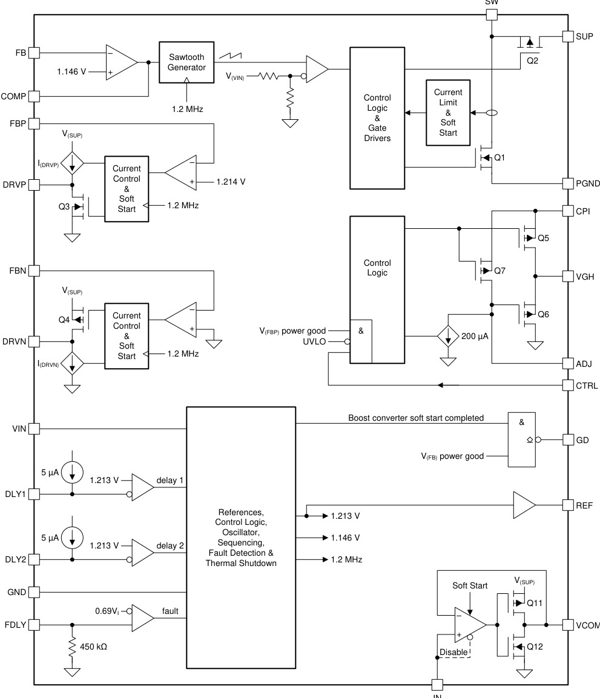
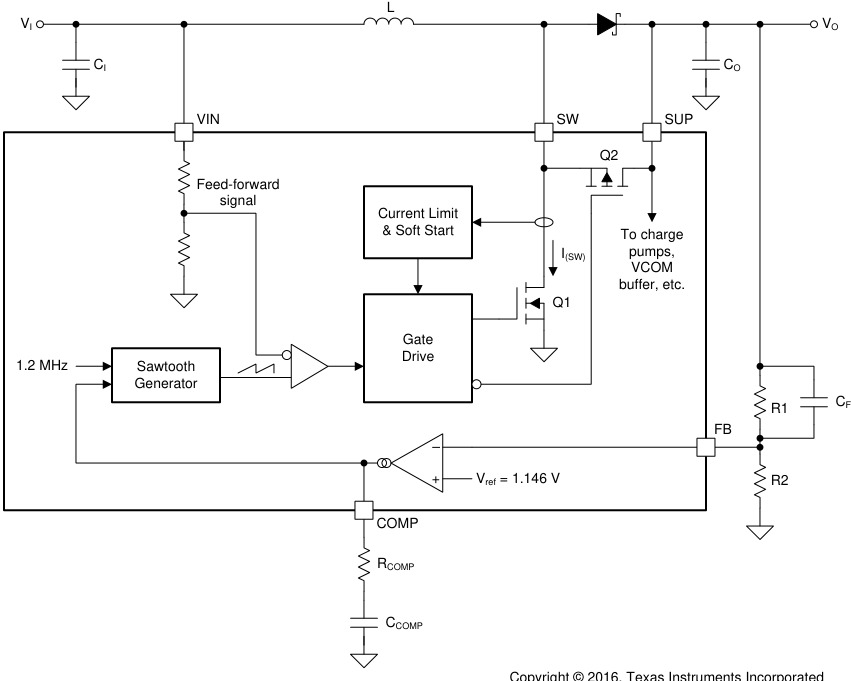
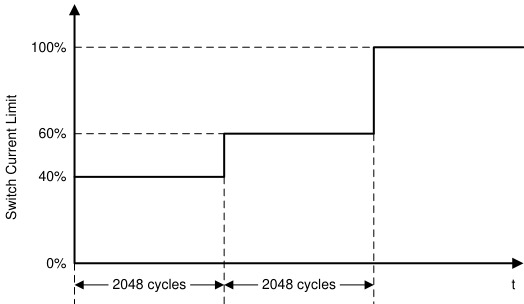
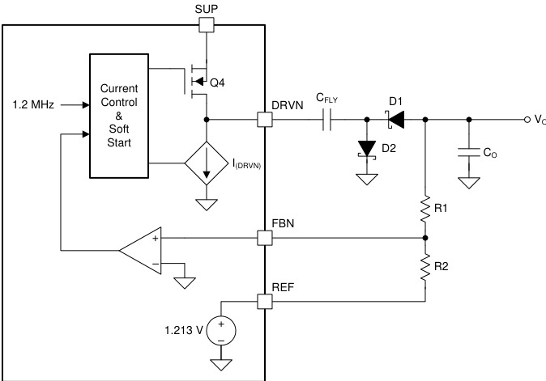
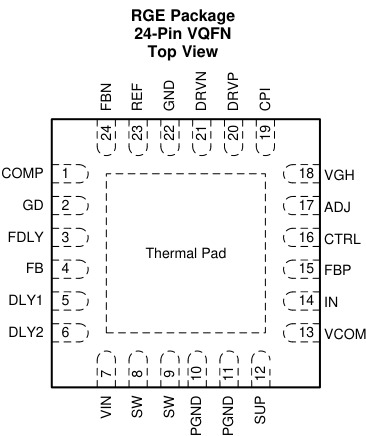

# TPS65150
> TI 低输入电压紧凑型 TFT LCD 偏压电源（SLVS576B，2005 首发 / 2016 Rev B）。1.8–6 V 输入，单芯片产生源极驱动电压 V(VS)、栅极开启电压 VGH、栅极关断电压 VGL 与背板公共电压 VCOM 四路偏压，内置栅极电压整形（gate voltage shaping）、可调上电时序与可调故障锁存——一颗芯片解决 TFT 面板的全部电源需求。

## 1. 身份与选型

| 项目 | 内容 |
|------|------|
| 型号全称 | TPS65150（PWP = HTSSOP-24；RGE = VQFN-24） |
| 核心功能 | TFT LCD 偏压全家桶：Boost 主升压 V(VS) + 正电荷泵 VGH + 负电荷泵 VGL + VCOM 缓冲 |
| 输入范围 | 1.8–6 V，适配 2.5 V / 3.3 V（笔记本）、5 V（显示器）供电轨或单节锂电 |
| 关键卖点 | 集成 VCOM 缓冲器、VGH 高压隔离开关 + 栅极电压整形、可调上电时序（DLY1/DLY2）、可调故障检测锁存（FDLY）、虚拟同步 CCM 技术 |
| 主开关 | 2 A（保证最小限流值）内部 MOSFET，V(VS) 最高 15 V，精度 <1% |
| 保护 | 输出失调锁存、SUP 过压保护、热关断 → [电源保护机制](../../知识/电源电子/电源保护机制.md) |
| 车规 | ❌（车规版本为 TPS65150-Q1，Q100 认证） |
| 应用 | 笔记本 / 显示器 TFT LCD、车载导航显示 |

## 2. 极限工况

| 参数 | 最小 | 最大 | 单位 |
|------|------|------|------|
| VIN 引脚电压 | -0.3 | 7 | V |
| SUP 引脚电压 | -0.3 | 15.5 | V |
| SW 引脚电压 | — | 20 | V |
| CTRL 引脚电压 | -0.3 | 7 | V |
| GD 引脚电压 | — | 15.5 | V |
| CPI 引脚电压 | — | 32 | V |
| 焊接温度（10 s） | — | 260 | °C |
| 结温 TJ | -40 | 150 | °C |
| 存储温度 | -65 | 150 | °C |
| ESD HBM | — | ±2000 | V |
| ESD CDM | — | ±500 | V |

> [!warning] 电压预算的天花板在 CPI
> CPI 绝对极限 32 V 决定了正电荷泵输出（即 VGH 上限 30 V）；SUP 极限 15.5 V 决定了 Boost 输出不能超过 15 V。级联三倍压时 VGH 也不得逼近 32 V。

## 3. 推荐工作条件

| 参数 | 最小 | 典型 | 最大 | 单位 |
|------|------|------|------|------|
| VIN | 1.8 | — | 6 | V |
| V(VS) 主输出 | — | — | 15 | V |
| 电感 L | — | 4.7 | — | µH |
| TA | -40 | — | 85 | °C |
| TJ | -40 | — | 125 | °C |

> [!note] 开关限流不是 2 A 封顶
> SW 引脚限流为 2 A（最小）/ 2.5 A（典型）/ 3.4 A（最大）。特性页的"2-A Internal MOSFET"指的是保证的最小限流值；按保守法选电感时，饱和电流应按最大限流 3.4 A 取。

## 4. 功耗与热特性

| 参数 | PWP (HTSSOP-24) | RGE (VQFN-24) | 单位 |
|------|------|------|------|
| RθJA 结-环境 | 36.4 | 34.3 | °C/W |
| RθJC(top) | 18.8 | 36.2 | °C/W |
| RθJB 结-板 | 15.9 | 12 | °C/W |
| RθJC(bot)（热焊盘） | 1.3 | 3.2 | °C/W |

静态电流（不开关时）：VIN 14 µA（典型）/ 25 µA（最大）；SUP 1.9 mA / 3 mA；VCOM 缓冲 750 µA / 1500 µA。不用 VCOM 缓冲时把 IN 接地可省掉这 750 µA。

## 5. I/O 接口特性

**Boost 主升压**（VI = 3.3 V，V(VS) = 10 V 条件）：

| 参数 | 最小 | 典型 | 最大 | 单位 |
|------|------|------|------|------|
| FB 基准电压 Vref | 1.136 | 1.146 | 1.154 | V |
| Q1 主开关 rDS(on)（VO = 10 V） | — | 200 | 300 | mΩ |
| Q2 同步管 rDS(on)（VO = 10 V） | — | 8 | 15 | Ω |
| SW 限流 | 2 | 2.5 | 3.4 | A |
| SUP 过压保护阈值（上升） | 16 | — | 20 | V |
| 线性调整率（VI 1.8–5 V, IO 1 mA） | — | 0.007 | — | %/V |
| 负载调整率（VI 5 V, IO 0–400 mA） | — | 0.16 | — | %/A |
| GD 触发阈值（FB） | Vref−12% | — | Vref−4% | V |

**电荷泵与基准**：

| 参数 | 最小 | 典型 | 最大 | 单位 |
|------|------|------|------|------|
| REF 基准输出 | 1.205 | 1.213 | 1.219 | V |
| 负泵 FBN 调节电压 | -36 | 0 | 36 | mV |
| 负泵输出范围 | — | — | -2 | V |
| 负泵 Q4 rDS(on)（20 mA） | — | 4.4 | — | Ω |
| DRVN 电流灌压降（50 mA） | — | 130 | 300 | mV |
| 正泵 FBP 基准 | 1.187 | 1.214 | 1.238 | V |
| 正泵输出上限（CTRL=GND，VGH 开路） | — | — | 30 | V |
| 正泵 Q3 rDS(on)（20 mA） | — | 1.1 | — | Ω |
| DRVP 电流灌压降（50 mA） | — | 420 | 650 | mV |
| 电荷泵负载调整率 | — | 0.016（负）/ 0.07（正） | — | %/mA |

**VCOM 缓冲 / 整形 / 时序**：

| 参数 | 最小 | 典型 | 最大 | 单位 |
|------|------|------|------|------|
| VCOM 输入范围（IN） | 2.25 | — | V(SUP)−2 | V |
| VCOM 输入失调 | -25 | — | 25 | mV |
| VCOM 最大输出电流 | — | 1.2（SUP=15 V）/ 0.65（10 V）/ 0.15（5 V） | — | A |
| 整形 Q5 rDS(on) | — | 12 | 30 | Ω |
| ADJ 放电电流 I(ADJ) | 160 | 200 | 240 | µA |
| 整形最大输出电流 | — | — | 20 | mA |
| DLY1/DLY2 充电电流 | 3 | 5 | 7 | µA |
| FDLY 内部电阻 R(FDLY) | 250 | 450 | 650 | kΩ |
| 振荡频率 fSW | 1.02 | 1.2 | 1.38 | MHz |
| UVLO（VI 下降 / 上升） | — | 1.6 / 1.7 | 1.8 / 1.9 | V |
| CTRL 逻辑电平 VIH / VIL | 1.6 / — | — | — / 0.4 | V |

电荷泵 DRVN/DRVP 均为 1.2 MHz、50% 占空比；电荷泵最大输出电流约为内部驱动电流源的一半（典型设计 ≤20 mA）。

## 6. 核心功能

*功能方框图（§7.2）：Boost 主升压 + 正/负电荷泵 + VCOM 缓冲 + 栅极整形（Q5/Q6/Q7）+ 时序/故障控制，LCD 偏压全家桶*

### 6.1 四路输出与 TFT 面板需求的对应

| 输出 | 产生方式 | 面板中的角色 | 典型值（5 V 显示器方案） |
|------|------|------|------|
| V(VS) | Boost 升压 | 源极驱动 IC（列驱动/伽马电路）的模拟供电，负载最重 | 13.5 V / 450 mA |
| VGH | 正电荷泵（SUP 泵升）经 Q5 隔离开关输出 | 栅极驱动 IC 的开启电压——TFT 导通、像素充电 | 23 V / 20 mA |
| VGL | 负电荷泵 | 栅极关断电压——把 a-Si TFT 拉到深截止，压住漏电 | -5 V / 20 mA |
| VCOM | 跨导型缓冲放大器（输入 IN） | 液晶背板公共电极，驱动大容性负载 | 跟随 IN 分压 |

TFT 像素本质是"a-Si 开关管 + 存储电容"：栅极要够正才能在行选通时间内把像素充满（VGH），要够负才能在其余帧时间内不漏电（VGL——a-Si 阈值漂移决定了 0 V 关不干净）；源极驱动的伽马 DAC 需要 10–15 V 模拟轨（VS）；VCOM 是所有像素的公共参考极板，极性反转驱动决定了它需要一个能吐纳大电流的缓冲器而非简单分压。四路电压等级和功率量级差异巨大，这正是"偏压全家桶"芯片存在的理由。

内部供电链：Boost 输出 V(VS) 必须回接 SUP 引脚——两个电荷泵和栅驱动电路都从 SUP 取电，所以 Boost 必然最先启动，这也天然决定了时序的第一级。

### 6.2 Boost 主升压：电压模式 + 前馈 + 虚拟同步

*Figure 8 — Boost 框图：Q1 主开关 + 外部肖特基整流 + Q2 小同步管（虚拟同步）*

采用快速响应电压模式控制并加入输入前馈，1.2 MHz 定频，外部 COMP 补偿。**虚拟同步（virtual-synchronous）**是其特色：在外部整流二极管旁并联一只 1 A 的小 MOSFET Q2（rDS(on) 8 Ω 典型，远大于外部肖特基），轻载时允许电感电流反向，从而**任何负载下都保持 CCM**。收益有三：补偿设计只需按 CCM 一种模式做；轻载时 SW 节点不振铃；SW 引脚波形规整，可以直接再驱动级联电荷泵。

占空比与峰值开关电流（选电感、选二极管的依据）：

$$D = 1 - \frac{\eta \cdot V_I}{V_O} \qquad I_{SW(M)} = \frac{D \cdot V_I}{2fL} + \frac{I_O}{1-D}$$

其中 η 为效率（可查曲线，或按最坏 75% 估算），f = 1.2 MHz。峰值电流按**最低输入电压**计算，且要记住正/负电荷泵和 VCOM 缓冲的功率也都从 Boost 输出取——它们的负载要折算进 IO。

输出电压由 FB 分压设定（Vref = 1.146 V）：

$$V_O = \left(1 + \frac{R_1}{R_2}\right) \times 1.146\,\text{V}$$

R1 取 100 kΩ–1 MΩ 以压低静态损耗。输出纹波近似 $V_{O(PP)} = D \cdot I_O / (f \cdot C_O)$。

### 6.3 软启动电流阶梯

*Figure 9 — Boost 软启动期间的开关电流限制阶梯*

Boost 的软启动不是缓升基准，而是**限流阶梯**：前 2048 个开关周期限流为最大值的 40%，接下来 2048 个周期放宽到 60%，之后全开（100%）直至输出进入调节。按 1.2 MHz 计，两级各约 1.7 ms，典型总启动时间约 5 ms。这种做法把浪涌电流从输入电源上"削"掉，对适配器/电池供电的面板尤其重要。负电荷泵、正电荷泵和 VCOM 缓冲各自也带独立软启动。

### 6.4 上电时序：VS → VGL → VGH → VCOM（顺序硬件固定）

时序链条：VIN 越过 UVLO 上升阈值 → Boost 启动；V(VS) 到达终值后经 **td(DLY1)** → 负电荷泵 VGL 启动；V(VGL) 到达终值后经 **td(DLY2)** → 正电荷泵启动；V(CPI) 进入调节后 VCOM 缓冲才启动，同时整形块的 Q5 才允许导通把 CPI 接通到 VGH 引脚（这就是 VGH 的输入-输出隔离）。

为什么 TFT 要求 **VGL 先于 VGH**：上电过程中若栅极先出现正压，而此时源极数据电压尚未建立，全部行同时半导通，像素被随机充电——表现为开机白闪、残影甚至 DC 残留损伤液晶。先建立 VGL 把所有 TFT 钳在深截止，等 VS 与数据通道稳定后再放出 VGH，面板才能"干净"地点亮。TPS65150 把这个顺序**做死在硬件状态机里**，DLY 电容只能调间隔、不能换顺序。

延迟时间由 DLY1/DLY2 对地电容设定——内部 5 µA 恒流源给电容线性充电，充到 1.213 V 基准即触发：

$$t_{d(DLY)} = \frac{C_{DLY} \times 1.213\,\text{V}}{5\,\mu\text{A}}$$

10 nF 对应约 2.4 ms。掉电时序不受控：VS/VGL/CPI 的跌落速度取决于各自负载与反馈电阻放电。

> [!note] 手册内部小矛盾
> §8.2.1 Table 2 写目标延迟 td1 = td2 = 1 ms，但 §8.2.2.10 算例按 2.5 ms 代入得 10.31 nF → 取 10 nF。按公式 1 ms 应取 4.7 nF 左右；照抄 10 nF 时实际延迟约 2.4 ms。

### 6.5 栅极电压整形（Gate Voltage Shaping）

TFT 行关断瞬间，栅-漏寄生电容会把一部分栅压跳变耦合进像素（kickback），行与行之间还会串扰。**在每行扫描间隙把 VGH 拉低一段再恢复**，可以减小关断摆幅、抑制像素间串扰与残影——这就是整形功能的意义。

实现：面板时序控制器把整形信号打到 CTRL。CTRL = 高时 Q5/Q7 导通、Q6 截止，VGH 引脚直连正电荷泵输出 CPI；CTRL = 低时 Q5/Q7 断开、Q6 作为源极跟随器让 VGH 跟随 ADJ 引脚电压——而 ADJ 被内部 200 µA 电流沉以恒流放电，线性斜降。斜率与摆幅由 ADJ 电容决定：

$$V_{VGH(PP)} = \frac{I_{(ADJ)} \times t_{w(CTRL)}}{C_{ADJ}}, \quad I_{(ADJ)} = 200\,\mu\text{A}$$

例：斜率要求 10 V/µs → C_ADJ = 200 µA ÷ 10 V/µs = 20 pF，取标准值 22 pF。整形通道最大输出 20 mA，ADJ = 0 V 时 VGH 最低可到 2 V。

> [!warning] CTRL 不用也不能悬空
> 不需要整形时 CTRL 必须接 VI——此时 Q5 仍作为 VGH 隔离开关工作，DLY2 决定 VGH 何时接通。CTRL 悬空或接地会导致 VGH 无输出。UVLO 或故障关断时 Q5/Q6 全断，VGH 呈高阻。

### 6.6 电荷泵工作原理：调制的是电流源，不是占空比

*Figure 10 — 负电荷泵框图：Q4 充电相 + 受控电流沉 I(DRVN) 放电相*

两个电荷泵均为 1.2 MHz、50% 固定占空比的两相操作，但**稳压不靠 PWM，而靠串联受控电流源**——这是它输出纹波小、调整率好的原因：

- **负泵**：充电相 Q4 导通把飞跨电容充到约 V(SUP)；放电相 Q4 断开、受控电流沉 I(DRVN) 导通，飞跨电容负端经 D1 向输出泵出负电流。误差放大器比较反馈与基准后调节 I(DRVN) 的大小实现稳压。FBN 的调节点是 **0 V**（±36 mV），反馈网络一端挂在 REF（1.213 V）上，因此输出为负：
$$V_{VGL} = -\frac{R_1}{R_2} \times 1.213\,\text{V}$$
- **正泵**：拓扑与负泵对称，电流源 I(DRVP) 与 MOSFET Q3 位置对调，FBP 调节点 1.214 V：
$$V_{CPI} = \left(1 + \frac{R_1}{R_2}\right) \times 1.214\,\text{V}$$

输出纹波（两泵同式）：$V_{O(PP)} = I_O / (2f \cdot C_O)$。需要更高 VGH 时，可从 SW 引脚再级联一级电荷泵组成三倍压（手册 Figure 34，2.5 V 系统即如此做出 23 V）。

### 6.7 VCOM 缓冲

跨导型放大器，专为容性负载（背板 ITO 电极）设计，从 SUP 供电，输出电流能力随 SUP 电压变化（15 V 时 1.2 A / 10 V 时 0.65 A / 5 V 时 0.15 A）。输入 IN 通常由 V(VS) 经电阻分压（典型 500 kΩ/500 kΩ + 1 nF）设定，输出接 1 µF 电容。带独立软启动，限制启动时从 SUP 抽取的电流。

> [!warning] IN 接地只能是静态配置
> 不用 VCOM 缓冲时把 IN 接地可关闭它省电，但**不允许运行中动态拉低 IN**。

### 6.8 GD：外部隔离 MOSFET 驱动

GD 为低有效开漏输出：Boost 输出进入调节（FB 达到 Vref −12%…−4% 阈值窗）后**锁存为低**，用于驱动一只外部 P-MOSFET（如 Si2343）把 V(VS) 接通到面板——实现输出隔离与短路保护（手册 Figure 36）。VIN 跌破 UVLO 或器件故障关断时 GD 恢复高阻，P 管断开，面板与升压输出脱离。

### 6.9 保护与故障模式

详见 [电源保护机制](../../知识/电源电子/电源保护机制.md)。状态机（手册 Figure 16）分四态：OFF / ON / FAULT DETECTION / FAULT。

| 保护 | 触发 | 行为 |
|------|------|------|
| UVLO | VIN < 1.6 V（典型，下降） | 器件整体关断，回升越过 1.7 V（典型）重启 |
| SUP 过压 | V(SUP) 上升越过 16–20 V | **立即**进入 FAULT |
| 热关断 | TJ > 155 °C（典型），迟滞 10 °C | **立即**进入 FAULT |
| 输出失调锁存 | V(VS)/V(VGL)/V(VGH) 任一跌破 power-good 阈值且持续超过 td(FDLY) | 进入 FAULT；短于 td(FDLY) 的跌落被容忍 |

故障延迟由 FDLY 到 **VIN**（注意不是到地）的电容设定：

$$t_{d(FDLY)} = R_{(FDLY)} \times C_{FDLY}, \quad R_{(FDLY)} = 450\,\text{k}\Omega\ (250\text{–}650\,\text{k}\Omega)$$

例：45 ms → 100 nF。失调检测**在启动阶段同样生效**——任一路启动时爬不到 power-good 阈值也会关断，所以 td(FDLY) 必须大于整个上电时序（含 DLY1/DLY2）的总时长。

> [!warning] FAULT 是锁存态，断电才能复位
> 一旦进入 FAULT，器件完全停止工作，必须把 VIN 循环到地（跌破 UVLO）才能恢复。把 FDLY 直接接 VI 可禁用失调关断功能（调试期常用）；R(FDLY) 有 250–650 kΩ 的散布，精确延时不能指望它。

## 7. 引脚与典型连线

*引脚分布（左 VQFN-24 RGE，右 HTSSOP-24 PWP），均带底部热焊盘*

| 名称 | HTSSOP | VQFN | 功能 | 闲置处理 |
|------|------|------|------|------|
| FB | 1 | 4 | Boost 反馈输入 | — |
| DLY1 | 2 | 5 | VS→VGL 延迟设定电容（对地） | — |
| DLY2 | 3 | 6 | VGL→VGH 延迟设定电容（对地） | — |
| VIN | 4 | 7 | 输入电压 | — |
| SW | 5, 6 | 8, 9 | Boost 开关节点 | — |
| PGND | 7, 8 | 10, 11 | 功率地 | — |
| SUP | 9 | 12 | 电荷泵与栅驱动供电，**必须接 Boost 输出** | — |
| VCOM | 10 | 13 | VCOM 缓冲输出，接 1 µF | — |
| IN | 11 | 14 | VCOM 缓冲输入 | 接地＝禁用缓冲（仅静态） |
| FBP | 12 | 15 | 正电荷泵反馈 | — |
| CTRL | 13 | 16 | 栅极整形控制（来自面板 TCON） | 不用时接 VI |
| ADJ | 14 | 17 | 整形下降斜率电容 | — |
| VGH | 15 | 18 | 正栅压输出（经内部开关接 CPI） | — |
| CPI | 16 | 19 | 隔离开关/整形电路输入（正泵输出节点） | — |
| DRVP | 17 | 20 | 正电荷泵驱动 | — |
| DRVN | 18 | 21 | 负电荷泵驱动 | — |
| GND | 19 | 22 | 模拟地 | — |
| REF | 20 | 23 | 1.213 V 基准输出 | — |
| FBN | 21 | 24 | 负电荷泵反馈 | — |
| COMP | 22 | 1 | Boost 补偿（RC 对地） | — |
| GD | 23 | 2 | 隔离 P-MOS 栅驱动，开漏低有效 | 可不用 |
| FDLY | 24 | 3 | 故障延迟电容（**接 VIN**） | 接 VI＝禁用故障关断 |
| 热焊盘 | — | — | 必须焊到 GND | — |

### 7.1 典型应用（5 V → 13.5 V/450 mA + 23 V + −5 V，手册 Figure 17）

| 元件 | 值 | 作用 |
|------|------|------|
| L1 | 3.9 µH（Sumida CDRH6D28，Isat 2.6 A） | Boost 储能，推荐范围 3.3–6.8 µH |
| C1 / C2 | 22 µF / 22 µF | 输入 / 输出（低 ESR 陶瓷） |
| C5 | 1 µF | SUP 引脚旁路（必加） |
| R1/R2 | 820 kΩ / 75 kΩ | VS = 13.68 V |
| C15 | 22 pF | 前馈零点（与 R1 构成，11.2 kHz） |
| COMP | 2.2 nF + 0 Ω | 5 V 输入补偿 |
| C7 / C3 | 330 nF / 330 nF | 负泵飞跨 / 输出 |
| R3/R4 | 620 kΩ / 150 kΩ | VGL = −5.014 V（REF 负载仅 8 µA） |
| C16 / C4 | 330 nF / 330 nF | 正泵飞跨 / 输出 |
| R5/R6 | 1 MΩ / 56 kΩ | CPI = 22.89 V |
| D2–D5 | BAT54S（双肖特基） | 电荷泵整流，平均电流 = IO，峰值 = 2×IO |
| C10 | 22 pF | ADJ：整形斜率 10 V/µs |
| C11 / C12 | 10 nF / 10 nF | DLY1 / DLY2 各约 2.4 ms |
| C13 | 100 nF | FDLY：td ≈ 45 ms |
| R7/R8 + C6 | 500 kΩ/500 kΩ + 1 nF | VCOM 输入分压 |
| C14 | 1 µF | VCOM 输出 |

### 7.2 Boost 外围设计要点

- **电感**：饱和电流 > 式 (2) 峰值电流（本例 D = 0.69、η = 85% 时 I_SW(M) ≈ 1.8 A）+ 裕量；保守做法直接 ≥ 3.4 A（最大限流）。1.2 MHz 下磁芯损耗/趋肤效应显著，DCR 不是效率的唯一因素，不同电感效率差可达 2–10%。
- **整流二极管**：反压 > VO(max)，平均电流 > IO(max)，重复峰值电流 ≥ I_SW(M)；损耗 $P_D = V_F \cdot I_O$（本例 0.45 A × 0.5 V ≈ 0.225 W）。选低 VF、低反向漏流肖特基（SL22/SS22/MBRS130L 等）。
- **输出电容**：按纹波公式反推（本例 10 mV 目标 → 20.3 µF → 取 22 µF 陶瓷），SUP 引脚另加 1 µF 直接旁路。
- **补偿**（COMP 对地 RC；输入电压越低环路增益需求越高，补偿电容越小）：

| VI | CCOMP | RCOMP | 前馈零点 |
|------|------|------|------|
| 2.5 V | 470 pF | 68 kΩ | 8.8 kHz |
| 3.3 V | 470 pF | 33 kΩ | 7.8 kHz |
| 5 V | 2.2 nF | 0 kΩ | 11.2 kHz |

前馈电容与 R1 并联构成附加零点改善瞬态：$f_{co} = 1/(2\pi R_1 C_{FF})$（本例 11.2 kHz、820 kΩ → 17 pF → 取 22 pF）。电池供电（输入变动大）时按最小/最大输入的中点选值，并全工况做瞬态验证。

### 7.3 电荷泵外围设计要点

- **飞跨电容**：负泵 ≥ 100 nF、正泵 ≥ **330 nF**（正泵 Q3 导通电阻更小，充电峰值电流更大），均按 20 mA 输出考虑；输出更小可相应减小。
- **输出电容**：$C_O = I_O/(2f \cdot V_{O(PP)})$，本例 20 mA / 100 mV → 83 nF，统一取 330 nF 方便物料归一。
- **反馈电阻**：负泵接 REF 的下臂 R2 限定 39–150 kΩ（太小压垮 REF，太大易不稳）；正泵 R2 不超过 1 MΩ。
- **二极管**：平均电流 = 输出电流（≤20 mA），峰值 = 2 倍（<40 mA），BAT54S 轻松满足。

### 7.4 PCB 布局要点（§10.1）

1. Boost 输入/输出电容与 PGND 星形接地或共用功率地平面；尽量单一地平面压低 GND/PGND 地弹。
2. 输入电容直接跨 VIN-地；SUP 走粗线接 VS 并就近加小旁路电容。
3. DRVN/DRVP 走线尽量短——它们承载 1.2 MHz 开关电流；飞跨电容紧贴 DRVP/DRVN 引脚，防电压尖峰。
4. 肖特基二极管紧贴芯片与飞跨电容；电荷泵走线远离敏感电路（高压开关电流）。
5. VCOM 输出电容紧贴 VCOM 引脚；热焊盘必须焊到板上并打热过孔。

## 8. 封装

| 参数 | 值 |
|------|-----|
| 封装选项 | HTSSOP-24（PWP，7.80 × 4.40 mm）/ VQFN-24（RGE，4.00 × 4.00 mm） |
| 引脚 | 24 + 底部热焊盘（必须焊接到 GND） |
| 料况 | PWP：管装 60 / 卷装 2000；RGE：卷装 3000；均 Active，MSL2-260C |

- [DC-DC降压转换器](../../知识/电源电子/DC-DC降压转换器.md) · [电源保护机制](../../知识/电源电子/电源保护机制.md)
