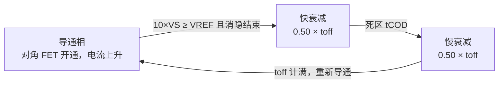

# A4950

## 1. 身份选型

Allegro **A4950** 是单通道全桥（H 桥）DMOS 电机驱动器，为 PWM 控制的有刷直流电机设计：VBB 8~40V 供电，峰值输出 ±3.5A。四只开关全部为低 RDS(on) 的 N 沟道 DMOS，高侧栅压由**内部电荷泵**产生——不需要外部自举电容，也没有电荷泵外接引脚。控制接口只有 **IN1/IN2 两线**，即可覆盖正转/反转/刹车/滑行四象限；片内集成固定关断时间电流斩波限流环（toff 典型 25μs）与同步整流，外围只需一只检流电阻和两只退耦电容。

| 订购型号 | 温度等级 | 认证 | 包装 |
|------|----------|------|------|
| A4950ELJTR-T | E：-40 ~ +85°C | 商业级 | 13 英寸卷带，3000 只/盘 |
| A4950KLJTR-T | K：-40 ~ +125°C | AEC-Q100 Grade 1 | 13 英寸卷带，3000 只/盘 |

选型定位：单片一个全桥，适合单个有刷直流电机双向调速；双极步进电机需两片（每相一片）；螺线管等感性负载亦可。**没有故障诊断输出引脚**，需要故障回报的场合要靠外部电流/转速监测，或改选更高集成度的驱动器。

## 2. 极限工况

| 参数 | 符号 | 条件 | 额定值 | 单位 |
|---|---|---|---|---|
| 负载电源电压 | VBB | — | 40 | V |
| 逻辑输入电压 | VIN | — | -0.3 ~ 6 | V |
| VREF 输入电压 | VREF | — | -0.3 ~ 6 | V |
| 检流电压（LSS 引脚） | VS | — | -0.5 ~ +0.5 | V |
| 电机输出电压 | VOUT | — | -2 ~ 42 | V |
| 输出电流 | IOUT | 占空比 100% | 3.5 | A |
| 瞬态输出电流 | iOUT | 脉宽 < 500ns | 6 | A |
| 工作环境温度 | TA | E 级 / K 级 | -40~85 / -40~125 | °C |
| 最高结温 | TJ(max) | — | 150 | °C |
| 存储温度 | Tstg | — | -55 ~ 150 | °C |
| ESD | — | 手册未给出 | — | — |

> [!warning] 输出允许 -2V / +42V，是给电感反冲留的瞬态裕量
> 不是允许长期超压。VBB 靠近 40V 使用时，母线退耦（100μF 电解 + 陶瓷）必须到位，否则刹车回馈的能量会把 VBB 顶过绝对极限。

> [!note] 3.5A 是"100% 占空比下的绝对极限"，不是可用连续电流
> 实际连续电流由结温封顶（见第 4 节估算）：2 层板约 1.3A、4 层板约 1.8A 就已逼近 150°C 结温上限。

## 3. 推荐工作条件

- **VBB**：8 ~ 40V（低于 UVLO 阈值约 7.5V 时输出保持关闭）
- **逻辑电平**：VIH ≥ 2.0V、VIL ≤ 0.8V，3.3V 与 5V MCU 均可直连；输入内置约 50kΩ 下拉，悬空默认为低
- **VREF**：0 ~ 5V，设定限流阈值 **ITripMAX = VREF / (10 × RS)**
- **PWM 频率**：手册电源电流规格在 fPWM < 30kHz 条件下给出；建议 2 ~ 30kHz。下限受待机定时器约束（低电平期 > 约 1ms 会掉进待机，见 6.5 节），上限受消隐时间制约（tBLANK 最大 4μs，周期太短会让限流环大部分时间"失明"）

## 4. 功耗热特性

| 参数 | 数值 | 条件 |
|---|---|---|
| RθJA（2 层板） | 62 °C/W | 双面各 0.8 in² 裸露 2oz 铜 |
| RθJA（4 层板） | 35 °C/W | JEDEC 标准板 |
| 热关断 TJTSD | 160°C（典型） | 温度上升方向 |
| 热关断迟滞 | 15°C | 恢复点 = 160 - 15 = 145°C |

**结温估算**（导通损耗为主）：电流同时流经一只高侧管和一只低侧管，手册直接给出总导通电阻 RDS(on)(sink+source)：25°C 典型 0.6Ω，150°C 典型 1.1Ω，可线性近似 RDS(on)(TJ) ≈ 0.6 + 0.004×(TJ-25) Ω。功耗 P ≈ I² × RDS(on)(TJ)，与 TJ = TA + RθJA × P 联立自洽求解（TA = 25°C、典型值）：

| 连续电流 | 2 层板（62°C/W） | 4 层板（35°C/W） |
|---|---|---|
| 1.0 A | TJ ≈ 74°C | TJ ≈ 49°C |
| 1.3 A | TJ ≈ 133°C | TJ ≈ 72°C |
| 1.5 A | **超 150°C** | TJ ≈ 94°C |
| 1.8 A | — | TJ ≈ 150°C（临界） |
| 2.0 A | — | **超 150°C** |

> [!warning] 上表是乐观估计
> 用的是典型 RDS(on)，且忽略了开关损耗和死区期间体二极管导通（Vf 最大 1.5V）的损耗；TA 高于 25°C 需进一步降额。热正反馈明显——RDS(on) 从 25°C 到 150°C 涨近一倍，电流略增结温即发散。连续大电流输出时 PCB 散热设计是硬约束，参见 [[电源电子/电源保护机制|电源保护机制]]。

## 5. IO/电气特性

条件：VBB = 8~40V。E 级参数在 TJ = 25°C 下给出；**K 级在 TJ = -40 ~ 150°C 全范围保证**（K 级不只是温度筛选，是全温参数保证）。

| 参数 | 符号 | 条件 | 最小 | 典型 | 最大 | 单位 |
|---|---|---|---|---|---|---|
| 总导通电阻 | RDS(on) | IOUT = 2.5A，TJ = 25°C | — | 0.6 | 0.8 | Ω |
| 总导通电阻 | RDS(on) | IOUT = 2.5A，TJ = 150°C | — | 1.1 | 1.5 | Ω |
| 电源电流 | IBB | fPWM < 30kHz | — | 10 | 20 | mA |
| 待机电流 | IBB | 低功耗待机 | — | — | 10 | μA |
| 体二极管压降 | Vf | If = 2.5A | — | — | 1.5 | V |
| 输入高电平 | VIN(1) | — | 2.0 | — | — | V |
| 输入低电平 | VIN(0) | — | — | — | 0.8 | V |
| 待机判定电平 | VIN(STANDBY) | — | — | — | 0.4 | V |
| 输入迟滞 | VHYS | — | — | 250 | 550 | mV |
| 输入下拉电阻 | RLOGIC(PD) | VIN = 0V | — | 50 | — | kΩ |
| 输入电流 | IIN(1) | VIN = 2.0V | — | 40 | 100 | μA |
| 交叉（死区）延时 | tCOD | — | 50 | — | 500 | ns |
| 消隐时间 | tBLANK | — | 2 | 3 | 4 | μs |
| 固定关断时间 | toff | — | 16 | 25 | 34 | μs |
| 待机定时器 | tst | IN1 = IN2 < 0.4V | — | 1 | 1.5 | ms |
| 上电延时 | tpu | — | — | — | 30 | μs |
| 电流增益 | AV = VREF/VS | VREF = 5V | 9.5 | — | 10.5 | V/V |
| 电流增益 | AV | VREF = 2.5V | 9.0 | — | 10.0 | V/V |
| 电流增益 | AV | VREF = 1V | 8.0 | — | 10.0 | V/V |
| UVLO 使能阈值 | VBBUVLO | VBB 上升 | 7 | 7.5 | 7.95 | V |
| UVLO 迟滞 | — | — | — | 500 | — | mV |

> [!note] 限流精度随 VREF 降低而变差
> VREF = 5V 时增益偏差约 ±5%；VREF = 1V 时是 -20%/0%（只会偏低）。低限流值时优先"提高 VREF + 加大 RS"，但代价是检流损耗——触发点 VS = VREF/10，RS 上功耗 = ITrip × VREF/10（2A、VREF=5V 时整整 1W，这就是参考 BOM 用 2512 封装 1W 电阻的原因）。

## 6. 核心功能

![[_llm/raw/assets/datasheets/a4950/a4950_p1_fig3.jpg|560]]
*功能方框图：全桥驱动 + 电流斩波控制*

### 6.1 IN1/IN2 两线四象限控制

A4950 没有独立的 PHASE/ENABLE 引脚——IN1/IN2 两线编码本身就覆盖四态（若固件沿用 PHASE/ENABLE 模型：PHASE 决定哪个 INx 为高，"禁用"用 1/1 刹车或 0/0 滑行实现）。

| IN1 | IN2 | 10×VS > VREF | OUT1 | OUT2 | 功能 |
|---|---|---|---|---|---|
| 0 | 1 | 否 | L | H | 反转 |
| 1 | 0 | 否 | H | L | 正转 |
| 0 | 1 | 是 | H/L | L | 斩波（混合衰减），反转 |
| 1 | 0 | 是 | L | H/L | 斩波（混合衰减），正转 |
| 1 | 1 | 否 | L | L | 刹车（慢衰减，两低侧管短接电机） |
| 0 | 0 | 否 | Z | Z | 滑行（高阻），约 1ms 后进入低功耗待机 |

两种外部 PWM 调速方式：
- **快衰减调速**：IN2 = 0 固定，IN1 加 PWM → 导通/滑行交替。电流纹波大、电流对占空比更线性、响应快。
- **慢衰减调速**：IN1 = 1 固定，IN2 加 PWM → 导通/刹车交替。off 期电流在低侧短路环里环流，纹波小、平均转矩大，低速更平稳。

> [!warning] 快衰减调速的待机陷阱
> off 期 IN1 = IN2 = 0，若低电平持续超过待机定时（典型 1ms），器件掉入待机、电荷泵关闭，唤醒要等最多 200μs 才能重新接受 PWM——表现为低占空比时输出抖动、丢拍。PWM 频率保持 ≥ 2kHz 可稳妥避开。

刹车本质是慢衰减：两低侧管把电机反电动势短路，制动电流 ≈ VBEMF / RL，**不经过限流环设定值封顶**（真值表中刹车行触发条件为"否"路径）。高转速 + 大惯量负载刹车时须自行核算电流不超过 3.5A 极限。

### 6.2 内部电流斩波限流环

导通相开始时，对角一对高/低侧 FET 开通，电流经电机绕组和 LSS 引脚下的检流电阻 RS 上升。片内比较器把 **VREF/10** 与 RS 上的压降 VS 比较，当 10×VS 达到 VREF 时复位 PWM 锁存器，进入衰减：

**ITripMAX = VREF / (10 × RS)** —— 例：VREF = 5V、RS = 0.25Ω → 2A。

三个关键时序量：
- **消隐时间 tBLANK（2~4μs）**：每次开关后屏蔽比较器，躲开二极管反向恢复和寄生电容充电的电流尖峰，防误触发。副作用是导通相有 ≈tBLANK 的最小宽度——低电感负载在高 VBB 下，消隐期内电流可能明显冲过设定值。
- **固定关断时间 toff（16~34μs，典型 25μs）**：**片内固定，没有 RC 引脚、不可调**（区别于需外接 RC 定时的老一代驱动）。斩波频率不是常数，由 ton + toff 决定，ton 随 VBB、反电动势和绕组 L/R 变化。
- **死区 tCOD（50~500ns）**：见 6.3。

### 6.3 混合衰减与死区防直通

触发限流后，A4950 固定采用**混合衰减**：先快衰减 0.50×toff（桥反向开通，绕组能量回馈 VBB，电流快速下降），再慢衰减剩余 0.50×toff（低侧环流，电流缓降）——兼顾快衰减的调节速度与慢衰减的小纹波。

每次快/慢衰减切换（以及所有上下管换相）时，驱动器强制关断 tCOD（50~500ns）作死区，防止同一半桥上下管直通（交叉导通保护）。死区内同步整流不工作，电流走体二极管（Vf 最大 1.5V）——时间极短，损耗占比小，但这是死区损耗的来源。

### 6.4 同步整流——为什么不需要续流二极管

PWM off 期负载电流必须续流。无同步整流时电流走 DMOS 体二极管，2.5A 下压降最大 1.5V，单管续流损耗可达约 3.75W。A4950 在检测到衰减相时**主动开通续流路径上的 DMOS**，用低 RDS(on) 沟道把体二极管短路：单管约 0.3Ω（总 0.6Ω 的一半），2.5A 时压降约 0.75V，损耗近乎减半，且**省掉 4 只外部肖特基续流二极管**。

零电流检测：电流衰减到 0 时自动关闭同步整流，防止电流反向——否则慢衰减短路环里反电动势会把电流反着拉起来，变成不受控的制动。

### 6.5 低功耗待机模式

- **进入**：IN1 与 IN2 同时低于 VIN(STANDBY)（0.4V）持续超过待机定时 tst（典型 1ms，最大 1.5ms）。关闭电荷泵和内部稳压器，VBB 电流 < 10μA。
- **退出**：任一输入拉高即唤醒；**必须等电荷泵重建（最多 200μs）后再发 PWM 指令**，另有上电延时 tpu ≤ 30μs。
- 注意待机判定电平 0.4V 低于普通逻辑低电平 0.8V：输入在 0.4~0.8V 之间是"逻辑 0 但不进待机"的区间，GPIO 漏电或分压残留电平可能导致该睡不睡。

### 6.6 保护特性

参见 [[电源电子/电源保护机制|电源保护机制]]：

- **OCP 过流保护（锁存）**：电流监测检测到输出短路（对地、对电源、负载短路）即锁存故障并关断输出。**解锁仅两条路：经历一次待机（进入再退出）或 VBB 断电重上**。固件应把"双输入拉低 ≥1.5ms 再恢复"做成故障复位例程。
- **热关断 TSD**：结温约 160°C 关断，降 15°C 自动恢复——会形成打嗝式循环，不是锁存。
- **UVLO**：VBB 上升过约 7.5V（7~7.95V）才使能输出，迟滞 500mV。
- **交叉导通保护**：换相强制死区 tCOD。

> [!warning] 无故障输出引脚
> OCP 锁存后芯片沉默关断，MCU 无法直接得知——需通过电流检测、转速反馈或看门狗超时间接判断，否则表现为"电机无声无息停转"。

### 6.7 三类负载的接法差异

- **有刷直流电机**（手册设计目标）：OUT1/OUT2 直接接电机两端；VREF 限流兼作堵转保护和软启动限流。
- **双极步进电机**：每相一片、共两片，IN1/IN2 组合按全步序列换相；限流环可稳相电流，但没有 DAC 细分基准——做微步需 MCU 用滤波后的 PWM 动态驱动 VREF，工程上更推荐专用步进驱动器。
- **螺线管/继电器**：负载仍接 OUT1/OUT2 间，单方向驱动；吸合后可降 VREF 切到保持电流省功耗；断开用 0/0 滑行（快衰减经体二极管/同步整流回馈 VBB）加快释放。

### 6.8 VBB 供电与电荷泵

电荷泵完全内置、无外接飞跨电容，从 VBB 产生高侧 N-DMOS 栅压——这也是待机要关电荷泵、唤醒要等 200μs 的原因。VBB 退耦：100μF 电解 + 0.22μF 陶瓷（X5R 及以上）尽量贴近器件。VBB 工作下限 8V 距 UVLO 上升阈值最大 7.95V 只有 0.05V 裕量，且迟滞仅 0.5V——低压电池供电时线缆压降可能引起 UVLO 附近反复启停，供电裕量要留足。

## 7. 引脚

![[_llm/raw/assets/datasheets/a4950/a4950_p2_fig6.jpg|240]]
*引脚分布*

SOICN-8（带散热焊盘）：

| 引脚 | 名称 | 功能 |
|------|------|------|
| 1 | GND | 地 |
| 2 | IN2 | 逻辑输入 2（内置约 50kΩ 下拉） |
| 3 | IN1 | 逻辑输入 1（内置约 50kΩ 下拉） |
| 4 | VREF | 限流基准模拟输入（0~5V） |
| 5 | VBB | 负载电源 8~40V |
| 6 | OUT1 | 全桥输出 1 |
| 7 | LSS | 低侧功率回流——检流电阻接点 |
| 8 | OUT2 | 全桥输出 2 |
| PAD | — | 裸露散热焊盘，焊到地平面 |

**LSS 使用要点**：检流电阻 RS 为可选件——不需要限流时 LSS 直接接地（VS 恒为 0，斩波永不触发）。使用 RS 时：其接地端独立走线回星形接地点、走线尽量短（低阻值下 PCB 走线 IR 压降会显著掺进检流值）；LSS 引脚电压极限 ±500mV，选 RS 时按最大负载电流核算不超限（过流瞬间允许短时超出）。

**PCB 布局**：星形接地点设在裸焊盘正下方的地铜皮上，裸焊盘焊接到该处；焊盘下打热过孔把热量导入内层（JESD51-5）；地平面要厚实；VBB 退耦电容就近放置。

## 8. 封装

- **LJ 封装 = SOICN-8 带裸露散热焊盘**：本体 4.90×3.90mm（含引脚跨距 6.00mm），高度最大 1.70mm，引脚间距 1.27mm；裸焊盘约 2.41×3.30mm（NOM）
- 焊盘图形参考 IPC7351 SOIC127P600X175-9AM，各焊盘间距 ≥ 0.20mm
- 无铅，100% 亚光锡引线框架镀层
- 温度等级：E：-40~+85°C；K：-40~+125°C（AEC-Q100 Grade 1）

参考 BOM（VREF = 5V、ITrip ≈ 2A）：

| 器件 | 取值 | 规格 |
|---|---|---|
| RS | 0.25 Ω | 2512 封装，1W，1% 或更优 |
| C1 | 0.22 μF | 陶瓷，X5R 及以上，≥50V |
| C2 | 100 μF | 电解，≥50V |
