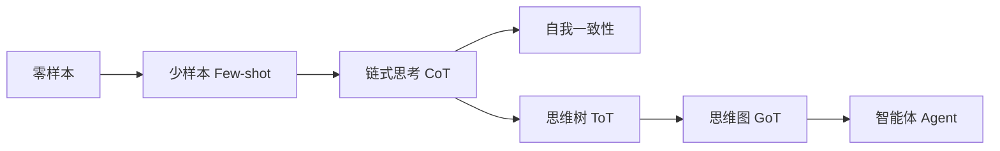

# 提示词工程完全指南 — 摘要

> 来源：[博客园 · 指尖下的世界](https://www.cnblogs.com/luzhanshi/articles/19071865) | 2025-09-03

## 核心论点

**提示词工程不是"玄学"，而是基于模型逻辑+任务场景的系统性技术。** 如果 prompt 就能达到基本要求，微调可以进一步提升；但如果 prompt 完全不起作用，微调成功的可能性极低。提示工程是一种"软微调"，更是 Agent 的构造框架。

## 关键框架

### CO-STAR 模板
在 prompt 中覆盖六个维度：**C**ontext（背景）、**O**bjective（目标）、**S**tyle（风格）、**T**one（语气）、**A**udience（受众）、**R**esponse（输出格式）。

### 生产级 Prompt 五段式
1. 角色定义 → 2. 任务指示 → 3. 上下文背景 → 4. 示例（Few-shot）→ 5. 输入输出格式

### 六大核心策略 (OpenAI)
1. 编写清晰指令 2. 提供参考文本 3. 拆分复杂任务 4. 给模型时间思考 5. 使用外部工具 6. 系统测试更改

## 进阶技术演进

- **CoT**：在示例中加入中间推理步骤，"let's think step by step"
- **ToT**：多路径探索 + 剪枝，本质是 BFS/DFS 驱动的多轮 Agent
- **GoT**：将思维建模为图，支持聚合、反馈循环——与 LangGraph 的设计理念一致
- **Agent**：提示词工程的终局——不再只是单次任务描述，而是定义角色、工具、工作流

## 结构化输出技巧

使用 XML 标签分隔不同内容区域（`<documents>`, `<citations>`, `<answer>` 等），LLM 对 XML 标签敏感。配合 Pydantic 定义输出 Schema（OpenAI `response_format` 已原生支持）。

## 安全防御

| 攻击 | 防御 |
|------|------|
| 角色诱导（奶奶漏洞） | System Prompt 屏障 |
| 提示泄漏 | 输入关键词/语义过滤 |
| 非法行为诱导 | 输出二次校验 |

## 核心金句

> "提示词工程不仅仅是技术，更是一种思维方式。它要求我们从模型的角度思考问题，理解模型的认知模式。"

> "微调改变了模型参数，但提示工程改变了模型行为。如果写 prompt 就能达到基本要求，微调可以进一步提升；如果 prompt 不起作用，微调成功的可能性就很低。"

> "Agent 可以理解为一种更复杂的提示工程——不只是提供单一任务描述，而是定义职责、操作和能力的认知模型。"

## 参见

- [提示词工程](../知识/LLM-AI/提示词工程.md) — 概念页
- [LLM Wiki方法论](../知识/LLM-AI/LLM%20Wiki方法论.md) — 本 Wiki 的方法论基础
