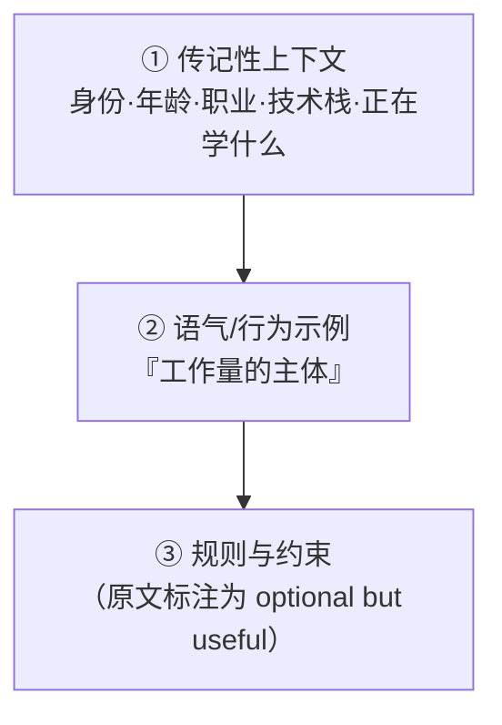

# 2026-09-23 - 拟人化对话风格调研

## 元数据

| 属性 | 值 |
|------|-----|
| 标题 | 拟人化对话风格：人格三层设计 · 声音校准十维度 · 去 AI 味边界 |
| 日期 | 2026-09-23 |
| 来源 | 两篇原文级核对（经 PC 端代理 2026 端口抓取，全文读取） |
| 内容性质 | 写作手艺层笔记（与产品架构层有别，架构见 [LLM-AI/AI 陪伴产品架构](../知识/LLM-AI/AI%20陪伴产品架构.md)） |
| 姊妹页 | [2026-09-23 - 提示词注入防御调研](2026-09-23%20-%20提示词注入防御调研.md) |

> [!note] 来源层级：**A 级（正文级核对）**
> 本页两篇来源均**全文抓取并逐条核对**（非摘要转述）。首次调研时因网络受限只有检索摘要，曾误标 B 级并产生一处错误判断，已更正（见文末「勘误」）。

## 来源清单

| # | 来源 | 性质 | 核对程度 |
|---|------|------|---------|
| 1 | **Persona-Based Prompting**（Python-AI-Notes, Section 3 / Lecture 8） | 课程讲义（`status: in-progress`） | ✅ 全文（13,980 字节） |
| 2 | **作者声音校准指南**（cat-xierluo/legal-skills, de-ai-polish） | 项目风格指南 | ✅ 全文（8,464 字节） |

> [!warning] 来源 1 的强度限制
> 来源 1 自称 `type: lecture-notes`、`status: in-progress`，**是课程笔记而非论文或工业实践报告**。其具体条数（100~150）与效果断言（"fidelity becomes startling"）**无实验数据支撑**，属经验性表述。引用时应标明此定位。

## 一、人格三层设计（来源 1，正文）

原文明确给出三层，并指出**第 2 层是工作量的主体**：



**原文给出的三层模板**（逐字）：

- **① 传记性上下文**：`You are an AI persona acting on behalf of Jayanth, a 25-year-old tech enthusiast, currently a Principal Engineer. His main tech stack is JavaScript and Python. He's actively learning Generative AI.`
- **② 语气示例**：以 `Q: / A:` 成对形式给出，`Repeat for ~100-150 examples.`
- **③ 规则**：`Stay in character at all times.` / `Be informal and concise — don't over-explain.` / `If asked about topics outside tech, deflect with humor.` / `Never break character or admit being an AI.`

**关于示例数量的原文表述（关键，勿断章取义）**：

> "With just **three examples** it's already on tone. With 100+ examples, the fidelity becomes startling."
> "Three examples isn't really enough — for serious results, feed in **100 to 150 examples**."

即：**3 条即可"沾调"，100~150 条用于高保真**——这是一个**连续谱**，不是"少于 100 就无效"。

**示例应覆盖的质量维度**（原文 8 项）：特色措辞 / 句式结构 / 词汇层级 / emoji 与标点习惯 / 话题相关反应 / 拒绝模式 / 幽默风格 / 口头禅。

**应覆盖的对话面**（原文）：随意交谈 / 求助 / 给建议 / 表达异议 / 开玩笑 / 接受赞美 / 被指出错误。原文强调「对话面越宽，人格越稳」。

**示例取材来源**（原文）：WhatsApp/Telegram 聊天、LinkedIn 评论、Twitter/X 帖文、YouTube 评论、Slack 私信、邮件、博客、演讲转录。

**⚠️ 原文含明确的伦理警示**（前次调研遗漏）：克隆**他人**声音在伦理与部分司法辖区法律上均有问题。原文允许的范围仅限：**自己** / 有公开作品的公众人物 / **明确同意**的朋友。**不得使用他人私密对话。**

## 二、声音校准十维度（来源 2，正文）

来源 2 的核心主张：**去 AI 化 ≠ 给文本加人设。**

> "去 AI 化不等于给文本加'人设'。第一人称、口语、比喻、短句和不确定词都可能是新模板。"

### 2.1 判断"有人味"的三件事（原文）

1. **判断来源**：作者为什么会说这句话——依据是经历、观察、材料还是推断？
2. **选择痕迹**：作者改变过什么做法、拒绝了什么解释、仍在犹疑什么？
3. **段落动力**：下一段由上一段留下的问题推动，还是由"接下来谈三个方面"之类的框架提示推动？

### 2.2 十维度（7 表层 + 3 深层）

原文指出「七个表层维度只够描述『怎么写』，不能解释『为什么像这个人』」，故增加三个深层维度：

| 维度 | 观察内容 | 原文禁止的机械化处理 |
|---|---|---|
| 句长分布 | 长/中/短句的实际比例及出现位置 | 规定"每两句插一个短句" |
| 词选层级 | 口语、正式语、行业术语的边界 | 用口语词替换所有正式表达 |
| 段落开头 | 由事实/场景/判断/问题/承接词起段 | 统一改成"很多人""真正的问题" |
| 标点习惯 | 分号、破折号、括号、引号的实际功能 | 为制造节奏强加破折号 |
| 过渡方式 | 复用前文对象、因果推进、时间推进或显式路标 | 全部删除连接词后硬切段 |
| 观点密度 | 每段承担几个新判断 | 每段强行只留一个口号式判断 |
| 语气倾向 | 第一人称、直接称呼、反问和判断强度 | 为"有人味"凭空增加"我"或"你" |
| **认识来源** | 观点来自亲历/观察/材料/推理/转述 | 把通用知识伪装成个人发现 |
| **不确定性形态** | 作者对什么不确定，为何仍未下结论 | 机械添加"可能、或许、某种程度" |
| **段落动力** | 段落怎样从前一段的问题或对象长出来 | 用标题提示和短句金句推动全文 |

**稳定特征 vs 偶发表达**：只记录样本中**反复出现**的稳定特征；偶发表述写入「反例」，**不得当成目标风格复现**。

### 2.3 作者证据卡（原文格式）

```
判断：作者真正要说什么？
来源：亲历 / 观察 / 材料 / 推断 / 转述 / 未提供
触发：什么事实或变化让作者形成这个判断？
边界：作者仍不确定什么，或该判断只适用于哪里？
代价：如果判断错了，谁会受到什么影响？
```

**处理规则**（原文）：来源为"未提供"时只能保留为一般分析或提示补料，**不得改成"我后来发现""我们曾经遇到"**；事实、观察、推断必须分开写。

### 2.4 三种 voice 模式（原文）

| 模式 | 触发条件 | 行为约束 |
|------|---------|---------|
| `cleanup_only` | 未提供作者样本 | 只做删除/合并/澄清/必要句式重构；**不主动增加**第一人称、反问、生活化比喻或金句；不按固定比例"注入个人化" |
| `provided_sample` | 用户提供并确认样本 | 先提 profile 再改写；**只学稳定特征，不复制样本原句、独有比喻或事实** |
| `local_anchor` | 明确要求用本机个人声音 | 须记录 `voice_anchor_id`；该目录由 `.gitignore` 排除 |

### 2.5 底线（原文）

> "没有作者材料时，**不得编造经历、感受、客户、案件、讨论过程或立场变化**。平实而准确的文本优于虚构的'真情实感'。"

## ⚠️ 勘误（本次修正）

**首次调研（仅检索摘要）时，本页曾记录「100~150 条示例」与既有页面 [LLM-AI/AI 陪伴产品架构](../知识/LLM-AI/AI%20陪伴产品架构.md) 中 RoleLLM 结论「描述 + 口头禅即可泛化未见角色」之间存在张力。**

**该判断错误，现已撤回。** 读到原文后可见：来源 1 本身即写明"**three examples 就已经 on tone**"，与 RoleLLM 的"2-3 组示例对话 > 纯指令"**完全一致**，二者是同一连续谱的不同区段（沾调 vs 高保真），不存在矛盾。

教训：**只凭检索摘要做跨来源比对，会凭空造出并不存在的矛盾。**

## ⚠️ 未读到/存疑

| 项 | 状态 |
|----|------|
| LiveKit / ElevenLabs / Retell / AvatarChatbot 等来源 | ❌ 本次未抓取，前次检索摘要中关于「工程化语流不畅」「情绪标签当约束」「禁止星号动作」等表述**未获原文级核对** |
| 「看前 5 个词认不出是 AI」等图灵验收三条 | ❌ 未回原文，**来源不明**，本轮已从知识页移出 |
| 来源 1 的条数与效果断言 | ⚠️ 讲义性质，无实验数据 |
