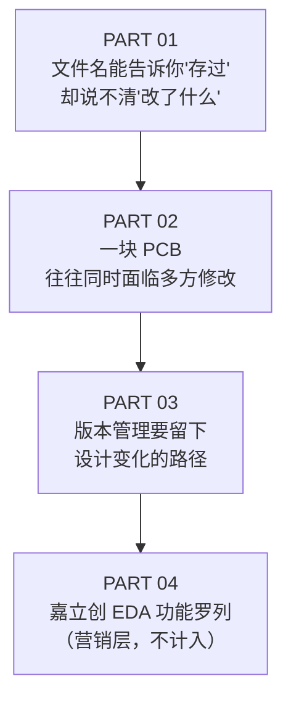

# 2026-09-24 - 硬件设计数据版本管理（吴川斌的博客）

## 元数据

| 属性 | 值 |
|------|-----|
| 标题 | （原文无标题，围绕"最终版"文件名现象谈设计数据版本管理） |
| 发布渠道 | 微信公众号「吴川斌的博客」 |
| URL | https://mp.weixin.qq.com/s/252-20VSgJobTfJM9xbaZw |
| 发布日期 | ⚠️ 存疑：文章页未提供可提取的发布日期，按入库日 2026-09-24 记 |
| 原始文本 | `_llm/raw/2026-09-24-硬件设计数据版本管理-微信文章.md`（8,151 字节） |
| 内容性质 | **厂商内容** —— 嘉立创 EDA 的产品宣传稿，嵌套在行业观察文体中 |
| 数据密度 | 无参数、无表格、无量化数据；纯概念论述 |

> [!warning] 来源性质提示：厂商内容，需剥离营销层
> 全文四个 PART 中，PART 01–03 是厂商中立的行业问题论述，PART 04 是嘉立创 EDA 的功能罗列。**本文档只提取 PART 01–03 的概念框架，PART 04 的产品功能介绍不计入知识页**（违反「知识页是纯领域知识」原则）。

## 论述结构

## 核心论点（A 级 — 原文逐段核对）

### 1. 文件名/目录结构的表达能力上限

- 文件名解决的是「它叫什么」，**不是**「它为什么要这样命名」
- 一个副本只能证明某个时刻**保存过**，不能直接说明改动发生在**网络、器件、封装，还是布局**
- 真要找差异，工程师往往得同时打开两个工程，凭记忆逐项核对
- 修改说明散落多处：评审意见另起文档、群消息聊天记录、发给采购/生产的又是另一份附件 → 「文件没有丢，设计过程却已'断链'」

> 原文：「命名规范仍然值得坚持，但它更适合承担**识别**作用；设计差异、版本分支、节点和回溯，需要由系统化的版本管理来完成。」

### 2. 多方并行修改的汇聚问题

临近打样时断点被迅速放大：硬件工程师按评审意见改原理图、PCB 工程师在另一份工程里调布局、采购反馈某器件需替换。几条线各自推进后，要确认的不再是「哪一个文件最新」，而是：

- 这些改动**有没有真正汇合**
- 生产输出是不是来自**同一个设计状态**

原文列出的反复问答：手里的工程是不是最新？评审对应哪一版？同事的修改合进来了吗？发给下游的资料和当前设计一致吗？

### 3. 差异的粒度：设计对象，而非文件字节

> 原文：「工程师真正想看的不是两个压缩包大小相差多少，而是**网表、器件、布局**发生了什么变化。差异能直接落到设计对象，评审才容易判断修改是否符合预期。」

### 4. 版本节点 ≠ 每次保存

- 一次内部评审、一次样板输出、一次量产资料发布，**重要程度各不相同**
- 团队需约定三件事：
  1. 何时创建正式节点
  2. 谁可以确认节点
  3. 下游以哪个节点为准
- 原文：「工具负责记录和呈现，**工程规则决定这些记录如何被使用**。」

### 5. 分支：处理尚未确定的设计路线

- 场景：一个方案保留原器件继续优化，另一个方案验证替代料
- 两边都需要修改和评审，**却不应互相覆盖**
- 等验证结果明确后，团队再决定后续基于哪条路线推进
- 相比复制两个文件夹，分支关系能更清楚地保留：**方案从哪里分开、各自经历了哪些修改**

### 6. 备份 / 版本 / 日志是三个不同的问题

| 概念 | 保留什么 | 回答的问题 |
|------|---------|-----------|
| 备份 | 可恢复的**数据状态** | 数据丢了能不能救回来 |
| 版本 | 组织**研发节点** | 以哪一版为准 |
| 日志 | 记录**操作过程** | 谁在什么时候做了什么 |

原文：「把三者都理解成'多存几份文件'，仍然无法还原一段完整的设计变化。」

## 未提取内容（营销层，明确排除）

PART 04 提到嘉立创 EDA 的产品能力，**不纳入知识页**：多版本创建与独立编辑、树状分支管理、图形化差异对比、原理图图元差异高亮、变更追踪与回溯、自动保存/手动版本备份、历史版本与回收站恢复、企业管理操作日志/团队项目编辑日志/库编辑日志/账号使用日志、私有化部署。

> [!note] 排除理由
> 这些是单一厂商的功能清单，跨工具不可迁移，且会腐蚀知识页的领域中立性。它们对应的**领域概念**（分支、差异对比、节点、日志）已在上面六条中抽象提取，无需保留产品名。

## 提取完整性

| 类别 | 请求项 | 已提取 | 存疑 | 未找到 | 排除 |
|------|--------|--------|------|--------|------|
| 概念论点 | 6 | 6 | 0 | 0 | 0 |
| 厂商功能 | 10 | 0 | 0 | 0 | 10 |
| 量化参数 | — | 0 | 0 | 0 | — （原文本就无参数） |
| 发布日期 | 1 | 0 | 1 | 0 | 0 |

## 相关页面

- [知识/硬件设计/设计数据版本管理](../知识/硬件设计/设计数据版本管理.md) — 本来源的概念框架落点
- [2026-09-24 - Allegro OrCAD 设计数据版本管理调研](2026-09-24%20-%20Allegro%20OrCAD%20设计数据版本管理调研.md) — 姊妹来源，补足工具链实现层
