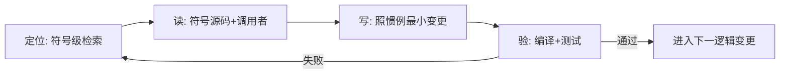

# AI 编码工作流(边查边写)

> 一句话: AI 写代码应复刻人类工程师工作流——**边查边写**: 局部上下文、按需深挖、快速反馈、约定记忆、小步渐进。文献依据见来源页(Lost in the Middle / 符号级精查 / 地图先行)。

## 为什么人类工程师这样写(五要素)

| 要素 | 人类行为 | 带来的质量属性 |
|---|---|---|
| 局部化上下文 | 只把当前改动相关的符号/文件拉进工作记忆,不预读整个仓库 | 注意力集中于相关处,免噪声 |
| 按需深挖 | 写某处才读某处;读到的东西经编译/测试验证才成为"确信" | 知识置信度与证据绑定 |
| 快速反馈环 | 编译错误/单测几分钟一轮,早暴露早修 | 错误半衰期短,不堆积 |
| 约定记忆 | 团队规范、命名、模式写第一处查一次,之后复用 | 风格与系统一致性 |
| 渐进而非重写 | 小步修改+小步验证,不做一次性大重构 | 变更面小,回归面小 |

## 映射为 AI 五规则(可执行)

1. **开工先建地图(一次成本)**: 包拓扑/关键符号/既有约定 → 沉淀为文档(如代码事实附录);未建地图不开写。
2. **定位再读**: 按符号点查(知识图谱/符号索引)→ 读该符号源码 + 其调用者;禁止整文件扫读、禁止全库通读。
3. **写一步验一步**: 每次变更立即编译+测试(+同类仿真回归);失败 → 回查定位 → 修,循环。
4. **惯例先行**: 写新代码前,先找"同类既有写法"照做(命名/错误处理/结构/注释风格)——一致性优先于新颖。
5. **最小变更**: 一次一个逻辑变更,不夹带重构;重构另起一轮。

## 每轮循环的质量检查点

- [ ] 编译 + 测试全绿(含既有回归)
- [ ] 与既有模式一致(命名/结构/错误处理)
- [ ] 无重复实现——先搜现有函数再写新代码
- [ ] 变更面最小(无夹带重构)

## 与 RAG 的关系

同源不同域: [LLM-AI/检索增强生成](检索增强生成.md) 是"检索文档抑制幻觉";本工作流是**检索增强编码**——检索对象是符号级代码上下文,注入的是"当前变更相关的源码与调用链",而非文档段落。二者共享同一原则:**检索质量 > 上下文总量**。

## 质量提升手段图谱(七类,详见 —)

| 手段 | 采用 | 要点 |
|---|---|---|
| 流程工程(AlphaCodium) | ⚠️ 轻量版 | 设计→测试→实现→验证→评审 五步,流程>提示 |
| 执行反馈(CodeSim/MapCoder) | ✅ 必做 | build+test 每步跑,确定性信号为主 |
| 自我反思(Self-Refine/Reflexion) | ✅ 自评轮 | 写后以评审视角过检查点;Reflexion: 修过的错沉淀为文档 |
| 测试先行(Codex/HumanEval) | ✅ | 测试定义"完成",行为可断言模块先写测试 |
| 质量维度(COFFE) | ⚠️ | 正确性外关注效率/可维护性(惯例先行) |
| AI 评审(SWE-PRBench) | ⚠️ 辅助 | 检出率仅 15-31%——主力=测试+人,AI 自查是补充 |
| 多 agent(MapCoder/CodeSim) | ❌ | 零 agent 纪律(用户定规),收益依赖首生成质量 |

## 反模式(违反即质量下降)

| 反模式 | 后果 | 依据 |
|---|---|---|
| 全库通读再写 | 中间位信息丢失,读过≠用过 | Lost in the Middle |
| 不查直接写 | 跨文件接口/行为系统性盲区 | CoCoMIC · ASE 2025 |
| 一次大重构 | 反馈环断裂,回归面爆炸 | 人类渐进原则 |
| 写完不验证 | 幻觉代码/接口漂移静默入库 | Ghost Context |

## 适用范围

本地仓库级开发(Go/Flutter 桌面项目等)的标准流程;不适用场景: 一次性脚本(直接写+验证即可)、纯文档任务(先查后写)。
