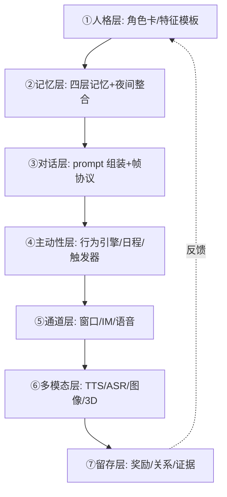

# AI 陪伴产品架构(装人全链路)

> 把"AI 装人"拆成七层,每层给出已验证的开源实现与机制要点;用于设计陪伴型 AI 产品的全链路参照。生态断言基于 2026-09-05 调研(见 sources,全部源码/论文级核实)。

## 全链路分层

## 各层要点(开源验证)

**① 人格层**:行业标准 = **Character Card V2**(PNG 内嵌 JSON:description/personality/scenario/first_mes/mes_example/system_prompt/tags/extensions)。人格注入最佳实践:多块化(各字段独立 system 块,可调位置/深度/预算)+ **风格锚点(口头禅/句长/语气词)是性价比最高杠杆**(RoleLLM:描述+口头禅即可泛化未见角色)+ **注入 2-3 组示例对话 > 纯指令**。卡可互换=换角色=换卡(MyGirlGPT/voxta 均验证)。

**② 记忆层**:见 [LLM-AI/Agent 记忆分层](Agent%20记忆分层.md)。

**③ 对话层**:结构化输出帧(MyGirlGPT `{content, imageBase64}` / 隐藏标签 `<tableEdit>` 协议降低多模态+自维护成本);强制块超预算要显式处理;纠错时序有证据(提示式纠错+紧跟回应)。

**④ 主动性层**(核心:"它有生活"):三档现成实现——
- 轻:触发器(time/noInput/cycle × prompt/random/topic,super-agent-party BehaviorEngine)
- 中:任务中心(OpenDAN triage;通用秘书,无人格)
- 完全体:人格化日程+协商+独立情绪
  - ⚠️ **2026-09-23 修正**:原记"尚无开源先例"**已不成立**。**N.E.K.O**(2,964★、Steam 上架、2026-09-22 仍推送)已具备现实时间感知+主动发起+五维记忆(含反思记忆/人格记忆),并自我定位为"数字生命";**AIRI**(49,350★)已具备实时语音+游戏陪伴+VRM/Live2D+RAG 记忆并以发行版分发。
  - ⚠️ 精确边界:两者是否**完整覆盖**"日程 **+ 协商** + 独立情绪"三要素**未逐一验证**——尤其"**协商**"在两项目 README 中**均未出现**。正确表述应为"该组合的多数要素已有高成熟度开源实现,完整三要素组合仍未见明确先例"。
- 附加:好感度隐藏标签(`<user=名 love=12>` 数值关系态)、日记独处时刻("它独处时写日记+想念你")、回归仪式。

**⑤ 通道层**:IM bot 是生态主流(MyGirlGPT Telegram / SAP 官方 botpy QQ);**消息落库在通道之前,配额裁决在通道之上**;TavernCard 生态互通。

**⑥ 多模态层**:每模态一服务(voxta 插件式);模型按模态分离(SAP:chat/视觉/ASR/TTS 各接引擎);轻量 TTS(Kokoro-82M CPU 可跑);3D=重资产(VMC/VRM),按需。

**⑦ 留存层**:奖励(共同连胜=+22% 社交连胜的 1:1 版)、宽恕(earn-back>保险)、难度双模型(Birdbrain 能力×难度 + 词级半衰期)、关系证据(记忆面板/纪念日)——惩罚向与排行榜明确不做(证据见竞品来源页)。

## 生态格局(2026-09:开源与商业)

| 位置 | 玩家 | 状态 |
|---|---|---|
| 装人前端 | SillyTavern(33k★ 事实标准) | 成熟(Chat Completion 限定,记忆靠插件) |
| 记忆 | Letta(24.6k★)/mem0(64.7k★)/Zep-Graphiti | 成熟且产品化 |
| 人格模型 | CharacterGLM(66B 一流/6B 开源一般)/BC-NPC-Turbo | 专用模型可做,但通用模型+注入已一流 |
| 端到端陪伴 | MyGirlGPT/OpenDAN/super-agent-party | 玩具→可用,均无学习闭环 |
| **端到端陪伴(新增)** | **AIRI 49,350★ / N.E.K.O 2,964★** | **产品级放量**(2026-09 实测:GitHub API + README 原文) |
| 个人实验(勿当先例) | kiri 2★ / heart-girlfriend 1★ / girlfriend-skill 5★ / virtual-being 0★ | ⚠️ 检索摘要会与上者混列,须回源核实 |
| 商业口语陪练 | Talkpal/Speak($10 亿估值)/Praktika | 巨头进入,全是"老师"不是"朋友" |
| **学习性装人** | **空缺** | **无人在做** |

## 关键认知(调研所得)

1. **通用模型 + 结构化注入可达一流一致性**(GPT-4 一致性 4.33/OOC 3.5%),专用模型优势来自规模×数据而非微调本身(CharacterGLM-6B 3.73 < GPT-3.5 3.83)。
2. **一致性已可解,知识摄取才是短板**(CharacterEval KE 全线 <2.0)——记忆注入层的价值所在。
3. **主动性/低重复是通用模型弱项**(GPT-4 重复 17.3%)——需要对话策略(话题轮换/系统骰子)兜底。
4. **"无意图关系"是产品级差异化**:所有竞品都是学习意图产品;用户好评"像朋友不打断"恰证明此类产品想做而做不到。
5. 最大风险:角色知识记忆(KE)+ 检索质量上限 + AI 自我评审天花板(检出 15-31%)。

## 适用场景

陪伴型 AI(语言学习陪伴/虚拟朋友/角色扮演伴侣)的架构设计对照表;每层实现可分别参照上述开源,不必自研。
