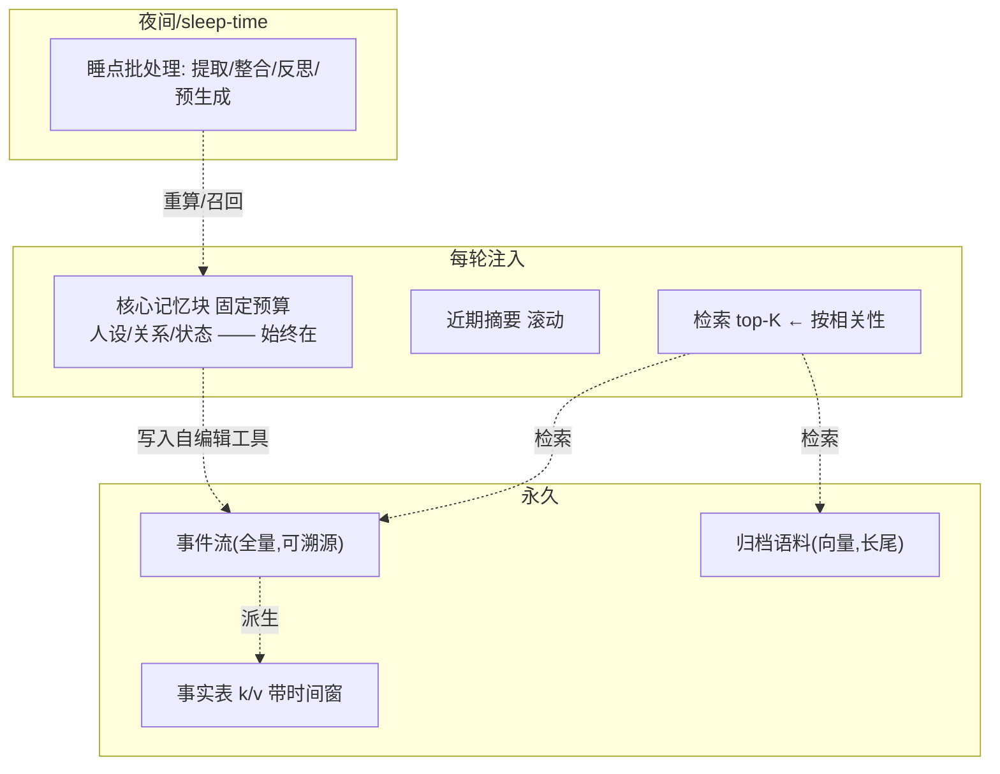

# Agent 记忆分层(长期记忆设计)

> 给 LLM agent 设计长期记忆的机制级指南。三元证据:MemGPT(论文,OS 分页类比)、Sleep-time compute(论文,夜间整合)、记忆综述(三操作框架)。项目参照 Letta/mem0/Zep(源码级)。

## 分层模型

- **核心记忆块**(始终注入):label + description(元指令:何时用/怎么写)+ value;双限制(块数+大小);只读/读写区分。
- **事件流**(全量永久):每条记忆带来源锚点(src id)→ 审计与回滚免费;"**全历史可分页回溯 > 有损摘要**"(MemGPT 数据:GPT-4 32%→92.5%——摘要是注入层,不是存储层)。
- **事实表**(带时间窗):被推翻=逻辑失效(`invalid_at`)而非删除——人"知道你对 X 的看法变了"。
- **归档语料**(向量长尾):检索注入;⚠️ 收益受检索质量制约(检索器上限封顶)。

## 三操作流水线(综述框架 + 同行实现)

| 操作 | 做法 | 最佳实践(已核实) |
|---|---|---|
| **Writing 提取** | 单趟 ADD-only(一次 LLM 调用,纯新增) | 注入"今天日期/禁止推测/只存可验证事实"(mem0);原文永远入库;低置信入**待确认缓冲**下次求证 |
| **Management 巩固/遗忘** | 睡点批处理 + 生命周期 | **遗忘在主流系统中普遍缺席——必须显式设计**(衰减/合并/回滚/用户可删);增量更新 > 全量重建;睡点写日期必须具体 |
| **Reading 检索** | top-K + 分页防击穿 | 语义+BM25+实体 boost 融合(中文事实检索更稳);上下文压力阈值显式化(如 70% 告警/100% 驱逐);示例:关键词触发+常驻块+近期摘要组合管理预算 |

## 夜间整合(Sleep-time compute,论文验证)

- 思想:上下文持久存在 → 提前离线加工成**更富信息的表示 c′**;与 test-time scaling 正交(10× token 差价 → 离线便宜)。
- **实测**:同精度 test-time 计算省 ~5×;多查询摊销降 2.5×;**收益与查询可预测性正相关**(陪伴对话=高可预测=收益区);高预算强模型下收益下降(**开关化**)。
- 适用同理:对话摘要/记忆整合/话题预生成/反思——"睡前想好明天聊什么"即其拟人化形式。

## 与认知分类的映射(综述批判)

综述不采用短期/长期/情景/语义/程序分类,给操作性框架:**来源(同 trial/跨 trial/外部)× 形态(文本形/参数形)× 操作(写/管/读)**。参数形(微调/知识编辑)为未来方向:长期陪伴的偏好可知识编辑式低损更新。

## 风险清单(论文级)

1. 检索质量决定记忆系统上限(MemGPT 文档 QA)
2. 查询可预测性决定夜间整合收益(Sleep-time 5.4)
3. 遗忘机制必须显式化(综述 Table 3:主流缺席)
4. 底层模型函数调用能力是自编辑瓶颈(弱模型指令跟随差)

## 适用场景

对话型 agent(陪伴/助手)的长期记忆设计;落地检查单:核心块有 description?事件全量可回溯?事实带时间窗?提取单趟+缓冲?遗忘显式?注入限长防击穿?夜间整合有开关?
