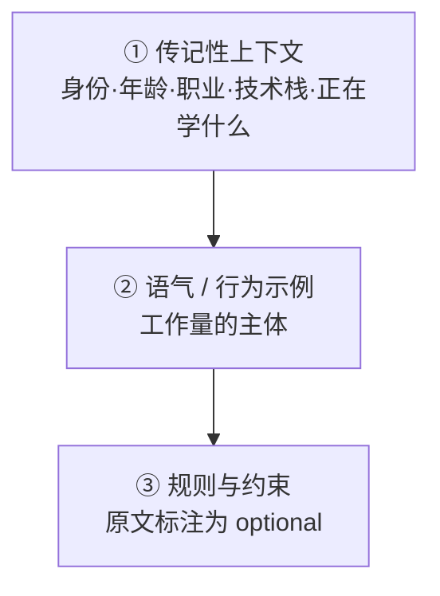
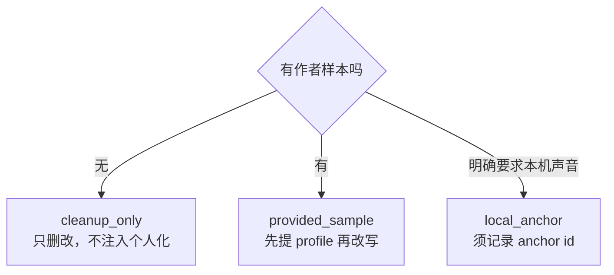

# 拟人化对话风格

> 本条目核心内容已回原文核对（A 级）；未核对条目在文末单列。
> ⚠️ 已核对的来源之一是课程讲义（`status: in-progress`），其条数与效果断言属经验性表述，**无实验数据支撑**。

## 定位

本页讲**写作手艺层**：怎么让对话读起来不像 AI 生成的。

与 [LLM-AI/AI 陪伴产品架构](AI%20陪伴产品架构.md) 的区别：那页讲产品**架构**（七层链路、开源实现）；本页讲**同一层内部的表达手艺**。人格注入机制（Character Card、多块化、风格锚点）见架构页。

## 一、人格三层设计

**第二层是工作量的主体**——这是与「写一段人格描述」最本质的区别。



- **① 传记性上下文**：`You are an AI persona acting on behalf of <名字>, a 25-year-old tech enthusiast...` —— 设定身份与处境
- **② 语气示例**：以 `Q: / A:` 成对给出，**show, don't describe**
- **③ 规则**：`Stay in character at all times.` / `Be informal and concise` / 离题话题用幽默化解 / `Never break character or admit being an AI.`

### 关于示例数量（连续谱，勿断章取义）

> **"With just three examples it's already on tone. With 100+ examples, the fidelity becomes startling."**

即：**3 条即可「沾调」，100~150 条用于高保真**。这是一个连续谱，**不是「少于 100 条就无效」**。

这与 [LLM-AI/AI 陪伴产品架构](AI%20陪伴产品架构.md) 记录的 RoleLLM 结论（「注入 2-3 组示例对话 > 纯指令」「描述 + 口头禅即可泛化未见角色」）**完全一致**——同一条连续谱的不同区段。

### 示例应覆盖的维度

**质量维度**：特色措辞 / 句式结构 / 词汇层级 / emoji 与标点习惯 / 话题相关反应 / 拒绝模式 / 幽默风格 / 口头禅。

**对话面**（越宽人格越稳）：随意交谈 / 求助 / 给建议 / 表达异议 / 开玩笑 / 接受赞美 / 被指出错误。原文强调「**对话面越宽，人格越稳**」。

**取材来源**：聊天记录、社交平台评论、私信、邮件、博客、演讲转录。

> [!warning] 伦理边界
> 克隆**他人**声音在伦理与部分司法辖区法律上均有问题。允许范围仅限：**自己** / 有公开作品的公众人物 / **明确同意**的朋友。**不得使用他人私密对话。**

## 二、去 AI 化 ≠ 加人设

这是本主题最反直觉、也最重要的一条：

> **「去 AI 化不等于给文本加『人设』。第一人称、口语、比喻、短句和不确定词都可能是新模板。」**

也就是说：**去 AI 味本身会固化成新模板**。这不是换一套腔调，是**去掉腔调**。

### 判断「有人味」的三件事

1. **判断来源**——作者为什么会说这句话？依据是经历、观察、材料还是推断？
2. **选择痕迹**——作者改变过什么做法、拒绝了什么解释、仍在犹疑什么？
3. **段落动力**——下一段由上一段留下的问题推动，还是由「接下来谈三个方面」之类的框架提示推动？

## 三、声音校准十维度

前七个表层维度只够描述**怎么写**，不能解释**为什么像这个人**——故增加三个深层维度：

| 维度 | 观察内容 | 要避免的机械化 |
|---|---|---|
| 句长分布 | 长/中/短句的实际比例与位置 | 规定「每两句插一个短句」 |
| 词选层级 | 口语 / 正式语 / 术语的边界 | 用口语词替换所有正式表达 |
| 段落开头 | 由事实/场景/判断/问题/承接词起段 | 统一改成「很多人」「真正的问题」 |
| 标点习惯 | 分号、破折号、括号的实际功能 | 为制造节奏强加破折号 |
| 过渡方式 | 复用前文对象、因果/时间推进、显式路标 | 全删连接词后硬切段 |
| 观点密度 | 每段承担几个新判断 | 每段强行只留一个口号式判断 |
| 语气倾向 | 第一人称、直接称呼、反问、判断强度 | 为「有人味」凭空增加「我/你」 |
| **认识来源** | 亲历 / 观察 / 材料 / 推理 / 转述 | 把通用知识伪装成个人发现 |
| **不确定性形态** | 对什么不确定、为何仍未下结论 | 机械添加「可能、或许」 |
| **段落动力** | 段落如何从前一段的问题长出来 | 用标题提示与金句推动全文 |

**只记录反复出现的稳定特征**；偶发表述写入「反例」，不得当作目标风格复现。

## 四、作者证据卡

需要呈现「经验感」时，先为关键判断建立最小证据：

```
判断：作者真正要说什么？
来源：亲历 / 观察 / 材料 / 推断 / 转述 / 未提供
触发：什么事实或变化让作者形成这个判断？
边界：作者仍不确定什么，或该判断只适用于哪里？
代价：如果判断错了，谁会受到什么影响？
```

**关键约束**：来源为「未提供」时，**不得改写成「我后来发现」「我们曾经遇到」**；事实、观察、推断必须分开写；不要用第一人称把推断伪装成事实。

## 五、三种 voice 模式



| 模式 | 行为约束 |
|------|---------|
| `cleanup_only` | 只做删除/合并/澄清/必要句式重构；**不主动增加**第一人称、反问、生活化比喻或金句；不按固定比例「注入个人化」 |
| `provided_sample` | 先提 profile 再改写；**只学稳定特征，不复制样本原句、独有比喻或事实** |
| `local_anchor` | 须记录 `voice_anchor_id`；该目录应由 `.gitignore` 排除 |

## 底线

> **没有作者材料时，不得编造经历、感受、客户、案件、讨论过程或立场变化。平实而准确的文本优于虚构的「真情实感」。**

## ⚠️ 未核对项（勿引用）

以下表述来自首次调研的检索摘要层，**未回原文**，本库不作为结论：

- 「工程化语流不畅」（um / uh / 停顿编排）
- 「情绪标签当约束用」「一轮保持一个基线情绪」
- 「同一条规则换角度重复 2~3 遍」
- 「写可听见的行为，不写形容词」
- 图灵验收三条（「看前 5 个词认不出是 AI」等）—— **来源不明**

## 参见

- [2026-09-23 - 拟人化对话风格调研](../../来源/2026-09-23%20-%20拟人化对话风格调研.md) — 来源页（含勘误记录）
- [LLM-AI/AI 陪伴产品架构](AI%20陪伴产品架构.md) — 产品**架构**层（七层链路、人格注入机制、开源实现）
- [LLM-AI/提示词工程](提示词工程.md) — 提示词的结构化写法
- [LLM-AI/Agent 记忆分层](Agent%20记忆分层.md) — 人格一致性的记忆侧支撑
