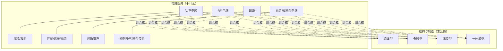
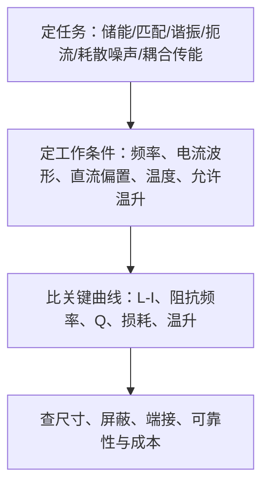

# 电感分类与选型

黑色方块、两端电极、里面有线圈 —— 功率电感、RF 电感、磁珠和扼流圈可能长得几乎一样，但设计目标完全不同。本篇建立电感器件的分类框架与选型流程。

## 两个正交维度：任务 × 结构

电感分类混乱的根源是把两个维度揉在了一起：

- **电路任务维度**：功率、RF、滤波 —— 器件在电路中干什么
- **结构与制造维度**：绕线、叠层、薄膜 —— 器件怎么做出来

同一颗器件可以同时属于两个分类，例如"绕线型功率电感"或"叠层型 RF 电感"。选型时先确定任务，再讨论材料和结构。

## 按电路任务分

### 功率电感

功率电感常见于 DC-DC 变换器（见 [电源电子/DC-DC降压转换器](../电源电子/DC-DC降压转换器.md)）。它在开关周期内储存和释放磁场能量，帮助电流连续变化。理想电感储能：

$$W = \frac{1}{2}LI^2$$

这条式子解释了为什么功率电感**不能只看标称电感量**：

- 电流升高后磁芯可能逐渐接近饱和 → 电感量下降
- 绕组 DCR 和交流电阻带来温升

选型时必须对照 L-I 直流偏置曲线，在最大工作电流下确认实际电感量。

### RF 电感

RF 电感服务于匹配、谐振和高频扼流。理想感抗：

$$X_L = 2\pi fL$$

频率越高，理想感抗越大。但真实器件存在寄生电容和损耗，接近自谐振频率（SRF）后就不能继续套用"频率越高越像电感"的直觉。因此 RF 设计通常还要看 Q、SRF 和阻抗曲线。

### 磁珠、扼流圈与耦合电感

| 器件 | 任务 | 关键区别 |
|------|------|---------|
| 铁氧体磁珠 | 把目标频段内的一部分高频噪声**耗散成热** | 不为高效储能 |
| 差模扼流圈 | 抑制回路中的差模噪声 | — |
| 共模扼流圈 | 利用双绕组的磁通关系抑制共模噪声 | 双绕组磁通抵消 |
| 耦合电感 | 能量传递与纹波管理 | 多个绕组共享磁通 |

磁珠与 EMI 的关系见 [电源电子/展频谱与EMI抑制](../电源电子/展频谱与EMI抑制.md) 和 [电源电子/电磁屏蔽原理与工程设计](../电源电子/电磁屏蔽原理与工程设计.md)。

## 磁芯材料：偏置与损耗的底色

### 铁氧体

- 氧化物陶瓷磁性材料，电阻率较高 → 涡流更容易控制
- 许多牌号磁导率较高 → 有限尺寸内取得较高电感量
- 接近饱和后，部分铁氧体磁芯的电感量可能**下降较快**

### 金属磁粉磁芯

- 金属磁性颗粒 + 颗粒间绝缘层组成
- 颗粒之间的大量非磁性间隔形成**分布式气隙**
- 金属材料通常具有较高饱和磁通密度
- 直流偏置曲线常比集中气隙或无气隙铁氧体结构**更平缓** → 大直流偏置下电感量更稳定

### 气隙的作用

磁路的简化电感关系：

$$L \approx \frac{N^2}{\Re}$$

其中 $N$ 是线圈圈数，$\Re$ 是磁阻。气隙会提高磁阻、降低初始电感，却能：

1. 提高器件在磁芯饱和约束下的储能能力
2. 改善直流偏置下的可用范围

> [!note] 近似边界
> 这是磁路近似，真实器件还要考虑漏磁、非线性和局部磁场。

## 结构与制造路线

| 结构 | 工艺 | 优势 | 代价 |
|------|------|------|------|
| 绕线型 | 铜线绕在磁芯或骨架上 | 导体截面选择范围大，覆盖较宽的电流和电感量范围 | 绕组排布、端接、寄生电容、机械一致性需控制 |
| 叠层型 | 导体图形印在多层铁氧体/陶瓷生片上，层间互连形成线圈 | 小型、低矮、适合批量制造 | DCR、寄生参数、一致性受内导体截面/层间距/烧结工艺影响 |
| 薄膜型 | 光刻、电镀、绝缘层形成精细导体图形 | 线宽与层间结构易做精细，适合高频、小型、低高度 | "薄膜"并不自动等于低损耗——导体厚度、磁性层、频率和散热条件仍重要 |
| 一体成型 | 绕线线圈 + 金属磁粉复合材料整体包覆 | 封装与磁路构造紧凑 | 描述的是封装方式，内部往往仍是绕线线圈，与"绕线"并非互斥 |

**结构会写进参数里**：

- 导体截面和长度 → DCR
- 绕组排布与层间距 → 寄生电容
- 磁路是否闭合 → 漏磁
- 材料和封装 → 温升、机械强度与直流偏置特性

## 选型流程

**一句话总结**：用途决定你该看哪些指标，结构决定这些指标能做到什么范围。分类不是为了记名称，而是为了避免把目标完全不同的器件放进同一张比较表。

## 反直觉提醒

- **不要按外壳颜色猜材料** —— 比较 L-I 曲线、损耗频率曲线和温升条件；材料牌号、频率、磁通摆幅、温度与结构共同决定损耗，没有一种材料适合所有工况
- **"看见线圈"不足以判断用途** —— 先确认器件处理什么电流、工作在哪个频段，再讨论材料和结构

## 与 Wiki 其他页面的关联

- [电源电子/DC-DC降压转换器](../电源电子/DC-DC降压转换器.md) — 功率电感在 Buck 拓扑中的储能角色，输出 LC 滤波
- [电源电子/环路补偿](../电源电子/环路补偿.md) — 电感量 L 直接进入 LC 双极点频率 ω₀ = 1/√LC，选型影响环路稳定性
- [电源电子/降压转换器PCB布局](../电源电子/降压转换器PCB布局.md) — 电感位置与 SW 节点布局的 EMI 影响
- [电源电子/展频谱与EMI抑制](../电源电子/展频谱与EMI抑制.md) — 磁珠在 EMI 抑制中的耗散作用
- [电源电子/电磁屏蔽原理与工程设计](../电源电子/电磁屏蔽原理与工程设计.md) — 差模/共模噪声与滤波器件选择

## 提取完整性

| 类别 | 情况 |
|------|------|
| 正文提取 | 完整（defuddle 文本提取，公式为可读文本，A 级） |
| 图片 4 张 | ⚠️ 图片读取：本次入库环境无法渲染图片，分类图内容未读取；图片已存档于 `_llm/raw/assets/2026-09-18-电感-图0*.png`，请人工核对分类图与本页分类表的对应关系 |
| 页码引用 | 不适用 —— 在线文章无页码；全部内容追溯至 [2026-09-18 - 电感分类与选型（硬核科技雷达）](../../来源/2026-09-18%20-%20电感分类与选型（硬核科技雷达）.md) |
| 原文资料来源 | TDK 技术文档 4 篇（Power Inductors / Inductor types / Multilayer Chip Inductors / Thin-film Technologies） |
