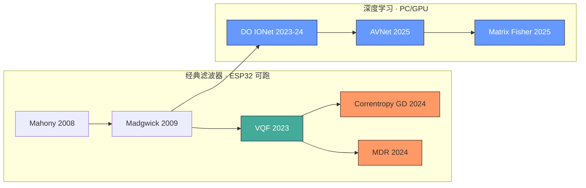

# IMU 姿态解算算法演进

> 从 Madgwick 到深度学习：九轴 IMU 姿态估计算法的现状与选择。服务于[全身动捕与头显系统](../../全身动捕与头显系统.md)的算法选型。

---

## 算法谱系



---

## 经典滤波器

### Madgwick (2009)

梯度下降替代 Kalman 滤波，一步迭代，计算量极小。[详见 Madgwick 专题页](../../来源/2026-06-24%20-%20Madgwick%20AHRS%20姿态解算滤波器.md)。

| 优点 | 缺点 |
|------|------|
| 109 次运算/迭代，ESP32 跑 1kHz 无压力 | 无陀螺偏置估计 |
| 开源成熟，社区大 | 磁干扰无抵抗机制 |
| β 一个参数 | 静态有 0.3° 震荡（梯度步长震荡） |

**对本项目**：Phase 1 起手方案，够用但远非最优。

---

### VQF (2023) → [详页](VQF%20姿态解算滤波器.md)

> 解耦式四元数滤波器，当前经典算法天花板。
> Laidig & Seel, *Information Fusion* 91:187–204. DOI: [10.1016/j.inffus.2022.10.014](https://doi.org/10.1016/j.inffus.2022.10.014)

**核心思路**：把陀螺积分、倾斜校正、航向对齐三个任务解耦成独立模块。

| Madgwick | VQF |
|----------|-----|
| 梯度下降一步融合 | 三模块解耦独立处理 |
| 无偏置估计 | 静止+运动中估计陀螺偏置 |
| 磁力计无条件信任 | 磁干扰检测+动态调整校正时间常数 |
| 需要调 β | 单一固定参数，30+ 数据集无需调参 |
| 全数据集平均 RMSE 5°–17° | 平均 RMSE **2.9°**（单一参数） |

**对本项目**：**Phase 1 应立即替换 Madgwick**。C++ 开源，ESP32 直跑，零硬件改动。动态 yaw 从 3.7° → ~2°，指尖抖动从 4cm → 2cm。

---

### Correntropy GD (2024) → [详页](相关熵梯度下降姿态解算.md)

> Li et al., *IEEE TIM* 73 (2024).
> DOI: [10.1109/TIM.2023.3334336](https://doi.org/10.1109/TIM.2023.3334336)

**核心思路**：把梯度下降中的最小二乘损失替换为多核相关熵（Multikernel Correntropy）。最小二乘对大误差（野值）敏感→剧烈运动时加计测量偏离重力→短暂跳变。相关熵天然抗野值。

| VQF | Correntropy GD |
|-----|---------------|
| 最小二乘框架 | 多核相关熵框架 |
| 剧烈运动有短暂跳变 | 剧烈运动 yaw 不乱跳 |
| 计算量适中 | 计算量**更低**（不需矩阵求逆） |

**对本项目**：VQF 的上位替代，ESP32 完全能跑。甩臂/跳跃时 yaw 更稳。可作为 Phase 1 后期可选升级。

---

### MDR (2024) → [详页](MDR%20磁畸变抑制.md)

> Yang et al., arXiv:2410.12304 (Oct 2024).
> 完整版：[escholarship.org](https://escholarship.org/content/qt04m228kd/qt04m228kd.pdf)

**核心思路**：不假设地磁场均匀。把 3D 空间栅格化（1cm³ 体素），记录每个位置的磁场方向数据库。在线估计姿态时查表取真实的局部磁场方向，而非假定指向磁北。数据库自动更新，无需人工标定。

**关键数据**：比上一代最优方案 MUSE 好 **44.5%**（27+ 小时手臂运动数据）。

**对本项目**：15 个节点分布在身体各处→手腕靠近手表、腰部靠近腰带扣、头显靠近耳机磁铁→每个节点磁干扰环境不同。MDR 是针对性解决方案。但 ESP32 维护 3D 体素数据库较吃力，建议 PC 端实现。可作为 Phase 2 论文的方法创新点之一。

---

## 深度学习方案

### DO IONet (2023–2024) → [详页](DO%20IONet%20Transformer直接姿态.md)

> Han et al., *JAMET* 48(2):96–106 (2024).
> DOI: [10.5916/jamet.2024.48.2.96](https://doi.org/10.5916/jamet.2024.48.2.96)
> 前身：IEEE Access 2023, DOI: [10.1109/access.2023.3281970](https://doi.org/10.1109/access.2023.3281970)

**核心思路**：**跳过陀螺积分**。用 Transformer 直接从 IMU 数据窗口输出当前姿态四元数。陀螺积分是传统 AHRS 的漂移根源——取消这步就没有累积误差。编码器用 CNN 提取局部特征，解码器用 Transformer 多头注意力捕捉时序依赖。

输入：9 轴 raw 数据（线加速度 + 角速度 + 重力方向 + 地磁方向），多帧窗口
输出：姿态四元数 + 位置变化（速度）

比上一代 DO IONet 好 **>10%**。不需要初始姿态。

**对本项目**：需要 GPU 推理，但 Phase 2 PC 端正好有 GPU。论文级创新点——"用 Transformer 取代经典滤波器做动捕姿态融合"本身就是贡献。

---

### AVNet + InEKF (2025) → [详页](AVNet%20不变扩展卡尔曼姿态.md)

> Qian et al., *Satellite Navigation* 6:15 (2025).
> DOI: [10.1186/s43020-025-00168-7](https://doi.org/10.1186/s43020-025-00168-7)（开放获取）

**核心思路**：CNN+GRU 网络（AVNet）从手机 IMU 学出姿态和速度，作为伪测量喂给不变扩展 Kalman 滤波器（InEKF）。InEKF 在李群 SO(3) 上做滤波，避免四元数归一化误差。同时网络自适应调节 Kalman 协方差——等于深度学习替代了人工噪声调参。

**关键数据**：停车场测试 ~0.4% 水平误差。用的 IMU 是**手机级的消费器件**（和 ICM-42688-P 同代）。

**对本项目**：AVNet 输出的是速度+姿态——如果你的动捕系统加根节点速度估计（ZUPT 输出），这个框架天然适配。Phase 2 候选主算法之一。

---

### Matrix Fisher SO(3) (2025) → [详页](Matrix%20Fisher%20SO3概率姿态.md)

> *Information Fusion*, 2025.

**核心思路**：不在欧拉角或四元数空间做回归，直接在 SO(3) 流形上输出 **Matrix Fisher 分布**——带概率姿态估计。贝叶斯框架融合网络预测 + 运动学模型，同时估计姿态和陀螺偏置。

**对本项目**：理论深度最高的方案。如果 Phase 2 论文需要数学上的"硬核"贡献来提升档次，这是最佳选择。但工程实现复杂度高。

---

## 路线图

| 阶段 | 算法 | 部署位置 | 预期单节点 Yaw |
|------|------|:---:|:---:|
| Phase 1 起步 | Madgwick | ESP32-S3 | 3.7° |
| Phase 1 升级 | **VQF** | ESP32-S3 | **~2°** |
| Phase 1 后期 | VQF + Correntropy GD | ESP32-S3 | <2° |
| Phase 2 边缘 | VQF | ESP32-S3 | ~2° |
| Phase 2 PC | DO IONet 或 AVNet | PC GPU | **<1°** |
| Phase 2 融合 | PC 端 + 光学参考 + EKF | PC | **<0.5°**（关节角度） |

---

## 论文创新点备选（Phase 2）

```
✅ = 论文可做
🔬 = 需要验证
```

| 创新方向 | 核心论文 | 可行性 |
|---------|---------|:---:|
| VQF + 15 节点运动链 EKF 混合融合 | VQF + [Solà ESKF](../../2026-06-24%20-%20Solà%20Error-State%20Kalman%20Filter/.md) | ✅ |
| Transformer 替代经典滤波器做动捕姿态 | DO IONet 2024 | ✅ |
| CNN+InEKF + 光学参考外部修正 | AVNet 2025 | ✅ |
| MDR 多节点磁干扰建模 + 运动链 | MDR 2024 | 🔬 |
| Matrix Fisher 概率姿态 + 骨架约束 | Matrix Fisher 2025 | 🔬 |
| Correntropy GD + 运动链鲁棒融合 | Correntropy GD 2024 | ✅ |

---

## 开源实现速查

| 算法 | 语言 | 链接 |
|------|------|------|
| Madgwick | C/Python | 社区 N 多实现 |
| VQF | C++/Python/MATLAB | [github.com/dlaidig/vqf](https://github.com/dlaidig/vqf) |
| Correntropy GD | MATLAB | 联系作者（李士雷组） |
| MDR | — | 论文 2024.10 新发，代码未公开 |

## 参见

- [2026-06-24 - Madgwick AHRS 姿态解算滤波器](../../来源/2026-06-24%20-%20Madgwick%20AHRS%20姿态解算滤波器.md) — Madgwick 算法详解
- [梯度下降姿态解算](梯度下降姿态解算.md) — 梯度下降法理论推导
- [2026-06-24 - Solà Error-State Kalman Filter](../../来源/2026-06-24%20-%20Solà%20Error-State%20Kalman%20Filter.md) — EKF 全局融合基础
- [ICM-42688-P](../../元件/传感器/ICM-42688-P.md) — 本项目 IMU
- [QMC5883P](../../元件/传感器/QMC5883P.md) — 本项目磁力计
- [全身动捕与头显系统](../../全身动捕与头显系统.md) — 应用项目
