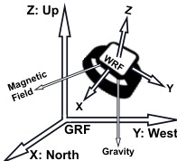
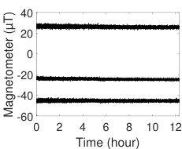
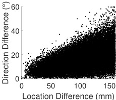
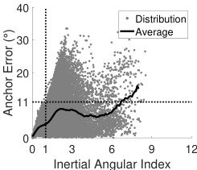
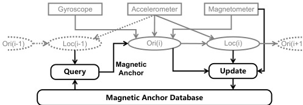
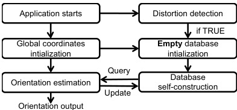
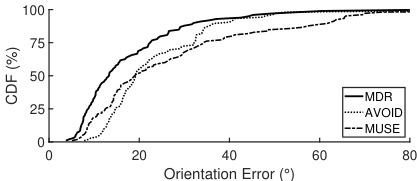

# MDR 磁畸变抑制姿态估计

> 不忽视、不回避磁干扰——先建模它，再修正它。UC Merced 2024，ACM TOSN。

## 核心思路


*Fig. 1 — WRF（手表参考系）与 GRF（全局参考系：北-西-天）的关系。室内钢结构使局部磁场偏离真北最多 31°*

现有方法对磁干扰只有两种态度：

- **忽视**（MUSE等经典互补滤波）：假设磁场方向全局一致。室内铁架、钢筋使磁场偏转 31°，磁力计直接被带偏，yaw 误差可达 100°。
- **回避**（AVOID 等自适应加权）：检测到磁畸变就降低磁力计权重甚至关掉。好处是不会被带偏，坏处是丢失了航向参考，退化为 6-DOF 陀螺/加计融合，漂移随时间累积。

MDR 的第三种态度：**室内磁场虽然扭曲，但它是稳定且可建模的**。与其回避，不如建一个空间数据库记录每个位置的"本地方向"，用这个本地方向替代全局磁北来做磁校准。

## 互补滤波框架

MDR 沿用经典互补滤波作为姿态引擎，其核心递推式为：

```
Θ(t+Δt) = Θ(t) · R_g · R_a(k_a) · R_m(k_m)
```

- **R_g**：陀螺角速度积分得到的旋转
- **R_a(k_a)**：加速度计校准旋转——将变换到 GRF 的加计方向拉向重力锚（down 方向），权重 k_a = 0.1
- **R_m(k_m)**：磁力计校准旋转——将变换到 GRF 的磁力计方向拉向磁锚（理想情况下是正北），权重 k_m = 0.1

系统在 50 Hz 下迭代，每次只转一小步（小权重 0.1），实现平滑收敛。

> [!note] MDR 的关键改动就在 R_m 的磁锚
> 传统方法将磁锚固定为全局磁北（GRF 中 X 轴方向）。MDR 从数据库查表，取出当前位置的**实际磁场方向**作为磁锚。换言之，不是把磁力计往"书上的北"拉，而是往"这个位置真正的磁场方向"拉。这步替换是 MDR 区别于所有前期工作的核心。

## 3D 磁场数据库设计


*Fig. 2 — 磁场时域稳定性：同一位置 12 小时三轴磁力计读数几乎不变——这是数据库可行的前提*


*Fig. 3 — 空间相关性：磁力方向差随距离增大而增大，20 mm 内方向变化很小*

### 体素化模型

工作空间以 **0.1 m（10 cm）** 为分辨率栅格化，每体素体积 0.001 m³（1000 cm³）。每体素存储：

- 该位置的**平均磁场方向**（GRF 中的三维单位向量），即"局部磁锚"
- **累计更新次数**（置信度信号）

> [!warning] 修正：分辨率不是 1 cm³
> 此前版本误记为 1 cm³ 体素。论文明确设置 l_DB = 0.1 m（Section IV-B），每体素 0.001 m³。若分辨率为 1 cm 则开放空间需填充的体素量大约是 0.1 m 方案的 1000 倍，内存不可行。论文也在 Section V-E 通过实验验证 0.1 m 为最优权衡：更细则位置噪声使锚点存入错误体素，更粗则丢失畸变细节。

### 内存开销

实现上，数据库是一个**稀疏三维数组**，每个有数据的单元存一个三维向量。论文在 iPhone XS Max 上测得平均 **21.63 KB/m³**（Section V-H2）。数据库操作仅占总计算延迟的 **2.87%**。这意味着一个 10 m × 10 m × 3 m 的房间（300 m³），数据库内存占用约 6.3 MB。

> [!note] 为什么这么省内存？
> 每体素只存一个方向向量（3 × 4 字节 float）+ 计数值（4 字节 int）= 16 字节/体素。0.1 m 分辨率下每 m³ 含 1000 个体素，若全部填充需 16 KB——但实际只有访问过的体素才分配，且手臂运动可达空间有限，所以实测 21.63 KB/m³（含稀疏索引开销）。

## 数据库查询与"死锁"解决

系统工作流涉及三个模块的循环依赖：

```
姿态估计(互补滤波) ← 需要磁锚 → 数据库查询 ← 需要位置 → 粒子滤波定位 ← 需要姿态 → 姿态估计
```

这是一个环形依赖：互补滤波需要数据库的磁锚才能算姿态，粒子滤波需要姿态才能定位，数据库需要位置才能查询。

**MDR 的解法**：利用人体运动的连续性。相邻时间步（20 ms 间隔）内手表的位移极为有限——12 名用户实测平均位移仅 **7.6 mm**，**98.5% 的步间位移 < 20 mm**。论文据此用上一时间步的位置结果直接查数据库，避免运行两次互补滤波。该方法比"先暂算一次再查"的直观解法误差低 **8.36%**，且效率更高。

## IAI 自适应更新

数据库的构建依赖姿态估计结果，而姿态估计本身有误差。自适应更新方案的核心是：**用角速度大小作为姿态可靠性的代理指标**。

### Inertial Angular Index

论文不直接使用瞬时角速度 ω(t)，因为瞬时高速旋转不一定意味着姿态已漂移。取而代之的是一阶低通滤波形式的累积指标：

```
IAI(t) = IAI(t-Δt) × k_IAI + ω(t) × (1 - k_IAI)
```

- k_IAI = 0.95（惯性系数）
- IAI 初值 0
- 输入 ω(t) 为当前角速度大小

IAI 本质上是角速度大小的**指数滑动平均**，反映过去短时间内的整体运动剧烈程度。论文实验验证 IAI 与锚点误差之间呈现更线性的关系。当 IAI ≤ 1 时锚点误差可控制在 **11°** 以内。


*Fig. 8 — IAI 与锚点方向误差的关系。相比原始角速度（Fig. 7），IAI 更具线性指示性。IAI ≤ 1 时误差控制在 11° 以内*

### 加权更新公式

```
DP_new* = DP_old* + N           (IAI ≤ IAI_0)
DP_new* = DP_old* + W × N       (IAI > IAI_0)
```

- IAI_0 = 1（阈值）
- W = 0.1（低权重）
- N 为新计算的磁锚方向

**为什么能区分永久畸变和临时干扰**？永久畸变（如钢筋、铁桌）产生的方向偏移是位置相关的——同一位置反复访问时，各次读数被加权平均，误差相互抵消，均值收敛到真实本地方向。临时干扰（如路过电机、金属门开关）导致某次读数异常，但该次 IAI 高（因为干扰引起的角速度变化），更新权重低（0.1），对均值的污染有限。多次访问后临时干扰的影响被稀释。

自适应更新使数据库误差降低 **9.07%**（从 14.56° 降至 13.24°），最终收敛至 **12.59°**。

## 畸变检测模块

在畸变轻微的场景（如会议室 6.93°、室外 6.63°），数据库不仅无益甚至有害（会议室开库反降 1.83%），因此关掉数据库以节省计算。

### 两个判据

| 判据 | 依据 | 阈值 |
|------|------|------|
| A | 磁感应强度幅值范围 | 40 μT ~ 60 μT |
| B | 幅值相对方差 σ_M / M | < 0.135 |

- 两判据同时满足 → 判定为无畸变（畸变 < 10°）→ 自动停用数据库
- 单独判据性能：A 的 F1 94.12%，B 的 F1 91.74%
- **两者联合：F1 96%，Precision 96%，Recall 96%**

### 计算节省

数据库和粒子滤波停用后，**节省 89.95% 的计算开销**（粒子滤波占总延迟 87.08%，数据库占 2.87%）。这意味着在无畸变场景下 MDR 退化到纯互补滤波，计算量极低。

## 粒子滤波定位

MDR 沿用 MUSE 的粒子滤波做位置估计。受人体骨骼约束，手表可能的位置在特定手腕姿态下有限。粒子滤波在可行区域内随机撒粒子，每步基于姿态结果采样新位置形成轨迹，用加速度计评估粒子轨迹与实测的吻合度，淘汰劣质粒子、在优质粒子周围重采样。

位置误差为 **0.1201 m**，比 MUSE 低 12.61%。论文指出 0.12 m 的位置误差对应的磁方向变化很小（参照 Fig. 3 空间相关性），不影响数据库查询精度。

> [!note] HPE 系统中的关键差异
> 对于多节点人体姿态估计系统，每个传感器节点的磁环境各不相同。MDR 的粒子滤波是为**单手表**场景设计的——它利用了手臂骨骼约束。扩展到全身多节点时，每个节点的可行运动空间不同，粒子滤波的撒粒策略需要相应调整。

## 系统工作流


*Fig. 5 — MDR 系统工作流全貌：互补滤波 + 粒子滤波 + 数据库并行运行，位置用上一时间步结果，磁锚查询与姿态估计循环迭代*


*Fig. 4 — MDR 应用工作流：启动→初始化（10 s 静止建立 GRF）→畸变检测→空库初始化→在线查询+更新→应用结束（不保存库）*

## 实验评估

### 实验设置

| 项目 | 数据 |
|------|------|
| 参与者 | 12 人 |
| 轨迹 | 100+ 条 |
| 地点 | 10 处（两个城市） |
| 总时长 | 27.53 小时 |
| 采样率 | 50 Hz |
| 硬件 | Fossil Gen 5 智能手表（AK0991X 磁力计 + LSM6DSO 六轴） |
| 真值 | Meta Quest 2（姿态误差 < 0.85°，位置误差 < 0.7 cm） |

### 各场景畸变程度

| 地点 | 畸变程度 | 数据库贡献 |
|------|---------|-----------|
| 会议室 | 6.93° | -1.83%（有害） |
| 室外 | 6.63° | +3.43% |
| 住宅 | 7.06° | +4.37% |
| 公寓#2 | 11.65° | +9.20% |
| 楼梯间 | 14.12° | +23.47% |
| 办公室 | 14.51° | +27.80% |
| 公寓#3（另一城市） | 16.46° | +33.59% |
| 公寓#1 | 17.05° | +25.08% |
| 礼堂 | 28.51° | +23.91% |
| **走廊** | **31.06°** | **+34.66%** |

### 总体对比


*Fig. 13 — 总体姿态误差 CDF。MDR 整体平均 17.73°，AVOID 22.96°，MUSE 27.42°*

MDR 较 MUSE 提升 **35.34%**，较 AVOID 提升 **22.80%**。这组数字对比清晰地揭示了两种策略的优劣：MUSE 被畸变带偏，AVOID 过于保守，MDR 介于两者之间但明显优于两者。

> [!note] 走廊（31° 畸变）是最关键的测试场景
> 走廊的钢结构导致畸变最高。MDR 在该场景下误差 18.73°，比 AVOID 低 39.44%。同时走廊数据量最大（11 小时），统计意义最强。这验证了 MDR 的核心假设——畸变越大，数据库建模带来的收益越大。

### 按畸变等级分析

| 畸变等级 | 4-7° | 7-10° | 10-16° | 16-30° | > 30° |
|----------|------|-------|--------|--------|-------|
| MUSE 表现 | 尚可 | 开始退化 | 显著恶化 | 大幅偏离 | 完全不可用 |
| AVOID 表现 | 稳定 | 稳定 | 稳定 | 稳定 | 开始退化 |
| MDR 表现 | 稳定 | 稳定 | 稳定 | 稳定 | 仍然稳定 |

当畸变超过 30° 时，AVOID 的磁力计权重 λ ≈ 0.5，意味着既受畸变影响又缺少磁校准——两头不讨好。MDR 则始终稳定，证实了"建模而非回避"的优越性。

### 特殊失败案例：楼梯间

楼梯间（14.12° 畸变）是 MDR **唯一**不如 AVOID 的场景。原因是楼梯间有频繁开关的金属门，改变了畸变模式，破坏了 MDR 依赖的"磁场时域稳定"假设。动态畸变是数据库方法的天然短板。

## 应用案例

### 空中写字（In-Air Writing）

在走廊（31° 畸变）中用智能手表空写 20 个符号（A-N 字母、1-4 数字、三角形、矩形），重复 9 轮共 180 个样本。

| 指标 | MDR | MUSE |
|------|-----|------|
| 平均姿态误差 | **8.27°** | 22.41° |
| 平均位置误差 | **0.056 m** | 0.112 m |
| LPIPS（感知相似度，越低越好） | **0.1216** | 0.2461 |

LPIPS 是 Learned Perceptual Image Patch Similarity 指标，比 PSNR/SSIM 更贴近人眼感知。MDR 的 LPIPS 接近 MUSE 的一半，意味着绘制出的字符在视觉上更接近真实轨迹。

### 星空渲染（Star Sky Rendering）

类比天文观测 App（如 Star Walk），根据手表姿态从 Vizier 星表中投影 10000 颗恒星到屏幕。在走廊 10 分钟数据上：

- MDR 渲染准确率 **86.69%**，几乎不降至 50% 以下
- MUSE 渲染准确率 70.92%，时高时低

这意味着在室内使用天文 App 时，MDR 可以让用户更有信心通过粗略指向找到星座大致区域后再调望远镜。

## 计算开销

MDR 在 iPhone XS Max（MATLAB Mobile App）上实测可实时处理 **3.37 倍**速率的 IMU 数据。各模块延迟占比：

| 模块 | 占比 |
|------|------|
| 粒子滤波 | **87.08%** |
| 互补滤波 | 10.05% |
| 数据库 | **2.87%** |

数据库操作的极低延迟是 MDR 工程优雅性的体现——核心创新点几乎不增加计算负担。

## 局限性批判

1. **冷启动问题**（论文承认但未完全解决）：首次进入新环境时数据库为空，前几分钟姿态误差较大，需在运动中逐步填充体素。论文实验从空库开始，约 5 分钟数据库容量趋于饱和，误差逐步收敛至稳定值。

2. **动态磁场环境**：楼梯间金属门的频繁开关导致畸变模式变化，MDR 在此处不如 AVOID。论文指出"如果环境持续且显著变化，MDR 将失效"——虽然这种场景在实际生活中不多见。

3. **内存随空间线性增长**：21.63 KB/m³ 虽然高效，但覆盖整个大空间（如仓库、商场）仍需数 MB 到数十 MB，且随使用时间推移，已访问体素不断增加。论文未实现库的淘汰或压缩机制。

4. **无畸变场景下无益**：会议室和室外无显著畸变时，数据库不仅不提升精度还会引入微小误差（-1.83%）。畸变检测模块能关库解决此问题，但判据的 96% F1 意味着仍有 4% 的误判率。

5. **单平台验证**：论文仅在 Fossil Gen 5 手表上采集主要数据，虽然与三星、iPhone 传感器的交叉对比显示了跨平台可行性，但未在多种硬件上系统性评估数据库构建的差异。

6. **代码未开源**：截至论文发表（2024.10），暂无开源实现。这使得复现和移植存在工程壁垒。

## 工程应用考量

在姿态贴/动捕类应用中，MDR 的核心思想——数据库建模局部磁场——与传感器节点的异构磁环境天然匹配。但需要注意：

- 多节点同时建库会大幅增加体素填充速率，缩短冷启动时间，但也需要协调各节点的坐标系一致性
- 粒子滤波 87% 的计算占比是主要瓶颈，在低功耗嵌入式平台上需考虑降采样或简化粒子数
- 运动链约束可以部分替代粒子滤波的位置估计功能，减少计算开销

## 参见

- [VQF 姿态解算滤波器](VQF%20姿态解算滤波器.md) — MDR 可增强 VQF 的航向对齐模块，用局部磁锚替换全局磁北
- [IMU姿态解算算法演进](IMU姿态解算算法演进.md) — 互补滤波与卡尔曼滤波在姿态解算中的对比
- [QMC5883P](../../元件/传感器/QMC5883P.md) — 低成本磁力计的实际磁畸变敏感性
