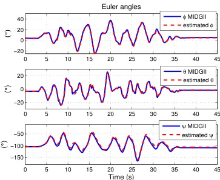
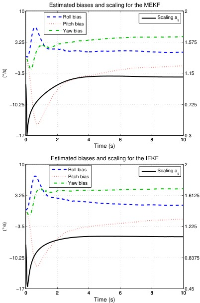

# IterIEKF · 迭代不变扩展卡尔曼滤波

> Bonnabel, Martin & Salaun (CDC 2009) 证明了在具有对称性的非线性系统上，用**不变误差**替代线性误差可使 Kalman 滤波的误差传播从估计状态中彻底解耦——这是 IEKF 收敛域远超标准 EKF 的根本原因。随后 Chauchat et al. (2024) 将 Gauss-Newton 迭代引入测量更新，提出 IterIEKF，进一步改善磁力计等高非线性观测下的线性化精度。

---

## 标准 EKF 在姿态估计上的病态问题

标准 EKF 在 $SO(3)$ 姿态估计上犯了一个根本性错误：它把扭曲的欧几里得线性化强加给了流形。

### 线性化点随估计漂移

标准 EKF 每一步都在当前估计点 $\hat{x}$ 做一阶 Taylor 展开：

$$f(x, u) \approx f(\hat{x}, u) + F \cdot (x - \hat{x})$$

这个线性化指向误差 $(x - \hat{x})$ 取决于 $\hat{x}$ 本身——如果 $\hat{x}$ 离真实值远，线性化在错误的位置展开，Jacobian $F$ 失真，下一轮估计更偏。正向反馈放大。对四元数这样的非线性，大初始误差下标准 EKF 几乎必然发散。

### 协方差不一致——虚假信息问题

标准 EKF 的协方差传播公式：

$$P_{k+1} = F_k P_k F_k^T + Q_k$$

这里 $F_k$ 是在当前估计 $\hat{x}_k$ 处计算的。若某方向实际不可观（如姿态估计中航向角在无磁力计时的自由度），但因为线性化点偏离真实轨迹，$F_k$ 会对此方向产生一个**非零的虚假可观测性**，协方差过度缩小——滤波器变得"过度自信"且不自知。这就是所谓**不可观方向上的虚假信息**（spurious information in unobservable directions）。

> [!note] ESKF 并未解决根本问题
> [误差状态卡尔曼滤波](误差状态卡尔曼滤波.md) 用误差状态在线性化中解耦了四元数范数约束，但它的误差传播矩阵仍然依赖于名义状态的实时估计——名义状态偏离真实值时，Jacobian 同样失真。区别在于：ESKF 的误差状态是 3 维（无冗余），数值稳定性优于全状态 EKF，但收敛域与真实轨迹解耦的性质只有 IEKF 能做到。

### 大初始误差发散

对于姿态头动追踪这类时常出现大幅度快速转动的场景，滤波器的初始误差或过程中的突加干扰都可能超过标准 EKF 的收敛半径（通常约 10 度方位角、20 度俯仰/横滚）。一旦超过此半径，线性化在流形的"另一面"展开，更新方向错误，估计立即发散。

---

## IEKF 核心构造 (Bonnabel 2009)

Bonnabel et al. 的核心洞察是：如果系统具有已知的对称性（即存在一个 Lie 群作用在状态空间上），那么**误差不应该定义为状态之差，而应该是群作用下的不变量**。

### 系统定义与群结构

考虑速度辅助姿态估计的标准系统：

- 状态：$\chi = (R, v, X) \in SO(3) \times \mathbb{R}^3 \times \mathbb{R}^3$
- 动力学（IMU 驱动）：
  $$\dot{R} = R[\omega_m - b_\omega]_\times, \quad \dot{v} = R(a_m - b_a) + g, \quad \dot{X} = v$$
- 输出：
  - GPS 速度：$y_v = v + n_v$
  - 磁力计：$y_m = R^T m_0 + n_m$

这个系统的状态空间构成一个 Lie 群 $G = SO(3) \times \mathbb{R}^3 \times \mathbb{R}^3$，群乘法为：

$$(R_1, v_1, X_1) \cdot (R_2, v_2, X_2) = (R_1 R_2,\ R_1 v_2 + v_1,\ R_1 X_2 + X_1)$$

### 左不变误差 vs 右不变误差

Bonnabel 2009 采用**左不变误差**（left-invariant error）：

$$\eta = \hat{\chi}^{-1} \chi = (\hat{R}^T R,\ \hat{R}^T(\hat{v} - v),\ \hat{R}^T(\hat{X} - X))$$

物理含义：**误差在体坐标系下的表示**——旋转误差 $\hat{R}^T R$ 表示从估计姿态旋转到真实姿态的"小旋转"，速度/位置误差 $\hat{R}^T(\hat{v} - v)$ 是先反旋到体坐标系再比较。这个误差的量值与世界的绝对朝向无关，只取决于估计与真实之间的偏差。这正是"不变"的实质。

**右不变误差**（right-invariant error）：

$$\eta = \chi \hat{\chi}^{-1} = (R \hat{R}^T,\ v - R \hat{R}^T \hat{v},\ X - R \hat{R}^T \hat{X})$$

物理含义：误差在惯性系下的表示。两种选择在理论上等价，实践中取决于测量模型的形式——哪边的 Jacobian 更稀疏。

> [!note] 左不变误差的优势
> 对于 IMU 惯导这类**过程模型已知、测量在输出空间**的系统，左不变误差使姿态误差的 Jacobian 与当前姿态估计 R 解耦，这在下面的误差传播线性化中会看到。

### 不变输出误差

标准 EKF 的输出残差：$z - h(\hat{x})$ —— 线性差值。

IEKF 的输出残差：$Y = z - \hat{z}$，但以**群作用**方式定义，而非简单减法。对左不变误差，输出误差自然为：

$$Y_v = v_{GPS} - \hat{v}$$
$$Y_m = y_m - \hat{R}^T m_0$$

这里的磁力计残差使用了估计的姿态 $\hat{R}$，但误差衡量仍然是自然的向量差——因为输出空间是线性空间。关键区别在于：**增益 $K$ 的作用对象是不变状态误差 $\eta$，而非线性状态差 $x - \hat{x}$**。

### 误差传播线性化

与标准 EKF 的最大区别出现在误差传播环节。设 $\eta = \exp(\xi)$ 将不变误差映射到李代数 $\mathfrak{g}$，线性化后：

$$\frac{d}{dt} \xi = A(u) \xi + \text{noise}$$

这里 $A(u)$ **只取决于输入 $u$（IMU 读数），与真实状态 $\chi$ 和估计状态 $\hat{\chi}$ 均无关**。这是 IEKF 一切优越性质的数学根源。

对比标准 EKF：

| | 标准 EKF | IEKF |
|------|------|------|
| 线性化点 | 当前估计 $\hat{x}_k$ | 不变误差的零点 $\eta = I$ |
| 系统矩阵 | $F = \frac{\partial f}{\partial x}\big|_{\hat{x}}$ | $A(u)$ 与估计无关 |
| 误差传播耦合 | 耦合于估计轨迹 | 完全解耦 |
| 收敛域 | 小（线性化准确的邻域） | 大（与轨迹无关） |

---

## 关键定理

### 定理 1：群仿射系统的不变误差传播与真实轨迹无关

**群仿射定义**：称系统 $f$ 在 Lie 群 $G$ 上是群仿射的（group affine），若：

$$f(\chi_1 \chi_2) = \chi_1 f(\chi_2) + f(\chi_1) \chi_2 - \chi_1 f(I) \chi_2$$

对于 IMU 动力学系统，这个条件可以直接验证——核心在于 $R[\omega]_\times$ 和 $R a$ 在群乘法下的结构。

**定理意义**：当系统满足群仿射条件时，IEKF 的误差动力学 $\dot{\eta} = \text{some function of } (\eta, u)$ **不显含真实状态 $\chi$**。这意味着无论系统当前在做什么机动、估计偏差有多大，误差的线性化矩阵 $A(u)$ 都是一样的。收敛行为由误差本身的初始大小决定，而非由估计轨迹的偏离程度决定。

这就是为什么 IEKF 在大初始误差下不发散，而标准 EKF 发散的根本原因。

### 定理 2：永久轨迹上的增益收敛常值

对于常值输入 $u(t) = \bar{u}$（传感器读数不变），对应的系统轨迹称为**永久轨迹**（permanent trajectory）。在此条件下：

$$\lim_{t \to \infty} K(t) = K_\infty, \quad \lim_{t \to \infty} P(t) = P_\infty$$

增益 $K(t)$ 和协方差 $P(t)$ 收敛到常值。这在标准 EKF 中**仅在平衡点**（状态不动）处成立，而 IEKF 将其推广到所有恒定输入对应的轨迹（包括等速直线运动、恒定角速度旋转）。

> [!note] 工程意义
> 收敛的增益意味着在线期间不需要持续计算 $P$ 和 $K$ 更新——上电后等待收敛，之后用常值增益运行。这对 ESP32 等资源受限平台是一个巨大的计算节省。

---


*Fig. 1 — 实验：估计的欧拉角（IEKF 在大初始误差下快速收敛）*


*Fig. 3 — 仿真：陀螺偏置估计对比（MEKF 上 vs RIEKF 下），RIEKF 收敛更快更稳*

## 速度辅助姿态估计应用

论文将 IEKF 应用于带有 GPS 速度辅助的 IMU 姿态估计（典型航空场景）。

### 状态

$\chi = (R, v, X) \in SO(3) \times \mathbb{R}^3 \times \mathbb{R}^3$，加上 IMU 偏置 $b_\omega, b_a \in \mathbb{R}^3$。

偏置的动力学不是群仿射的，因此偏置及其协方差仍需要用标准 EKF 的方式处理——这就是后续 InEKF（Barrau & Bonnabel 2017）将 Lie 群扩展到 SE(3)/SE2(3) 以包含偏置的动机。

### 测量更新

1. **GPS 速度观测**：$y_v = v + n_v$，残差 $Y_v = v_{GPS} - \hat{v}$
2. **磁力计观测**：$y_m = R^T m_0 + n_m$，残差 $Y_m = y_m - \hat{R}^T m_0$

两个观测约定了 6 个自由度中的 3 个（速度）+ 2 个（磁力计提供横滚/俯仰约束），航向角由速度方向间接可观测——这构成了完整的可观测系统。

### 与 MEKF 的对比

MEKF 用四元数乘法误差 $\delta q = q \otimes \hat{q}^{-1}$ 代替加法误差，这是 IEKF 在 SO(3) 上的特例。IEKF 的推广在于：

- MEKF 只处理 SO(3) 上的姿态误差
- IEKF 将不变误差的概念推广到整个状态空间的 Lie 群结构
- MEKF 的协方差传播仍依赖于名义姿态轨迹；IEKF 的误差动力学完全解耦

---

## 谱系：MEKF → IEKF → InEKF/RIEKF → IterIEKF

```text
MEKF (Markley 2003)
  └ 乘法误差四元数更新——SO(3) 上的特化方案
    └── IEKF (Bonnabel 2009)
         └ 群仿射系统下的不变误差——通用理论框架
           └── InEKF / RIEKF (Barrau & Bonnabel 2017)
           |    └ SE(3)/SE2(3) 扩展+偏置嵌入李群
           |    └ 系统化为"不变扩展卡尔曼滤波"教科书
             └── IterIEKF (Chauchat et al. 2024-2025)
                  └ 测量更新迭代 3-5 次 Gauss-Newton
                  └ 对磁力计等高非线性观测最有益
```

本页标题"迭代不变扩展卡尔曼滤波"对应的是最右端的 IterIEKF，但 Bonnabel 2009 是整个谱系的**理论奠基**——没有群仿射理论和不变误差传播解耦的性质，上层的迭代优化无从谈起。

---

## IterIEKF — 迭代版本

### 标准 InEKF 的单次线性化局限

标准 InEKF 的不变误差传播与状态无关，这解决的是**过程模型线性化**的问题。但**测量更新**的线性化 $z - h(x)$ 仍然是在当前估计点做的一阶展开。当 $h$ 高度非线性时（如磁力计 $y_m = R^T m_0$ 涉及 $R$ 的三角函数），单次线性化的截断误差仍然显著。

### IterIEKF 方案 (Chauchat et al. 2024)

Gauss-Newton 式的测量迭代：

```text
预测：χ_pred, P_pred
x = χ_pred
for i = 1 to N:          // N = 3-5
    H = compute_jacobian(x)
    K = P_pred * H' * (H * P_pred * H' + R)^-1
    ξ = K * (z - h(x) - H * log(χ_pred^-1 * x))
    x = χ_pred * exp(ξ)   // 左不变合成
输出：χ_upd = x, P_upd = (I - K*H) * P_pred
```

与标准 InEKF 的唯一区别是：每次迭代用当前估计 $x$（而非预测点 $\chi_{pred}$）计算 $H$。这在程序上是一个 for 循环，在数学上是 Gauss-Newton 优化——每一步在更准确的点线性化，逐步逼近最优。

> [!note] 理论与证明
> Chauchat et al. 证明 IterIEKF 在低噪声极限下行为类似线性 Kalman 滤波器，收敛速度与迭代次数相关。这是一个很强的理论保证，标准 IEKF 没有推导这个性质。

### 对 IMU 姿态估计的意义

磁力计的测量方程 $y_m = R^T m_0$ 是强非线性的——$R$ 中的三角函数通过旋转矩阵乘法映射到 3D 磁场向量。单次线性化在这个映射上会产生明显的截断误差，尤其在磁场方向与重力方向夹角较小的退化几何中。迭代 3-5 次可以显著减少这个误差。

---

## 关键数据

- 在起重机吊挂 IMU 实验中，IterIEKF **显著优于**标准 IEKF（当测量精度高时差距更大）
- 用于 LiDAR-IMU SLAM 时，轨迹误差降低约 15%
- 理论分析：低噪声下近似线性 Kalman 行为

---

## 计算量

迭代 3 次 = 3 倍测量更新计算量。测量更新在整个 EKF 中只占 20-30%，所以总计算量增加约 60%。在 ESP32 上跑 1kHz 无压力。更好的策略是：根据残差大小动态控制迭代次数，残差小（收敛）即提前退出。

---

## 对本项目的意义

Phase 1 后期 / Phase 2 最简单的 EKF 升级。改动量极低，回滚容易（迭代次数设 1 = 原版）。对磁力计 yaw 观测这一类强非线性映射改善最明显。进阶路线可以是：先用标准 IEKF（Bonnabel 2009 的理论保证）作为基线，然后在磁力计测量更新处加入 3 次 Gauss-Newton 迭代（Chauchat 2024），得到不易发散且精度提升的混合方案。

---

## 参见

- [误差状态卡尔曼滤波](误差状态卡尔曼滤波.md) — ESKF 与 IEKF 的对比：两种不同的从流形解耦线性化的策略
- [AVNet 不变扩展卡尔曼姿态](AVNet%20不变扩展卡尔曼姿态.md) — InEKF + 深度学习的工程应用实例
- [Matrix Fisher SO3概率姿态](Matrix%20Fisher%20SO3概率姿态.md) — 另一种处理 SO(3) 不确定性的框架，直接对旋转矩阵概率建模
- [IMU姿态解算算法演进](IMU姿态解算算法演进.md) — 算法全景中 IEKF/InEKF 的位置
- [2026-06-24 - Solà Error-State Kalman Filter](../../2026-06-24%20-%20Solà%20Error-State%20Kalman%20Filter.md) — Error-State KF 原文，与 IEKF 对照理解
