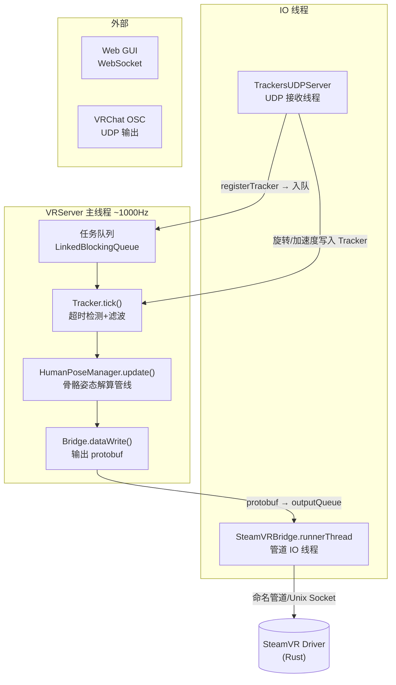

# SlimeVR Server 概述与架构

## 一句话

> 单线程 1000Hz 游戏主循环 + UDP 接收线程 + SteamVR 管道 IO 线程——所有状态变更在 VRServer 线程串行化，无需锁。

## 系统架构



## 主循环 (VRServer.run)

```kotlin
// VRServer.kt — 核心主循环
while (true) {
    fpsTimer.update()
    
    // 1. 排空任务队列（所有状态变更在此串行化）
    drainTaskQueue()
    
    // 2. onTick 回调
    onTick.forEach { it.update() }
    
    // 3. 从各桥接读入消息（protobuf）
    bridges.forEach { it.dataRead() }
    
    // 4. Tracker 超时检测 + 滤波更新
    trackers.forEach { it.tick(deltaTime) }
    
    // 5. 骨骼姿态解算 → 核心管线
    humanPoseManager.update()
    
    // 6. 向各桥接输出姿态
    bridges.forEach { it.dataWrite() }
    
    // 7. VRChat OSC 输出
    vrcOSCHandler.update()
    
    Thread.sleep(1)  // ~1000Hz 目标帧率
}
```

**关键设计**：`VRServer` 通过 `queueTask(Runnable)` 串行化所有跨线程操作。UDP 线程收到新手柄时调用 `VRServer.registerTracker()`，内部入队——实际创建在主线程下一帧执行。这消除了所有锁竞争。

## 模块依赖

Module structure:
server/core (platform-independent core):
- tracking/trackers/: Tracker data model, UDP server, device management
- tracking/processor/: Skeleton assembly, pose pipeline, constraints, IK, leg correction
- bridge/: Bridge interface definitions
- config/: Configuration management (JSON/YAML)
- VRServer.kt: Central scheduler

server/desktop (Windows/Linux bindings):
- platform/SteamVRBridge: SteamVR bridge implementation
- platform/ProtobufBridge: Protobuf message encoding/decoding
- platform/windows/: Named pipe implementation
- platform/linux/: Unix Socket implementation

## 数据所有权模型

| 数据 | 写线程 | 读线程 |
|------|--------|--------|
| `Tracker._rotation` | UDP 接收线程 | VRServer 主线程 |
| `Tracker.status` | VRServer 主线程 | UDP 线程 (timeout) |
| `Bone` 世界变换 | VRServer 主线程 | Bridge IO 线程 |
| Protobuf outputQueue | VRServer 主线程 | Bridge IO 线程 |
| Device 注册 | UDP → 入队 → VRServer | VRServer |

> 旋转数据只写不锁——UDP 线程直接写 `Tracker._rotation`（volatile 等效），主线程读。无中间拷贝，性能最优。

## 关键设计决策

1. **单线程骨骼解算**：FK 链涉及 ~87 个骨骼的递归变换组合，天然不适合并行。单线程避免所有同步开销。
2. **UDP 直写 Tracker**：不经过队列，零延迟——四元数到骨骼只需 1 帧（~1ms）。
3. **Protobuf 桥接异步**：`inputQueue`/`outputQueue` 解耦主循环和管道 IO，管道阻塞不影响帧率。
4. **任务队列模式**：所有创建/销毁/配置变更入队，避免数据竞争。类似 Android 的 `Handler` 或 Win32 的 `PostMessage`。
