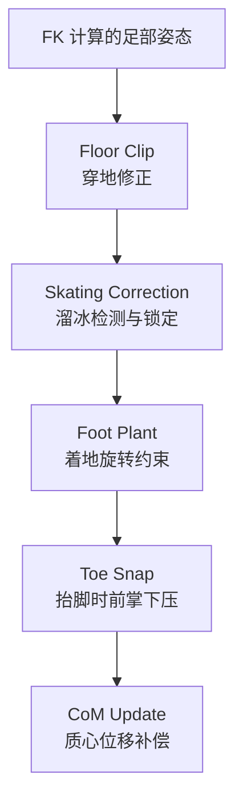

# SlimeVR 腿部校正与地面交互

## 一句话

> `LegTweaks` 解决纯 IMU 动捕最头疼的问题：脚穿地、溜冰、浮空——通过足部着地检测 + 质心约束 + 运动学修正逐帧处理。

## 为什么需要腿部校正

纯 IMU 动捕没有绝对位置参考，腿部有三个固有问题：

| 问题 | 现象 | 根因 |
|------|------|------|
| **穿地** | 脚陷入地面以下 | FK 链累积误差使脚位置计算偏低 |
| **溜冰** (Skating) | 脚在地面滑动 | IMU 无法感知绝对位移，静止脚在虚拟空间漂移 |
| **浮空** | 抬起的脚姿态不自然 | 无地面参考时脚旋转缺约束 |

`LegTweaks` 在每帧姿态管线最后执行，以 10 帧环形缓冲区追踪脚部运动状态。

## 校正管线



## Floor Clip — 穿地修正

```
if foot_y < floor_y:
    correction = floor_y - foot_y
    foot_y = floor_y
    
    连带修正：
    knee_y += correction * kneeRatio    // 膝上抬
    hip_y  += correction * hipRatio      // 髋上抬
```

穿地修正是硬约束——脚绝对不能低于地面。修正是分层级的：脚→膝→髋逐级分摊，保持腿的自然形态。

## Skating Correction — 溜冰校正

核心思想：**着地脚不应该移动**。检测着地状态 → 锁定脚位置 → 后续帧保持锁定直到抬起。

### 着地检测

```kotlin
// LegTweaksBuffer — 多条件联合判断
fun isFootLocked(foot, frameBuffer):
    conditions:
    1. foot_y ≈ floor_y (脚贴近地面)
    2. foot_velocity < threshold (运动速度低)
    3. foot_acceleration < threshold (加速度低)
    4. foot_angular_velocity < threshold (旋转慢)
    5. time_since_last_lock > minInterval (防抖动)
    
    if all conditions met for N consecutive frames:
        lock foot at current position
```

### 锁定机制

| 状态 | 行为 |
|------|------|
| **Locked** | 脚位置固定在锁定点，仅允许 yaw 旋转 |
| **Unlocked** | 正常 FK 输出 |
| **Transition** | 解锁时平滑过渡（lerp），避免突变 |

## Foot Plant — 着地旋转约束

着地时脚不应有 pitch/roll 偏移——脚底应与地面平行：

```
if foot close to ground:
    target_rotation = pure_yaw(foot_rotation)
    foot_rotation = lerp(current, target, plantFactor)
```

`plantFactor` 随脚离地距离指数衰减——接近地面时约束强，抬起时松弛。

## Toe Snap — 抬脚前掌下压

脚在空中时，自然姿态是前掌略下垂（重力 + 踝关节松弛）：

```
if foot in air && foot above ground by > threshold:
    toe_angle = smoothstep(0, maxAngle, height)
    foot_rotation = foot_rotation * toe_down_rotation(toe_angle)
```

## 质心 (CoM) 模型

用于溜冰校正的质心位移补偿：

```kotlin
// 人体惯性参数（Winter 2009 人体测量学）
val massDistribution = mapOf(
    HEAD_THORAX to 0.2697f,   // 头+胸 26.97%
    WAIST_HIP    to 0.2541f,   // 腰+髋 25.41%
    LEFT_LEG     to 0.1417f,   // 左腿 14.17%
    RIGHT_LEG    to 0.1417f,   // 右腿 14.17%
    LEFT_ARM     to 0.0490f,   // 左臂 4.90%
    RIGHT_ARM    to 0.0490f,   // 右臂 4.90%
)
// ... 按骨骼位置加权求和 = 全身质心
```

当溜冰校正移动了脚的位置，对应的质心位移反向补偿到髋关节，保持整体平衡。
