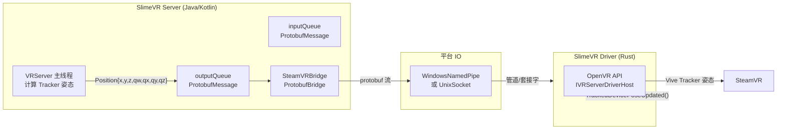

# SlimeVR SteamVR 桥接

## 一句话

> Protobuf 消息通过命名管道（Windows）或 Unix Socket（Linux）与 Rust Driver 通信 → 创建虚拟 Vive Tracker → SteamVR 识别为追踪点。

## 桥接架构



## Protobuf 消息格式

```protobuf
message Position {
    uint32 id = 1;           // Tracker 全局 ID
    float x = 2; float y = 3; float z = 4;    // 位置 (m)
    float qw = 5; float qx = 6; float qy = 7; float qz = 8;  // 旋转四元数
    float vx = 9; float vy = 10; float vz = 11;  // 速度 (m/s)
}

message TrackerAdded {
    uint32 id = 1;
    string role = 2;          // "WAIST", "LEFT_FOOT", etc.
    string serial = 3;        // "human://WAIST"
}

message TrackerStatus {
    uint32 id = 1;
    Status status = 2;        // DISCONNECTED, OK, BUSY, ERROR
}

message UserAction {
    uint32 type = 1;          // RESET_FULL, RESET_YAW, RESET_MOUNTING, PAUSE
}

message Battery {
    uint32 id = 1;
    float voltage = 2;
    float percentage = 3;
}
```

## 数据流

```
VRServer 主线程 (每帧):
  bridge.dataWrite()
    for each sharedTracker:
      ProtobufMessage {
        Position {
          id = tracker.id,
          x, y, z = tracker.position (来自 computed tracker 或骨骼)
          qw, qx, qy, qz = tracker.rotation
          vx, vy, vz = tracker.derivedVelocity
        }
      }
      → outputQueue.enqueue(msg)

Bridge IO 线程:
  while true:
    msg = outputQueue.dequeue()
    writeDelimitedTo(pipe, msg)  // protobuf length-delimited
```

## 自动共享规则

SteamVR 限制每个虚拟 Tracker 设备只报告一个追踪点。SlimeVR 自动选择活跃的追踪点：

```kotlin
// SteamVRBridge 自动共享逻辑
if skeleton.spineTracker != null:
    share WAIST
if skeleton.leftLeg.hasTrackers():
    share LEFT_FOOT + LEFT_KNEE
if skeleton.rightLeg.hasTrackers():
    share RIGHT_FOOT + RIGHT_KNEE
if skeleton.leftArm.hasTrackers():
    share LEFT_ELBOW + LEFT_HAND
if skeleton.rightArm.hasTrackers():
    share RIGHT_ELBOW + RIGHT_HAND
if skeleton.headTracker != null:
    share HEAD
```

> ⚠️ 手动关闭不需要的追踪点可节省 SteamVR 资源。

## 电池聚合

多个身体追踪器合并为一个 SteamVR 设备：

```
SteamVR "WAIST" tracker battery =
    min(所有躯干 tracker 电量)  // 最差情况报告
```

## 平台实现

### Windows — 命名管道

```kotlin
// WindowsNamedPipeBridge
pipePath = "\\\\.\\pipe\\SlimeVRDriver"
// 使用 JNI 调用 Windows CreateNamedPipe / ConnectNamedPipe
// Protobuf 流: writeDelimitedTo / readDelimitedFrom
```

### Linux — Unix Socket

```kotlin
// UnixSocketBridge
socketPath = "/run/slimevr/driver.sock"
// AF_UNIX + SOCK_STREAM
```

## Driver (Rust) — 简要

`bindings-provider/` 子模块包含 Rust 编写的 OpenVR Driver：
- 读取命名管道/socket 上的 protobuf 流
- 调用 OpenVR C API 创建 `ITrackedDeviceServerDriver` 实例
- 调用 `TrackedDevicePoseUpdated()` 更新追踪器姿态
- SteamVR 将每个实例识别为一个虚拟 Vive Tracker
