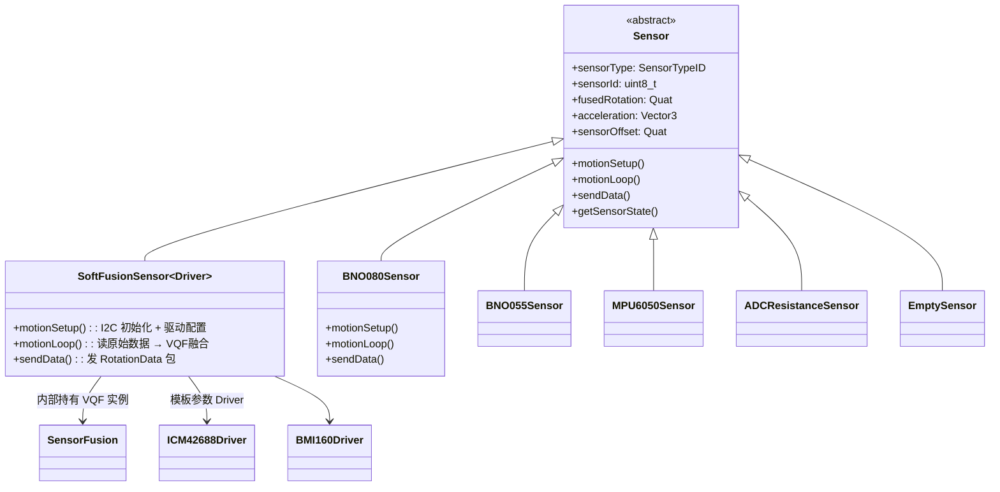

# SlimeVR 传感器抽象与驱动

## 一句话

> 虚基类 `Sensor` 定义统一接口，`SoftFusionSensor` 模板支持 12 种 IMU 即插即用，I2C 地址 + 寄存器映射自动适配。

## 类层次结构



## Sensor 虚基类核心接口

```cpp
class Sensor {
    virtual void motionSetup() = 0;   // I2C 初始化 + 传感器配置
    virtual void motionLoop() = 0;    // 每帧读取 + 融合
    virtual void sendData();          // 默认实现：发 RotationData + 传感器信息

    uint8_t sensorId;                 // SlimeVR 协议中的传感器编号
    SensorTypeID sensorType;          // 传感器类型枚举
    Quat sensorOffset;                // 安装偏置（板载安装方向补偿）
    Quat fusedRotation;               // VQF 输出的四元数
    Vector3 acceleration;             // 线性加速度
    SensorPosition m_SensorPosition;  // 身体位置（头部/胸部/手等）
};
```

`sensorOffset` 是板载 IMU 到身体坐标系的旋转变换——IMU 在 PCB 上的焊接方向不一定对齐人体轴，这个四元数补偿安装偏差。

## SoftFusionSensor — 模板多态驱动

`SoftFusionSensor<Driver>` 是 SlimeVR 的核心传感器实现，通过 C++ 模板参数选择 IMU 驱动：

| 模板参数 Driver | 对应芯片 | 接口 | 说明 |
|-----------------|----------|------|------|
| `icm42688::ICM42688` | ICM-42688-P | I2C/SPI | 6 轴 MEMS，陀螺 2.8mdps/√Hz |
| `icm45686::ICM45686` | ICM-45686 | I2C/SPI | 6 轴，最新一代 |
| `bmi160::BMI160` | BMI160 | I2C/SPI | 6 轴，低功耗 |
| `bmi270::BMI270` | BMI270 | I2C/SPI | 6 轴，高端消费级 |
| `lsm6ds3::LSM6DS3` | LSM6DS3TRC | I2C/SPI | 6 轴，STM 低端 |
| `lsm6dsv::LSM6DSV` | LSM6DSV | I2C/SPI | 6 轴，STM 高端 |
| `mpu6050::MPU6050` | MPU6050 | I2C | 6 轴，经典芯片 |

每个 Driver 声明了寄存器和配置，SoftFusionSensor 在编译期适配。核心数据路径：

SoftFusionSensor::motionLoop() data path:
1. Driver::readFIFO() — FIFO batch read of raw data
2. SensorFusion::update6D() / update9D():
   - vqf.updateAcc() — tilt correction
   - vqf.updateMag() — magnetic correction (9D only)
   - vqf.updateGyr() — gyro integration
3. SensorFusion::getQuaternion() — get quaternion
4. fusedRotation = quat * sensorOffset — mounting offset compensation
5. newFusedRotation = true

## ICM-42688-P 驱动细节

SlimeVR 固件对 ICM-42688-P 的驱动实现：

```cpp
// softfusion/drivers/icm42688.h
constexpr uint8_t I2C_ADDR = 0x68;  // 或 0x69 (AD0=HIGH)
constexpr uint8_t WHOAMI = 0x47;

// 初始化配置
Driver::setup() {
    writeRegister(BANK0, DEVICE_CONFIG, 0x01);  // 软复位
    writeRegister(BANK0, GYRO_CONFIG0, 0x06);   // 陀螺 ±2000dps, ODR 1kHz
    writeRegister(BANK0, ACCEL_CONFIG0, 0x06);  // 加计 ±16g, ODR 1kHz
    writeRegister(BANK0, FIFO_CONFIG1, 0x00);   // FIFO 使能
}

// 量程换算
constexpr float GYRO_SCALE  = 2000.0 / 32768.0;  // dps/LSB
constexpr float ACCEL_SCALE = 16.0  / 32768.0;  // g/LSB
```

## SensorManager — 传感器生命周期管理

```cpp
SensorManager::setup() {
    for (每个配置的传感器) {
        SensorBuilder::build(sensorConfig)
        // 1. 探测 I2C 地址 (WHOAMI 验证)
        // 2. new SoftFusionSensor<Driver>(...)
        // 3. sensor->motionSetup()    初始化 IMU
        // 4. m_Sensors.push_back(sensor)
    }
}

SensorManager::update() {
    for (auto& sensor : m_Sensors) {
        sensor->motionLoop();  // 读数据 + VQF 融合
        if (sensor->hasNewDataToSend())
            sensor->sendData();  // UDP 发送
    }
}
```

## 支持的 I2C 接口抽象

I2CImpl hierarchy:
- I2CWireSensorInterface (default Wire library)
- I2CPCAInterface (PCA9548A I2C multiplexer)
- DirectPinInterface (direct GPIO bit-banging)
- MCP23X17PinInterface (MCP23017 GPIO expander)

`I2CPCAInterface` 支持多 IMU 共享同一 I2C 总线（通过 PCA9548A 切换通道），解决同名 I2C 地址冲突。
