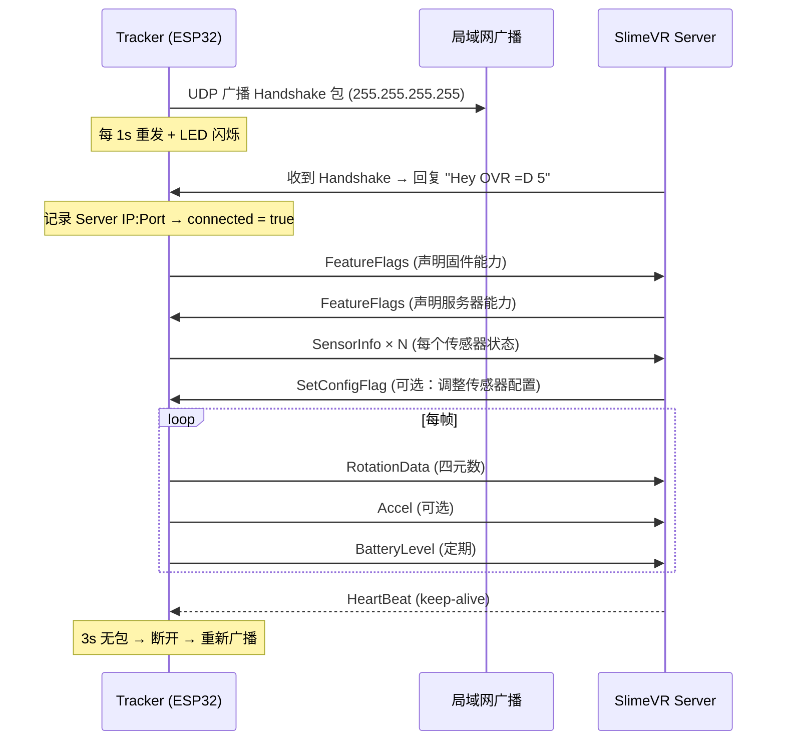

# SlimeVR UDP 网络协议

## 一句话

> UDP 广播发现 → "Hey OVR =D 5" 握手 → 大端序二进制包流式发送四元数，Bundle 机制合并多传感器数据为一个 UDP 数据报。

## 通信生命周期



## 握手协议

Tracker 发送 Handshake 包（type=3），内容：

| 字段 | 类型 | 说明 |
|------|------|------|
| Board ID | uint32 BE | 硬件板型编号 |
| IMU Type | uint32 BE | 第一个传感器的类型（向后兼容） |
| MCU Type | uint32 BE | ESP32=1, ESP8266=2 等 |
| (reserved ×3) | uint32 BE | 保留，填 0 |
| Firmware Build | uint32 BE | 协议版本号 |
| Firmware Version | length-prefixed string | 版本字符串 |
| MAC Address | 6 bytes | 唯一标识 |
| Tracker Type | uint8 | 普通/手套 |
| Vendor Name/URL | length-prefixed string | OEM 信息 |
| Product Name | length-prefixed string | 产品名 |
| Update URL/Name | length-prefixed string | OTA 地址 |

Server 回复：`[0x03] + "Hey OVR =D 5"`（共 13 字节），其中 `0x03` = `ReceivePacketType::Handshake`。

## 包格式

每个 UDP 包的结构：

Packet format: `[0x00][0x00][0x00][PacketType:1B][PacketNumber:uint64 BE][Payload...]`
- 3 bytes of 0x00 padding
- 1 byte packet type
- 8 bytes big-endian packet number
- Variable-length payload

Payload 用 `#pragma pack(push, 1)` 保证紧凑布局，所有多字节字段为**大端序**（Big-Endian）：

```cpp
template <typename T>
struct BigEndian {
    explicit BigEndian(T val) { value = swapEndianness(val); }
    operator T() const { return swapEndianness(value); }
    T value{};
};
```

## 上行包类型（Tracker → Server）

| Type | 名称 | Payload | 频率 |
|------|------|---------|------|
| 0 | HeartBeat | 无 | 响应 Server ping |
| 3 | Handshake | 设备信息 | 仅发现阶段 |
| 4 | Accel | `{x, y, z: float32 BE, sensorId: uint8}` | 可选 |
| 12 | BatteryLevel | `{voltage, percentage: float32 BE}` | ~1Hz |
| 13 | Tap | `{sensorId, value: uint8}` | 事件驱动 |
| 14 | Error | `{sensorId, error: uint8}` | 事件驱动 |
| 15 | SensorInfo | 传感器类型/状态/位置/配置 | 状态变化时 |
| 17 | **RotationData** | `{sensorId, dataType, x, y, z, w: float32 BE, accuracyInfo}` | **每帧** |
| 18 | MagnetometerAccuracy | `{sensorId, accuracy: float32 BE}` | 磁力计状态变化 |
| 19 | SignalStrength | `{sensorId=255, RSSI: uint8}` | 定期 |
| 20 | Temperature | `{sensorId, temperature: float32 BE}` | 定期 |
| 22 | FeatureFlags | 固件能力位图 | 首次连接 |
| 24 | AcknowledgeConfigChange | `{sensorId, configType}` | 响应配置变更 |
| 26 | FlexData | `{sensorId, flexLevel: float32 BE}` | 手套弯曲传感器 |
| 100 | Bundle | 多包合并 | 每帧（如启用） |

### RotationData 包详析（type=17）

```cpp
struct RotationDataPacket {
    uint8_t sensorId;       // 传感器编号 (0-255)
    uint8_t dataType;       // 1=NORMAL, 2=CORRECTION
    BigEndian<float> x;     // 四元数 X（大端序）
    BigEndian<float> y;     // 四元数 Y
    BigEndian<float> z;     // 四元数 Z
    BigEndian<float> w;     // 四元数 W
    uint8_t accuracyInfo;   // 校准精度等级 (0-255)
};
// 总大小: 1+1+4×4+1 = 19 字节（不含包头）
```

**dataType**: 
- `DATA_TYPE_NORMAL (1)`: VQF 标准四元数
- `DATA_TYPE_CORRECTION (2)`: 修正四元数（如 Yaw 重置）

**accuracyInfo**: 0=未校准, 255=完全校准。来自传感器内部校准状态。

### Bundle 机制（type=100）

减少 UDP 包数量——多个传感器数据合并为一个数据报：

Bundle packet = [PacketType=100] [PacketNumber] [BundleCount=N] [size_1: uint16] [inner_packet_1] [size_2: uint16] [inner_packet_2] ...

```cpp
// Connection::beginBundle() / endBundle()
bool beginBundle() {
    m_IsBundle = true;        // 后续 sendPacket 写入缓冲区
    m_BundlePacketInnerCount = 0;
}
bool endBundle() {
    m_IsBundle = false;
    // 发送 Bundle 包：type=100 + 所有 inner packet
    sendPacketType(SendPacketType::Bundle);
    sendPacketNumber();
    for (每个 inner packet)
        sendShort(size); sendBytes(data, size);
}
```

需要 Server 声明 `PROTOCOL_BUNDLE_SUPPORT` 特性后才启用。

## 下行包类型（Server → Tracker）

| Type | 名称 | 作用 |
|------|------|------|
| 1 | HeartBeat | Keep-alive 请求 |
| 2 | Vibrate | 触觉反馈（未实现） |
| 3 | Handshake | "Hey OVR =D 5" |
| 4 | Command | 远程命令 |
| 8 | Config | 传感器配置 |
| 10 | PingPong | 原包返回（延迟测量） |
| 15 | SensorInfo | 确认传感器状态 |
| 22 | FeatureFlags | 服务器能力声明 |
| 25 | SetConfigFlag | 运行时切换传感器参数 |

### SetConfigFlag 示例

```cpp
// Server 发送：禁用传感器 0 的磁力计
SetConfigFlagPacket {
    .sensorId = 0,
    .flag = SensorToggles::Magnetometer,  // enum 值
    .newState = false
}
// Firmware 处理：
sensor->setFlag(Magnetometer, false);
configuration.save();  // 持久化到 JSON
sendAcknowledgeConfigChange(0, Magnetometer);  // 确认
```

## 连接超时与重连

```cpp
#define TIMEOUT 3000UL  // 3 秒无数据 → 超时

void Connection::update() {
    if (m_LastPacketTimestamp + TIMEOUT < millis()) {
        m_Connected = false;
        m_ServerHost = IPAddress(255, 255, 255, 255);  // 切回广播
        // 下次 searchForServer() 重新广播 Handshake
    }
}
```

3 秒无心跳即断开，Tracker 自动回到广播发现模式。这是 UDP 无连接协议的标准做法——不需要显式断开，超时即清理。
