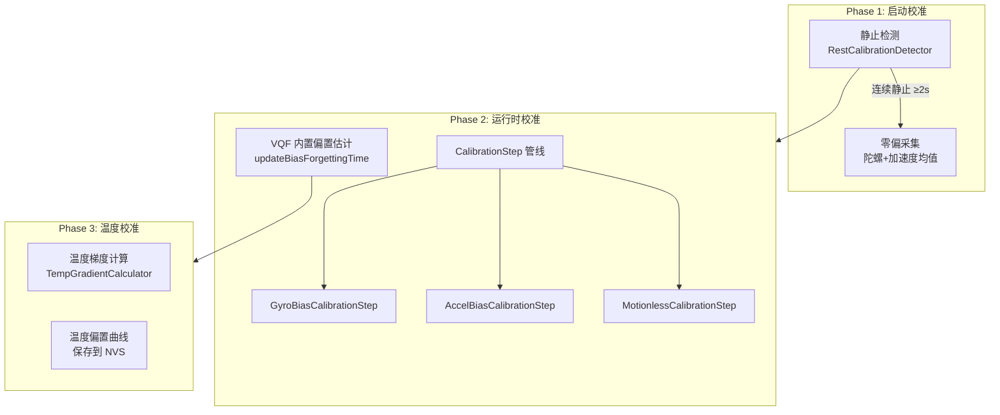

# SlimeVR 校准与配置

## 一句话

> 三级校准体系：静止校准（初始零偏）→ 运行时偏置估计（VQF 内置）→ 温度补偿（离线标定 + 在线修正）；配置用 JSON 持久化到 SPIFFS。

## 校准体系全景



## 1. 静止校准（Rest Calibration）

SlimeVR 对静止检测的实现：

```cpp
// RestCalibrationDetector — 独立于 VQF 的静止判断
class RestCalibrationDetector {
    bool isResting(gyroData, accelData) {
        // 滑动窗口内 gyro 方差 < 阈值
        // 且 accel 幅值变化 < 阈值
        // 持续 > restMinT (2.0s)
    }
};

// VQF 内置静止检测（精度更高）
bool SensorFusion::getRestDetected() const {
    return vqf.getRestDetected();
    // 基于陀螺幅值 + 加速度幅值 + 持续时间
}
```

两套检测协同工作：`RestCalibrationDetector` 用于初始零偏采集（需要高置信度），VQF 内置检测用于运行时偏置更新触发。

## 2. 运行时偏置估计

VQF 的 `updateBiasForgettingTime()` 控制陀螺偏置遗忘速度：

```cpp
// 默认遗忘时间 = τAcc × 10 ≈ 20s
// 更短 = 更快适应温度变化, 但噪声更大
// 更长 = 更稳定, 但对温度漂移反应慢
void SensorFusion::updateBiasForgettingTime(float biasForgettingTime);
```

`CalibrationStep` 管线提供更精细的控制：

| Step | 触发条件 | 动作 |
|------|----------|------|
| `GyroBiasCalibrationStep` | 连续静止 | 更新陀螺偏置均值 |
| `AccelBiasCalibrationStep` | 连续静止 | 更新加速度偏置均值 |
| `MotionlessCalibrationStep` | VQF 报静止 | 触发上述两步 |
| `SampleRateCalibrationStep` | 启动时 | 校准 IMU ODR 偏差 |
| `NullCalibrationStep` | — | 占位符（跳过校准） |

```cpp
// RuntimeCalibration — 按顺序执行 CalibrationStep 管线
class RuntimeCalibration {
    void update(gyroData, accelData, isResting) {
        for (auto& step : m_Steps) {
            step->update(gyroData, accelData, isResting);
        }
    }
};
```

## 3. 温度校准

MEMS 陀螺和加速度计存在温度漂移（~0.01 dps/°C），温度校准离线标定 + 在线查表修正：

```cpp
// TempGradientCalculator — 温度梯度跟踪
class TempGradientCalculator {
    void update(float temperature) {
        // 维护温度变化率
        // 温度稳定 → 触发偏置采集
        // 温度变化 → 暂停采集（等待热平衡）
    }
};

// SoftFusionCalibration — 温度偏置表
struct SoftFusionCalibration {
    struct TempPoint {
        float temperature;
        float gyroBias[3];
        float accelBias[3];
    };
    std::vector<TempPoint> table;  // 离线标定的温度-偏置曲线
};
```

离线标定流程：Tracker 放入温控箱 → 温度梯度扫描（-20°C~60°C）→ 每个温度点采集静止数据 → 线性插值生成偏置曲线。在线修正：查表 + 线性插值，每帧补偿。

> ⚠️ 存疑：温度校准功能的完整启用需要 NVS 存储和离线标定数据，SlimeVR 社区大多数 DIY tracker 没有这一流程，默认依赖 VQF 的在线偏置估计。

## 配置系统

```cpp
// Configuration — JSON 文件持久化到 SPIFFS
class Configuration {
    void setup() {
        // 从 /config.json 加载
        // 含每个传感器的：位置/类型/I2C地址/偏置/校准数据
    }
    void save() {
        // 写入 /config.json（去抖动，批量保存）
    }
};
```

典型 JSON 结构：

```json
{
  "version": 2,
  "sensors": [
    {
      "id": 0,
      "type": "ICM-42688-P",
      "position": "CHEST",
      "address": 104,
      "rotation": 0,
      "calibration": {
        "gyroBias": [0.001, -0.002, 0.0],
        "accelBias": [0.0, 0.0, 0.0]
      }
    }
  ]
}
```

配置通过 SlimeVR Server GUI 远程修改 → `SetConfigFlag` 包下发 → firmware 更新配置 → `save()` 持久化。

## 配置项速查（SensorToggles）

```cpp
enum class SensorToggles : uint16_t {
    Magnetometer    = 1 << 0,   // 启用/禁用磁力计
    Acceleration    = 1 << 1,   // 发送线性加速度包
    GestureControl  = 1 << 2,   // 手势控制
    SleepMode       = 1 << 3,   // 低功耗模式
    TapDetection    = 1 << 4,   // 敲击检测
    ExtendedData    = 1 << 5,   // 扩展数据（温度等）
};
```

## 三级校准对比

| 校准级别 | 触发时机 | 方法 | 精度 |
|----------|----------|------|------|
| 静止校准 | 上电静止 ≥2s | 均值采集 | 初始零偏 |
| 运行时偏置 | VQF 内置检测 | 在线遗忘滤波 | 漂移跟踪 |
| 温度补偿 | 温度梯度变化 | 离线标定+在线插值 | 全温区 |
