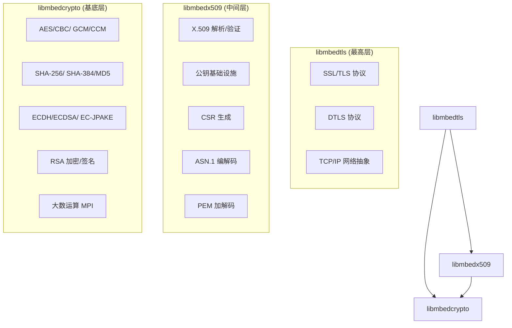
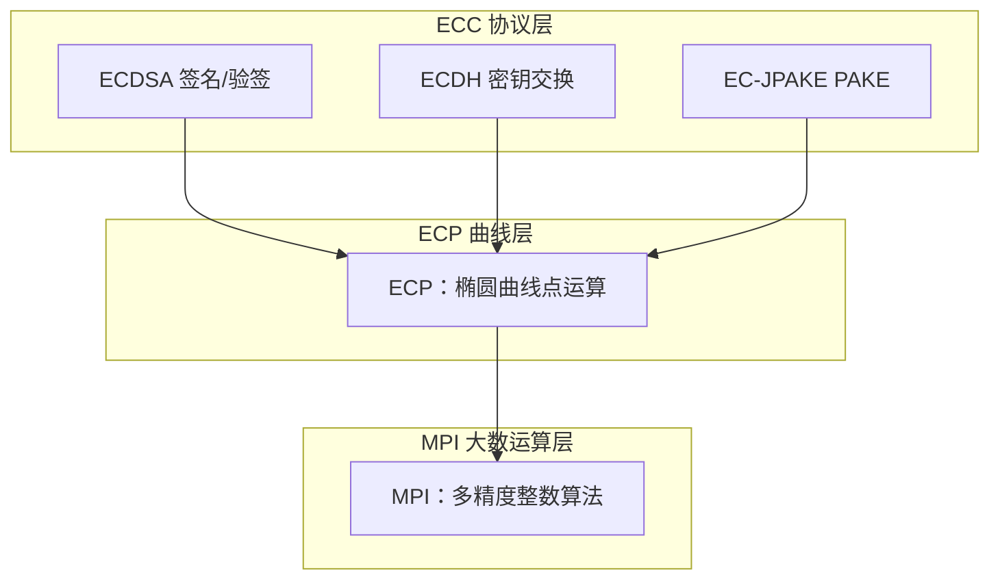
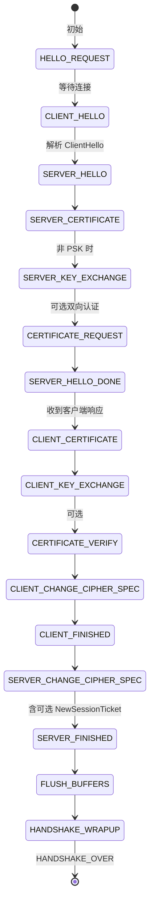
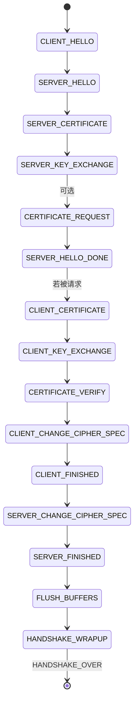
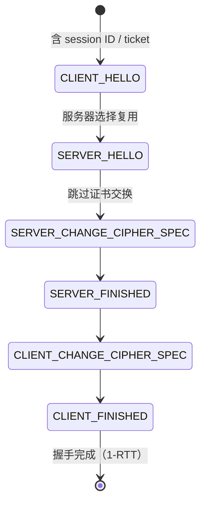
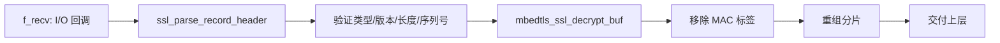
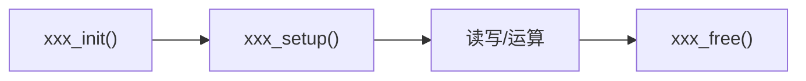

# mbedTLS 嵌入式 TLS 加密库架构分析

> mbedTLS（原名 PolarSSL）是 ARM 公司维护的开源嵌入式 TLS/SSL 加密库，采用 Apache 2.0 许可。设计目标是最小化代码体积和内存占用，与 OpenSSL 相比，其典型二进制体积小 20-50 倍，适合 MCU、FreeRTOS 等资源受限环境。库名从 PolarSSL → mbed TLS → mbedTLS 演进，v3.x 起正式更名 Mbed TLS。

## 目录

1. [[#整体架构模块化设计|整体架构：模块化设计]]
2. [[#Crypto 层深度解析|Crypto 层深度解析]]
3. [[#TLS 握手状态机|TLS 握手状态机]]
4. [[#平台抽象层 PAL|平台抽象层 PAL]]
5. [[#X.509 证书处理|X.509 证书处理]]
6. [[#SSL 记录层|SSL 记录层]]
7. [[#关键设计模式|关键设计模式]]
8. [[#与 FreeRTOS 的设计异同]]
9. [[#完整调用示例]]

---

## 整体架构：模块化设计

mbedTLS 采用**三层分离**的库架构，编译为三个独立的静态库：



### 三层职责

| 层级 | 库文件 | 头文件目录 | 依赖 | 代码量（估算） |
|------|--------|-----------|------|---------------|
| **Crypto** | `libmbedcrypto.a` | `include/mbedtls/` | 无 | ~15K 行 |
| **X.509** | `libmbedx509.a` | `include/mbedtls/` | libmbedcrypto | ~6K 行 |
| **TLS/SSL** | `libmbedtls.a` | `include/mbedtls/` | libmbedcrypto + libmbedx509 | ~25K 行 |

### config.h 编译定制系统

所有模块的可选性由**单一配置文件** `include/mbedtls/mbedtls_config.h`（v3.x+；v2.x 为 `config.h`）控制。该文件通过 C 预处理器宏实现模块级的条件编译，是 mbedTLS 最核心的设计决策之一。

**关键定制宏示例**：

```c
// 整个模块启用/禁用
#define MBEDTLS_AES_C            // 启用 AES 模块
#define MBEDTLS_ECP_C            // 启用椭圆曲线模块
#define MBEDTLS_SSL_PROTO_TLS1_2 // 启用 TLS 1.2
// #define MBEDTLS_SSL_PROTO_TLS1_3 // 注释掉 = 不编译 TLS 1.3

// 子功能精确控制
#define MBEDTLS_CIPHER_MODE_CBC  // AES-CBC 模式
#define MBEDTLS_CIPHER_MODE_GCM  // AES-GCM 模式
#define MBEDTLS_ECP_DP_SECP256R1_ENABLED  // secp256r1 曲线

// 平台适配
#define MBEDTLS_PLATFORM_C       // 平台抽象层
#define MBEDTLS_THREADING_C      // 线程安全支持
#define MBEDTLS_MEMORY_BUFFER_ALLOC_C // 静态内存池
```

**定制方式**：

1. **直接编辑** `mbedtls_config.h`
2. **外置配置**：编译时用 `-DMBEDTLS_CONFIG_FILE=\"my_config.h\"` 指定外部文件
3. **叠加覆写**：`-DMBEDTLS_USER_CONFIG_FILE=\"overrides.h\"` 在加载主配置后追加

**预置配置模板**（位于 `configs/` 目录）：

| 配置 | 描述 | 典型 ROM |
|------|------|----------|
| `config-default.h` | 全功能，调试/桌面 | ~100KB+ |
| `config-minimal-tls1_2.h` | 仅 TLS 1.2 客户端，最小集 | ~30KB |
| `config-suite-b.h` | NSA Suite B 合规集 | ~50KB |
| `config-thread.h` | 带线程安全的全功能 | ~110KB |

配置一致性在编译时自动检查（`check_config.h`），不兼容的组合会直接触发 `#error` 预处理器指令。

---

## Crypto 层深度解析

### 对称加密：AES 实现

AES 是 mbedTLS 中最核心的对称加密模块，支持 128/192/256 位密钥，符合 FIPS-197 标准。

**核心结构**：

```c
// include/mbedtls/aes.h
typedef struct mbedtls_aes_context {
    int nr;                 // 轮数：10 (128-bit), 12 (192-bit), 14 (256-bit)
    uint32_t *rk;           // 轮密钥数组指针
    uint32_t buf[68];       // 轮密钥数据缓冲区 (AES-256 最大需 60 字)
} mbedtls_aes_context;

typedef struct mbedtls_gcm_context {
    mbedtls_cipher_context_t cipher_ctx; // 底层 AES 上下文
    uint64_t HL[16];                     // GHASH 加速表
    uint64_t HH[16];
    uint8_t base_key[16];                // GHASH 子密钥
    // ... 其他 GCM 状态字段
} mbedtls_gcm_context;
```

**AES 模式 vs. 函数族**：

| 模式 | 上下文类型 | 关键函数 | 场景 |
|------|-----------|---------|------|
| ECB | `mbedtls_aes_context` | `mbedtls_aes_crypt_ecb()` | 仅密钥包装 |
| CBC | `mbedtls_aes_context` | `mbedtls_aes_crypt_cbc()` | 通用加密 |
| GCM | `mbedtls_gcm_context` | `mbedtls_gcm_crypt_and_tag()` | AEAD 首选 |
| CCM | `mbedtls_ccm_context` | `mbedtls_ccm_encrypt_and_tag()` | 802.15.4 等 |

**硬件加速**：通过 `MBEDTLS_AESNI_C`（x86 AES-NI）、`MBEDTLS_AESCE_C`（ARMv8-A AES-CE）、`MBEDTLS_PADLOCK_C`（VIA PadLock）等宏启用，运行时自动检测 CPU 特性。

### Cipher 抽象层

mbedTLS 提供一层**统一 cipher 接口**，所有对称加密算法通过这层虚拟化访问：

```c
// 关键结构体链
typedef struct mbedtls_cipher_context_t {
    const mbedtls_cipher_info_t *cipher_info; // 算法元信息（只读）
    int key_bitlen;                            // 密钥长度
    mbedtls_operation_t operation;             // 加密/解密
    void *cipher_ctx;                          // 下层算法特有上下文
    // ...
} mbedtls_cipher_context_t;

typedef struct mbedtls_cipher_info_t {
    mbedtls_cipher_type_t type;   // AES-128-CBC, AES-256-GCM 等
    const char *name;             // 文本名
    unsigned int key_bitlen;      // 密钥位数
    unsigned int iv_size;         // IV 大小
    unsigned int block_size;      // 分组大小
    // ...
} mbedtls_cipher_info_t;
```

**调用流程**：

```c
// 通用 cipher 加密流程
mbedtls_cipher_context_t ctx;
mbedtls_cipher_init(&ctx);
mbedtls_cipher_setup(&ctx, mbedtls_cipher_info_from_type(MBEDTLS_CIPHER_AES_128_GCM));
mbedtls_cipher_setkey(&ctx, key, 128, MBEDTLS_ENCRYPT);
mbedtls_cipher_set_iv(&ctx, iv, iv_len);
mbedtls_cipher_update(&ctx, input, input_len, output, &output_len);
mbedtls_cipher_finish(&ctx, output + output_len, &finish_len);
mbedtls_cipher_free(&ctx);
```

### Hash / HMAC

MD（Message Digest）层提供了 hash 算法的统一接口：

```c
// MD 信息结构定义
typedef struct mbedtls_md_info_t {
    mbedtls_md_type_t type; // SHA_256, SHA_384, MD5 等
    const char *name;
    int size;               // 摘要长度（字节）
    int block_size;         // 块大小
} mbedtls_md_info_t;

// 统一使用：
mbedtls_md_context_t ctx;
mbedtls_md_init(&ctx);
mbedtls_md_setup(&ctx, mbedtls_md_info_from_type(MBEDTLS_MD_SHA256), 1); // 1 = HMAC 模式
mbedtls_md_hmac_starts(&ctx, key, key_len);
mbedtls_md_hmac_update(&ctx, input, input_len);
mbedtls_md_hmac_finish(&ctx, output);
mbedtls_md_free(&ctx);
```

**支持的 hash 算法**（取决于编译配置）：
- SHA-1（逐渐弃用）、SHA-224、SHA-256、SHA-384、SHA-512
- MD2、MD4、MD5（兼容旧协议，Security Level 标记为低）
- RIPEMD-160

### ECC 椭圆曲线加密

ECC 是 mbedTLS 非对称加密的核心模块，同时也是 TLS 1.3 握手的基座。

**三层结构**：



**核心数据结构**：

```c
// MPI — 多精度整数（基底层）
typedef struct mbedtls_mpi {
    int s;                // 符号：1 正, -1 负, 0 零
    size_t n;             // 当前使用的 limb 数
    mbedtls_mpi_uint *p;  // limb 数组指针（32位系统 = uint32_t, 64位 = uint64_t）
} mbedtls_mpi;

// ECP 点 — 雅可比坐标
typedef struct mbedtls_ecp_point {
    mbedtls_mpi X;  // X 坐标
    mbedtls_mpi Y;  // Y 坐标
    mbedtls_mpi Z;  // Z 坐标（Z=0 ⇒ 无穷远点/零元）
} mbedtls_ecp_point;

// ECP 群 — 曲线参数
typedef struct mbedtls_ecp_group {
    mbedtls_ecp_group_id id; // 曲线标识（MBEDTLS_ECP_DP_SECP256R1 等）
    mbedtls_mpi P;           // 素域模数
    mbedtls_mpi A;           // Weierstrass: y² = x³ + Ax + B 中的 A
    mbedtls_mpi B;           // Weierstrass: 中的 B
    mbedtls_ecp_point G;     // 生成元
    mbedtls_mpi N;           // 生成元 G 的阶
    size_t pbits;            // P 的位数
    size_t nbits;            // N 的位数
    unsigned int h;
    int (*modp)(mbedtls_mpi *);       // 快速约简函数指针
    mbedtls_ecp_point *T;             // 预计算点 (comb 乘法)
    size_t T_size;                    // 预计算点数
    // ...
} mbedtls_ecp_group;

// ECP 密钥对
typedef struct mbedtls_ecp_keypair {
    mbedtls_ecp_group grp; // 曲线
    mbedtls_mpi d;         // 私钥（标量）
    mbedtls_ecp_point Q;   // 公钥（点）
} mbedtls_ecp_keypair;
```

**支持椭圆曲线**（通过编译宏激活）：
- **NIST 曲线**：secp192r1, secp224r1, secp256r1, secp384r1, secp521r1
- **Montgomery 曲线**：curve25519（X25519 密钥交换）、curve448
- 可通过 `MBEDTLS_ECP_DP_xxx_ENABLED` 系列宏精确裁剪

**MPI 的常数时间运算**：为防止侧信道攻击，mbedTLS 提供：
- `mbedtls_mpi_safe_cond_assign()` — 条件赋值（不分支）
- `mbedtls_mpi_safe_cond_swap()` — 条件交换（不分支）
- `mbedtls_mpi_lt_mpi_ct()` — 常数时间比较
- `mbedtls_mpi_exp_mod()` — 滑动窗口模幂（含指数盲化）

### RSA

RSA 模块（编译开关 `MBEDTLS_RSA_C`）支持：
- 密钥长度 1024~4096 位
- PKCS#1 v1.5 加密/签名
- OAEP 加密（SHA-256 等）
- PSS 签名（RSASSA-PSS）
- 盲化签名防时序攻击

```c
typedef struct mbedtls_rsa_context {
    int ver;                // 版本
    size_t len;             // 密钥字节长度
    mbedtls_mpi N;          // 模数
    mbedtls_mpi E;          // 公钥指数
    mbedtls_mpi D;          // 私钥指数
    mbedtls_mpi P;          // 素数 1
    mbedtls_mpi Q;          // 素数 2
    mbedtls_mpi DP;         // D mod (P-1)
    mbedtls_mpi DQ;         // D mod (Q-1)
    mbedtls_mpi QP;         // 1/Q mod P
    mbedtls_mpi RN;         // CRT 加速：Blinding R^N
    mbedtls_mpi RP;         // CRT 加速：Blinding R^P
    mbedtls_mpi RQ;         // CRT 加速：Blinding R^Q
    // ...
} mbedtls_rsa_context;
```

---

## TLS 握手状态机

mbedTLS 的握手是用**单步执行**状态机实现的。核心入口是 `mbedtls_ssl_handshake_step()`，由上下层的循环调用 `mbedtls_ssl_handshake()` 驱动。有独立的客户端和服务器端状态步进函数。

### 状态枚举（完整列表）

```c
// include/mbedtls/ssl.h
typedef enum {
    MBEDTLS_SSL_HELLO_REQUEST = 0,      // 起始状态
    MBEDTLS_SSL_CLIENT_HELLO,            // 1: ClientHello 发送/解析
    MBEDTLS_SSL_SERVER_HELLO,            // 2: ServerHello 发送/解析
    MBEDTLS_SSL_SERVER_CERTIFICATE,      // 3: 服务器证书
    MBEDTLS_SSL_SERVER_KEY_EXCHANGE,     // 4: 服务器密钥交换
    MBEDTLS_SSL_CERTIFICATE_REQUEST,     // 5: 可选证书请求
    MBEDTLS_SSL_SERVER_HELLO_DONE,       // 6: 服务器完成
    MBEDTLS_SSL_CLIENT_CERTIFICATE,      // 7: 客户端证书
    MBEDTLS_SSL_CLIENT_KEY_EXCHANGE,     // 8: 客户端密钥交换
    MBEDTLS_SSL_CERTIFICATE_VERIFY,      // 9: 客户端证书验证
    MBEDTLS_SSL_CLIENT_CHANGE_CIPHER_SPEC,// 10: 客户端 CCS
    MBEDTLS_SSL_CLIENT_FINISHED,         // 11: 客户端 Finished
    MBEDTLS_SSL_SERVER_CHANGE_CIPHER_SPEC,// 12: 服务端 CCS
    MBEDTLS_SSL_SERVER_FINISHED,         // 13: 服务端 Finished
    MBEDTLS_SSL_FLUSH_BUFFERS,          // 14: 刷新缓冲区
    MBEDTLS_SSL_HANDSHAKE_WRAPUP,       // 15: 收尾
    MBEDTLS_SSL_HANDSHAKE_OVER,         // 16: 握手完成
    MBEDTLS_SSL_SERVER_NEW_SESSION_TICKET,// 17: 可选 session ticket
    MBEDTLS_SSL_SERVER_HELLO_VERIFY_REQUEST_SENT, // 18: DTLS 专用
} mbedtls_ssl_states;
```

TLS 1.3 额外状态（条件编译 `MBEDTLS_SSL_PROTO_TLS1_3`）：
- `MBEDTLS_SSL_HELLO_RETRY_REQUEST`
- `MBEDTLS_SSL_ENCRYPTED_EXTENSIONS`
- `MBEDTLS_SSL_CLIENT_CERTIFICATE_VERIFY`
- 以及 CCS 兼容性模式的多个变体

### 服务端全握手状态机



### 客户端全握手状态机



### 简化握手（Session Resumption）



### 实现机制

核心是 `mbedtls_ssl_handshake_server_step()` 中的巨型 `switch` 语句（同层级函数 `mbedtls_ssl_handshake_client_step()` 结构对称）：

```c
int mbedtls_ssl_handshake_server_step(mbedtls_ssl_context *ssl) {
    if (ssl->state == MBEDTLS_SSL_HANDSHAKE_OVER || ssl->handshake == NULL)
        return MBEDTLS_ERR_SSL_BAD_INPUT_DATA;

    MBEDTLS_SSL_DEBUG_MSG(2, ("server state: %d", ssl->state));

    // DTLS 重传检查
    if (ssl->conf->transport == MBEDTLS_SSL_TRANSPORT_DATAGRAM &&
        ssl->handshake->retransmit_state == MBEDTLS_SSL_RETRANS_SENDING) {
        if ((ret = mbedtls_ssl_flight_transmit(ssl)) != 0)
            return ret;
    }

    switch (ssl->state) {
        case MBEDTLS_SSL_HELLO_REQUEST:
            ssl->state = MBEDTLS_SSL_CLIENT_HELLO;
            break;
        case MBEDTLS_SSL_CLIENT_HELLO:
            ret = ssl_parse_client_hello(ssl);
            break;
        case MBEDTLS_SSL_SERVER_HELLO:
            ret = ssl_write_server_hello(ssl);
            break;
        case MBEDTLS_SSL_SERVER_CERTIFICATE:
            ret = mbedtls_ssl_write_certificate(ssl);
            break;
        // ... 逐状态处理
        case MBEDTLS_SSL_HANDSHAKE_WRAPUP:
            mbedtls_ssl_handshake_wrapup(ssl);
            break;
    }
    return ret;
}
```

每个状态处理函数内部完成各自工作后，手动推进 `ssl->state` 到下一个状态。若底层 I/O 返回 `MBEDTLS_ERR_SSL_WANT_READ` 或 `MBEDTLS_ERR_SSL_WANT_WRITE`，状态机可在下一次调用从同一状态继续 — 这是**可恢复性（resumable）状态机**的核心特征，对非阻塞 I/O 至关重要。

### TLS 1.3 握手的差异

TLS 1.3 使用不同的消息序列，mbedTLS 通过独立的代码路径（`ssl_tls13_client.c`, `ssl_tls13_server.c`）实现：

| 阶段 | TLS 1.2 | TLS 1.3 |
|------|---------|---------|
| 密钥交换 | ClientHello → ServerKeyExchange → ClientKeyExchange | ClientHello + KeyShare → ServerHello + KeyShare |
| 证书 | 明文发送 | 加密后发送（EncryptedExtensions + Certificate） |
| 握手完成 | 4 次飞行（2-RTT） | 2 次飞行（1-RTT），0-RTT 可选 |
| 算法协商 | 在 ClientHello/ServerHello 中完成 | 类似，但无重协商 |

---

## 平台抽象层 PAL

PAL（Platform Abstraction Layer）定义在 `platform.h` 中，是 mbedTLS 实现跨平台可移植性的核心机制。它通过**编译时宏覆盖**和**运行时函数指针**两种方式，将标准 C 库依赖与库核心逻辑解耦。

### 内存分配器

```c
// 默认使用标准 C 库
#define MBEDTLS_PLATFORM_STD_CALLOC calloc
#define MBEDTLS_PLATFORM_STD_FREE   free

// 运行时替换（需 MBEDTLS_PLATFORM_MEMORY）
void mbedtls_platform_set_calloc_free(
    void *(*calloc_func)(size_t, size_t),
    void (*free_func)(void *));

// 静态替换（编译时宏）
#define MBEDTLS_PLATFORM_CALLOC_MACRO my_calloc
#define MBEDTLS_PLATFORM_FREE_MACRO   my_free
```

**内置静态内存池**：当定义 `MBEDTLS_MEMORY_BUFFER_ALLOC_C` 时，使用 `memory_buffer_alloc.c` 中的**固定大小缓冲池**，完全消除堆依赖：

```c
// 在 main 启动时初始化：给一个 32KB 静态数组
mbedtls_memory_buffer_alloc_init(buffer, sizeof(buffer));
// 之后所有 mbedtls_calloc/free 自动从此池分配
```

### 熵源抽象

熵模块（`MBEDTLS_ENTROPY_C`）将多个熵源聚合为统一的熵池：

```c
typedef struct mbedtls_entropy_context {
    int source_count;
    mbedtls_entropy_source_state source[MBEDTLS_ENTROPY_MAX_SOURCES];
    mbedtls_mpi_poll accumulator; // SHA-256 累积
    // ...
} mbedtls_entropy_context;

// 注册自定义熵源
int mbedtls_entropy_add_source(
    mbedtls_entropy_context *ctx,
    mbedtls_entropy_f_source_ptr f_source,  // 轮询函数
    void *p_source,
    size_t threshold,   // 所需最少熵比特
    int strong);        // 是否被视为强熵源
```

**平台熵源**（自动编译选择）：
- **Linux/Unix**：`/dev/urandom`，或 `getrandom()` 系统调用
- **Windows**：`BCryptGenRandom`（或传统 `CryptGenRandom`）
- **硬件**：`MBEDTLS_ENTROPY_HARDWARE_ALT` 宏 → 用户实现 `mbedtls_hardware_poll()`
- **NV Seed**：`MBEDTLS_ENTROPY_NV_SEED` → 非易失种子存储（适用于无 OS 设备）

### 定时/随机源

```c
// 定时回调（DTLS 必需）
void mbedtls_ssl_set_timer_cb(
    mbedtls_ssl_context *ssl,
    void *timer_ctx,
    mbedtls_ssl_set_timer_t f_set_timer,   // 设置超时
    mbedtls_ssl_get_timer_t f_get_timer);  // 查询剩余

// 随机数生成器（DRBG）
mbedtls_ssl_conf_rng(
    mbedtls_ssl_config *conf,
    int (*f_rng)(void *, unsigned char *, size_t),
    void *p_rng);
// 常用：mbedtls_ctr_drbg_random (CTR_DRBG, AES-256)
```

### FreeRTOS 移植要点

将 mbedTLS 移植到 FreeRTOS 需要覆盖三个关键方面：

#### 1. 内存分配

```c
// 直接将 pvPortMalloc/vPortFree 接入 mbedTLS
mbedtls_platform_set_calloc_free(
    platform_calloc,  // 封装 pvPortMalloc + memset 归零
    platform_free     // 封装 vPortFree
);

static void *platform_calloc(size_t nmemb, size_t size) {
    size_t total = nmemb * size;
    void *p = pvPortMalloc(total);
    if (p) memset(p, 0, total);
    return p;
}

static void platform_free(void *ptr) {
    vPortFree(ptr);
}
```

#### 2. 线程/互斥锁

```c
// 定义 MBEDTLS_THREADING_C + MBEDTLS_THREADING_ALT
// 然后注册 FreeRTOS 互斥量实现：

void mbedtls_platform_mutex_init(mbedtls_threading_mutex_t *mutex) {
    *mutex = xSemaphoreCreateMutex();
}

void mbedtls_platform_mutex_lock(mbedtls_threading_mutex_t *mutex) {
    xSemaphoreTake(*mutex, portMAX_DELAY);
}

void mbedtls_platform_mutex_unlock(mbedtls_threading_mutex_t *mutex) {
    xSemaphoreGive(*mutex);
}

void mbedtls_platform_mutex_free(mbedtls_threading_mutex_t *mutex) {
    vSemaphoreDelete(*mutex);
}

// 注册
mbedtls_threading_set_alt(
    mbedtls_platform_mutex_init,
    mbedtls_platform_mutex_lock,
    mbedtls_platform_mutex_unlock,
    mbedtls_platform_mutex_free
);
```

#### 3. 熵源

```c
// FreeRTOS + MCU 典型：使用硬件 TRNG（如 ESP32 RNG, STM32 RNG）
int mbedtls_hardware_poll(void *data, unsigned char *output, size_t len,
                           size_t *olen) {
    for (size_t i = 0; i < len; i++) {
        output[i] = (unsigned char)(RNG_GetRandomNumber() & 0xFF);
    }
    *olen = len;
    return 0;
}
```

#### 4. I/O 回调

mbedTLS 不直接调用 socket API，而是通过回调：

```c
// 设置 BIO — FreeRTOS+TCP 或 lwIP 适配
mbedtls_ssl_set_bio(
    &ssl,
    &net_context,
    mbedtls_net_send,     // 或自定义 send
    mbedtls_net_recv,     // 或自定义 recv
    mbedtls_net_recv_timeout  // 或 NULL
);
```

---

## X.509 证书处理

X.509 模块（`libmbedx509`）处理 PKI（Public Key Infrastructure）的所有功能，构建在 `libmbedcrypto` 和 ASN.1 编解码器之上。

### 核心结构

```c
typedef struct mbedtls_x509_crt {
    mbedtls_asn1_buf raw;        // 原始 DER 数据
    mbedtls_asn1_buf tbs;        // TBS 部分

    int version;                 // v1/v2/v3
    mbedtls_asn1_buf serial;     // 序列号
    mbedtls_asn1_buf sig_oid;    // 签名算法 OID

    mbedtls_x509_name issuer;    // 颁发者（链表）
    mbedtls_x509_name subject;   // 主题

    mbedtls_x509_time valid_from; // 有效起始
    mbedtls_x509_time valid_to;   // 有效截止

    mbedtls_pk_context pk;        // 公钥
    mbedtls_asn1_buf issuer_raw;  // 颁发者原始字节
    mbedtls_asn1_buf subject_raw; // 主题原始字节

    // v3 扩展
    unsigned char v3_ext;         // v3 扩展存在
    int ca_istrue;                // BasicConstraints: CA
    int max_pathlen;              // 路径长度约束
    unsigned int key_usage;       // KeyUsage 位掩码
    mbedtls_asn1_sequence subject_alt_names; // SAN
    mbedtls_x509_buf certificate_policies;   // 证书策略
    mbedtls_x509_buf ext_key_usage;          // 扩展密钥用途

    // 签名
    mbedtls_asn1_buf sig;         // 签名值
    mbedtls_md_type_t sig_md;     // 签名摘要算法
    mbedtls_pk_type_t sig_pk;     // 签名公钥算法

    struct mbedtls_x509_crt *next; // 链表 → 证书链
} mbedtls_x509_crt;
```

### 懒解析设计

mbedTLS 的 X.509 解析采用**懒解析**策略：原始 DER 数据被 `mbedtls_asn1_buf`（数据指针+长度）引用，而非全部拷贝。只有需要结构化访问的字段才解码为原生类型：

```c
typedef struct mbedtls_asn1_buf {
    int tag;                      // ASN.1 标签
    size_t len;                   // 数据长度
    unsigned char *p;             // 指向原始 DER 的指针
} mbedtls_asn1_buf;
```

### 解析函数

```c
// DER 解析（制作内部拷贝）
int mbedtls_x509_crt_parse_der(mbedtls_x509_crt *chain,
                                const unsigned char *buf, size_t buflen);

// DER 无拷贝解析（节省 RAM，后者必须保持有效）
int mbedtls_x509_crt_parse_der_nocopy(mbedtls_x509_crt *chain,
                                       const unsigned char *buf, size_t buflen);

// PEM 或 DER 自动检测
int mbedtls_x509_crt_parse(mbedtls_x509_crt *chain,
                            const unsigned char *buf, size_t buflen);

// 文件接口
int mbedtls_x509_crt_parse_file(mbedtls_x509_crt *chain, const char *path);
int mbedtls_x509_crt_parse_path(mbedtls_x509_crt *chain, const char *path);
```

### 链验证

```c
// 基本验证
int mbedtls_x509_crt_verify(
    mbedtls_x509_crt *crt,          // 待验证证书链
    mbedtls_x509_crt *trust_ca,     // 受信 CA 列表
    mbedtls_x509_crl *ca_crl,       // CRL（可选）
    const char *cn,                  // 期望 CN
    uint32_t *flags,                 // 输出验证标志
    int (*f_vrfy)(void *, mbedtls_x509_crt *, int, uint32_t *),
    void *p_vrfy);

// 带安全策略的验证
int mbedtls_x509_crt_verify_with_profile(
    mbedtls_x509_crt *crt,
    mbedtls_x509_crt *trust_ca,
    mbedtls_x509_crl *ca_crl,
    const mbedtls_x509_crt_profile *profile, // 安全策略
    const char *cn, uint32_t *flags,
    int (*f_vrfy)(void *, mbedtls_x509_crt *, int, uint32_t *),
    void *p_vrfy);

// 可中断验证（ECC 重入）
int mbedtls_x509_crt_verify_restartable(
    mbedtls_x509_crt *crt,
    mbedtls_x509_crt *trust_ca,
    mbedtls_x509_crl *ca_crl,
    const mbedtls_x509_crt_profile *profile,
    const char *cn, uint32_t *flags,
    int (*f_vrfy)(void *, mbedtls_x509_crt *, int, uint32_t *),
    void *p_vrfy,
    mbedtls_x509_crt_restart_ctx *rs_ctx); // 断点续传上下文
```

**验证步骤**（RFC 5280）：
1. **链构建**：从叶子证书向上搜索颁发者，形成证书链
2. **签名验证**：每个证书的签名由父证书公钥验证（`pk_verify()`）
3. **有效期检查**：`valid_from` / `valid_to` vs. 当前时间
4. **扩展检查**：`ca_istrue` 约束、`max_pathlen`、`key_usage`（如 `MBEDTLS_X509_KU_KEY_CERT_SIGN`）
5. **吊销检查**：如提供 CRL，检查序列号
6. **名称检查**：叶子证书 CN/SAN 匹配期望主机名

**预定义安全策略**：

```c
// 默认：允许 SHA-256+, RSA 2048+, ECC 256+
extern const mbedtls_x509_crt_profile mbedtls_x509_crt_profile_default;

// 下一版本：SHA-256+, RSA 2048+, ECC 256+
extern const mbedtls_x509_crt_profile mbedtls_x509_crt_profile_next;

// NSA Suite B: SHA-256/384, ECDSA P-256/384
extern const mbedtls_x509_crt_profile mbedtls_x509_crt_profile_suiteb;
```

### CSR 生成

```c
// X.509 CSR (PKCS#10) 生成
mbedtls_x509write_csr csr;
mbedtls_x509write_csr_init(&csr);
mbedtls_x509write_csr_set_md_alg(&csr, MBEDTLS_MD_SHA256);
mbedtls_x509write_csr_set_key(&csr, &keypair);
mbedtls_x509write_csr_set_subject_name(&csr, "CN=MyDevice,O=Home,C=CN");
// 添加 SAN 扩展
mbedtls_x509write_csr_set_extension(&csr, ...);

// DER 输出（反向编组）
mbedtls_x509write_csr_der(&csr, output_buf, sizeof(output_buf), f_rng, &rng);
mbedtls_x509write_csr_free(&csr);
```

X.509 输出采用**反向编组**（back-to-front DER encoding）：所有 `mbedtls_asn1_write_*` 函数从缓冲区的末尾向前写，这样外层标签自动包围内层内容，无需两次扫描。

---

## SSL 记录层

SSL 记录层位于传输层之上、握手/应用层之下，负责将上层的消息分片加密，并通过 I/O 回调发送。

### 记录结构

TLS 记录（TLSPlaintext）的线缆格式为：

```
+---------+----------+-----------+---------------------------+
| 1 byte  | 2 bytes  | 2 bytes   | up to 2^14 bytes          |
| Type    | Version  | Length    | Fragment                  |
+---------+----------+-----------+---------------------------+
|          Record Header (5 bytes)         | Record Payload     |
+-----------------------------------------+--------------------+
```

**内容类型**：ChangeCipherSpec(20), Alert(21), Handshake(22), Application(23)

### 内部数据结构

```c
// ssl_internal.h — 记录层内部表示
typedef struct mbedtls_record {
    unsigned char ctr[8];       // 隐式序列号（TLS）或 epoch+seq（DTLS）
    unsigned char type;          // 内容类型
    unsigned char ver[2];        // 线缆版本

    unsigned char *buf;          // 记录缓冲区
    size_t buf_len;              // 缓冲区大小
    size_t data_offset;          // 数据在 buf 中的偏移
    size_t data_len;             // 数据实际长度

    // DTLS 透传支持
    unsigned char *extra_data;   // CID 等
    size_t extra_len;
} mbedtls_record;

// 加密变换状态
typedef struct mbedtls_ssl_transform {
    uint32_t cipher_ctx_enc;             // 加密上下文
    uint32_t cipher_ctx_dec;
    mbedtls_md_context_t md_ctx_enc;     // MAC 上下文
    mbedtls_md_context_t md_ctx_dec;
    int ivlen;                           // IV 长度
    int fixed_ivlen;                     // 固定部分 IV 长度
    unsigned char iv_enc[16];            // 写 IV
    unsigned char iv_dec[16];            // 读 IV
    size_t minlen;                       // 最小记录长度
    size_t maclen;                       // MAC 标签长度
    size_t taglen;                       // AEAD 标签长度
    int encrypt_then_mac;                // EtM 模式
} mbedtls_ssl_transform;
```

### 记录处理流程

**发送路径**：


**接收路径**：



### 记录层接口

```c
// 核心读取（内部使用）
static int mbedtls_ssl_read_record(mbedtls_ssl_context *ssl,
                                    unsigned update_hs_digest);
// 写入（内部使用）
static int mbedtls_ssl_write_record(mbedtls_ssl_context *ssl,
                                     unsigned char fuzz);

// 应用层 API（封装了记录层）
int mbedtls_ssl_read(mbedtls_ssl_context *ssl,
                     unsigned char *buf, size_t len);
int mbedtls_ssl_write(mbedtls_ssl_context *ssl,
                      const unsigned char *buf, size_t len);
```

**序列号管理**：每个方向（读/写）独立维护 8 字节序列号，每条记录后递增。序列号达到 `2^64-1` 时必须重新协商（mbedTLS 返回 `MBEDTLS_ERR_SSL_BAD_INPUT_DATA`）。

---

## 关键设计模式

### 1. init / setup / free 生命周期模式

这是 mbedTLS 中最普遍的设计模式，**每个对象**都遵循相同三阶段生命周期：



**规则**：
- `xxx_init()`：将结构体清零/设默认值，且**不可失败**（无返回值）
- `xxx_setup()`：绑定下层资源、分配内存、可能返回错误
- `xxx_free()`：释放资源并再次 init（可重新 setup）

这种模式贯穿所有模块：

| 模块 | init | setup/set* | free |
|------|------|-----------|------|
| SSL | `mbedtls_ssl_init()` | `mbedtls_ssl_setup()` | `mbedtls_ssl_free()` |
| CIPHER | `mbedtls_cipher_init()` | `mbedtls_cipher_setup()` | `mbedtls_cipher_free()` |
| RSA | `mbedtls_rsa_init()` | `mbedtls_rsa_check_pubkey()` | `mbedtls_rsa_free()` |
| X509 CRT | `mbedtls_x509_crt_init()` | `mbedtls_x509_crt_parse()` | `mbedtls_x509_crt_free()` |
| CTR_DRBG | `mbedtls_ctr_drbg_init()` | `mbedtls_ctr_drbg_seed()` | `mbedtls_ctr_drbg_free()` |

**FreeRTOS 类比**：这类似 FreeRTOS 的 `xTaskCreateStatic()` 模式，其中静态分配的任务在创建前就预分配好 TCB 和栈，创建后进行配置，需要时删除。mbedTLS 的 `xxx_init()` + `xxx_setup()` 对应 FreeRTOS 的 "分配静态资源 → 初始化 → 启动" 的分阶段模式。

### 2. 上下文结构体 + 函数指针

mbedTLS 大量使用**结构体嵌入函数指针**来实现多态。典型例子：

```c
// ECP 群的蒙哥马利约简函数指针
typedef struct mbedtls_ecp_group {
    // ... 字段 ...
    int (*modp)(mbedtls_mpi *);        // 快速约简（多态：不同曲线不同实现）
    // ... 预计算 ...
} mbedtls_ecp_group;

// Cipher 虚函数表（cipher_wrap.c）
typedef struct {
    mbedtls_cipher_type_t type;
    int (*ctx_alloc_func)(void **ctx);    // 分配算法特定上下文
    void (*ctx_free_func)(void *ctx);     // 释放
    int (*setkey_enc_func)(void *ctx, const unsigned char *key, size_t bitlen);
    int (*setkey_dec_func)(void *ctx, const unsigned char *key, size_t bitlen);
    int (*crypt_func)(void *ctx, size_t length, ...);
    // ...
} mbedtls_cipher_base_t;
```

**FreeRTOS 类比**：这类似于 FreeRTOS 内部 `List_t` 的结构体函数模式（`uxNumberOfItems`、`pxIndex` 等字段），以及 `xQueueCreate` 返回的 `QueueHandle_t` 背后通过指针间接调用不同队列类型实现的设计。FreeRTOS 的函数指针隐藏较少，而 mbedTLS 通过嵌入的 "vtable" 实现了更彻底的 C 语言 OOP。

### 3. 错误码约定

mbedTLS 错误码定义在 `error.h` 中，核心规则：

- **始终为负**：`int` 返回值的负数区间表示错误，0 或正数表示成功
- **16 位编码**：范围 `-0x0001` 到 `-0x7FFF`（兼容 16 位平台）
- **分层叠加**：高 3 位 = 高层模块 ID + 低 7 位 = 低层模块错误，两者可相加

```c
// 错误码位分布
// +---+---+---+---+---+---+---+---+---+---+---+---+---+---+---+---+
// |              |   High 3-bit  | Err 5-bit     | Low 7-bit       |
// +---+---+---+---+---+---+---+---+---+---+---+---+---+---+---+---+

// 示例：X.509 解析失败 + ASN.1 错误
// MBEDTLS_ERR_X509_INVALID_FORMAT + MBEDTLS_ERR_ASN1_INVALID_LENGTH
return -0x4F80 + -0x006C; // = 合成错误

// 典型值
#define MBEDTLS_ERR_MPI_BAD_INPUT_DATA        -0x0004
#define MBEDTLS_ERR_AES_INVALID_KEY_LENGTH    -0x0020
#define MBEDTLS_ERR_CIPHER_FULL_BLOCK_EXPECTED -0x4000
#define MBEDTLS_ERR_SSL_INVALID_RECORD        -0x6C00
```

**错误分类**（按高层模块 ID）：

| 模块 ID | 范围 | 示例 |
|---------|------|------|
| 1 (PEM) | `-0x1000` 起 | `MBEDTLS_ERR_PEM_NO_HEADER_FOOTER_PRESENT` |
| 2 (X509) | `-0x2000` 起 | `MBEDTLS_ERR_X509_INVALID_FORMAT` |
| 3 (DHM) | `-0x3000` 起 | `MBEDTLS_ERR_DHM_BAD_INPUT_DATA` |
| 4 (RSA) | `-0x4000` 起 | `MBEDTLS_ERR_RSA_BAD_INPUT_DATA` |
| 5 (MD) | `-0x5000` 起 | `MBEDTLS_ERR_MD_FEATURE_UNAVAILABLE` |
| 6 (CIPHER) | `-0x6000` 起 | `MBEDTLS_ERR_CIPHER_AUTH_FAILED` |
| 7 (SSL) | `-0x7000` 起 | `MBEDTLS_ERR_SSL_PEER_CLOSE_NOTIFY` |

调试辅助：`mbedtls_strerror(err, buf, bufsize)` 将错误码转为可读文本。

### 4. 非阻塞 I/O 契约

与 OpenSSL 风格相同，mbedTLS 通过特定返回值实现非阻塞：

```c
// 上层循环写法
while ((ret = mbedtls_ssl_handshake(&ssl)) != 0) {
    if (ret != MBEDTLS_ERR_SSL_WANT_READ &&
        ret != MBEDTLS_ERR_SSL_WANT_WRITE) {
        // 真正错误
        break;
    }
    // 让出 CPU 等待 I/O（RTOS 场景：vTaskDelay）
    // 然后重试
}
```

`MBEDTLS_ERR_SSL_WANT_READ` / `MBEDTLS_ERR_SSL_WANT_WRITE` 是**可恢复错误** — 调用者必须保留上下文，在 I/O 就绪后重新调用相同的函数。这是状态机能够停在中间状态的核心。

---

## 与 FreeRTOS 的设计异同

| 设计维度 | mbedTLS | FreeRTOS | 分析 |
|---------|---------|----------|------|
| **配置系统** | 单头文件宏开关 (`mbedtls_config.h`)，`check_config.h` 验证一致性 | `FreeRTOSConfig.h` 全局配置，参数验证在运行时 | **高度相似**：都是单文件的 C 预处理器配置，但 FreeRTOS 缺少编译时一致性检查，错误更晚暴露 |
| **对象生命周期** | `init → setup → [use] → free` 三阶段，`free` 后回到 init 状态 | `xTaskCreate → [运行] → vTaskDelete` 两阶段，无 "回到 init" 概念 | mbedTLS 更易"重置复用"，FreeRTOS 的删除再创建更彻底 |
| **静态分配** | `MBEDTLS_MEMORY_BUFFER_ALLOC_C` 静态池 | `configSUPPORT_STATIC_ALLOCATION` + `StaticTask_t` | **功能等价**：均提供完全不依赖堆的选项，适合安全关键系统 |
| **错误码** | 16-bit 负值分层编码 | 函数返回 `pdPASS` / `pdFAIL` / `errQUEUE_FULL` 等 | mbedTLS 更精细（错误叠加），FreeRTOS 更简单 |
| **多态实现** | 嵌入 vtable 式函数指针结构体 | 函数指针较少（`xQueueCreate` 背后有队列/队列集等变体，但通过编译时宏而非函数指针） | mbedTLS 运行时多态更灵活；FreeRTOS 编译时多态更省 ROM/避免间接跳转 |
| **状态机** | 显式 enum 状态 + switch + 持久的 context 状态 | 隐式：任务状态（Ready/Blocked/Suspended）在调度器内部维护 | mbedTLS 握手状态机更"用户可见"（状态可查询/可持久化）；FreeRTOS 调度器状态机对应用层透明 |
| **I/O 抽象** | 函数指针回调 (`f_send`/`f_recv`) | 无内置 I/O 抽象（FreeRTOS+TCP 提供独立 API） | mbedTLS 更灵活，任何传输层都可接入 |
| **可重入** | `MBEDTLS_THREADING_C` → 互斥锁保护全局状态 | 所有 API 要求单线程使用者或外部临界区 | FreeRTOS 更简单（单核裸调度器默认无重入问题）；mbedTLS 显式处理多线程场景 |
| **内存使用** | 预先申明结构体大小（`sizeof` 已知），可放在静态区 | 动态创建队列/信号量返回句柄 | mbedTLS 的结构体（如 `mbedtls_ssl_context` 约 2-4KB）通常作为全局或静态分配；FreeRTOS 队列等通常动态分配 |

---

## 完整调用示例

以下是一个典型的 mbedTLS 客户端 TLS 连接流程（结合 FreeRTOS 风格）：

```c
// ================ 0. 初始化全局 ================
mbedtls_entropy_context entropy;
mbedtls_ctr_drbg_context ctr_drbg;
mbedtls_ssl_context ssl;
mbedtls_ssl_config conf;
mbedtls_x509_crt cacert;

mbedtls_entropy_init(&entropy);
mbedtls_ctr_drbg_init(&ctr_drbg);
mbedtls_ssl_init(&ssl);
mbedtls_ssl_config_init(&conf);
mbedtls_x509_crt_init(&cacert);

// ================ 1. 设置随机数生成器 ================
mbedtls_ctr_drbg_seed(&ctr_drbg, mbedtls_entropy_func, &entropy,
                      (const unsigned char *)"my_app", 6);

// ================ 2. 加载 CA 证书 ================
mbedtls_x509_crt_parse(&cacert, (const unsigned char *)ca_cert_pem,
                        strlen(ca_cert_pem) + 1);

// ================ 3. 配置 SSL ================
mbedtls_ssl_config_defaults(&conf, MBEDTLS_SSL_IS_CLIENT,
                            MBEDTLS_SSL_TRANSPORT_STREAM,
                            MBEDTLS_SSL_PRESET_DEFAULT);
mbedtls_ssl_conf_authmode(&conf, MBEDTLS_SSL_VERIFY_REQUIRED);
mbedtls_ssl_conf_ca_chain(&conf, &cacert, NULL);
mbedtls_ssl_conf_rng(&conf, mbedtls_ctr_drbg_random, &ctr_drbg);

// ================ 4. 设置连接上下文 ================
mbedtls_ssl_setup(&ssl, &conf);
mbedtls_ssl_set_hostname(&ssl, "example.com");

// 设置 BIO（以 mbedtls_net 为例，FreeRTOS+TCP/lwIP 适配同理）
mbedtls_net_connect(&net_ctx, "example.com", "443", MBEDTLS_NET_PROTO_TCP);
mbedtls_ssl_set_bio(&ssl, &net_ctx,
                    mbedtls_net_send, mbedtls_net_recv, NULL);

// ================ 5. 握手 ================
while ((ret = mbedtls_ssl_handshake(&ssl)) != 0) {
    if (ret != MBEDTLS_ERR_SSL_WANT_READ &&
        ret != MBEDTLS_ERR_SSL_WANT_WRITE) {
        // 错误处理
        break;
    }
    // 非阻塞 I/O: 等待 socket 就绪
    taskYIELD();  // FreeRTOS 让出 CPU
}

// ================ 6. 读写数据 ================
mbedtls_ssl_write(&ssl, request, strlen(request));
mbedtls_ssl_read(&ssl, buf, sizeof(buf));

// ================ 7. 清理 ================
mbedtls_ssl_close_notify(&ssl);
mbedtls_net_free(&net_ctx);
mbedtls_x509_crt_free(&cacert);
mbedtls_ssl_free(&ssl);
mbedtls_ssl_config_free(&conf);
mbedtls_ctr_drbg_free(&ctr_drbg);
mbedtls_entropy_free(&entropy);
```

---

## 总结

mbedTLS 的设计哲学可归纳为：

1. **精确裁剪**：通过 `mbedtls_config.h` 的宏开关在编译期精确控制功能集，避免任何运行时的 "if 检查" 开销
2. **零初始化**：所有 `xxx_init()` 都是零开销的赋值或清零，不会分配资源；所有资源分配延迟到 `xxx_setup()`
3. **上下文隔离**：每个连接有独立 `mbedtls_ssl_context`，全局状态（熵、配置）通过函数指针注入
4. **传输无感**：通过 `f_send/f_recv` 回调与任何传输层解耦（TCP、UDP、串口、CAN 均可）
5. **常量时间**：关键加密路径实现侧信道防护（MPI 条件赋值、CBC MAC 的常量时间比较、Montgomery ladder）
6. **可恢复状态机**：非阻塞场景下，状态机可停在任意中间状态，外部 I/O 就绪后无缝继续
