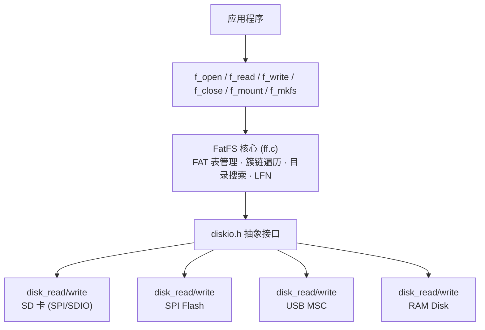

# FatFS 概述与架构

## 定位

FatFS 是 ChaN (Eiji Nishida) 开发的通用 FAT 文件系统模块，是嵌入式领域使用最广泛的文件系统实现。整个核心仅一个 `ff.c` 文件（R0.16 实测 7,249 行 ANSI C），支持 FAT12/16/32 和 exFAT。

## 二层架构



> [!note] 与 FreeRTOS 移植层的类比
> FatFS 的 `diskio` 层就是 FreeRTOS 的 `port` 层——核心代码零平台依赖，移植者只需实现 5-6 个函数。

## 核心状态结构

### FATFS — 每卷状态

```c
typedef struct {
    BYTE    fs_type;       // FS_FAT12, FS_FAT16, FS_FAT32, FS_EXFAT
    BYTE    pdrv;          // 物理驱动器号
    BYTE    n_fats;        // FAT 表份数
    BYTE    wflag;         // 扇区窗口脏标志
    BYTE    csize;         // 每簇扇区数
    WORD    n_rootdir;     // 根目录条目数 (FAT12/16)
    DWORD   fatbase;       // FAT 表起始 LBA
    DWORD   dirbase;       // 根目录起始 LBA / 簇号
    DWORD   database;      // 数据区起始 LBA
    DWORD   winsect;       // win[] 中缓存的当前扇区号
    BYTE    win[FF_MAX_SS];// **单扇区窗口缓冲区** — 关键 RAM 节省设计
    DWORD   last_clst;     // 最后分配的簇 (分配提示)
    DWORD   free_clst;     // 空闲簇计数 (0xFFFFFFFF = 未知)
    DWORD   fsize;         // 每 FAT 扇区数
} FATFS;
```

**单扇区窗口 `win[]`** 是 FatFS 最重要的设计决策：所有元数据读取（目录条目、FAT 表扇区）都经过这个惟一的扇区缓存。`move_window(fs, sector)` 函数实现惰性加载：

```c
// 伪代码
if (sector != fs->winsect) {
    if (fs->wflag) sync_window(fs);   // 写回脏缓冲
    disk_read(fs->pdrv, fs->win, sector, 1);  // 加载新扇区
    fs->winsect = sector;
    fs->wflag = 0;
}
```

### FIL — 每文件状态

```c
typedef struct {
    FFOBJID obj;          // 指向所属 FATFS 的链接
    BYTE    flag;         // FA_OPENED, FA_DIRTY, FA_MODIFIED...
    BYTE    err;          // 错误状态
    FSIZE_t fptr;         // 当前读写指针 (字节偏移)
    DWORD   clust;        // 当前簇
    LBA_t   sect;         // 当前数据扇区
#if !FF_FS_READONLY
    LBA_t   dir_sect;     // 目录条目所在扇区
    BYTE*   dir_ptr;      // 目录条目在 win[] 中的指针
#endif
#if !FF_FS_TINY
    BYTE    buf[FF_MAX_SS]; // 文件私有数据缓冲区
#endif
} FIL;
```

## 公共 API

| 类别 | 函数 | 说明 |
|------|------|------|
| **文件** | `f_open`, `f_read`, `f_write`, `f_lseek`, `f_close`, `f_truncate`, `f_sync` | 标准 POSIX 风格文件操作 |
| **目录** | `f_opendir`, `f_readdir`, `f_mkdir`, `f_chdir` | 目录遍历和创建 |
| **卷** | `f_mount`, `f_mkfs`, `f_getfree`, `f_getlabel` | 挂载/格式化/空间查询 |
| **工具** | `f_stat`, `f_unlink`, `f_rename`, `f_chmod`, `f_utime` | 文件属性操作 |

## 设计原则

1. **零平台依赖**：`ff.c` 不调用任何平台 API，所有 I/O 通过函数指针
2. **显式状态**：所有状态在 `FATFS`/`FIL`/`DIR` 结构体中外显，无隐藏全局变量
3. **惰性操作**：`f_mount` 不读盘，首次文件访问时才读 BPB
4. **扇区缓存是唯一的 RAM 大头**：通过 `FF_FS_TINY` 可消除 `FIL::buf[]`

## 与 FreeRTOS 的相似之处

| FatFS | FreeRTOS |
|-------|----------|
| `diskio` 移植层 | `port.c` 移植层 |
| `ffconf.h` 裁剪 | `FreeRTOSConfig.h` 裁剪 |
| `FATFS` / `FIL` / `DIR` 显式结构 | `TCB_t` / `Queue_t` / `Timer_t` |
| `FF_FS_REENTRANT` 互斥锁 | `configUSE_MUTEXES` |
| 单文件实现核心 | 多文件但模块化 |

## 页面索引

- [[FatFS/2. FatFS 核心实现]]
- [[FatFS/3. FatFS 配置与 RTOS 集成]]
