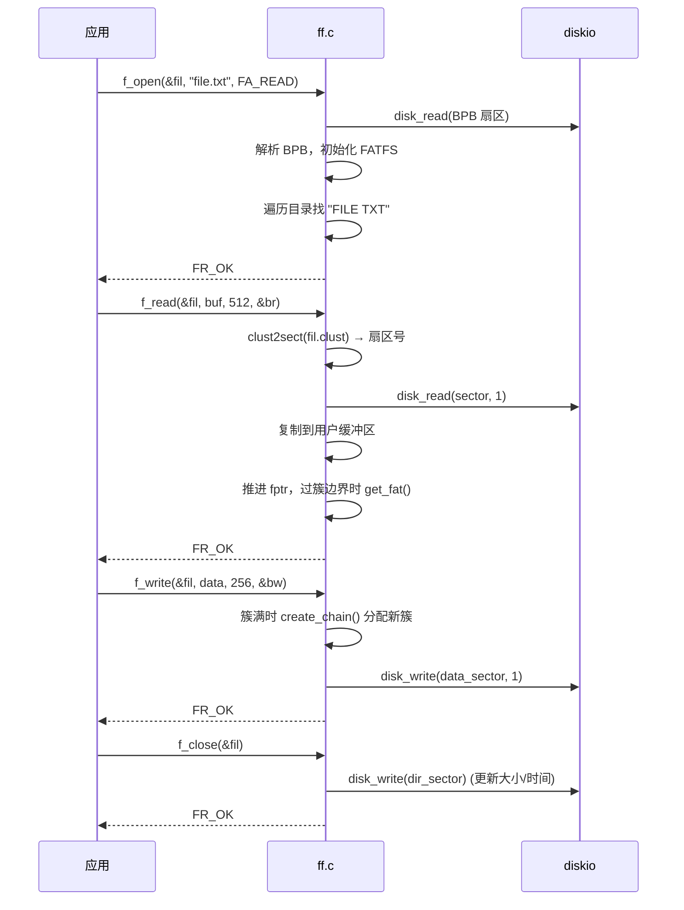

# FatFS 核心实现

## FAT 表结构

FAT 是簇号数组，每个条目指向文件的下一个簇：

```
FAT[0] = 0xFF8 (介质描述符)
FAT[1] = 0xFFF (保留)
FAT[2] = 0x003 → 簇 3
FAT[3] = 0x005 → 簇 5
FAT[4] = 0x000 (空闲)
FAT[5] = 0xFFF (EOF — 文件结束)
```

| 条目值 | FAT12 | FAT16 | FAT32 | 含义 |
|--------|-------|-------|-------|------|
| 空闲簇 | `0x000` | `0x0000` | `0x00000000` | 可用 |
| 坏簇 | `0xFF7` | `0xFFF7` | `0x0FFFFFF7` | 硬件缺陷 |
| EOF | `0xFF8-0xFFF` | `0xFFF8-0xFFFF` | `0x0FFFFFF8-0x0FFFFFFF` | 链尾 |

## 簇链遍历

```c
// 伪代码：get_fat(fs, clst) 获取簇 clst 的 FAT 条目
DWORD get_fat(FFOBJID* obj, DWORD clst) {
    FATFS* fs = obj->fs;
    if (fs->fs_type == FS_FAT32) {
        // 每项 4 字节，高 4 位保留
        DWORD sect = fs->fatbase + (clst * 4) / fs->ssize;
        DWORD offset = (clst * 4) % fs->ssize;
        move_window(fs, sect);  // 加载 FAT 扇区到 win[]
        return LD_DWORD(fs->win + offset) & 0x0FFFFFFF;
    }
    // FAT16: 每项 2 字节; FAT12: 每项 1.5 字节
}
```

**簇号 → 扇区号转换**：

```
sector = fs->database + (cluster - 2) * fs->csize
```

## 簇分配 `create_chain` ✅ 源码级 (R0.16)

```c
// ff.c:1539 — 精确自源码（删除非核心分支保留核心逻辑）
static DWORD create_chain (FFOBJID* obj, DWORD clst)
{
    // 返回值: 0=无空闲簇, 1=内部错误, 0xFFFFFFFF=磁盘错误, ≥2=新簇号
    DWORD cs, ncl, scl;

    if (clst == 0) {                     // 创建新链
        scl = fs->last_clst;             // 从上次分配位置开始搜索
        if (scl == 0 || scl >= fs->n_fatent) scl = 1;
    } else {                             // 延伸已有链
        cs = get_fat(obj, clst);         // 读 FAT[clst]
        if (cs < 2) return 1;            // 0或1 = insanity（不应出现）
        if (cs == 0xFFFFFFFF) return cs;  // 磁盘错误
        if (cs < fs->n_fatent) return cs; // ✅ 已有下一簇，直接返回
        scl = clst;                       // EOC (≥n_fatent) → 需延伸
    }
    if (fs->free_clst == 0) return 0;     // 无空闲簇

    // FAT 卷：优先尝试 clst+1（顺序分配，减少碎片）
    if (scl == clst) {
        ncl = scl + 1;
        if (ncl >= fs->n_fatent) ncl = 2;
        cs = get_fat(obj, ncl);
        if (cs == 1 || cs == 0xFFFFFFFF) return cs; // 错误
        if (cs != 0) { ncl = 0; }         // 不连续 → 回退线性扫描
    }
    // 线性扫描：从 scl 开始找第一个空闲簇 (cs == 0)
    // ... (分配并更新 FATFS::last_clst 提示) ...

    return ncl;
}
```

**核心逻辑**（3 个分支，`ff.c:1549-1558`）：
1. `clst == 0` → 从 `last_clst` 开始搜索（空间局部性优化）
2. `cs < fs->n_fatent` → 链已续接，返回下一簇号（无需分配）
3. `cs >= fs->n_fatent` → EOC 标记，需延伸链

> ✅ R0.16 源码确认：EOC 判断不是 `< 2` 而是 `>= n_fatent`。FAT32 中 `n_fatent ≈ 0x0FFFFFF8` 附近。

**分配提示 `last_clst`**：从上次分配的簇开始搜索空闲簇，利用空间局部性，减少 FAT 扫描开销。

## 目录条目

### SFN (8.3) 格式 — 32 字节

| 偏移 | 大小 | 字段 | 说明 |
|------|------|------|------|
| 0 | 8 | `DIR_Name[8]` | 空格填充；`0xE5`=已删除，`0x00`=目录结束 |
| 8 | 3 | `DIR_Ext[3]` | 扩展名 |
| 11 | 1 | `DIR_Attr` | RO(1), HID(2), SYS(4), VOL(8), DIR(16), ARC(32) |
| 22-25 | 4 | 时间/日期 | 压缩格式：Y-1980(7b), M(4b), D(5b), H(5b), M(6b), S/2(5b) |
| 26-27 | 2 | `DIR_FstClusHI` | FAT32 簇号高 16 位 |
| 28-31 | 4 | `DIR_FileSize` | 文件大小（字节） |

### LFN (长文件名) 编码

长文件名通过前置 LFN 槽实现（`DIR_Attr = 0x0F = RO|HID|SYS|VOL`）：

- 每个 LFN 槽携带 13 个 Unicode 字符
- 槽以**逆序**存储（最后一个 LFN 槽在前，序列号 bit 6 置位）
- LFN 槽的校验和关联到后续的 8.3 条目
- 最大文件名长度：255 UTF-16 码元（~20 个 LFN 槽）

## 扇区缓存管理

FatFS 的 **唯一扇区窗口 `win[]`** 驱动所有元数据 I/O：

| 模式 | 说明 | RAM 消耗 |
|------|------|---------|
| `FF_FS_TINY = 0` | 每个 `FIL` 有私有 `buf[FF_MAX_SS]` | FATFS.win + N × FIL.buf |
| `FF_FS_TINY = 1` | 文件数据也复用 `FATFS.win[]` | 仅 FATFS.win |

Tiny 模式下，应用必须在下次 API 调用前消费完读出的数据——窗口会被覆盖。

## 文件读/写数据流



## 与 FreeRTOS 的对比

| FatFS 算法 | FreeRTOS 模式 | 备注 |
|-----------|--------------|------|
| 单扇区窗口 `win[]` | — | FreeRTOS 无此缓存抽象 |
| `move_window()` 惰性加载 | `xQueueReceive` 阻塞 | 都等待数据可用才继续 |
| `create_chain()` 簇分配 | `pvPortMalloc` 首次适配 | 相似：线性搜索 + 提示优化 |
| FAT 表遍历 | 链表遍历 | 都是单向跟随指针 |
