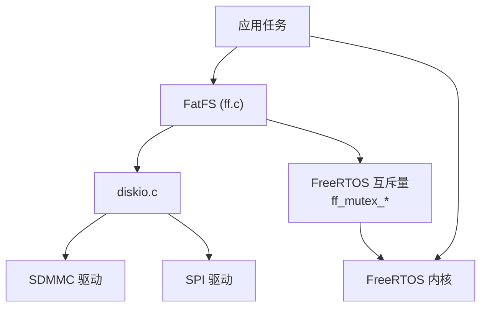

# FatFS 配置与 RTOS 集成

## ffconf.h 关键配置

| 选项 | 值 | RAM 影响 | ROM 影响 |
|------|-----|---------|---------|
| `FF_USE_LFN` | 0/1/2/3 | 0=off; 1=BSS `(MAX_LFN+1)*2`; 2=stack; 3=heap | LFN 代码大 (含 Unicode 表) |
| `FF_FS_TINY` | 0/1 | 0=每 FIL +512B; 1=共用 FS 窗口 | 可忽略 |
| `FF_FS_READONLY` | 0/1 | 写路径代码移除 | 显著节省 (~2KB+) |
| `FF_FS_MINIMIZE` | 0-3 | 3 移除 f_lseek, f_opendir, f_mkdir 等 | 逐级节省 ROM |
| `FF_FS_EXFAT` | 0/1 | 需要 LFN 支持 | ~4KB |
| `FF_MAX_SS` | 512-4096 | 扇区缓存 = FF_MAX_SS | 影响对齐代码 |
| `FF_FS_REENTRANT` | 0/1 | 无直接影响 (互斥量由用户创建) | 小 (lock/unlock 调用) |
| `FF_FS_LOCK` | 0-999 | 锁表 = FF_FS_LOCK × sizeof(锁条目) | 小 |

### 最小化配置示例

```c
// 深度嵌入式设备 — 只读、8.3 文件名、Tiny 模式
#define FF_FS_READONLY  1
#define FF_FS_MINIMIZE  3
#define FF_USE_LFN      0
#define FF_FS_TINY      1
#define FF_FS_REENTRANT 0
// → RAM: ~800 字节 (FATFS + 512B win[]), ROM: ~4KB
```

### 典型 RTOS 配置

```c
// ARM Cortex-M + FreeRTOS — 读写、LFN、重入
#define FF_FS_READONLY  0
#define FF_FS_MINIMIZE  0
#define FF_USE_LFN      2          // LFN 在栈上分配（临时）
#define FF_MAX_LFN      255
#define FF_FS_TINY      0
#define FF_FS_REENTRANT 1
#define FF_FS_TIMEOUT   (1000 / portTICK_PERIOD_MS)
#define FF_FS_LOCK      8
```

## RTOS 互斥量集成

当 `FF_FS_REENTRANT = 1`，必须实现四个函数：

```c
int ff_mutex_create(int vol);   // 创建每卷互斥量
void ff_mutex_delete(int vol);  // 卸载时删除
int ff_mutex_take(int vol);     // 获取 (带 FF_FS_TIMEOUT 超时)
void ff_mutex_give(int vol);    // 释放
```

### FreeRTOS 实现

```c
#include "FreeRTOS.h"
#include "semphr.h"

static SemaphoreHandle_t fatfs_mutex[FF_VOLUMES];

int ff_mutex_create(int vol) {
    fatfs_mutex[vol] = xSemaphoreCreateMutex();
    return (fatfs_mutex[vol] != NULL) ? 1 : 0;
}

void ff_mutex_delete(int vol) {
    if (fatfs_mutex[vol]) vSemaphoreDelete(fatfs_mutex[vol]);
}

int ff_mutex_take(int vol) {
    if (!fatfs_mutex[vol]) return 1;
    return (xSemaphoreTake(fatfs_mutex[vol], pdMS_TO_TICKS(FF_FS_TIMEOUT)) == pdTRUE) ? 1 : 0;
}

void ff_mutex_give(int vol) {
    if (fatfs_mutex[vol]) xSemaphoreGive(fatfs_mutex[vol]);
}
```

> [!note] 重入粒度
> 只有**同一卷**的访问受保护。不同卷始终可重入（各自有独立互斥量）。卷控制函数（`f_mount`、`f_mkfs`、`f_fdisk`）始终不可重入。disk I/O 函数不受 FatFS 保护——用户需自行串行化共享硬件访问。

## 与 LittleFS 的设计对比

| 维度 | FatFS | LittleFS |
|------|-------|----------|
| 目标介质 | 块设备 (SD/eMMC/USB) | NOR Flash (SPI) |
| 文件系统兼容 | FAT12/16/32/exFAT — PC 可读 | 专有格式 |
| 断电安全 | ❌ 原生不支持 | ✅ 元数据对 + COW |
| 磨损均衡 | ❌ 需外部层 | ✅ 内置动态均衡 |
| 代码量 | ~13KB+ typed | ~7KB (ARM Thumb) |
| RAM/挂载 | ~550 字节 | ~100 字节 |
| RAM/文件 | 512 字节 (或 0, Tiny 模式) | 几十字节 |

### 选型指南

| 场景 | 推荐 |
|------|------|
| SD 卡需在 PC 上读取 | **FatFS** (FAT 通用) |
| SD 卡频繁写日志 | FatFS + 外部日志层 |
| NOR Flash 固件升级 | **LittleFS** (断电安全) |
| NOR Flash 配置存储 | **LittleFS** (原子更新) |
| USB Mass Storage 设备 | **FatFS** (主机期望 FAT) |
| 大容量 (GB+) | **FatFS** (FAT32/exFAT) |
| 高可靠性工业 IoT | **LittleFS** (断电安全) |

## 与 FreeRTOS 生态的集成位置



FatFS + FreeRTOS 是 ESP-IDF、STM32Cube 等生态的标准组合。ESP-IDF 同时支持 FatFS 和 LittleFS，前者用于 SD 卡，后者用于内部 SPI Flash。
