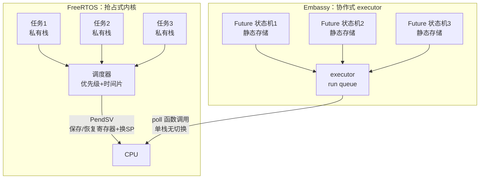
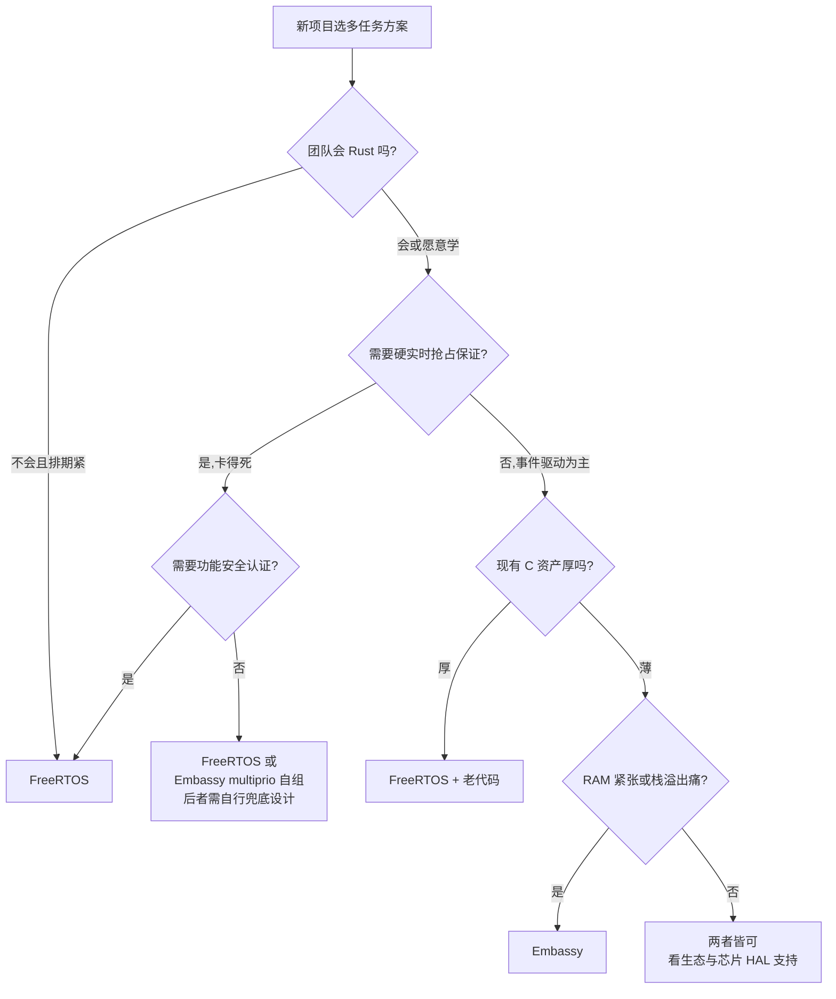

# FreeRTOS vs Embassy 对比

两种完全不同的多任务实现路线：FreeRTOS 是**抢占式内核**（运行时换栈换上下文），Embassy 是**编译期状态机 + 协作式 executor**（运行时只有函数调用）。本篇两侧机制均有源码依据：FreeRTOS 侧来自 vault 的 V10.4.6 源码分析系列，Embassy 侧来自 embassy@bd35bd7 源码核对（见 [嵌入式软件/Embassy 异步框架](Embassy%20异步框架.md)）。

## 一句话结论

- **FreeRTOS**：用「每任务一条栈 + 抢占」模拟并发，语义强（优先级保证、抢占、丰富同步原语），代价是 RAM、栈估算和运行时开销。
- **Embassy**：用「编译期状态机 + 单栈协作」实现并发，RAM 和中断路径极省、无栈溢出问题，代价是协作式语义（无同 executor 内抢占）和 Rust 学习曲线。

## 架构模型

## 调度机制

| 维度 | FreeRTOS | Embassy |
|------|----------|---------|
| 调度器 | 内核：就绪链表 + 优先级位图（见 [嵌入式软件/FreeRTOS/3. FreeRTOS 任务管理与调度](FreeRTOS/3.%20FreeRTOS%20任务管理与调度.md)） | executor 主循环 `loop { poll; wfe }`（cortex_m.rs:107-117） |
| 任务实体 | TCB + 私有栈 | `TaskStorage` 内 Future 状态机（raw/mod.rs:221-224） |
| 抢占 | ✅ 高优先级就绪立即抢占（PendSV） | ❌ 同 executor 协作式；跨 executor 抢占靠 multiprio（中断优先级） |
| 同优先级 | 时间片轮转，每 tick 换人（pxIndex O(1) 推进） | 无时间片概念，谁先被 poll 谁先跑 |
| 优先级 | 任意数值（configMAX_PRIORITIES） | 只有「executor 的层数」（典型 2-3 层：线程 + 高中断） |
| 阻塞语义 | 任务挂在等待列表，调度器换人 | 返回 Pending，状态机保存进度，poll 别人 |
| 饿死风险 | 低优先级被高优先级饿死（优先级反转→互斥继承） | 长 CPU 任务不 await 饿死同 executor 所有任务 |

## 栈与内存（RAM 省 84% 的结构性来源）

| 维度 | FreeRTOS | Embassy |
|------|----------|---------|
| 栈模型 | 每任务独立栈（静态数组或 heap 动态，configMINIMAL_STACK_SIZE 起） | 全程一条主栈；任务只存「跨 await 存活变量」的状态机字段 |
| 栈大小 | **人为估算**（最坏调用链+中断帧），估错 = HardFault 且不复现 | 编译器精确计算状态机大小；单栈一次测透 |
| 堆 | heap_1~5：heap_2 碎片严重、heap_4 合并相邻块（见 [嵌入式软件/FreeRTOS/10. FreeRTOS 内存管理](FreeRTOS/10.%20FreeRTOS%20内存管理.md)） | 不需要堆：`static POOL: TaskPool` 编译期分配 |
| 实测静态 RAM（F446 同应用） | 5480 B | **872 B（省 84%）** |
| 最小内核 ROM | ~4-12 KB（见 [嵌入式软件/FreeRTOS/1. FreeRTOS 概述与架构](FreeRTOS/1.%20FreeRTOS%20概述与架构.md)） | executor 核心极小（.text 实测 14.3KB 含 HAL） |

## 上下文切换：FreeRTOS 唯一赢的单项

F446 实测：FreeRTOS 2.01μs vs Embassy 2.29μs——**FreeRTOS 更快**。

机制解释（⚠️ 本节为分析展开）：

- FreeRTOS：PendSV 切换是高度优化的固定开销——保存/恢复寄存器 + 换 SP（汇编级，见 [嵌入式软件/FreeRTOS/3. FreeRTOS 任务管理与调度](FreeRTOS/3.%20FreeRTOS%20任务管理与调度.md)），不关心任务逻辑
- Embassy：「切换」= 一次 `Future::poll` 调用——进入 match 状态转移、可能穿透多层子 Future 嵌套解引用；任务越复杂状态机越深，poll 路径越长
- 结论：Embassy 赢在**整体**（中断、RAM、体积），不赢在切换本身；协作式框架把「每次抢占」的成本换成了「每次事件」的成本

## 中断处理（Embassy 快 51% 的结构性来源）

| 维度 | FreeRTOS | Embassy |
|------|----------|---------|
| 中断路径 | ISR → FromISR API（队列/临界区）→ 必要时 PendSV 挂起（见 [嵌入式软件/FreeRTOS/11. FreeRTOS 中断管理](FreeRTOS/11.%20FreeRTOS%20中断管理.md)） | ISR → 事件 → `Waker::wake` → 任务入队（waker.rs:11-13 直通 wake_task） |
| 中断里做什么 | 允许 FromISR 收发/通知，逻辑可较重 | 只「叫醒」，不 poll 不调度 |
| 实测中断处理耗时 | 2.96 μs | **1.45 μs（快 51%）** |
| 中断延迟 | 4.97 μs | **3.74 μs（低 25%）** |
| 延迟处理模式 | 任务侧 FromISR 变体或守护任务模式 | 中断只发 Waker，任务在主循环 poll 时处理 |

## 同步与 IPC 原语对照

| 需求 | FreeRTOS（vault 源码系列页） | Embassy（embassy-sync，✅ 源码目录核对） |
|------|------------------------------|------------------------------------------|
| 互斥 | 互斥锁 + **优先级继承**（见 [嵌入式软件/FreeRTOS/5. FreeRTOS 信号量与互斥锁](FreeRTOS/5.%20FreeRTOS%20信号量与互斥锁.md)） | `blocking_mutex`、`mutex`（无优先级继承——同 executor 内无抢占，反转场景天然不存在） |
| 队列/通道 | Queue_t 环形缓冲（见 [嵌入式软件/FreeRTOS/4. FreeRTOS 队列管理](FreeRTOS/4.%20FreeRTOS%20队列管理.md)） | `channel`（多生产者）、`priority_channel`（按优先级出队）、`zerocopy_channel`、`pipe` |
| 信号量 | 二值/计数（见 [嵌入式软件/FreeRTOS/5. FreeRTOS 信号量与互斥锁](FreeRTOS/5.%20FreeRTOS%20信号量与互斥锁.md)） | `semaphore` |
| 事件标志 | 事件组 24 位 AND/OR（见 [嵌入式软件/FreeRTOS/7. FreeRTOS 事件组](FreeRTOS/7.%20FreeRTOS%20事件组.md)） | `waitqueue`、`signal`、`watch`（单值变更通知） |
| 轻量同步 | 任务通知：TCB 内嵌 32 位，最快 IPC（~45% 快于信号量，见 [嵌入式软件/FreeRTOS/6. FreeRTOS 任务通知](FreeRTOS/6.%20FreeRTOS%20任务通知.md)） | Waker 本身就是任务指针，`wake_task` 直通（waker.rs）——全框架同步原语都建在这上面 |
| 流式数据 | 流缓冲/消息缓冲（见 [嵌入式软件/FreeRTOS/9. FreeRTOS 流缓冲区与消息缓冲区](FreeRTOS/9.%20FreeRTOS%20流缓冲区与消息缓冲区.md)） | `pubsub`（发布订阅）、`ring_buffer` |
| 一次性初始化 | — | `once_lock`、`lazy_lock` |

> [!note] 设计哲学差异
> FreeRTOS 需要「优先级继承」是因为抢占 + 优先级才存在反转问题；Embassy 同 executor 协作式下任务天然顺序执行，**互斥/信号量在单 executor 内几乎用不到**（数据无需保护），它们主要用于跨 executor/中断与任务之间。

## 定时器与低功耗

| 维度 | FreeRTOS | Embassy |
|------|----------|---------|
| 软件定时器 | 守护任务 + 命令队列（见 [嵌入式软件/FreeRTOS/8. FreeRTOS 软件定时器](FreeRTOS/8.%20FreeRTOS%20软件定时器.md)） | 无守护任务：`Timer::after` 只是「登记 Waker 给全局 time driver」（timer.rs:306-310） |
| 任务级延时 | vTaskDelay（挂进延时链表，tick 到期唤醒） | `Timer::after_millis().await`（状态机挂起，driver 到期唤醒） |
| 低功耗 | tickless idle：计算可休眠时间，停 SysTick 入睡（见 [嵌入式软件/FreeRTOS/3. FreeRTOS 任务管理与调度](FreeRTOS/3.%20FreeRTOS%20任务管理与调度.md)） | `wfe` + pender 发 `sev`（Cortex-M）；RISC-V 为 `wfi` |
| 时基溢出 | tick 计数需处理溢出 | embassy-time 的 Instant/Timer 设计上处理了溢出 |

## 可靠性与工程

| 维度 | FreeRTOS | Embassy |
|------|----------|---------|
| 经典故障 | **任务栈溢出 HardFault**（估错栈大小，专挑不复现时刻炸） | 无此故障类别（无每任务栈）；单栈最坏情况可测 |
| 优先级反转 | 存在 → 互斥锁优先级继承解决 | 同 executor 无抢占 → 反转不适用；跨 executor 时需自行设计 |
| 内存碎片 | heap_2 有碎片风险；heap_4/5 较低 | 无堆无碎片 |
| 竞态/数据竞争 | C 无检查，全靠纪律与代码评审 | 借用检查器编译期拒绝数据竞争（跨 executor 共享仍需 Send/Sync 纪律） |
| 功能安全认证 | ✅ 成熟路径（SafeRTOS/OpenRTOS，车规医疗有先例） | ❌ 尚无成熟认证路径 |
| 语言门槛 | C，人人会 | Rust：所有权/借用/async 三件套，借用检查器前两周劝退 |
| 与现有 C 资产互操作 | 原生 | FFI 可用但成本不低，unsafe 边界自守 |

## 选型决策

（⚠️ 本节为分析展开的速查图，非任一来源原文。）

## 数值汇总（F446 实测 + 源码依据）

| 指标 | FreeRTOS/C | Embassy/Rust | 来源 |
|------|-----------|--------------|------|
| 中断处理耗时 | 2.96 μs | 1.45 μs | Tweede golf 2022 实测（文章转述） |
| 中断延迟 | 4.97 μs | 3.74 μs | 同上 |
| 上下文切换 | **2.01 μs** | 2.29 μs | 同上 |
| .text | 20.7 KB | 14.3 KB | 同上 |
| 静态 RAM | 5480 B | 872 B | 同上 |
| 内核最小 ROM | ~4-12 KB | —（executor 极小，未单独测） | FreeRTOS 概述页 |
| 任务通知 vs 信号量 | ~45% 快 | Waker 直通（无中间对象） | FreeRTOS 页6 / waker.rs |

## 参见

- [嵌入式软件/Embassy 异步框架](Embassy%20异步框架.md) — Embassy 机制细节与源码行号
- [嵌入式软件/FreeRTOS/1. FreeRTOS 概述与架构](FreeRTOS/1.%20FreeRTOS%20概述与架构.md) — FreeRTOS 内核全景与源码索引
- [嵌入式软件/FreeRTOS/3. FreeRTOS 任务管理与调度](FreeRTOS/3.%20FreeRTOS%20任务管理与调度.md) — TCB、PendSV、时间片
- [嵌入式软件/RTOS vs Linux 本质区别](RTOS%20vs%20Linux%20本质区别.md) — RTOS 路线的宏观定位
