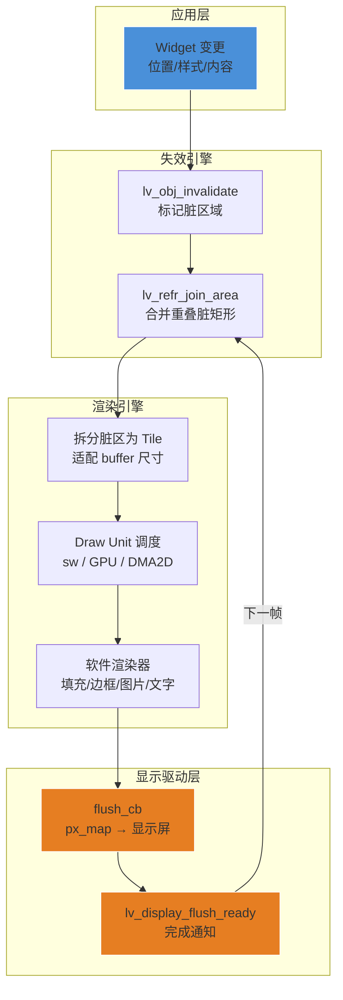
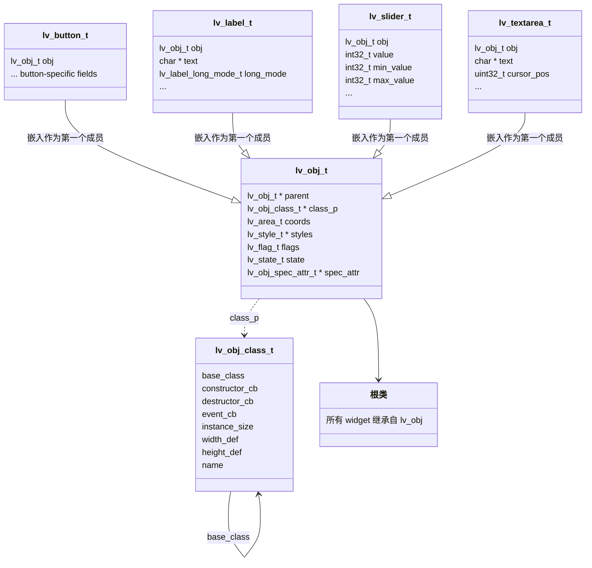
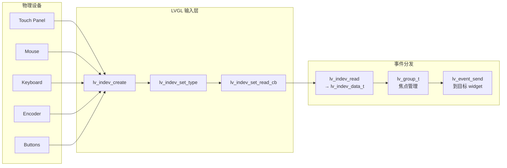
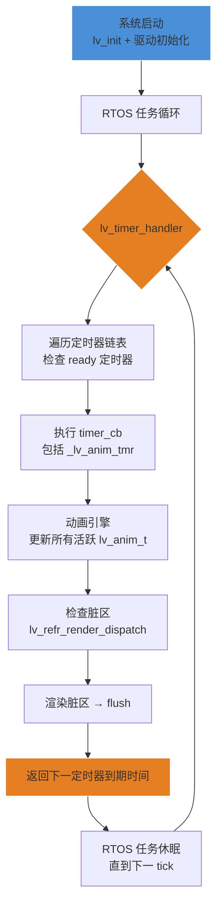

# LVGL 图形库

## 一句话

> LVGL（Light and Versatile Graphics Library）是一个用纯 C 实现的嵌入式 GUI 框架，通过对象系统模拟 OOP、脏矩形局部刷新管道、可插拔渲染后端（软件/GPU）和 OSAL 抽象层，在资源受限的 MCU 上提供接近桌面级的 UI 体验。

## 渲染管道全景



LVGL 的渲染管道是**事件驱动 + 增量刷新**的：

1. **Widget 变更**触发 `lv_obj_invalidate()`，将对象当前占用的屏幕区域标记为脏
2. **脏区合并**引擎（`lv_refr_join_area`）在每帧开始前合并相邻/重叠的矩形 —— 仅当合并后的面积 < 两个原始面积之和时合并
3. **Tile 拆分**：在 `LV_DISPLAY_RENDER_MODE_PARTIAL` 模式下，将脏区拆分为适配 display buffer 大小的水平条带
4. **Draw Unit 调度**：LVGL v9 通过 `lv_draw_dispatch()` 将绘制任务分配给注册的 draw unit（软件渲染器、GPU 后端等），每个 draw unit 有优先级分数，高分的优先执行
5. **flush_cb**：渲染完成后调用用户实现的回调，将像素数据推送到物理显示屏
6. 通过 `lv_display_flush_is_last()` 区分单次刷新的最后一次调用

---

## 1. 总体架构

### 1.1 源码组织结构

LVGL v9 的 `src/` 目录结构（v8 中目录带 `lv_` 前缀，v9 移除）：

| 目录 | 用途 |
|------|------|
| `core/` | 核心对象系统：`lv_obj.c`（基础对象）、`lv_event.c`（事件系统）、`lv_style.c`（样式引擎）、`lv_obj_tree.c`（对象树管理）、`lv_obj_class.c`（类描述符）、`lv_obj_style.c`（样式绑定）、`lv_obj_draw.c`（基础绘制）、`lv_group.c`（输入组）、`lv_refr.c`（刷新引擎） |
| `draw/` | 绘制后端：`sw/`（纯软件渲染器，含 blend/ 子目录）、`nxp/`（NXP PXP/VG-Lite）、`arm2d/`、`sdl/`、`stm32_dma2d/`、`swm342_dma2d/` |
| `widgets/` | 标准控件（每个文件一个 widget）：`lv_button.c`、`lv_label.c`、`lv_slider.c`、`lv_chart.c`、`lv_table.c`、`lv_textarea.c`、`lv_dropdown.c`、`lv_list.c`、`lv_tabview.c` 等 |
| `layouts/` | 布局引擎：`flex/`（CSS Flexbox）、`grid/`（CSS Grid） |
| `libs/` | 第三方库封装：`lodepng`（PNG 解码）、`tjpgd`（JPEG 解码）、`freetype`（字体渲染）、`rlottie`（Lottie 动画）、`qrcode` 等 |
| `display/` | 显示设备管理：`lv_display.c`（创建/配置/刷新循环） |
| `indev/` | 输入设备管理：触摸、键盘、编码器、按钮 |
| `misc/` | 杂项：`cache/`（类+实例缓存）、`lv_timer.c`（定时器）、`lv_anim.c`（动画引擎）、`lv_math.c`、`lv_log.c`、`lv_async.c` |
| `osal/` | 操作系统抽象层：`lv_osal.h` 提供统一接口（裸机、FreeRTOS、Zephyr、RT-Thread、Windows、pthread） |
| `themes/` | 内置主题：`basic/`、`default/`、`mono/`、`simple/` |
| `font/` | 字体加载与渲染 |
| `stdlib/` | 标准库替身，含 `builtin/` 实现（无 libc 依赖时使用） |
| `others/` | 其他功能：`monkey`（测试）、`msg`（消息总线）、`observer`（观察者模式）、`snapshot`、`sysmon`（系统监视器） |

外部目录：

| 目录 | 用途 |
|------|------|
| `demos/` | 官方演示（`lv_demo_widgets()`、`lv_demo_benchmark()`、`lv_demo_music()`） |
| `examples/` | 按模块组织的基础示例 |
| `env_support/` | 平台适配（CMake、ESP-IDF、RT-Thread、Zephyr） |
| `lv_conf.h` | 全局配置宏（控件开关、内存大小、LCD 参数） |

### 1.2 硬件依赖与最小资源需求

| 参数 | 典型最小值 | 建议值 |
|------|-----------|--------|
| Flash | 128 KB | 256 KB+（完整功能） |
| RAM | 32 KB | 64 KB+ |
| 显示 Buffer | 1/10 屏幕 | 屏幕大小 × 2（双缓冲） |
| CPU | 任何 32-bit MCU | Cortex-M4/M7 @ 80 MHz+ |

---

## 2. 面向对象 C 设计

### 2.1 类描述符 `lv_obj_class_t` —— C 语言实现的虚函数表

LVGL 在纯 C 中实现 OOP 的核心机制是 `lv_obj_class_t` 结构体，每个 widget 类型对应一个全局唯一的类描述符实例。

```c
// lv_obj_class_t 完整定义（lv_obj_class_private.h，源码验证 ✅）
struct _lv_obj_class_t {
    const lv_obj_class_t * base_class;   // 父类指针，NULL = 根类 lv_obj
    /** class_p is the final class while obj->class_p is the class
     *  currently being [de]constructed. */
    void (*constructor_cb)(const lv_obj_class_t * class_p, lv_obj_t * obj);
    void (*destructor_cb)(const lv_obj_class_t * class_p, lv_obj_t * obj);
    /** class_p is the class in which event is being processed. */
    void (*event_cb)(const lv_obj_class_t * class_p, lv_event_t * e);

#if LV_USE_OBJ_PROPERTY
    uint32_t prop_index_start;           // 属性 ID 范围起始
    uint32_t prop_index_end;             // 属性 ID 范围结束
    const lv_property_ops_t * properties; // 属性操作表
    uint32_t properties_count;
#if LV_USE_OBJ_PROPERTY_NAME
    const lv_property_name_t * property_names;
    uint32_t names_count;
#endif
#endif

    void * user_data;                    // 类级别用户数据
    const char * name;                   // 调试用类名
    int32_t width_def;                   // 默认宽度
    int32_t height_def;                  // 默认高度
    uint32_t editable : 2;               // 可编辑模式（编码器组）
    uint32_t group_def : 2;              // 默认加入组策略
    uint32_t instance_size : 16;         // 实例结构体大小（字节），最大 64KB
    uint32_t theme_inheritable : 1;      // 主题是否继承
};
```

**源码差异说明**（`⚠️ 来源验证`）：原始 wiki 页面基于 Web 文档推断的 `dispatch_event_cb` 和 `create_obj` 字段在实际源码中不存在。创建对象通过 `lv_obj_class_create_obj()` 通用工厂函数完成，事件调度通过 `event_cb` 和 `LV_EVENT_*` 机制处理。`instance_size` 实际是 16-bit 位域而非 `size_t`，受限于 widget 结构体 < 64KB。

### 2.2 继承机制 —— 结构体嵌入



继承的 C 语言实现特点：

- **每个派生 widget 的结构体**以 `lv_obj_t` 作为**第一个成员**，因此 `(lv_obj_t *)widget_ptr` 的强制转换始终安全
- **`lv_obj_class_t *class_p`** 指向该类专属的全局类描述符，类似 C++ vtable 指针
- **`base_class`** 指针构成继承链，用于构造函数和事件处理的递归调用

### 2.3 构造与析构生命周期

**创建流程**（以 `lv_button_create(parent)` 为例）：

1. `lv_button_create()` 内部调用 `lv_obj_class_create_obj(&lv_button_class, parent)`
2. `lv_obj_class_create_obj()` 根据 `instance_size` 分配内存（`sizeof(lv_button_t)`）
3. `lv_obj_class_init_obj()` 触发 `lv_obj_construct()`，**从根类向下递归**调用构造函数：
   - 先调 `lv_obj_class.base_class.constructor_cb`（如果存在）
   - 再调当前类的 `constructor_cb`
   - 这样基类初始化先完成，派生类后完成
4. 构造函数中设置默认样式、默认尺寸、初始属性
5. 返回 `lv_obj_t *` 指针

**析构流程**（`lv_obj_delete(obj)`）：

1. 递归删除所有子对象
2. 移除该对象的所有动画和定时器
3. 从输入组和事件列表中移除
4. 从**当前类向上到根类**递归调用 `destructor_cb`
5. 释放 `spec_attr` 扩展结构（如果有）
6. 释放对象内存

### 2.4 自定义 Widget 示例

自定义 widget 需要：

```c
// 1. 定义派生结构体
typedef struct {
    lv_obj_t obj;
    int32_t my_property;
} my_widget_t;

// 2. 定义全局类描述符
const lv_obj_class_t my_widget_class = {
    .base_class = &lv_obj_class,
    .constructor_cb = my_widget_constructor,
    .destructor_cb = my_widget_destructor,
    .event_cb = my_widget_event,
    .width_def = LV_DPI_DEF,
    .height_def = LV_DPI_DEF,
    .instance_size = sizeof(my_widget_t),
    .name = "my_widget",
};

// 3. 创建函数
lv_obj_t * my_widget_create(lv_obj_t * parent) {
    lv_obj_t * obj = lv_obj_class_create_obj(&my_widget_class, parent);
    lv_obj_class_init_obj(obj);  // 触发构造函数链
    return obj;
}
```

---

## 3. Widget 树与布局系统

### 3.1 对象层级结构

每个 display 有一个**根屏幕对象**（通过 `lv_scr_act()` 获取），所有 widget 构成一个树：

```
Screen (root, parent=NULL)
├── Top Layer (持久层，覆盖屏幕)
├── 主内容区
│   ├── Button
│   │   └── Label (btn 的子对象)
│   ├── Slider
│   └── Container (Panel)
│       ├── Chart
│       └── Table
└── System Layer (最高层，如键盘弹出)
```

关键函数：
- `lv_obj_create(parent)` —— 创建新对象，`NULL` 表示创建新 screen
- `lv_obj_set_parent(obj, new_parent)` —— 重设父对象
- `lv_obj_get_child(obj, idx)` —— 按索引获取子对象
- `lv_obj_get_parent(obj)` —— 获取父对象
- `lv_obj_del(obj)` / `lv_obj_clean(obj)` —— 删除/清空

每 display 有四层：**Bottom Layer → Active Screen → Top Layer → System Layer**，其中 Top/System 层在切换屏幕时保持不变。

### 3.2 坐标系统

| 概念 | 说明 |
|------|------|
| 原点 | `(0,0)` = 父对象内容区左上角（父对象 padding + border 之后） |
| 单位 | 像素（`lv_coord_t`，通常为 `int16_t`） |
| 百分比 | `lv_pct(50)` = 父内容区的 50% |
| 自适应 | `LV_SIZE_CONTENT` = 根据子对象或内容自动计算 |
| 约束 | `lv_obj_set_style_min_width()` / `max_width()` / `min_height()` / `max_height()` |
| 对齐 | `lv_obj_align(obj, parent, LV_ALIGN_CENTER, offset_x, offset_y)` |

坐标存储在 `lv_obj_t.coords`（`lv_area_t { x1, y1, x2, y2 }`）中，是相对于父对象的**内容区**的绝对位置。

### 3.3 布局引擎

LVGL 内置两种布局引擎，通过 `lv_obj_set_layout(obj, layout)` 激活。布局引擎会**覆盖**手动设置的 x/y/width/height。

**Flexbox**（`LV_LAYOUT_FLEX`）：

```c
lv_obj_set_layout(cont, LV_LAYOUT_FLEX);
lv_obj_set_flex_flow(cont, LV_FLEX_FLOW_ROW_WRAP);
lv_obj_set_flex_align(cont, LV_FLEX_ALIGN_START, LV_FLEX_ALIGN_CENTER, LV_FLEX_ALIGN_SPACE_EVENLY);
```

- `LV_FLEX_FLOW_ROW` / `COLUMN` / `ROW_REVERSE` / `COLUMN_REVERSE`
- `_WRAP` 后缀允许换行
- `lv_obj_set_flex_grow(child, 1)` 让 child 填充剩余空间

**Grid**（`LV_LAYOUT_GRID`）：

```c
static lv_coord_t col_dsc[] = {100, 200, LV_GRID_FR(1), LV_GRID_TEMPLATE_LAST};
static lv_coord_t row_dsc[] = {50, LV_GRID_CONTENT, LV_GRID_TEMPLATE_LAST};
lv_obj_set_grid_dsc_array(cont, col_dsc, row_dsc);
lv_obj_set_grid_cell(child, LV_GRID_ALIGN_STRETCH, 0, 1,
                              LV_GRID_ALIGN_STRETCH, 0, 1);
```

- `LV_GRID_FR(n)` —— 自由比例单位（类似 CSS 的 fr）
- `LV_GRID_TEMPLATE_LAST` —— 数组结尾标记
- `LV_GRID_CONTENT` —— 自适应内容高度

**自定义布局**：通过 `lv_layout_register(my_update_cb, user_data)` 注册，回调在布局需要重新计算时自动调用。

### 3.4 样式系统与级联

`lv_style_t` 定义了 widget 的外观属性。样式通过**级联**的方式叠加：

```c
static lv_style_t style_base;
lv_style_set_bg_color(&style_base, lv_color_hex(0x333333));

lv_obj_add_style(obj, &style_base, LV_STATE_DEFAULT);
lv_obj_add_style(obj, &style_pressed, LV_STATE_PRESSED);  // 按下时覆盖
```

**级联规则**（优先级从低到高）：

1. 本地样式（`lv_obj_set_local_style_*`）—— 最高优先级
2. 对象级别样式 —— 通过 `lv_obj_add_style()` 添加
3. 父对象的样式 —— 默认不继承，但可设置为 `LV_STYLE_PROP_FLAG_INHERITABLE`
4. 主题默认样式 —— 系统主题提供的默认值

**状态匹配优先于添加顺序**：假设 base 设置了 `LV_STATE_DEFAULT` 的红色和 `LV_STATE_PRESSED` 的蓝色，later 设置了 `LV_STATE_DEFAULT` 的绿色 —— 当按下时仍显示蓝色（状态匹配优先）。

关键样式属性类：

| 类别 | 属性 |
|------|------|
| 尺寸 | `width`, `height`, `min_width`, `max_width`, `min_height`, `max_height` |
| 坐标 | `x`, `y`, `align` |
| 背景 | `bg_color`, `bg_opa`, `bg_grad`, `bg_image_src` |
| 边框 | `border_color`, `border_width`, `border_side`, `border_opa` |
| 文本 | `text_color`, `text_font`, `text_letter_space`, `text_line_space` |
| 阴影 | `shadow_width`, `shadow_color`, `shadow_offset_x`, `shadow_offset_y` |
| 变换 | `transform_angle`, `transform_zoom`, `transform_width`, `transform_height` |
| 控件特有 | `pad_row`（flex/grid 行间距）、`pad_column`（flex/grid 列间距） |

---

## 4. 渲染引擎

### 4.1 脏区域跟踪

LVGL 的核心优化是**只重绘变化的区域**：

- **`lv_obj_invalidate(obj)`**：将对象的当前 `coords` 区域加入 display 的 `inv_areas[]` 数组（默认容量 32）
- **`lv_refr_join_area()`**：每帧开始前遍历脏区数组，合并相邻/重叠的矩形 —— 仅当合并后面积 < 各自面积之和时执行合并
- **`inv_p`** 计数器跟踪脏区数量
- **`inv_en_cnt`** 允许临时禁用脏区标记（批量更新时使用）

### 4.2 Tile 渲染与三种刷新模式

| 模式 | 宏 | Buffer 要求 | 行为 |
|------|---|-------------|------|
| PARTIAL | `LV_DISPLAY_RENDER_MODE_PARTIAL` | < 屏幕大小（建议 ≥ 1/10 屏幕） | 脏区拆分为适配 buffer 的水平条带，逐条渲染 → flush |
| DIRECT | `LV_DISPLAY_RENDER_MODE_DIRECT` | = 屏幕大小（单/双 buffer） | LVGL 在 buffer 的正确位置直接绘制脏区；双 buffer 时记录 `sync_areas` 链表同步前后 |
| FULL | `LV_DISPLAY_RENDER_MODE_FULL` | = 屏幕大小（建议双 buffer） | 任何变化都会重绘整个屏幕，flush_cb 只需切换 frame buffer 地址 |

在 PARTIAL 模式下，`tile_cnt` 参数控制 tile 数量，影响 DMA 传输粒度。

### 4.3 Draw Task 调度（LVGL v9）

LVGL v9 引入了 **Draw Unit** 架构：

```
        lv_draw_dispatch()
               │
       ┌───────┼───────┐
       │       │       │
   Draw Unit 1  DU 2   DU 3
    (SW, pri=0) (DMA2D) (PXP)
               │
         ┌─────┴─────┐
         │           │
    lv_draw_task_t  lv_draw_task_t
    (FILL rect)    (IMAGE logo.png)
```

- 每个 draw unit 有**优先级分数**（`supported_score`），分数高者优先获取任务
- `lv_draw_dispatch()` 从全局任务列表中按 `LV_DRAW_TASK_TYPE_*` 分派
- 软件渲染器是默认 draw unit（`LV_USE_DRAW_SW`），优先级最低
- GPU 后端注册自己的 draw unit，返回高于 SW 的优先级分数即可抢占任务
- Draw task 类型：`LV_DRAW_TASK_TYPE_FILL`、`LV_DRAW_TASK_TYPE_BORDER`、`LV_DRAW_TASK_TYPE_BOX_SHADOW`、`LV_DRAW_TASK_TYPE_IMAGE`、`LV_DRAW_TASK_TYPE_LABEL`、`LV_DRAW_TASK_TYPE_ARC`、`LV_DRAW_TASK_TYPE_TRIANGLE`、`LV_DRAW_TASK_TYPE_LAYER`、`LV_DRAW_TASK_TYPE_LINE` 等

### 4.4 软件渲染器（`lv_draw_sw`）

纯 CPU 渲染后端，支持的基本操作：

- **Fill**：矩形填充（纯色/渐变）
- **Border**：边框绘制（各边独立）
- **Box Shadow**：投影（模糊展开）
- **Image**：图像解码与渲染（支持透明度、颜色格式转换、旋转、缩放）
- **Label**：文字渲染（UTF-8、多行、双向文本、字形缓存）
- **Arc**：弧线/扇形（用于仪表盘等）
- **Line**：线段绘制
- **Triangle**：三角形填充
- **Blend**：像素混合（支持 `LV_OPA_TRANSP` ~ `LV_OPA_COVER`、Alpha 混合、颜色空间转换）

软件渲染器使用**自定义 blend 函数**，根据源和目标颜色格式选择最优路径（如 RGB565→RGB565 直接拷贝 vs RGB565→ARGB8888 转换混合）。

### 4.5 GPU 加速后端

| 后端 | 适用平台 | 原理 |
|------|---------|------|
| **NXP PXP** | i.MX RT 系列 | 像素处理加速器：图像处理、色彩空间转换、图像旋转/缩放、去交织。PXP 在 frame buffer 上直接操作 |
| **NXP VG-Lite** | i.MX 系列 | 矢量图形加速器（OpenVG 子集）：贝塞尔曲线、路径填充、渐变、透明度 |
| **STM32 DMA2D** | STM32 F4/H7 系列 | Chrom-ART 图形加速器：颜色格式转换、像素混合、alpha 混合、拷贝 |
| **ARM 2D** | Cortex-M 系列 | Arm 官方 2D 加速库，通过自定义 draw unit 集成 |
| **SDL** | PC 模拟器 | SDL2 后端用于 PC 开发和调试 |
| **OpenGL ES** | MPU/Linux | 通过 VG-Lite 桥接或独立 draw unit |

每个 GPU 后端作为独立 draw unit 注册，通过优先级竞争获取绘制任务，与软件渲染器共存。

### 4.6 颜色格式抽象

| 格式宏 | 位深 | 说明 |
|--------|------|------|
| `LV_COLOR_FORMAT_RGB565` | 16-bit | 5R+6G+5B，最常用 |
| `LV_COLOR_FORMAT_RGB565_SWAPPED` | 16-bit | 字节序交换（小端平台常见） |
| `LV_COLOR_FORMAT_RGB888` | 24-bit | 8R+8G+8B |
| `LV_COLOR_FORMAT_ARGB8888` | 32-bit | 8A+8R+8G+8B |
| `LV_COLOR_FORMAT_XRGB8888` | 32-bit | 未使用 alpha 的 ARGB |
| `LV_COLOR_FORMAT_I1/2/4/8` | 1/2/4/8-bit | 索引颜色（调色板） |
| `LV_COLOR_FORMAT_A1/2/4/8` | 1/2/4/8-bit | 仅 Alpha 通道 |

内置 `lv_color_t` 类型由 `LV_COLOR_DEPTH` 编译时配置决定，影响所有内部操作。

---

## 5. 显示驱动抽象

### 5.1 v9 API（`lv_display_t`）

```c
// 创建 display
lv_display_t * disp = lv_display_create(hor_res, ver_res);

// 设置 flush 回调（核心回调）
lv_display_set_flush_cb(disp, my_flush_cb);

// 设置颜色格式
lv_display_set_color_format(disp, LV_COLOR_FORMAT_RGB565);

// 设置 buffer
lv_display_set_buffers(disp, buf1, buf2, buf_size_in_px, LV_DISPLAY_RENDER_MODE_PARTIAL);
```

**flush_cb 原型**（v9）：

```c
void my_flush_cb(lv_display_t * display, const lv_area_t * area, uint8_t * px_map)
{
    // area->x1, area->y1, area->x2, area->y2 为脏区坐标
    // px_map 指向渲染好的像素数据
    uint32_t w = lv_area_get_width(area);
    uint32_t h = lv_area_get_height(area);

    // 发送像素到显示屏（例如 SPI DMA 传输）
    display_send_pixels(area->x1, area->y1, w, h, px_map);

    // 重要：必须通知 LVGL flush 完成
    lv_display_flush_ready(display);
}
```

### 5.2 v8 → v9 迁移要点

| v8 API | v9 API |
|--------|--------|
| `lv_disp_drv_t` + `lv_disp_draw_buf_t` | `lv_display_t`，`lv_display_create()` |
| `lv_disp_drv_init(&drv)` | `lv_display_create(w, h)` |
| `disp_drv.flush_cb = ...` | `lv_display_set_flush_cb(disp, cb)` |
| `disp_drv.draw_buf = &buf` | `lv_display_set_buffers(disp, buf1, buf2, size, mode)` |
| `lv_disp_flush_ready(disp)` | `lv_display_flush_ready(display)` |
| `lv_disp_flush_is_last(disp)` | `lv_display_flush_is_last(display)` |
| `LV_COLOR_16_SWAP` flag | `LV_COLOR_FORMAT_RGB565_SWAPPED` |
| `full_refresh` / `direct_mode` flags | render mode 参数 |

### 5.3 Buffer 策略

```c
// 单 buffer（PARTIAL 模式）
#define BUF_SIZE (LCD_HOR_RES * LCD_VER_RES / 10)
static uint8_t buf1[BUF_SIZE * sizeof(lv_color_t)];
lv_display_set_buffers(disp, buf1, NULL, BUF_SIZE, LV_DISPLAY_RENDER_MODE_PARTIAL);

// 双 buffer（PARTIAL 模式，渲染与 flush 可并行）
static uint8_t buf2_1[BUF_SIZE * sizeof(lv_color_t)];
static uint8_t buf2_2[BUF_SIZE * sizeof(lv_color_t)];
lv_display_set_buffers(disp, buf2_1, buf2_2, BUF_SIZE, LV_DISPLAY_RENDER_MODE_PARTIAL);

// 全屏单 buffer（DIRECT 模式）
lv_display_set_buffers(disp, fb, NULL, LCD_HOR_RES * LCD_VER_RES, LV_DISPLAY_RENDER_MODE_DIRECT);

// 全屏双 buffer（FULL 模式，经典双缓冲）
lv_display_set_buffers(disp, fb1, fb2, LCD_HOR_RES * LCD_VER_RES, LV_DISPLAY_RENDER_MODE_FULL);
```

双缓冲在 PARTIAL 模式下，LVGL 可以：在一个 buffer 上渲染下一块区域 → flush 另一个 buffer → 交替进行，实现渲染和刷新的流水线并行。

### 5.4 多 Display 支持

- `lv_display_create()` 每次调用创建一个新 display
- `lv_display_set_default(disp)` 设为主 display（无参 API 默认操作）
- 每个 display 有独立的 screen、buffer、flush_cb、脏区列表
- `lv_scr_act()` 返回当前活跃 display 的活跃 screen
- 通过 `lv_disp_get_scr_act(disp)` 获取指定 display 的活跃 screen

### 5.5 可选回调

| 回调 | 用途 |
|------|------|
| `rounder_cb`（v8） → `LV_EVENT_INVALIDATE_AREA`（v9） | 将脏区对齐到硬件边界（如 4 像素对齐） |
| `monitor_cb` | 每帧渲染完成后被调用，提供耗时、脏区数量等调试信息 |
| `clean_dcache_cb` | 刷新 CPU 数据 cache（Cortex-M7 等带 cache 的 MCU） |
| `lv_display_add_event(disp, event_cb, LV_EVENT_RENDER_READY, NULL)` | 渲染完成事件（v9 方式） |

---

## 6. 输入设备抽象

### 6.1 设备类型与驱动



四种输入设备类型：

| 类型 | `read_cb` 输出数据 | 典型用途 |
|------|-------------------|----------|
| `LV_INDEV_TYPE_POINTER` | `data->point.x/y`, `data->state` | 触摸屏、鼠标 |
| `LV_INDEV_TYPE_KEYPAD` | `data->key`（LV_KEY_*） | 矩阵键盘、蓝牙键盘 |
| `LV_INDEV_TYPE_ENCODER` | `data->enc_diff`, `data->state` | 旋转编码器 |
| `LV_INDEV_TYPE_BUTTON` | `data->btn_id`, `data->state` | 硬件按钮（预映射到屏幕坐标） |

### 6.2 触摸驱动实现

```c
void touch_read_cb(lv_indev_t * indev, lv_indev_data_t * data)
{
    if (touch_pressed()) {
        data->point.x = touch_get_x();
        data->point.y = touch_get_y();
        data->state = LV_INDEV_STATE_PRESSED;
    } else {
        data->state = LV_INDEV_STATE_RELEASED;
    }
    // data->continue_reading = true;  // 有更多数据待读取
    // data->timestamp = my_tick_ms;    // 事件时间戳
}

// 注册
lv_indev_t * indev = lv_indev_create();
lv_indev_set_type(indev, LV_INDEV_TYPE_POINTER);
lv_indev_set_read_cb(indev, touch_read_cb);
// 可选：将 indev 关联到指定 display
lv_indev_set_display(indev, disp);
```

### 6.3 输入组与焦点管理

键盘和编码器需要 `lv_group_t` 来管理焦点：

```c
lv_group_t * g = lv_group_create();
lv_group_add_obj(g, btn1);
lv_group_add_obj(g, btn2);
lv_group_add_obj(g, slider);

lv_indev_set_group(indev, g);  // 将组关联到键盘/编码器
```

组内的对象通过方向键（`LV_KEY_NEXT` / `LV_KEY_PREV` / `LV_KEY_UP` / `LV_KEY_DOWN` / `LV_KEY_LEFT` / `LV_KEY_RIGHT`）导航，通过 `LV_KEY_ENTER` 激活。

编码器使用双模式：
- **Navigate 模式**：旋转选择下一/上一对象，按下进入 Edit
- **Edit 模式**：旋转调整对象值，长按退出 Edit

### 6.4 手势识别

通过 `LV_EVENT_GESTURE` 事件处理手势：

```c
static void event_handler(lv_event_t * e)
{
    lv_event_code_t code = lv_event_get_code(e);
    if (code == LV_EVENT_GESTURE) {
        lv_dir_t dir = lv_indev_get_gesture_dir(lv_indev_active());
        switch (dir) {
            case LV_DIR_LEFT:  /* 左滑 */ break;
            case LV_DIR_RIGHT: /* 右滑 */ break;
            case LV_DIR_TOP:   /* 上滑 */ break;
            case LV_DIR_BOTTOM:/* 下滑 */ break;
        }
    }
}
```

启用多点触摸（pinch）需要在 `lv_conf.h` 中设置 `LV_USE_GESTURE_RECOGNITION = 1`。

### 6.5 输入事件传播路径

```
物理中断 → 触摸驱动读坐标
    → lv_indev_read() 将数据打包为 lv_indev_data_t
    → lv_indev 的定时器周期轮询（或事件驱动模式）
    → 通过 lv_indev_search_obj() 在对象树中查找命中目标
    → 发送 LV_EVENT_PRESSED / LV_EVENT_CLICKED / LV_EVENT_RELEASED 等
    → 事件的 event_cb 沿类继承链从派生类向基类传递
    → 触发样式状态变化（LV_STATE_PRESSED → 重绘）
```

---

## 7. 动画与定时器系统

### 7.1 `lv_timer_handler()` 主循环



**`lv_timer_handler()`** 是 LVGL 的心脏，必须在主循环中周期性调用：

```c
// 裸机模式
while (1) {
    uint32_t time_till_next = lv_timer_handler();
    if (time_till_next == LV_NO_TIMER_READY) {
        time_till_next = LV_DEF_REFR_PERIOD;
    }
    delay_ms(time_till_next);
}
```

`lv_timer_handler()` 的内部工作：

1. 遍历全局定时器链表，对每个未暂停的定时器检查 `lv_tick_elaps(timer->last_run) >= timer->period`
2. 执行 `timer_cb`（包括内部使用的 `_lv_anim_tmr` 和显示刷新定时器 `lv_display_refr_timer`）
3. 动画定时器回调遍历动画链表，更新所有活跃动画的当前值
4. 刷新定时器执行脏区合并 → 渲染 → flush
5. 返回最短的下一到期时间

### 7.2 心跳与 Tick

```c
// 必须在定时器中断中周期性调用（通常 1ms）
void SysTick_Handler(void)
{
    lv_tick_inc(1);
}
```

- **`lv_tick_inc(ms)`** 累加内部 tick 计数器，为动画和定时器提供时间基准
- **`lv_tick_get()`** 返回当前 tick 值（ms）
- **`lv_tick_elaps(last_tick)`** 计算从 `last_tick` 到当前经过的 ms 数

### 7.3 动画引擎 `lv_anim_t`

```c
lv_anim_t a;
lv_anim_init(&a);
lv_anim_set_var(&a, obj);                    // 动画目标对象
lv_anim_set_exec_cb(&a, (lv_anim_exec_xcb_t)lv_obj_set_x);  // 属性更新回调
lv_anim_set_values(&a, 0, 200);              // 起始值和结束值
lv_anim_set_time(&a, 1000);                  // 时长 1000ms
lv_anim_set_delay(&a, 200);                  // 启动延迟 200ms
lv_anim_set_path_cb(&a, lv_anim_path_ease_out);  // 缓动函数
lv_anim_set_playback_time(&a, 500);          // 回放时长
lv_anim_set_repeat_count(&a, 3);             // 重复次数，LV_ANIM_REPEAT_INFINITE
lv_anim_set_ready_cb(&a, my_complete_cb);    // 完成回调
lv_anim_start(&a);                           // 启动（复制 a 到内部链表）
```

**`lv_anim_start()`** 内部行为：

1. 清除同一 `var+exec_cb` 上的已有冲突动画
2. 如果动画列表之前为空，重置 `last_task_run` 为当前 tick
3. 将动画描述符复制到内部链表中（调用者栈上的 `a` 可丢弃）
4. 立即应用起始值（`early_apply` 默认为 true）
5. 唤醒动画定时器

**内置缓动函数**：

| 函数 | 效果 |
|------|------|
| `lv_anim_path_linear` | 匀速 |
| `lv_anim_path_ease_in` | 加速 |
| `lv_anim_path_ease_out` | 减速 |
| `lv_anim_path_ease_in_out` | 先加速后减速 |
| `lv_anim_path_overshoot` | 超过终值后回弹 |
| `lv_anim_path_bounce` | 反弹效果 |
| `lv_anim_path_step` | 跳变（到终值前保持起始值） |

### 7.4 时间线（`lv_anim_timeline_t`）

```c
lv_anim_timeline_t * at = lv_anim_timeline_create();

lv_anim_t a1, a2;
lv_anim_init(&a1);
lv_anim_set_var(&a1, obj1);
lv_anim_set_exec_cb(&a1, (lv_anim_exec_xcb_t)lv_obj_set_x);
lv_anim_set_values(&a1, 0, 100);
lv_anim_set_time(&a1, 500);

lv_anim_init(&a2);
lv_anim_set_var(&a2, obj2);
lv_anim_set_exec_cb(&a2, (lv_anim_exec_xcb_t)lv_obj_set_y);
lv_anim_set_values(&a2, 0, 200);
lv_anim_set_time(&a2, 300);

lv_anim_timeline_add(at, 0, &a1);    // a1 在 0ms 开始
lv_anim_timeline_add(at, 200, &a2);  // a2 在 200ms 开始

lv_anim_timeline_start(at);
```

Timeline 基于一个"主动画"实现，其值表示当前时间位置（ms），子动画通过 `start_time` 偏移量关联。

---

## 8. 文件系统抽象

### 8.1 `lv_fs_drv_t` —— 可插拔文件系统后端

```c
static lv_fs_drv_t drv;
lv_fs_drv_init(&drv);
drv.letter = 'S';                       // 驱动器字母标识
drv.cache_size = 4096;                  // 读缓存（可选）
drv.ready_cb = my_ready_cb;             // 就绪检查
drv.open_cb = my_open_cb;               // 打开文件
drv.close_cb = my_close_cb;             // 关闭文件
drv.read_cb = my_read_cb;               // 读数据
drv.write_cb = my_write_cb;             // 写数据（可选）
drv.seek_cb = my_seek_cb;               // 定位
drv.tell_cb = my_tell_cb;               // 获取当前位置
drv.dir_open_cb = my_dir_open_cb;       // 打开目录
drv.dir_read_cb = my_dir_read_cb;       // 读目录项
drv.dir_close_cb = my_dir_close_cb;     // 关闭目录
lv_fs_drv_register(&drv);               // 注册
```

文件路径格式：`"S:/path/to/file.bin"` —— 字母 + 冒号前缀，用于 LVGL 内部查找驱动。

### 8.2 内置文件系统后端

| 宏 | 后端 | 典型平台 |
|----|------|---------|
| `LV_USE_FS_FATFS` | Elm-Chan FatFS | SD 卡、U 盘 |
| `LV_USE_FS_LITTLEFS` | LittleFS | SPI Flash |
| `LV_USE_FS_ARDUINO_ESP_LITTLEFS` | ESP32 Arduino LittleFS | ESP32 |
| `LV_USE_FS_ARDUINO_SD` | Arduino SD | Arduino |
| `LV_USE_FS_STDIO` | C 标准 I/O | PC 模拟器 |
| `LV_USE_FS_POSIX` | POSIX API | Linux/Windows |
| `LV_USE_FS_WIN32` | Win32 API | Windows |
| `LV_USE_FS_MEMFS` | 内存作为文件系统 | 任意 |

### 8.3 图像解码管线

```
文件路径 / RAM 指针
    → 文件系统驱动（读取文件数据）
    → 图像解码器（根据格式选择）
        ├── LodePNG → RGBA 位图
        ├── TJPGD  → RGB/ARGB 位图
        ├── FreeType → SVG/字体
        ├── GIF    → 帧列表
        ├── BMP    → 位图
        └── 内置解码器（BIN、RGB565 原始数据）
    → 缓存在 Image Cache 中（可选）
    → 渲染时由 draw unit 绘制到 buffer
```

图像解码器在 `lv_conf.h` 中启用：

| 宏 | 格式 | 说明 |
|----|------|------|
| `LV_USE_LODEPNG` | PNG | 使用 lodepng 库解码，解码为 RGBA，需要 `w*h*4` RAM |
| `LV_USE_TJPGD` | JPEG | 轻量级 JPEG 解码器 |
| `LV_USE_BMP` | BMP | 内置 BMP 解码器 |
| `LV_USE_GIF` | GIF | 动图解码为帧列表 |
| `LV_USE_FREETYPE` | 字体/SVG | FreeType 字型和 SVG 渲染 |
| `LV_USE_RLOTTIE` | Lottie | After Effects Lottie 动画 |

**Image Cache**：`lv_cache.h` 提供类类型缓存和实例缓存。图像解码结果被缓存以避免重复解码，通过 LRU 策略淘汰。

---

## 9. 内存管理

### 9.1 内置分配器 vs 自定义分配器

| 模式 | 宏 | 行为 |
|------|-----|------|
| 内置（默认） | `LV_MEM_CUSTOM 0` | 使用静态数组池 + first-fit 分配 |
| 自定义 | `LV_MEM_CUSTOM 1` | 委托给外部 `malloc`/`free`（v8） |

**LVGL v9 自定义分配器**（`CONFIG_LV_USE_CUSTOM_MALLOC`）：

```c
// 用户必须实现的四个核心函数
void * lv_malloc_core(size_t size);      // 分配
void * lv_realloc_core(void * p, size_t new_size);  // 重分配
void   lv_free_core(void * p);           // 释放
void   lv_mem_init(void);                // 初始化（可为空）
```

例如在 ESP32 上使用 PSRAM：

```c
void * lv_malloc_core(size_t size) {
    return heap_caps_malloc(size, MALLOC_CAP_SPIRAM);
}
void lv_free_core(void * p) {
    heap_caps_free(p);
}
```

配置宏：

| 宏 | 默认值 | 说明 |
|----|--------|------|
| `LV_MEM_SIZE` | `(48 * 1024)` | 内置池大小（字节） |
| `LV_MEM_ADR` | `0` | 内置池固定地址（0=自动） |
| `LV_MEM_POOL_MAX_SIZE` | `16 * 1024` | 小块对象池最大大小 |
| `LV_MEM_BUF_MAX_NUM` | `16` | 中间渲染 buffer 最大数量 |

### 9.2 内存监控

```c
lv_mem_monitor_t mon;
lv_mem_monitor(&mon);
LV_LOG_USER("Used: %d / %d (%d%%), frag: %d%%",
            (int)mon.used_size, (int)mon.total_size,
            (int)(mon.used_size * 100 / mon.total_size),
            (int)mon.frag_pct);
```

### 9.3 RAM 受限 MCU 策略

1. **减小 `LV_MEM_SIZE`**：从 48 KB 开始，逐步降低直到不稳定的临界点
2. **使用 PARTIAL 刷新模式**：buffer 可小到屏幕的 1/10
3. **减少 `tile_cnt`**：`tile_cnt = 1` 最小化 DMA 开销
4. **禁用不用的控件**：在 `lv_conf.h` 中关闭不需要的 widget（`#define LV_USE_CHART 0`）
5. **选择更小的颜色深度**：`LV_COLOR_DEPTH 16` 比 32 省一半 buffer
6. **使用 `LV_IMG_CACHE_DEF_SIZE 0`** 禁用图片缓存
7. **对象池**：LVGL 内部预分配常用 widget 类型的内存池，减少堆碎裂
8. **监控碎片**：`lv_mem_monitor()` 的 `frag_pct` > 20% 说明碎片严重

---

## 10. RTOS 集成

### 10.1 在 FreeRTOS 任务中运行

```c
// LVGL 专属任务
void lvgl_task(void * parameter)
{
    lv_init();
    lv_display_t * disp = lv_display_create(320, 240);
    lv_display_set_flush_cb(disp, my_flush_cb);
    lv_display_set_buffers(disp, buf1, NULL, BUF_SIZE, LV_DISPLAY_RENDER_MODE_PARTIAL);
    // ... 创建 UI ...

    while (1) {
        uint32_t time_till_next = lv_timer_handler();
        vTaskDelay(pdMS_TO_TICKS(time_till_next));
    }
}

// 创建任务
xTaskCreate(lvgl_task, "LVGL", 4096, NULL, 5, NULL);
```

**关键整合步骤**：

1. **Tick 提供**：在 SysTick/定时器中断中调用 `lv_tick_inc(1)`（通常 1ms 周期）
2. **`lv_timer_handler()`**：在 LVGL 任务中循环调用
3. **`vTaskDelay()`**：使用 `lv_timer_handler()` 的返回值休眠，避免忙等
4. **显示刷新**：flush_cb 可依赖 SPI/I2C DMA，完成后调用 `lv_display_flush_ready()`

### 10.2 线程安全

**LVGL 默认非线程安全**。所有 `lv_*` API 调用必须在同一个任务中进行，或者用同一个互斥锁保护：

```c
SemaphoreHandle_t lvgl_mutex;

void lvgl_lock(void) {
    xSemaphoreTake(lvgl_mutex, portMAX_DELAY);
}

void lvgl_unlock(void) {
    xSemaphoreGive(lvgl_mutex);
}

// 从其他任务调用 LVGL API
void other_task(void * pv) {
    while (1) {
        // ... 获取传感器数据 ...
        lvgl_lock();
        lv_label_set_text(label, sensor_str);
        lvgl_unlock();
        vTaskDelay(pdMS_TO_TICKS(100));
    }
}
```

**LVGL v9.5+** 通过 `LV_USE_OS` 启用 OSAL 后，`lv_timer_handler()` 内部会调用 `lv_lock`/`lv_unlock` 保护渲染过程，但仍不保护用户从其他任务调用的 `lv_*` API。

### 10.3 OSAL（操作系统抽象层）

`lv_osal.h` 提供统一接口，支持：

| 后端 | 宏 |
|------|-----|
| 裸机（无 OS） | `LV_OS_NONE` |
| FreeRTOS | `LV_OS_FREERTOS` |
| Zephyr | `LV_OS_ZEPHYR` |
| RT-Thread | `LV_OS_RTTHREAD` |
| Windows | `LV_OS_WINDOWS` |
| pthread | `LV_OS_PTHREAD` |
| CMSIS-RTOS2 | `LV_OS_CMSIS_RTOS2` |
| Custom | `LV_OS_CUSTOM` |

OSAL 提供的原语：`lv_thread_t`、`lv_mutex_t`、`lv_thread_sync_t`（线程同步）。

### 10.4 已知坑

- **线程同步初始化 Bug**（LVGL v9 + FreeRTOS）：若 `lv_init()` 和 `lv_timer_handler()` 在不同线程调用，线程同步的 task notification 会通知错线程，导致 `lv_timer_handler()` 卡死。解决方案：在同一个任务中完成初始化和主循环，或将 `USE_FREERTOS_TASK_NOTIFY` 设为 0 改用信号量
- **flush_cb 必须快速返回**：在 flush_cb 中使用 DMA 传输，立即调用 `lv_display_flush_ready()`，不要在 flush_cb 中阻塞等待传输完成
- **`lv_timer_handler()` 不能从中断调用**

---

## 11. 关键 Widget

### 11.1 Widget 总览

所有 widget 都通过 `lv_obj_class_t` 继承自 `lv_obj`，每个 widget 的源文件在 `src/widgets/` 下（`lv_<widget>.c`）。

| Widget | 创建函数 | 关键特征 | 组件 Part |
|--------|---------|---------|-----------|
| **Button** | `lv_btn_create(parent)` | 纯容器 + 可点击语义；`LV_OBJ_FLAG_CHECKABLE` 时可触发开关状态 | MAIN |
| **Label** | `lv_label_create(parent)` | 文字显示；支持换行/滚动/省略号/循环滚动四种长文本模式；auto-size ✅ | MAIN, SCROLLBAR, SELECTED |
| **Slider** | `lv_slider_create(parent)` | 拖动条；设置 min/max/value；支持动画过渡 | MAIN, INDICATOR, KNOB |
| **Chart** | `lv_chart_create(parent)` | 折线/柱状/散点图；支持多系列、光标、刻度 | MAIN, CURSOR, TICKS |
| **Table** | `lv_table_create(parent)` | 表格；按行列组织；每个单元格可独立设置样式和值 | MAIN, ITEMS |
| **Textarea** | `lv_textarea_create(parent)` | 多行文本输入；光标管理；支持密码模式/占位符/最大字符 | MAIN, CURSOR, SCROLLBAR, SELECTED |
| **Dropdown** | `lv_dropdown_create(parent)` | 下拉选择列表；选项列表作为字符串；选中值和文本可分别获取 | MAIN, ITEMS, SELECTED |
| **List** | `lv_list_create(parent)` | 垂直列表容器；`lv_list_add_btn()` 添加带图标的按钮项 | MAIN, SCROLLBAR |
| **Tabview** | `lv_tabview_create(parent)` | 标签页容器；`lv_tabview_add_tab()` 添加标签页；含 tab 按钮区 + 内容区 | MAIN (tabs) |
| **Image** | `lv_img_create(parent)` | 显示图像；source 可为文件路径、`&img_xxx` 变量或符号 | MAIN |
| **Arc** | `lv_arc_create(parent)` | 圆弧/仪表盘；设置角度范围、值、旋转 | MAIN, INDICATOR, KNOB |
| **Bar** | `lv_bar_create(parent)` | 进度条；设置 min/max/value，可选动画 | MAIN, INDICATOR |
| **Switch** | `lv_switch_create(parent)` | 开关切换按钮；有动画过渡 | MAIN, INDICATOR, KNOB |
| **Checkbox** | `lv_checkbox_create(parent)` | 勾选框 + 标签组合 | MAIN, ITEMS |
| **Roller** | `lv_roller_create(parent)` | 滚轮选择器；选项字符串列表 | MAIN, SELECTED |
| **Calendar** | `lv_calendar_create(parent)` | 日历控件；高亮日期、标题可定制 | MAIN, ITEMS |
| **Keyboard** | `lv_keyboard_create(parent)` | 虚拟键盘；自动关联 textarea 输入 | MAIN, ITEMS |
| **Menu** | `lv_menu_create(parent)` | 多级菜单；支持子页面导航 | MAIN, SCROLLBAR |
| **Message Box** | `lv_msgbox_create(parent)` | 模态对话框；自动包含标题、内容、按钮 | MAIN |

### 11.2 Widget 的 Part 系统

类似 CSS 伪元素，每个 widget 可包含多个可独立样式的 Part：

| Part | 用途 | 示例 widget |
|------|------|-------------|
| `LV_PART_MAIN` | 主体区域 | 所有 widget |
| `LV_PART_INDICATOR` | 指示器（进度/值显示） | Slider, Bar, Arc, Checkbox |
| `LV_PART_KNOB` | 可拖动旋钮 | Slider, Arc |
| `LV_PART_SELECTED` | 选中项高亮 | Label, Roller, Dropdown |
| `LV_PART_ITEMS` | 列表/表格中的子项 | Table, Dropdown, List, Calendar |
| `LV_PART_CURSOR` | 光标 | Textarea, Chart |
| `LV_PART_SCROLLBAR` | 滚动条 | 可滚动的 widget |
| `LV_PART_TICKS` | 刻度 | Chart, Scale |

### 11.3 Widget 事件

所有 widget 可触发的事件包括：

| 事件代码 | 说明 |
|---------|------|
| `LV_EVENT_CLICKED` | 点击完成（释放时） |
| `LV_EVENT_PRESSED` | 按下 |
| `LV_EVENT_RELEASED` | 释放 |
| `LV_EVENT_VALUE_CHANGED` | 值改变 |
| `LV_EVENT_LONG_PRESSED` | 长按触发 |
| `LV_EVENT_LONG_PRESSED_REPEAT` | 长按重复 |
| `LV_EVENT_SCROLL_BEGIN` | 开始滚动 |
| `LV_EVENT_SCROLL_END` | 滚动结束 |
| `LV_EVENT_KEY` | 按键输入 |
| `LV_EVENT_FOCUSED` | 获得焦点 |
| `LV_EVENT_DEFOCUSED` | 失去焦点 |
| `LV_EVENT_DELETE` | 即将删除 |
| `LV_EVENT_CHILD_CHANGED` | 子对象变更 |
| `LV_EVENT_INVALIDATE_AREA` | 脏区通知（用于 flush 对齐） |
| `LV_EVENT_COVER_CHECK` | 覆盖检测 |
| `LV_EVENT_REFR_EXT_DRAW_SIZE` | 扩展绘制区域 |
| `LV_EVENT_DRAW_MAIN_BEGIN` | 开始主绘制 |
| `LV_EVENT_DRAW_MAIN_END` | 主绘制完成 |
| `LV_EVENT_DRAW_POST_BEGIN` | 开始后绘制 |
| `LV_EVENT_DRAW_POST_END` | 后绘制完成 |

---

## 核心 API 速查

### 初始化与运行

```c
lv_init();                              // 库初始化（一次）
lv_display_create(w, h);                // 创建 display
lv_display_set_flush_cb(disp, cb);      // 设置 flush 回调
lv_display_set_buffers(disp, b1, b2, size, mode); // 设置 buffer
lv_tick_inc(ms);                        // 在定时器中断中调用
while (1) { lv_timer_handler(); }       // 主循环
```

### 对象管理

```c
lv_obj_t * obj = lv_obj_create(parent);  // 创建
lv_obj_set_pos(obj, x, y);               // 位置
lv_obj_set_size(obj, w, h);              // 尺寸
lv_obj_align(obj, LV_ALIGN_CENTER, 0, 0); // 对齐
lv_obj_add_flag(obj, LV_OBJ_FLAG_HIDDEN);  // 添加标志
lv_obj_clear_flag(obj, LV_OBJ_FLAG_HIDDEN); // 清除标志
lv_obj_add_event_cb(obj, event_cb, LV_EVENT_ALL, NULL);  // 事件绑定
lv_obj_del(obj);                         // 删除
```

### 样式

```c
lv_style_t style;
lv_style_init(&style);                   // 初始化（必须 static/global）
lv_style_set_bg_color(&style, lv_color_hex(0xFF0000));
lv_style_set_radius(&style, 5);
lv_obj_add_style(obj, &style, LV_STATE_DEFAULT);
lv_obj_set_local_style_prop(obj, style_prop, value, selector);
```

### 动画

```c
lv_anim_t a;
lv_anim_init(&a);
lv_anim_set_var(&a, obj);
lv_anim_set_exec_cb(&a, (lv_anim_exec_xcb_t)lv_obj_set_x);
lv_anim_set_values(&a, 0, 200);
lv_anim_set_time(&a, 500);
lv_anim_set_path_cb(&a, lv_anim_path_ease_out);
lv_anim_start(&a);
```

### 定时器

```c
lv_timer_t * tmr = lv_timer_create(my_timer_cb, period_ms, user_data);
lv_timer_ready(tmr);                     // 立即执行一次
lv_timer_set_period(tmr, new_period);
lv_timer_pause(tmr);
lv_timer_resume(tmr);
lv_timer_del(tmr);
```

---

## 版本差异：LVGL v8 → v9

| 方面 | v8 | v9 |
|------|----|----|
| Display API | `lv_disp_drv_t` + `lv_disp_draw_buf_t` | `lv_display_t`，`lv_display_create()` |
| 驱动注册 | `lv_disp_drv_register(&drv)` | `lv_display_create(w, h)` |
| 颜色格式交换 | `LV_COLOR_16_SWAP` 宏 | `LV_COLOR_FORMAT_RGB565_SWAPPED` |
| 刷新模式 | `direct_mode` / `full_refresh` 位标志 | `LV_DISPLAY_RENDER_MODE_PARTIAL/DIRECT/FULL` |
| 渲染后端 | 单软件渲染器 | Draw Unit 架构，多后端支持 |
| 布局 | flex/grid 在 extra/ | layouts/ 为一级目录 |
| 源码目录 | `src/lv_core/`, `src/lv_draw/` 等 | `src/core/`, `src/draw/`（移除 `lv_` 前缀） |
| 自定义分配器 | `LV_MEM_CUSTOM` 宏 | `CONFIG_LV_USE_CUSTOM_MALLOC` + 核心函数 |
| flush 回调原型 | `void(*)(lv_disp_drv_t*, const lv_area_t*, lv_color_t*)` | `void(*)(lv_display_t*, const lv_area_t*, uint8_t*)` |
| OSAL | 无标准抽象 | `lv_osal.h` 支持 FreeRTOS/Zephyr/RT-Thread/裸机 |

---

## 参考

- [LVGL 官方文档](https://docs.lvgl.io/)
- [LVGL GitHub 仓库](https://github.com/lvgl/lvgl)
- [LVGL 官方论坛](https://forum.lvgl.io/)
- [LVGL Open Docs](https://lvgl.io/docs/open/)
- [DeepWiki: lvgl/lvgl 源码分析](https://deepwiki.com/lvgl/lvgl/)
