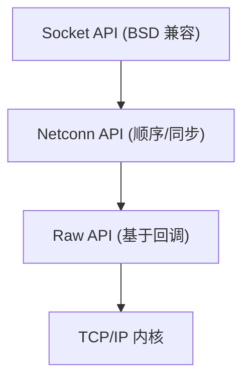

# LWIP 概述与架构

## 定位

lwIP (lightweight IP) 是 Adam Dunkels (瑞典计算机科学研究所) 开发的轻量级 TCP/IP 协议栈。它是嵌入式领域使用最广泛的网络协议栈，ESP32、STM32 以太网项目几乎都基于它。

> [!note] 名称由来
> "lwIP" 中的 "lw" 不是 "lightweight" 缩写——作者说只是随便起的。但文档中普遍理解为 lightweight IP。

## 目录结构与 TCP/IP 模型映射

```
src/
├── api/           # 顺序 API 层：Netconn (类 Berkeley) 和 Socket
├── apps/          # 应用层协议：HTTP、MQTT、SNTP、TFTP、mDNS
├── core/          # 核心网络层/传输层
│   ├── ipv4/      # IPv4、ICMP、IGMP、分片/重组
│   ├── ipv6/      # IPv6、ICMPv6、NDP、MLD
│   ├── pbuf.c     # 数据包缓冲区抽象（所有层的基础）
│   ├── mem.c      # 动态堆分配器
│   ├── memp.c     # 固定大小池分配器
│   ├── netif.c    # 网络接口抽象
│   ├── tcp.c      # TCP PCB 管理、定时器、连接生命周期
│   ├── tcp_in.c   # TCP 输入处理（段处理、状态机）
│   ├── tcp_out.c  # TCP 输出处理（分段、重传）
│   ├── udp.c      # UDP 输入/输出
│   └── timeouts.c # 定时器调度
├── include/       # 所有头文件（include/lwip/）
└── netif/         # 网络接口驱动程序（ethernet、PPP、SLIP、loopback）
```

| OSI 层 | lwIP 模块 |
|--------|-----------|
| 应用层 | `src/apps/`（HTTP、MQTT 等） |
| 传输层 | `src/core/tcp.c`、`src/core/udp.c`、`src/core/raw.c` |
| 网络层 | `src/core/ipv4/`、`src/core/ipv6/` |
| 链路层 | `src/netif/`、`src/core/netif.c` |

## 三种编程 API



| API | 复杂度 | 性能 | 线程模型 | 使用场景 |
|-----|--------|------|---------|---------|
| **Raw API** | 高 | 最高（零拷贝回调） | 单线程 / NO_SYS | 极简内存，最高吞吐 |
| **Netconn API** | 中 | 中（消息传递开销） | 多线程 | 典型 RTOS 应用 |
| **Socket API** | 低 | 中 | 多线程 | 移植 Unix 代码，兼容性 |

> [!note] Raw API 是 lwIP 的特色
> 其他协议栈（Linux 内核网络栈、FreeBSD 网络栈）没有 Raw API。回调直接从 TCP/IP 处理线程调用，应用程序在回调中直接处理 pbuf，零拷贝。

## 两种运行模式

### NO_SYS = 1（无 OS 模式）

```c
// 裸机主循环
int main(void) {
    lwip_init();
    netif_add(&netif, ...);
    netif_set_up(&netif);

    while (1) {
        ethernet_poll();          // 从网卡收包 → netif->input()
        sys_check_timeouts();     // 处理 TCP 重传、ARP 老化等定时器
    }
}
```

### NO_SYS = 0（OS 模式）

TCP/IP 作为独立线程运行，通过消息队列接收 API 调用：

```c
// tcpip_thread 主循环（lwIP 内部）
void tcpip_thread(void *arg) {
    while (1) {
        msg = sys_mbox_fetch(tcpip_mbox, timeout);
        switch (msg->type) {
            case API_MSG:  handle_api_msg(msg); break;
            case INPKT:    handle_input_packet(msg); break;
            case CALLBACK: msg->cb.f(msg->cb.ctx); break;
        }
        sys_check_timeouts();
    }
}
```

## 核心设计原则

1. **零拷贝优先**：数据在 pbuf 链中以指针传递，协议头通过移动 `payload` 指针添加/移除
2. **回调驱动**：传输层不缓存数据——通过回调立即交给应用层
3. **静态内存为主**：memp 池预分配所有核心对象（PCB、段、pbuf 结构体）
4. **无动态协议开销**：不使用 malloc 的协议对象（PCB 等）全部来自 memp 池
5. **最小化代码量**：通过条件编译 (`LWIP_*`) 精确裁剪不需要的功能

## 与 FreeRTOS 的架构映射

| lwIP 概念 | FreeRTOS 对应 | 相似度 |
|-----------|--------------|--------|
| `sys_mbox_t` 消息队列 | `QueueHandle_t` | 几乎一致 |
| `sys_sem_t` 信号量 | `SemaphoreHandle_t` | 几乎一致 |
| `sys_arch_protect` 临界区 | `taskENTER_CRITICAL` | 完全一致 |
| `sys_thread_new` | `xTaskCreate` | 完全一致 |
| `sys_timeout` 定时器链表 | 软件定时器守护任务 | 机制不同，目的相同 |
| `memp` 固定大小对象池 | — | FreeRTOS 无此抽象 |
| Raw API 回调 | 任务通知 | 逻辑等价：事件驱动 |
| `tcpip_mbox` | 控制流队列 | 相同的消息驱动架构 |

## 页面索引

| 页面 | 内容 |
|------|------|
| [[LWIP/2. LWIP pbuf 数据包缓冲区]] | 引用计数、链式结构、零拷贝操作 |
| [[LWIP/3. LWIP 内存管理]] | mem 堆 + memp 池双轨分配 |
| [[LWIP/4. LWIP IP 层]] | IPv4 输入/输出、分片重组、路由 |
| [[LWIP/5. LWIP TCP 传输层]] | 状态机、重传、拥塞控制、回调 |
| [[LWIP/6. LWIP UDP 与 RAW]] | UDP PCB、原始 IP 协议处理 |
| [[LWIP/7. LWIP netif 网络接口]] | 接口抽象、输出链、ARP 集成 |
| [[LWIP/8. LWIP API 层与 OS 抽象]] | Raw → Netconn → Socket, sys_arch 移植 |
