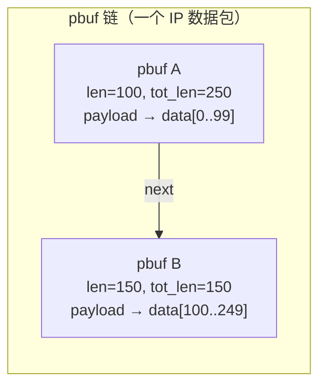

# LWIP pbuf 数据包缓冲区

## 设计目的

pbuf (Packet Buffer) 是 lwIP 整个协议栈的**基本数据单元**。它使零拷贝数据流成为可能：网卡驱动将数据接收到 pbuf 池中，指针在各协议层之间传递，无需复制。

## 核心结构体

```c
struct pbuf {
  struct pbuf *next;       // 链表中的下一个 pbuf
  void *payload;           // 指向实际数据的指针
  u16_t tot_len;           // 此 pbuf + 所有后续 pbuf 的总长度
  u16_t len;               // 此单个 pbuf 的长度
  u8_t type_internal;      // pbuf 类型 + 分配源（位域）
  u8_t flags;              // PBUF_FLAG_PUSH、PBUF_FLAG_IS_CUSTOM 等
  LWIP_PBUF_REF_T ref;     // 引用计数
  u8_t if_idx;             // 接收数据包的网络接口索引
};
```

### 关键不变量

```
p->tot_len == p->len + (p->next ? p->next->tot_len : 0)
```

遍历链时，`tot_len` 给出剩余数据总量，`len` 给出当前节点数据量。这使得 O(1) 获取总长度、O(1) 截断成为可能。

## pbuf 四种类型

| 类型 | 分配源 | 数据存储位置 | 典型用途 | 需复制？ |
|------|--------|-------------|---------|---------|
| `PBUF_RAM` | `mem_malloc` (堆) | 紧随 pbuf 结构的连续内存 | 发送 (TX) | 否 |
| `PBUF_ROM` | `memp` 池 | 外部（不可变，如 ROM 常量） | 指向静态数据的指针 | 否 |
| `PBUF_REF` | `memp` 池 | 外部（可能易失） | 指向驱动缓冲区的指针 | 是（若需排队） |
| `PBUF_POOL` | `MEMP_PBUF_POOL` | 紧随 pbuf 结构的连续内存 | 接收 (RX) | 否 |

### 内存布局对比

```
PBUF_RAM:
  ┌──────────────┐
  │ struct pbuf   │ ← mem_malloc 返回
  │ ...           │
  ├──────────────┤
  │ 数据区域      │ ← p->payload 指向这里
  │               │
  └──────────────┘

PBUF_REF / PBUF_ROM:
  ┌──────────────┐     ┌──────────────────┐
  │ struct pbuf   │     │ 外部数据          │
  │ p->payload ───┼────→│ (驱动缓冲区/ROM)   │
  └──────────────┘     └──────────────────┘

PBUF_POOL:
  从预分配的固定大小池中分配，结构和数据在同一连续块中（同 PBUF_RAM），
  但大小是固定的（PBUF_POOL_BUFSIZE）。大数据包需要链接多个 PBUF_POOL pbuf。
```

## 链式结构与分散-聚集 I/O



**分散 (Scatter)**：协议头可以放在第一个 pbuf 的前部（通过 `pbuf_add_header` 向前移动 payload 指针），数据在后续 pbuf 中。

**聚集 (Gather)**：接收时，多个 PBUF_POOL pbuf 链接在一起形成一个完整数据包，无需分配大缓冲区。

## 核心 API

### 分配与释放

```c
// 分配新 pbuf
// layer: PBUF_TRANSPORT / PBUF_IP / PBUF_LINK / PBUF_RAW_TX
//   决定在 payload 前预留多少空间给协议头
// length: 请求的数据容量
// type: PBUF_RAM / PBUF_ROM / PBUF_REF / PBUF_POOL
struct pbuf *pbuf_alloc(pbuf_layer layer, u16_t length, pbuf_type type);

// 释放 pbuf 链。递减 refcount，ref==0 时真正释放。
// 遍历链直到某个 pbuf 仍有引用。
u8_t pbuf_free(struct pbuf *p);
```

### 零拷贝头操作

```c
// 向前扩展 payload 指针（为协议头腾空间），零拷贝
// 返回新 payload 起始地址（通常 = 原 payload - size）
void *pbuf_add_header(struct pbuf *p, size_t size);

// 向后收缩 payload 指针（剥离协议头），零拷贝
// 返回新 payload 起始地址
void *pbuf_remove_header(struct pbuf *p, size_t size);

// 尾部扩展/收缩
err_t pbuf_add_tail(struct pbuf *p, size_t size);   // 需要重新分配
err_t pbuf_remove_tail(struct pbuf *p, size_t size);
```

**典型用法**——发送路径上逐层添加协议头：

```c
// 应用层数据在 pbuf 中
// TCP 层：添加 TCP 头
pbuf_add_header(p, TCP_HLEN);  // payload 指针前移 20 字节
// IP 层：添加 IP 头
pbuf_add_header(p, IP_HLEN);   // payload 指针再前移 20 字节
// 以太网层：添加 MAC 头
pbuf_add_header(p, ETH_HDR_LEN);
// 现在 p->payload 指向以太网帧起始
```

### 链操作

```c
void pbuf_chain(struct pbuf *head, struct pbuf *tail);  // 链接两个链
void pbuf_cat(struct pbuf *head, struct pbuf *tail);    // 同上（不更新 tot_len）
struct pbuf *pbuf_dechain(struct pbuf *p);               // 分离第一个 pbuf
err_t pbuf_copy(struct pbuf *p_to, const struct pbuf *p_from);  // 深拷贝
```

### 数据访问

```c
// 从链式 pbuf 复制数据到线性缓冲区
u16_t pbuf_copy_partial(const struct pbuf *p, void *buf,
                        u16_t len, u16_t offset);
// 从线性缓冲区复制到链式 pbuf
err_t pbuf_take(struct pbuf *p, const void *data, u16_t len);
// 将链式 pbuf 合并为单个 PBUF_RAM
struct pbuf *pbuf_coalesce(struct pbuf *p, pbuf_layer layer);
```

## 引用计数机制

```c
// 增加引用（如 TCP 同时排队发送和重传）
void pbuf_ref(struct pbuf *p);  // p->ref++

// 释放时：
// if (--p->ref == 0) → 真正释放数据结构
// 然后继续处理 p->next，直到某个节点 ref > 0
```

**典型场景**——TCP 段同时存在于 `unsent` 和重传链表中：

```
tcp_seg (unsent)
  └── pbuf (ref=1) ──────────┐
                              ├── 同一块内存
tcp_seg (重传备选)            │
  └── pbuf (ref=1, 同一块) ───┘
```

确认到达后，两个引用都释放，`ref` 降为 0，内存释放。

## 与 FreeRTOS 的对比

| lwIP pbuf | FreeRTOS 对应 | 备注 |
|-----------|--------------|------|
| 引用计数 (`ref`) | — | FreeRTOS 流/消息缓冲区无引用计数；lwIP 需要共享所有权 |
| 链式 pbuf | — | FreeRTOS 缓冲区是线性的；pbuf 链实现分散-聚集 I/O |
| `PBUF_POOL` 池 | `xQueue` 固定大小 | 相似：预分配，固定大小。但 lwIP 手动释放，Queue 自动释放。 |
| `pbuf_free` 自动遍历链 | — | FreeRTOS 无链式缓冲区概念 |
| `pbuf_add_header` 零拷贝 | — | FreeRTOS 缓冲区无此语义 |
