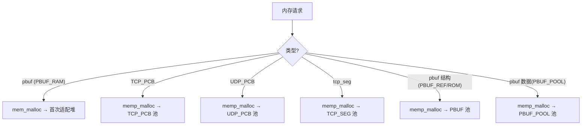

# LWIP 内存管理

## 双轨分配架构

lwIP 有两套独立的内存分配子系统：

| 子系统 | 文件 | 分配模式 | 用途 |
|--------|------|---------|------|
| **mem** (动态堆) | `core/mem.c` | 首次适配堆 | pbuf 数据（PBUF_RAM）、大块内存 |
| **memp** (固定池) | `core/memp.c` | 固定大小对象池 | PCB、tcp_seg、pbuf 结构体等高频小对象 |



> [!note] 为什么需要两套？
> 协议对象（PCB、段）频繁分配/释放，大小固定。用通用堆会导致碎片。用 memp 池预分配，O(1) 分配/释放，零碎片。

## mem — 动态堆分配器

### 数据结构

```c
struct mem {
  mem_size_t next;    // 下一个块的索引
  mem_size_t prev;    // 前一个块的索引
  u8_t used;          // 1=已分配, 0=空闲
};
```

- 所有块在静态 `ram_heap[MEM_SIZE_ALIGNED]` 数组上运行
- 首次适配搜索，从 `lfree`（上次释放位置）开始
- 相邻空闲块自动合并
- 线程安全：通过 `sys_mutex_t` 保护

### 核心 API

```c
void *mem_malloc(mem_size_t size);   // 首次适配搜索
void  mem_free(void *rmem);          // 标记为空闲 + 合并相邻块
void *mem_calloc(mem_size_t count, mem_size_t size);
void *mem_trim(void *mem, mem_size_t new_size);  // 原地缩小
```

### 配置选项

```c
#define MEM_SIZE                    1600   // 堆总大小（字节）
#define MEM_ALIGNMENT               1      // 对齐要求
#define MEM_USE_POOLS               0      // 用多个固定池替代堆
#define MEM_LIBC_MALLOC             0      // 委托给 C 库 malloc
```

### 溢出检测

通过 `MEMP_OVERFLOW_CHECK` 可以在分配块前后写入魔数 `0xcd`，释放时检测覆盖。

## memp — 固定大小对象池

### 设计思路

为每种核心数据结构预分配一个池：

```c
struct memp_desc {
  const char *desc;      // 调试名称
  struct stats_mem *stats;
  u16_t size;            // 每个元素大小
  u16_t num;             // 池中元素数量
  u8_t *base;            // 池内存起始地址
  struct memp **tab;     // 指向空闲链表头部的指针
};
```

每个池作为单向空闲链表管理：`memp_malloc` 从链表头部取，`memp_free` 放回头部。

### X-Macro 声明表

`memp_std.h` 用 X-Macro 技术声明所有池。该文件被多次 `#include`，每次定义不同的 `LWIP_MEMPOOL` 宏：

```c
// memp_std.h 中的声明（简化）
LWIP_MEMPOOL(UDP_PCB,        MEMP_NUM_UDP_PCB,   sizeof(struct udp_pcb),  "UDP_PCB")
LWIP_MEMPOOL(TCP_PCB,        MEMP_NUM_TCP_PCB,   sizeof(struct tcp_pcb),  "TCP_PCB")
LWIP_MEMPOOL(TCP_PCB_LISTEN, MEMP_NUM_TCP_PCB_LISTEN, sizeof(struct tcp_pcb_listen), "TCP_PCB_LISTEN")
LWIP_MEMPOOL(TCP_SEG,        MEMP_NUM_TCP_SEG,   sizeof(struct tcp_seg),  "TCP_SEG")
LWIP_PBUF_MEMPOOL(PBUF,      MEMP_NUM_PBUF,      sizeof(struct pbuf),     "PBUF_REF/ROM")
LWIP_PBUF_MEMPOOL(PBUF_POOL, PBUF_POOL_SIZE,     PBUF_POOL_BUFSIZE,       "PBUF_POOL")
// ...
```

**三次包含产生不同代码**：

```c
// 第一次：生成枚举（memp_type）
#define LWIP_MEMPOOL(name,num,size,desc) MEMP_##name,
typedef enum {
#include "lwip/priv/memp_std.h"
  MEMP_MAX
} memp_t;

// 第二次：生成描述符数组
#define LWIP_MEMPOOL(name,num,size,desc) {desc, &stats, num, size, NULL, NULL},
static const struct memp_desc memp_pools[MEMP_MAX] = {
#include "lwip/priv/memp_std.h"
};

// 第三次：生成内存数组
#define LWIP_MEMPOOL(name,num,size,desc) LWIP_MEM_ALIGN_BUFFER(memp_mem_##name, (num * (size)));
#include "lwip/priv/memp_std.h"
```

### 分配与释放

```c
void *memp_malloc(memp_t type) {
    SYS_ARCH_PROTECT();              // 禁用中断
    memp = desc->tab;                // 从空闲链表取头部
    if (memp != NULL) {
        desc->tab = memp->next;      // 更新头部
        desc->num--;                 // 计数减 1
    }
    SYS_ARCH_UNPROTECT();            // 恢复中断
    return memp;
}

void memp_free(memp_t type, void *memp) {
    SYS_ARCH_PROTECT();
    memp->next = desc->tab;          // 放回链表头部
    desc->tab = memp;
    desc->num++;
    SYS_ARCH_UNPROTECT();
}
```

> [!note] SYS_ARCH_PROTECT vs 互斥锁
> memp 使用 `SYS_ARCH_PROTECT()`（通常是关中断）而非互斥锁。因为 memp 操作极快（几条指令），关中断的开销远小于互斥锁的上下文切换开销。

## 配置裁剪

```c
// lwipopts.h 中的典型配置
#define MEMP_NUM_UDP_PCB        4     // 最多 4 个 UDP socket
#define MEMP_NUM_TCP_PCB        8     // 最多 8 个 TCP 连接
#define MEMP_NUM_TCP_PCB_LISTEN 2     // 最多 2 个监听 socket
#define MEMP_NUM_TCP_SEG        32    // TCP 段池大小
#define MEMP_NUM_PBUF           16    // PBUF_REF/ROM 结构池
#define PBUF_POOL_SIZE          8     // PBUF_POOL 缓冲区数量
#define PBUF_POOL_BUFSIZE       512   // 每个 PBUF_POOL 缓冲区大小
```

每个宏的数值直接决定 RAM 占用。这是 lwIP 能跑在 RAM < 10KB 的 MCU 上的关键。

## 与 FreeRTOS 的对比

| lwIP 机制 | FreeRTOS | 差异 |
|-----------|----------|------|
| `mem_malloc` / `mem_free` | `pvPortMalloc` / `vPortFree` | 都是首次适配堆。lwIP 在静态数组上运行，FreeRTOS 用链接器堆。 |
| `memp` 对象池 | — | **FreeRTOS 无此抽象**。最接近的是用固定大小的 Queue 模拟。 |
| `SYS_ARCH_PROTECT` (关中断) | `taskENTER_CRITICAL` | 完全一致。都是短暂关中断保护临界区。 |
| `MEM_OVERFLOW_CHECK` 魔数 | `configASSERT` 堆栈溢出 | 类似的防御性编程，检查不同的对象。 |
| X-Macro 生成枚举/表/数组 | — | FreeRTOS 不用 X-Macro，用普通的结构体数组。 |
