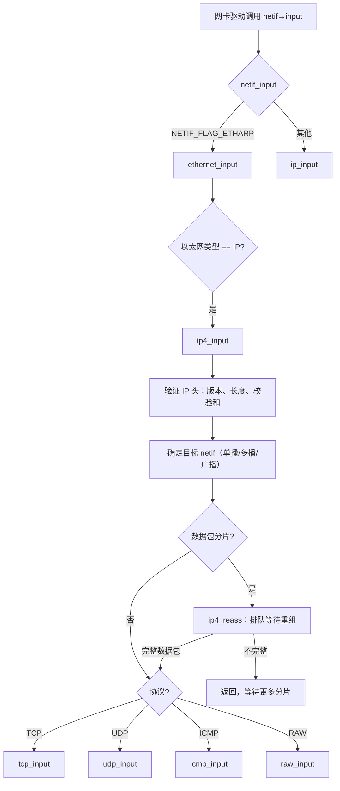

# LWIP IP 层

## IP_PCB 宏

lwIP 用 `IP_PCB` 宏将通用 IP 字段嵌入每个传输层 PCB：

```c
#define IP_PCB                             \
  ip_addr_t local_ip;                      \  // 本地 IP 地址
  ip_addr_t remote_ip;                     \  // 远程 IP 地址
  u8_t netif_idx;                          \  // 绑定的网络接口索引
  u8_t so_options;                         \  // 套接字选项 (SO_BROADCAST 等)
  u8_t tos;                                \  // 服务类型
  u8_t ttl                                 \  // 生存时间
  IP_PCB_NETIFHINT                            // 链路层地址提示
```

这个宏出现在 `struct udp_pcb`、`struct tcp_pcb`、`struct tcp_pcb_listen` 的**开头**。这是一种"成员变量复用"模式——类似于 C++ 的基类组合。

## IPv4 输入通路



## IPv4 输出通路

```c
// 从传输层调用（如 udp_sendto_if_src）
// 1. pbuf_add_header(p, IP_HLEN) — 在 pbuf 前添加 IP 头
// 2. 填写字段：version=4, IHL=5, TOS, 总长度, ID, TTL, 协议, 校验和
// 3. 处理环回（目标 == 本地地址）→ netif_loop_output
// 4. 如果 p->tot_len > netif->mtu → ip4_frag 分片
// 5. netif->output(netif, p, dest) → 进入 ARP/链路层
```

### 路由 `ip4_route`

```
遍历 netif_list，找第一个与目标 IP（通过 netmask）匹配的已 UP 的 netif。
回退到 netif_default。
可通过 LWIP_HOOK_IP4_ROUTE 自定义路由表。
```

## 分片 (Fragmentation)

`ip4_frag` 实现：

```c
// 对于超过 MTU 的数据包：
while (p->tot_len > netif->mtu + IP_HLEN) {
    // 1. 分配一个新的 PBUF_RAM 头（仅 IP 头）
    // 2. 创建指向原始 pbuf 数据部分的 PBUF_REF（零拷贝！）
    // 3. 填写 IP 头：偏移量 = poff >> 3, MF=1
    // 4. 调用 netif->output 发送这个分片
    // 5. poff += 分片数据大小
}
// 最后一个分片：MF=0
```

> [!note] 零拷贝分片
> 分片时**不复制数据**——`PBUF_REF` 指向原始数据包中的不同偏移位置。新分片的 IP 头很小（20 字节），使用 `PBUF_RAM`。

## 重组 (Reassembly)

```c
struct ip_reassdata {
  struct ip_reassdata *next;     // 全局重组链表
  struct pbuf *p;                // 第一个分片的 pbuf
  ip_addr_t src, dest;           // 标识数据包的地址对
  u16_t id;                      // IP 标识符
  u16_t datagram_len;            // 期望的总数据包长度
  u8_t timer;                    // 超时定时器（递减）
};
```

**重组算法**：
1. 收到分片 → 在 `reassdatagrams` 链表中按 (src, dest, id) 查找
2. 未找到 → 从 `MEMP_REASSDATA` 池分配新的重组条目
3. 按偏移量将分片插入有序链（从低偏移到高偏移）
4. 覆盖检测：`IP_REASS_CHECK_OVERLAP` 确保不重叠
5. 收到最后一个分片（MF=0）→ 将所有 pbuf 链接在一起 → 恢复 IP 头 → 传给传输层
6. 超时（`ip_reass_tmr` / `IP_TMR_INTERVAL`）→ 释放不完整的数据包

## IPv6

IPv6 实现在 `src/core/ipv6/` 中，设计类似：

| IPv4 | IPv6 |
|------|------|
| `ip4_input` / `ip4_output_if` | `ip6_input` / `ip6_output_if` |
| ARP (`etharp`) | NDP (`nd6`) |
| IGMP | MLD (`mld6`) |
| IP 分片 | IP6 分片（仅发送端分片） |

IPv6 的分片策略不同：根据 IPv6 规范，只有发送端分片，中间路由器不分片。lwIP 的路由器上 `ip6_frag` 被跳过。

## 与 FreeRTOS 的对比

lwIP 的 IP 层是纯协议多路分用器，无 RTOS 概念。`LWIP_HOOK_*` 宏提供了与 FreeRTOS 集成的注入点（如自定义路由表、统计计数）。
