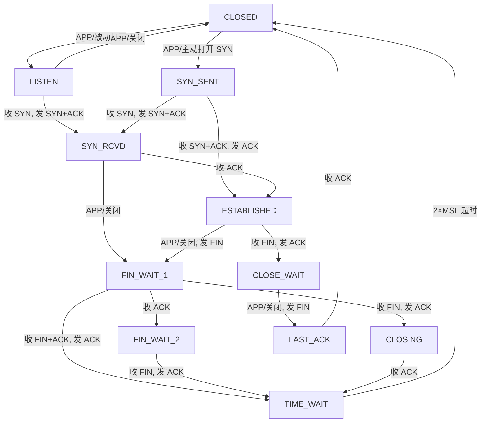
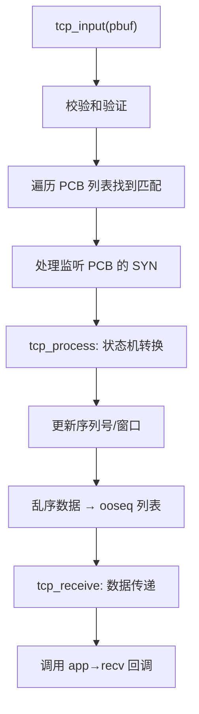
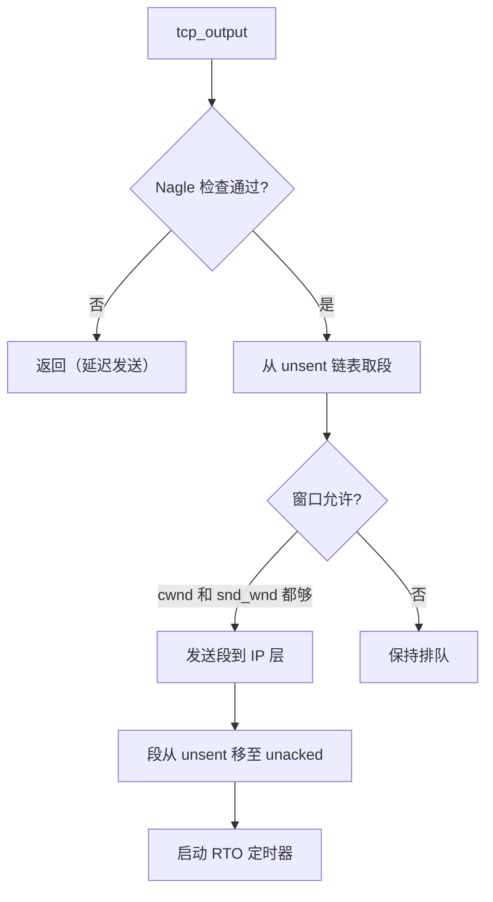

# LWIP TCP 传输层

## 模块分解

TCP 是 lwIP 中最复杂的模块，分为三个文件：

| 文件 | 职责 |
|------|------|
| `tcp.c` | PCB 生命周期、定时器（慢/快）、PCB 列表管理、连接建立/关闭 |
| `tcp_in.c` | 入站段处理、状态机转换、数据接收 |
| `tcp_out.c` | 出站段构造、发送窗口管理、重传队列 |

## TCP 状态机



定义在 `tcpbase.h`：

```c
enum tcp_state {
  CLOSED      = 0,  LISTEN      = 1,  SYN_SENT    = 2,  SYN_RCVD    = 3,
  ESTABLISHED = 4,  FIN_WAIT_1  = 5,  FIN_WAIT_2  = 6,  CLOSE_WAIT  = 7,
  CLOSING     = 8,  LAST_ACK    = 9,  TIME_WAIT   = 10
};
```

## TCP PCB 结构

```c
struct tcp_pcb {
  IP_PCB;                            // 嵌入 IP 层通用字段
  TCP_PCB_COMMON(struct tcp_pcb);    // 嵌入 TCP 通用字段
  u16_t remote_port;

  // 连接标志
  tcpflags_t flags;        // TF_ACK_DELAY, TF_INFR, TF_NODELAY, TF_RTO...

  /* 接收端变量 */
  u32_t rcv_nxt;           // 下一个期望的序列号
  tcpwnd_size_t rcv_wnd;   // 接收窗口（本地可用缓冲区）

  /* 重传 / RTT 估计 */
  s16_t rtime;             // 重传定时器（递减）
  u16_t mss;               // 最大段大小
  u32_t rttest, rtseq;     // RTT 测量的时间戳和序列号
  s16_t sa, sv;            // 平滑 RTT 估计器 (Jacobson/Karels 算法)
  s16_t rto;               // 重传超时值
  u8_t nrtx;               // 重传次数

  /* 拥塞控制 */
  tcpwnd_size_t cwnd;      // 拥塞窗口
  tcpwnd_size_t ssthresh;  // 慢启动阈值

  /* 发送端变量 */
  u32_t snd_nxt;           // 下一个要发送的新序列号
  u32_t snd_wnd;           // 发送窗口（远程通告）
  u32_t snd_wl1, snd_wl2;  // 窗口更新检测用的序列号/确认号

  /* 段队列 */
  struct tcp_seg *unsent;   // 排队但未发送的段
  struct tcp_seg *unacked;  // 已发送但未确认的段
  struct tcp_seg *ooseq;    // 接收到的乱序段

  /* 回调函数 */
  tcp_recv_fn recv;         // 数据到达时调用
  tcp_sent_fn sent;         // 数据被确认时调用
  tcp_connected_fn connected;
  tcp_poll_fn poll;         // 周期性回调（应用可发送数据）
  tcp_err_fn errf;          // 连接错误回调
  void *callback_arg;
};
```

## 按状态分区的 PCB 列表

lwIP 将 TCP PCB 按连接状态分为四个全局链表：

| 列表 | 内容 | 查找用途 |
|------|------|---------|
| `tcp_bound_pcbs` | 已绑定但未连接/未监听 | 端口冲突检测 |
| `tcp_listen_pcbs` | LISTEN 状态 | 新连接匹配 |
| `tcp_active_pcbs` | 活动连接 (SYN_SENT ~ CLOSE_WAIT) | 入站段分发 |
| `tcp_tw_pcbs` | TIME_WAIT 状态 | TIME_WAIT 处理 |

这种**按状态分区**的设计使入站段分发高效——大多数数据包只搜索 `tcp_active_pcbs`，而新连接只搜索 `tcp_listen_pcbs`。

## 入站处理 `tcp_input`



### 段处理关键步骤

1. **SYN 处理**：分配新 PCB → 交换 ISN → 发送 SYN+ACK
2. **ACK 处理**：从 `unacked` 链表中移除已确认的段 → 更新 `snd_wnd` → 调整 `cwnd`/`ssthresh` → 调用 `sent` 回调
3. **数据接收**：在 `rcv_nxt` 附近插入段 → 调用 `recv` 回调传递数据 → 应用调用 `tcp_recved()` 释放窗口
4. **FIN 处理**：推进状态（ESTABLISHED → CLOSE_WAIT；FIN_WAIT_1 → TIME_WAIT 等）
5. **RST 处理**：调用 `errf` 回调 → 释放 PCB

## 出站处理 `tcp_output`



`tcp_write` 将数据排队到 `pcb->unsent`：
- 尽量与现有未发送段合并（减少小段）
- 若 `TCP_WRITE_FLAG_COPY` 置位，分配 `tcp_seg` + pbuf 复制数据；否则引用外部数据

**Nagle 算法**：若 `unacked != NULL`（有未确认数据）且 `TF_NODELAY` 未设置，且段 < MSS，则延迟发送。

## RTO 重传超时

**Jacobson/Karels 算法**：

```
srtt    = (7/8) × srtt    + (1/8) × m           // 平滑 RTT
rttvar  = (3/4) × rttvar  + (1/4) × |srtt - m|  // RTT 变化
rto     = srtt + 4 × rttvar                      // 重传超时
```

### 两个定时器

| 定时器 | 周期 | 功能 |
|--------|------|------|
| **快速定时器** (`tcp_fasttmr`) | 250ms | 发送延迟 ACK、处理 RTO 超时 |
| **慢速定时器** (`tcp_slowtmr`) | 500ms | 检查未确认段超时、零窗口探测、保活、TIME_WAIT 清理 |

**退避数组**：`tcp_backoff[13] = {1,2,3,4,5,6,7,7,7,7,7,7,7}`，最大退避因子 = 7。

## 拥塞控制

```c
// 慢启动：cwnd < ssthresh 时，每收到一个 ACK，cwnd += mss
// 拥塞避免：cwnd >= ssthresh 时，每 RTT，cwnd += mss
// 丢包检测（3 个重复 ACK 或 RTO 超时）：
//   ssthresh = max(snd_wnd / 2, 2*mss)
//   cwnd = mss  (RTO) 或 ssthresh + 3*mss (快速恢复)
```

## TCP 段结构

```c
struct tcp_seg {
  struct tcp_seg *next;    // 链表中下一个段
  struct pbuf *p;          // 指向 TCP 头所在 pbuf
  u16_t len;               // 段数据长度
  u8_t oversize_left;      // tcp_write 用的剩余预分配空间
  // ... 后面是 TCP 头
};
```

## 与 FreeRTOS 的对比

| lwIP TCP | FreeRTOS 模式 | 备注 |
|----------|--------------|------|
| 回调 API (`tcp_recv` 等) | 任务通知 | lwIP 回调在 TCP 线程上下文执行；FreeRTOS 通知唤醒任务——都避免轮询 |
| `tcp_tmr` 每 250ms | `vTaskDelay`/软件定时器 | 在 NO_SYS 模式从 `main()` 循环调用，或线程化 |
| PCB 链表 (`tcp_active_pcbs`) | — | 由核心锁或临界区保护 |
| 窗口/拥塞控制 | — | 无 FreeRTOS 对应——纯协议机制 |
| `tcp_seg` 链表 | `xStreamBuffer` | 概念相似：段队列 vs 字节流。但有确认/重传机制。 |
