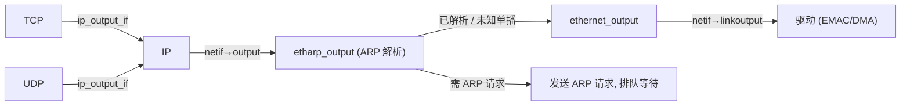
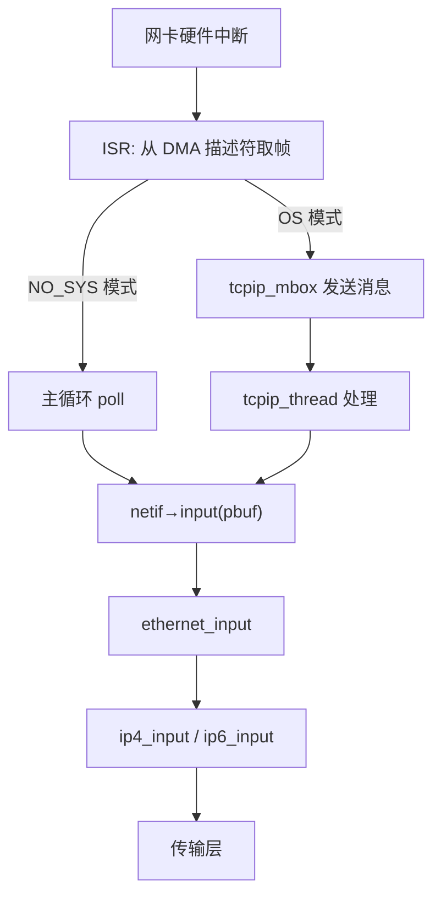

# LWIP netif 网络接口

## 设计定位

`netif` 是 lwIP 对网络接口（网卡）的抽象。每个 netif 代表一个物理或虚拟网络接口（以太网卡、WiFi Station、PPP 链路、环回接口等）。

## netif 结构体

```c
struct netif {
  struct netif *next;                        // 全局 netif_list 链表
  ip_addr_t ip_addr, netmask, gw;            // IPv4 配置
  ip_addr_t ip6_addr[LWIP_IPV6_NUM_ADDRESSES]; // IPv6 地址
  netif_input_fn input;                      // 驱动收到数据包时调用
  netif_output_fn output;                    // IP 层输出（→ etharp_output）
  netif_linkoutput_fn linkoutput;            // ARP/以太网输出原始帧（→ 驱动）
  void *state;                               // 驱动私有状态（如 DMA 描述符指针）
  u8_t hwaddr[NETIF_MAX_HWADDR_LEN];         // MAC 地址
  u8_t hwaddr_len;                           // MAC 地址长度（6）
  u16_t mtu;                                 // 最大传输单元
  u8_t flags;                                // NETIF_FLAG_UP, _BROADCAST, _LINK_UP, _ETHARP...
  char name[2];                              // 缩写（"en", "lo"...）
  u8_t num;                                  // 接口编号
  // loopback 队列
  struct pbuf *loop_first, *loop_last;       // 环回数据包队列
};
```

## 输出链



### output vs linkoutput

| 函数指针 | 调用者 | 职责 |
|---------|--------|------|
| `netif->output` | IP 层 | 处理 ARP 解析 → 获取 MAC 地址 → 调用 `linkoutput` |
| `netif->linkoutput` | ARP/以太网 | 通过 DMA 将原始帧发送到网卡硬件 |

> [!note] 为什么分两层？
> `output` 做 ARP 解析（可能需要等待），`linkoutput` 是纯硬件写入。这种分离让 ARP 逻辑独立于硬件驱动。

## netif 管理 API

```c
// 添加接口——分配编号、链接到 netif_list、调用驱动 init
struct netif *netif_add(struct netif *netif,
                        const ip_addr_t *ipaddr, const ip_addr_t *netmask,
                        const ip_addr_t *gw, void *state,
                        netif_init_fn init, netif_input_fn input);

void netif_set_up(struct netif *netif);        // NETIF_FLAG_UP
void netif_set_down(struct netif *netif);
void netif_set_link_up(struct netif *netif);   // NETIF_FLAG_LINK_UP → 触发 DHCP/ARP
void netif_set_link_down(struct netif *netif);
void netif_set_default(struct netif *netif);   // 设为 netif_default
void netif_remove(struct netif *netif);        // 从链表移除

// 遍历所有接口
#define NETIF_FOREACH(netif) for (netif = netif_list; netif != NULL; netif = netif->next)
```

## 入站路径



## 环回 (Loopback)

发往本地 IP 的数据包不应离开本机。lwIP 通过**环回队列**实现：

```c
// 环回发送（在 ip4_output_if 中触发）
err_t netif_loop_output(struct netif *netif, struct pbuf *p) {
    // 复制 pbuf → 排队到 netif->loop_first/last
    // 在 NO_SYS 模式：应用调用 netif_poll_all() 处理
    // 在 OS 模式：通过 tcpip_callback 自动调度
}
```

## 状态回调 (NSC)

```c
// 注册 netif 状态变化回调
void netif_add_status_callback(netif_status_callback_fn fn);
// 事件类型：
//   LWIP_NSC_NETIF_ADDED / REMOVED
//   LWIP_NSC_LINK_CHANGED
//   LWIP_NSC_STATUS_CHANGED
//   LWIP_NSC_IPV4_ADDRESS_CHANGED
```

## 与 FreeRTOS 的对比

| lwIP netif | FreeRTOS | 备注 |
|-----------|----------|------|
| 回调函数 (`output`, `linkoutput`, `input`) | — | FreeRTOS 无网络抽象 |
| 用户数据 (`void *state`) | `pvTimerGetTimerID` | 都是将用户数据附加到核心结构 |
| `netif_poll_all()` 环回处理 | `main()` 循环 | NO_SYS 模式下等效 |
| `NETIF_FOREACH` | FreeRTOS 链表宏 | 相同的单向链表遍历模式 |
| NSC 回调 | 软件定时器回调 | 事件通知机制相似 |
