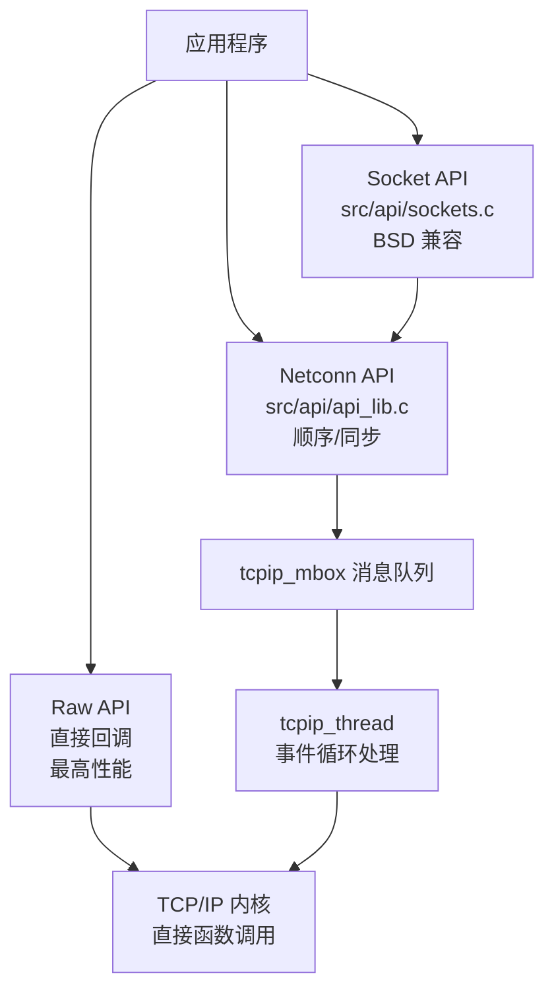
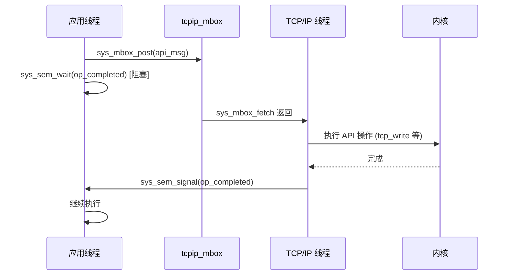

# LWIP API 层与 OS 抽象

## 三级 API 体系



## Raw API（回调驱动）

最轻量、最高性能的 API。回调在 TCP/IP 上下文直接调用：

```c
// 服务器示例
struct tcp_pcb *pcb = tcp_new();
tcp_bind(pcb, IP_ADDR_ANY, 80);
pcb = tcp_listen(pcb);
tcp_accept(pcb, accept_callback);

err_t accept_callback(void *arg, struct tcp_pcb *newpcb, err_t err) {
    tcp_recv(newpcb, recv_callback);    // 注册数据接收回调
    tcp_sent(newpcb, sent_callback);    // 注册确认回调
    tcp_poll(newpcb, poll_callback, 2); // 周期性回调
    tcp_err(newpcb, err_callback);      // 错误回调
    return ERR_OK;
}

err_t recv_callback(void *arg, struct tcp_pcb *pcb,
                    struct pbuf *p, err_t err) {
    if (p != NULL) {
        // 处理 p->payload 中的数据
        tcp_recved(pcb, p->tot_len);   // 释放接收窗口信用
        pbuf_free(p);
    } else {
        // p == NULL → 对端关闭了连接
        tcp_close(pcb);
    }
    return ERR_OK;
}
```

**Raw API 的限制**：
- 所有回调在 TCP/IP 线程上下文运行
- 不能在回调中长时间阻塞
- 不能在回调中调用会阻塞的 Netconn/Socket API

## Netconn API（顺序/同步）

在 OS 模式上提供同步、类似文件系统的 API：

```c
// 服务器示例
struct netconn *conn = netconn_new(NETCONN_TCP);
netconn_bind(conn, IP_ADDR_ANY, 80);
netconn_listen(conn);

while (1) {
    struct netconn *newconn;
    netconn_accept(conn, &newconn);     // 阻塞等待连接

    struct netbuf *buf;
    netconn_recv(newconn, &buf);        // 阻塞等待数据
    // 处理 buf->p->payload
    netconn_write(newconn, buf->p->payload, buf->p->len, NETCONN_COPY);
    netbuf_delete(buf);
    netconn_close(newconn);
    netconn_delete(newconn);
}
```

### 内部实现

Netconn 通过**消息传递**将操作发给 TCP/IP 线程：

```c
struct api_msg {
    struct tcpip_msg msg;          // 通用消息头
    struct netconn *conn;          // 目标连接
    err_t *err;                    // 返回值指针
    sys_sem_t *op_completed;       // 完成信号量
    union {
        struct { ... } bc;         // bind/connect
        struct { ... } wr;         // write
        // ...
    } msg;
};
```

**执行流程**：

```
应用线程:                         TCP/IP 线程:
netconn_write(conn, data, len)
  → 构造 api_msg
  → sys_mbox_post(tcpip_mbox, msg)
  → sys_sem_wait(op_completed)     → sys_mbox_fetch 收到 msg
                                       → 执行实际 tcp_write
                                       → sys_sem_signal(op_completed)
  → 返回结果
```

这正是 FreeRTOS 中 `xQueueSend` → 处理任务 → `xSemaphoreGive` 的经典消息传递模式。

## Socket API（BSD 兼容）

在 Netconn 之上实现，每个 Socket 映射到一个 Netconn：

```c
struct lwip_sock {
    struct netconn *conn;           // 底层 netconn
    struct fd_set *select_waiting;  // select() 支持
    int errno;                      // 最后错误
};
```

支持标准 BSD 函数：`socket()`, `bind()`, `listen()`, `accept()`, `send()`, `recv()`, `close()`, `select()`, `poll()`, `fcntl()`, `ioctl()`, `getsockopt()`, `setsockopt()`。

## OS 抽象层 (sys_arch)

`sys.h` 定义了 lwIP 所需的 OS 接口。每个移植必须在 `arch/sys_arch.h` 中实现：

| 操作 | POSIX 等价 | FreeRTOS 实现 |
|------|-----------|--------------|
| `sys_mutex_new/lock/unlock/free` | `pthread_mutex_t` | `xSemaphoreCreateMutex` + `xSemaphoreTake/Give` |
| `sys_sem_new/signal/wait/free` | `sem_t` | `xSemaphoreCreateBinary` + `xSemaphoreGive/Take` |
| `sys_mbox_new/post/fetch/trypost/free` | 消息队列 | `xQueueCreate` + `xQueueSend/Receive` |
| `sys_thread_new(name, thread, arg, stacksize, prio)` | `pthread_create` | `xTaskCreate` |
| `sys_now()` | `gettimeofday` 的毫秒部分 | `xTaskGetTickCount * portTICK_PERIOD_MS` |
| `sys_jiffies()` | 单调时钟滴答 | `xTaskGetTickCount` |
| `sys_arch_protect/unprotect` | 关/开中断 | `taskENTER_CRITICAL` / `taskEXIT_CRITICAL` |

### NO_SYS 模式

当 `NO_SYS == 1`，所有 OS 抽象都是空操作：

```c
#define sys_mbox_new()          NULL
#define sys_sem_new()           NULL
#define sys_mutex_new()         NULL
#define sys_arch_protect()      // 无操作
#define sys_arch_unprotect()    // 无操作
```

应用自行在 `main()` 循环中调用 `sys_check_timeouts()` 和 `netif_poll_all()`。

## 定时器系统

### 循环定时器数组

```c
const struct lwip_cyclic_timer lwip_cyclic_timers[] = {
    {TCP_TMR_INTERVAL,    HANDLER(tcp_tmr)},        // 250ms
    {IP_TMR_INTERVAL,     HANDLER(ip_reass_tmr)},    // 1000ms
    {ARP_TMR_INTERVAL,    HANDLER(etharp_tmr)},      // 5000ms
    {DHCP_COARSE_TIMER_MSECS, HANDLER(dhcp_coarse_tmr)},
    {DHCP_FINE_TIMER_MSECS,   HANDLER(dhcp_fine_tmr)},
};
```

### 两种调度模式

**NO_SYS 模式**：应用在 `main()` 循环调用 `sys_check_timeouts()`，遍历按过期时间排序的超时链表，执行到期处理函数。

**OS 模式**：`tcpip_thread` 主循环接收消息时带超时，到期后调用 `sys_check_timeouts()`。

## 消息传递模式总结



## 与 FreeRTOS 的精确映射

| lwIP 机制 | FreeRTOS 对应 | 语义一致性 |
|-----------|--------------|-----------|
| `sys_mbox_post` + `sys_sem_wait` | `xQueueSend` + `xSemaphoreTake` | 完全一致——生产者-消费者 + 同步 |
| `tcpip_mbox` 事件循环 | FreeRTOS 守护任务模式 | 相同——单线程处理所有事件 |
| `sys_timeout` 超时链表 | `xTimer` 软件定时器 | 目的相同，实现不同 |
| `sys_arch_protect` | `portDISABLE_INTERRUPTS` | 完全一致——短暂关中断 |
| `LWIP_TCPIP_CORE_LOCKING`（可选） | `xSemaphoreCreateMutex` | 替代消息传递模式——核心锁 |
