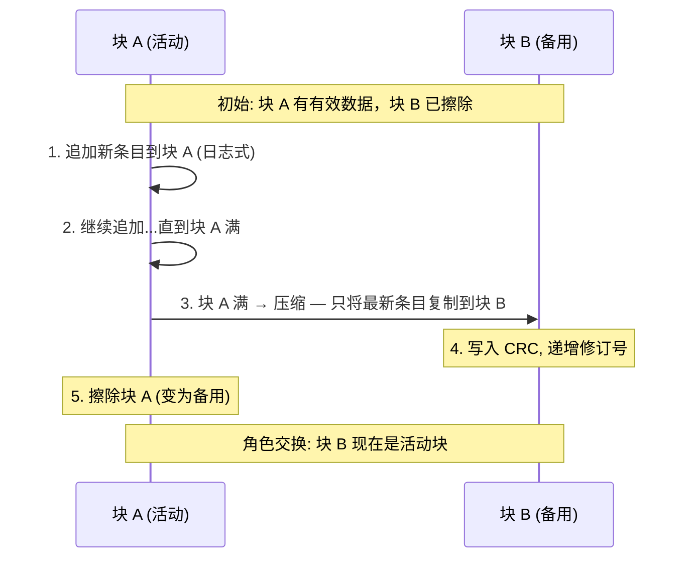

# LittleFS 元数据对与目录

## 元数据对概念

LittleFS 的每个目录（包括根目录）由**两个 Flash 块**组成一个元数据对。这是其断电安全的核心。

### 双块设计的原子提交



**为什么两个块足够**：
- 提交期间断电：正在写入的块 CRC 不完整 → 另一个块的旧状态完整可用
- 挂载时：通过 CRC 校验识别哪个块有效，修订号高 31 位决定哪个更新
- 这与数据库的 WAL (Write-Ahead Log) 思想相同——先写数据，CRC 是"提交点"

## 标签格式详解

```
位: [1|---- 11 ----|---- 10 ----|---- 10 ----]
     valid  type          id          length
```

- **valid** = 1（标签始终有效；已删除的标签设 length=0x3ff）
- **type** = `type1(3b) + chunk(8b)` — 如 NAME(0x0) + REG(0x001) = 普通文件名
- **id** = 文件 ID，`0x3ff` = 全局（不与特定文件关联）
- **length** = 标签数据长度，`0x3ff` = 已删除

## 目录条目布局

```
一个目录条目的元数据组成：

[NAME tag: 0x001 | id=N | len=M] [文件名 (M 字节)]
  └─ chunk=0x001 (REG) 或 0x002 (DIR)

[STRUCT tag: 0x202 | id=N | len=8] [头块地址: 4B] [文件大小: 4B]
  └─ 或 0x201 (INLINESTRUCT) — 小文件数据在标签内
  └─ 或 0x200 (DIRSTRUCT) — 子目录元数据对地址
```

## 目录链表

目录可以跨越多个元数据对，通过 HARDTAIL / SOFTTAIL 连接：

```
元数据对 1 (rev=42) → HARDTAIL → 元数据对 2 (rev=17) → SOFTTAIL → [下一目录]
   条目: a.txt, b.txt                      条目: c.txt, d.txt
```

- **HARDTAIL** (`0x601`)：下一个元数据对属于**同目录**（目录太大，需要多对）
- **SOFTTAIL** (`0x600`)：下一个元数据对属于**不同目录**（当前目录结束）

## 挂载恢复

挂载时 LittleFS 扫描元数据对链表：
1. 对每个元数据对：比较两个块的修订号 → 确定有效块 → CRC 校验
2. 收集所有 NAME tag → 构建目录树
3. **孤儿块回收** (Deorphan)：识别存在但不可达的块 → 标记为可分配
4. **全局状态恢复**：累加所有元数据对的 gdelta XOR → 获得当前全局状态

## 内联文件

小文件（< cache_size 字节）的数据直接存储在元数据对的 INLINESTRUCT 标签中：
- 不需要 CTZ skip-list
- 读取只需一次标签扫描
- 文件增大到超过阈值时自动转换为 CTZ

## 与 FreeRTOS 的对比

| LittleFS 机制 | FreeRTOS 概念类比 |
|--------------|------------------|
| 元数据对双块原子提交 | 消息队列的原子入队（要么全写入要么全不写入） |
| CRC 作为提交点 | 类似 `portENTER_CRITICAL` — 保护不可分割的代码段 |
| 标签日志式追加 | 类似流缓冲区的追加写入 |
| 孤儿块回收 | 类似 FreeRTOS 的 idle task 清理删除的任务 TCB |
| 全局状态 XOR 增量 | FreeRTOS 无此概念 — 数据分布在多个元数据对中 |
