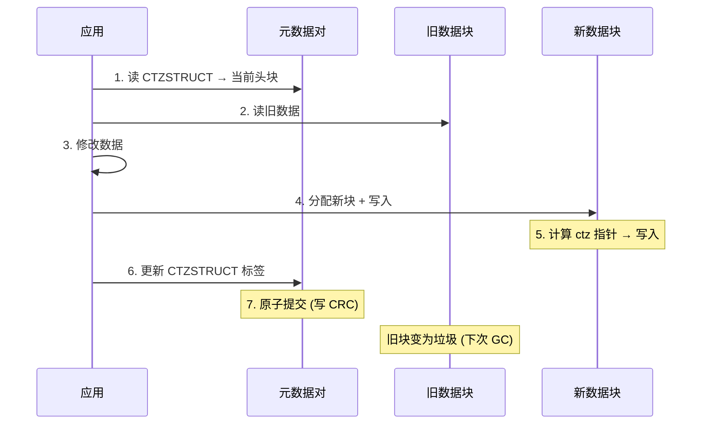

# LittleFS CTZ Skip-List 与 COW

## CTZ Skip-List 的设计动机

文件存储需要同时支持：
1. **追加写入** O(1) — 嵌入式日志场景
2. **随机读取** O(log n) — 不遍历全文件
3. **有界 RAM** — 不能缓存文件索引

简单链表追加 O(1) 但随机读 O(n)；B 树需要 O(log n) RAM。CTZ skip-list 是轻量级折衷——用极少元数据实现 O(log n) 随机访问。

## CTZ 规则

第 n 个数据块包含 `ctz(n) + 1` 个向后指针。`ctz(n)` = n 的二进制表示中末尾零的个数：

| 块 n | 二进制 | ctz(n) | 指针数 | 跳跃范围 |
|------|--------|--------|--------|---------|
| 0 | 0000 | 0 | 1 | (无) |
| 1 | 0001 | 0 | 1 | 1 步 → 块 0 |
| 2 | 0010 | 1 | 2 | 1步→块1, 2步→块0 |
| 3 | 0011 | 0 | 1 | 1 步 → 块 2 |
| 4 | 0100 | 2 | 3 | 1步→块3, 2步→块2, 4步→块0 |
| 8 | 1000 | 3 | 4 | 1,2,4,8 步 |

## 查找算法

要读文件中偏移 X (对应第 n 块)：

1. 从头块开始向后遍历
2. **贪心跳跃**：选择能覆盖目标距离的最长指针
3. 逐步缩小到目标块

复杂度：**O(log n)**，每块平均 2 个指针（证明：`lim_{n→∞} (1/n) Σ ctz(i)+1 = 2`）。

## 文件追加（COW 语义）

**追加**：O(1) — 分配新块，更新头指针，原子提交。

**中间覆盖**：需要 COW 连锁 — 修改点之后的所有块都需要复制和更新指针。复杂度 O(k log n)，k = 修改点后的块数。

## 有界 COW (CObW)

传统 COW 的连锁效应会传播到根节点。LittleFS 的"有界"含义：

> COW 连锁最多传播到**一个元数据对**的压缩操作，不会波及整个文件系统。

实现方式：
- 文件数据块 → 元数据对中的 CTZSTRUCT 指针 → 元数据对双块原子提交
- 没有比元数据对更高级别的索引

这使得修改小文件的 COW 开销极小（仅 2 个元数据块的压缩），大文件则分摊到多个数据块。

## 断电安全分析

| 断电时机 | 后果 | 恢复 |
|---------|------|------|
| 数据块写入期间 | 新块 CRC 不完整 | 旧 CTZSTRUCT 指向旧头块 → 回退 |
| CTZSTRUCT 更新期间 | 标签未完全写入 + CRC | 旧 CTZSTRUCT 仍在旧提交中 → 回退 |
| 元数据对压缩期间 | 备用块未完全写入 | 旧活动块的 CRC 完整 → 回退 |
| CRC 写入之后 | 提交完成 | 新状态有效 |

> CRC 写入是原子提交的"提交点"——CRC 之前的一切可以回退，CRC 之后的一切是定论。

## 与 FatFS 的对比

| 操作 | FatFS | LittleFS |
|------|-------|----------|
| 文件追加 | O(1) 找簇 + FAT 更新 | O(1) 新块 + CTZSTRUCT 更新 |
| 随机访问 | O(n) 遍历簇链 | O(log n) CTZ skip-list |
| 文件大小修改 | FAT 表更新 (无 COW) | COW 从修改点到尾 |
| 断电后状态 | FAT 表可能损坏 (无原子性) | 回到上一提交点 (原子) |
