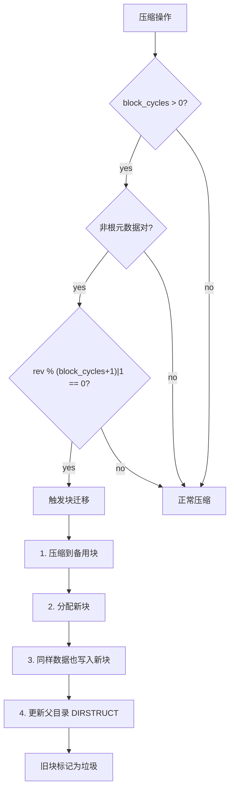

# LittleFS 磨损均衡、配置与 FatFS 对比

## 磨损均衡机制

### 元数据对内均衡

两个块交替写入，每次压缩角色互换。同一目录被反复更新时，写入在 2 个块间交替分散。

### 元数据对间均衡（块迁移）



> `(block_cycles+1)|1` 防止偶数 cycles 导致只迁移某一块（两个块修订号步进为 2）。

### 文件数据均衡

文件数据通过 COW 自然均衡 — 修改频繁的块被复制到新位置，旧块被回收。分配器使用前瞻缓冲区统计均匀分布写入。

## 前瞻缓冲区 (Lookahead Buffer)

LittleFS 不维护空闲块链表，而是**扫描整个文件系统**找空闲块：

```
前瞻缓冲区 = 32 字节 (默认)
每字节跟踪 8 块 → 32 × 8 = 256 块
4 MiB Flash (4 KiB 块 = 1024 块): 需要 1024/256 = 4 次扫描
```

位 n = 1 表示块空闲。每次分配从中取一块。扫描完一个窗口后移动到下一段。

> ⚠️ **源码验证修正**：前瞻缓冲区**不与超级块一起序列化**。挂载时通过 `lfs_alloc_drop()` 丢弃旧缓冲区，首次分配时通过 `lfs_fs_traverse_` 遍历整个文件系统重建位图。这是一个运行时临时结构，不是持久化数据。（来源：`lfs.c` `lfs_alloc` 函数，`lfs_alloc_scan` 重建逻辑）

## RAM 消耗公式

```
总 RAM = sizeof(lfs_t)
       + cache_size × 2            (读缓存 + 编程缓存)
       + cache_size × open_files   (每个打开文件)
       + lookahead_size            (前瞻缓冲区)
```

默认配置 (cache_size=64, lookahead_size=32, 3 个打开文件)：
```
≈ sizeof(lfs_t) + 64×2 + 64×3 + 32 ≈ sizeof(lfs_t) + 352 bytes
```

## 线程安全集成

```c
#ifdef LFS_THREADSAFE
struct lfs_config {
    // ...其他字段...
    int (*lock)(const struct lfs_config *c);    // FreeRTOS: xSemaphoreTake
    int (*unlock)(const struct lfs_config *c);  // FreeRTOS: xSemaphoreGive
};
#endif
```

- LittleFS 不在内部调用自己的公共 API → **非递归互斥量足够**
- 文件打开时获得文件状态 COW 快照 → 多读一写可共存

## 与 FatFS 完整对比

| 维度 | FatFS | LittleFS |
|------|-------|----------|
| **目标介质** | 块设备 (SD/eMMC/USB) | NOR Flash (SPI) |
| **文件系统类型** | FAT12/16/32 + exFAT | 自定义 COW |
| **断电安全** | ❌ 原生不支持 — FAT 表脆弱 | ✅ 元数据对 + COW + CRC |
| **磨损均衡** | ❌ 需外部层 | ✅ 内置动态 (元数据对交替 + 块迁移) |
| **PC 可读** | ✅ (FAT 通用) | ❌ (专有格式) |
| **最大分区** | FAT32: 8 TiB | ~2 GiB |
| **RAM/挂载** | ~550 字节 | ~100 字节 |
| **RAM/文件** | 512 字节 (Tiny 模式: 0) | 几十字节 |
| **代码量** | ~13 KB+ typed | ~7 KB (ARM Thumb) |
| **最大文件** | 4 GiB (FAT32) | 2 GiB - 1 |
| **文件名** | LFN: 255 Unicode | `name_max` 配置 (默认 255) |

## 选型速查

| 场景 | 推荐 |
|------|------|
| SD 卡 → PC 读取 | **FatFS** |
| SD 卡频繁日志 | FatFS + 外部日志 |
| NOR Flash 固件 OTA | **LittleFS** |
| NOR Flash 配置存储 | **LittleFS** |
| USB MSC 设备模式 | **FatFS** |
| 工业 IoT 高可靠性 | **LittleFS** |
| 极低 RAM (<4KB) | **LittleFS** |
| 大文件 (>2 GiB) | **FatFS** |
