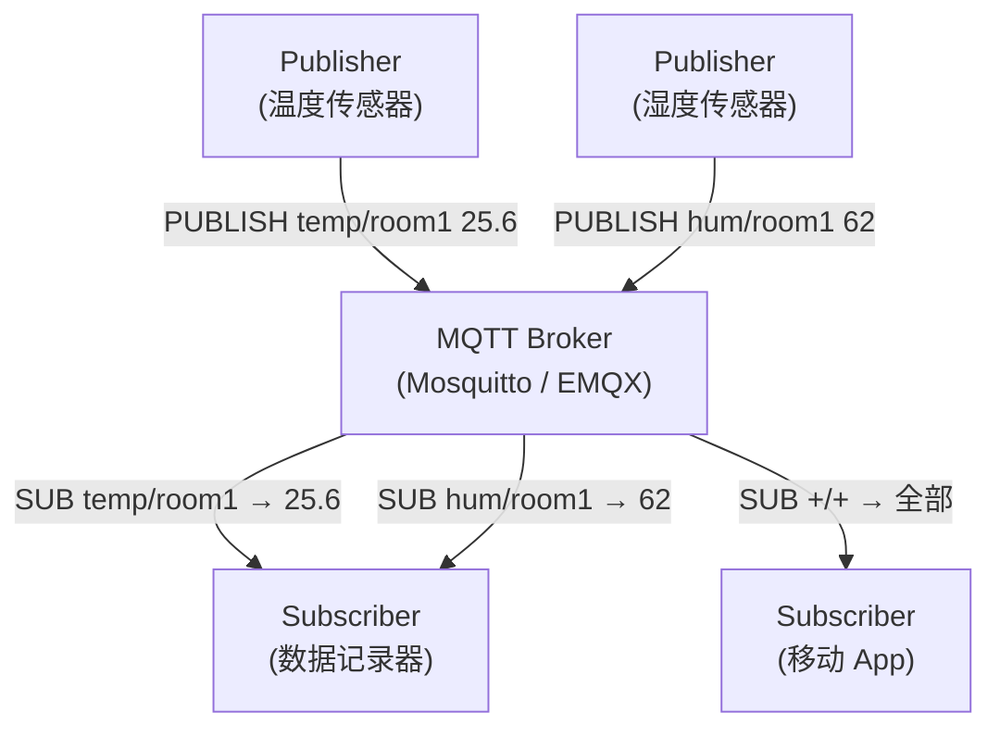
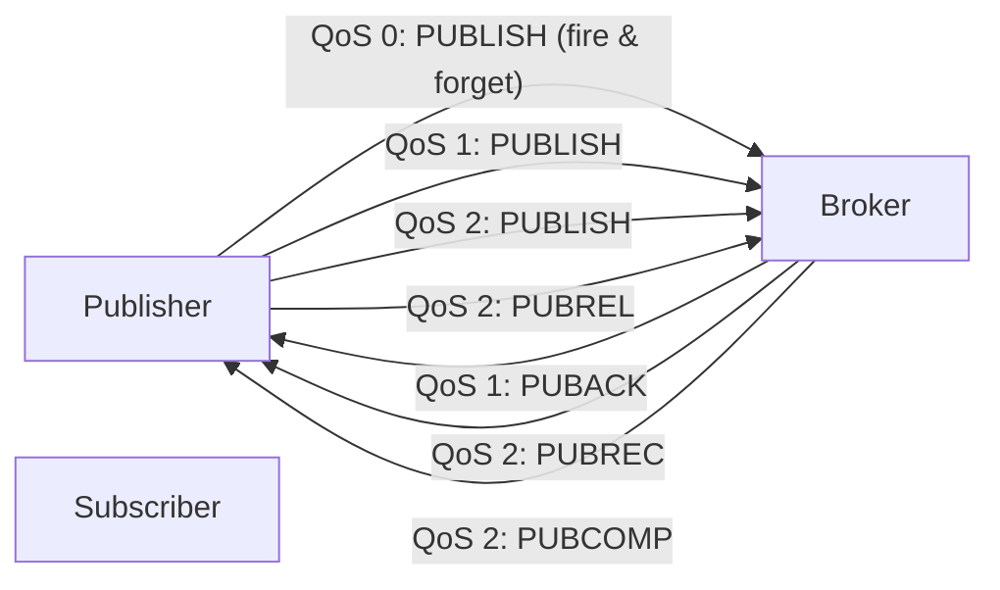

# MQTT 协议规范

> MQTT (Message Queuing Telemetry Transport) 是 OASIS 标准化的轻量级发布/订阅消息传输协议，2014 年发布 3.1.1 版本，2019 年发布 5.0。专为受限设备和低带宽、高延迟或不可靠网络设计——是 IoT 事实标准的应用层协议。本页聚焦协议核心规范；Paho Embedded-C 实现见 [嵌入式软件/MQTT nanobp/1. MQTT 协议与 Paho Embedded-C](1.%20MQTT%20协议与%20Paho%20Embedded-C.md)。

## 1. 架构模型



| 角色 | 功能 | 特点 |
|------|------|------|
| **Publisher** | 发布消息到 Topic | 不知道订阅者是谁——完全解耦 |
| **Subscriber** | 订阅 Topic 接收消息 | 不知道发布者是谁——空间解耦 |
| **Broker** | 消息路由、会话管理、QoS 保证 | 发布者和订阅者**从不直连**，时间解耦 |

### 1.1 Topic 结构

```
sensor/bedroom/temperature
sensor/bedroom/+           # 单层通配 → bedroom 下所有
sensor/#                   # 多层通配 → sensor 下所有后代
```

## 2. 报文格式

### 2.1 Fixed Header (2-5 B)

```
Byte 1:  Message Type(4b) | DUP | QoS(2b) | Retain
Byte 2+: Remaining Length (变长编码，每字节低 7-bit + MSB=延续位)
```

### 2.2 报文类型

| 类型 | 值 | 方向 | 功能 |
|------|-----|------|------|
| CONNECT | 1 | C→S | 请求连接 |
| CONNACK | 2 | S→C | 连接确认 |
| PUBLISH | 3 | C↔S | 发布消息（唯一有 Payload 的报文） |
| PUBACK | 4 | C↔S | QoS 1 确认 |
| PUBREC | 5 | C↔S | QoS 2 第一步 |
| PUBREL | 6 | C↔S | QoS 2 第二步 |
| PUBCOMP | 7 | C↔S | QoS 2 第三步 |
| SUBSCRIBE | 8 | C→S | 订阅 Topic |
| SUBACK | 9 | S→C | 订阅确认 |
| UNSUBSCRIBE | 10 | C→S | 取消订阅 |
| UNSUBACK | 11 | S→C | 取消订阅确认 |
| PINGREQ | 12 | C→S | 心跳请求 |
| PINGRESP | 13 | S→C | 心跳响应 |
| DISCONNECT | 14 | C→S | 断开连接 |
| AUTH | 15 | C↔S | 增强认证 (MQTT 5.0 新增) |

## 3. QoS (服务质量)

MQTT 的三级 QoS 是其最核心的设计：



| | QoS 0 | QoS 1 | QoS 2 |
|---|-------|-------|-------|
| **送达保证** | ≤ 1 次 (At most once) | ≥ 1 次 (At least once) | = 1 次 (Exactly once) |
| **交互次数** | 1 | 2 | 4 |
| **去重** | ❌ | ✅ (DUP flag + PacketId) | ✅ |
| **开销** | 最低 | 中 | 最高 |
| **典型场景** | 温湿度高频上报 | 设备控制指令 | 支付、固件升级 |

> [!note] QoS 不对称——发布者和订阅者的 QoS 独立。Publisher 以 QoS 2 发给 Broker，Broker 可以 QoS 1 发给 Subscriber。

## 4. 会话管理

### 4.1 Clean Session / Session Expiry

| 版本 | 字段 | 机制 |
|------|------|------|
| **MQTT 3.1.1** | Clean Session (bool) | 0=保留会话, 1=每次新建 |
| **MQTT 5.0** | Session Expiry Interval (uint32) | 0=每次新建, 0xFFFFFFFF=永久, N=秒后过期 |

### 4.2 会话状态

| 会话中保留 | 说明 |
|------------|------|
| 等待中的 QoS 1/2 消息 | Broker 离线缓存，重连后推送 |
| 未确认的 QoS 2 第二步 | 重连后继续握手 |
| 客户端订阅列表 | 重连后自动恢复订阅 |

### 4.3 遗嘱消息 (Last Will & Testament)

客户端在 CONNECT 报文中预设遗嘱消息。Broker 检测到非正常断开（Keep Alive 超时）后，自动发布该遗嘱消息。

```
CONNECT Payload:
  Will Topic:   "status/device1"
  Will Message: "offline"
  Will QoS:     1
  Will Retain:  true
```

## 5. Retained Message

| 标志 | 功能 |
|------|------|
| **RETAIN=1** | Broker 存储此消息为**该 Topic 的最新值** |
| **新订阅者** | Broker 立即发送 retained 消息给新订阅者（获取最后状态，无需等待新发布） |
| **RETAIN=0 + Zero Payload** | 删除 retained 消息 |

> [!note] Retained Message 的典型用途——传感器状态：`sensor/temp = 25.6 (Retain)` → 新监控面板订阅后立即显示 "25.6"，而不是等待下一秒的更新。

## 6. MQTT 5.0 关键新增

| 特性 | 说明 | 用途 |
|------|------|------|
| **Session Expiry** | 替代 Clean Session 布尔值 | 会话精确过期控制 |
| **Message Expiry** | PUBLISH 带 TTL | 消息超时丢弃（传感器数据过期） |
| **Shared Subscriptions** | `$share/group/topic` | 消费者群组负载均衡 |
| **Reason Code** | 所有 ACK 报文中返回操作结果 | 精确诊断 |
| **User Properties** | 任意 key-value 元数据 | 链路追踪、设备属性 |
| **Payload Format Indicator** | 区分二进制 vs UTF-8 | 正确解析 Payload |
| **Request/Response** | Response Topic + Correlation Data | 无状态的请求-应答模式 |
| **AUTH Packet** | 增强认证 (SCRAM-SHA-256 等) | 安全认证 |

### 6.1 Shared Subscriptions

```
Broker: group/commands 被 3 个处理器订阅：
  Sub1 ← group/commands (round-robin)
  Sub2 ← group/commands (round-robin)
  Sub3 ← group/commands (round-robin)
```

发布到 `group/commands` 的消息**只会被群组中的一个订阅者接收**——实现消费者负载均衡。

## 7. 安全

| 层 | 方案 | 说明 |
|----|------|------|
| **传输层** | TLS/SSL | 加密整个 MQTT 连接（端口 8883） |
| **应用层** | 用户名/密码 | CONNECT 报文明文或 SCRAM 哈希 |
| **授权** | ACL | Broker 端的 Topic 级权限控制 |

## 8. 嵌入式考量

| 考量 | 策略 |
|------|------|
| Keep Alive | 典型 60s；在受限网络（NB-IoT/LoRaWAN）上设得更长 |
| 消息大小 | MQTT 开销：固定头(2B min) + Topic + PacketId。QoS 2 有额外 4 次交互 |
| 断线重连 | 使用 Session Persistence，避免重复订阅 |
| 内存 | Paho Embedded-C 可配置为 <2 KB RAM |

## 相关页面

- [嵌入式软件/MQTT nanobp/1. MQTT 协议与 Paho Embedded-C](1.%20MQTT%20协议与%20Paho%20Embedded-C.md) — Paho Embedded-C 实现
- [嵌入式软件/MQTT nanobp/2. nanopb 与 IoT 数据序列化](2.%20nanopb%20与%20IoT%20数据序列化.md) — Protobuf 序列化传输
