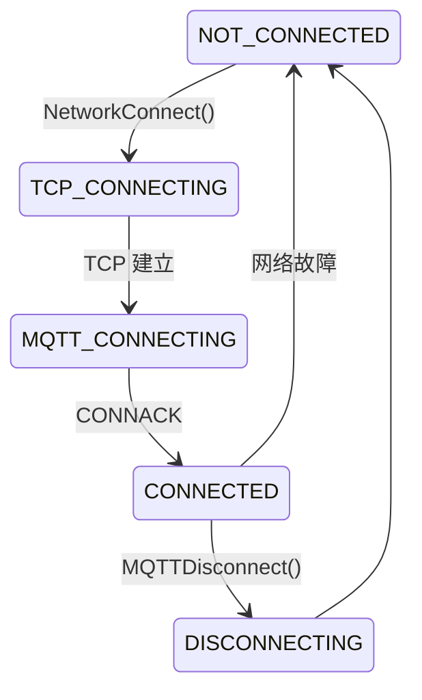
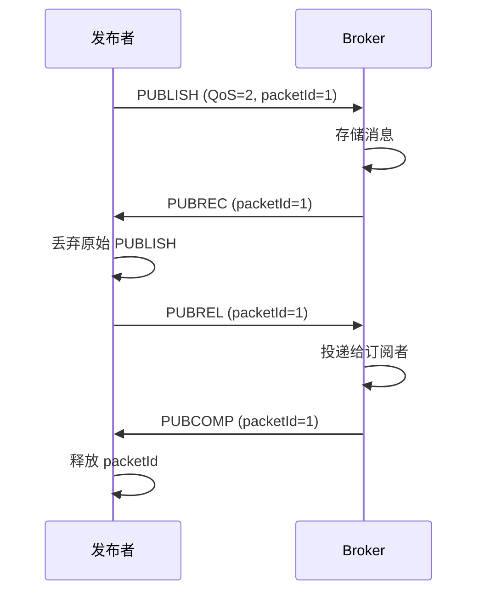

# MQTT 协议与 Paho Embedded-C

## MQTT 协议核心

MQTT (Message Queuing Telemetry Transport) 是基于 TCP 的发布/订阅协议，专为资源受限 IoT 设备设计。

### 发布/订阅模型

```
         Publisher                Broker                 Subscriber
            |                       |                       |
            |--- PUBLISH(temp=25)-->|                       |
            |                       |--- PUBLISH(temp=25)-->|
            |                       |                       |
```

发布者和订阅者完全解耦 — 互不知道对方的存在，只通过 Topic 路由。

### QoS 三级

| QoS | 名称 | 语义 | 开销 |
|-----|------|------|------|
| 0 | 最多一次 | 发即忘，无确认 | 最低 |
| 1 | 至少一次 | PUBACK 确认；未收到则重传 | 中 |
| 2 | 恰好一次 | PUBLISH → PUBREC → PUBREL → PUBCOMP 四次握手 | 最高 |

### 报文类型速查

| 报文 | 值 | 方向 | 说明 |
|------|-----|------|------|
| CONNECT | 1 | C→B | 建立会话 |
| CONNACK | 2 | B→C | 确认连接 |
| PUBLISH | 3 | 双向 | 发布消息 |
| PUBACK | 4 | 双向 | QoS 1 确认 |
| PUBREC | 5 | 双向 | QoS 2 接收 |
| PUBREL | 6 | 双向 | QoS 2 释放 |
| PUBCOMP | 7 | 双向 | QoS 2 完成 |
| SUBSCRIBE | 8 | C→B | 订阅主题 |
| SUBACK | 9 | B→C | 订阅确认 |
| UNSUBSCRIBE | 10 | C→B | 取消订阅 |
| PINGREQ | 12 | C→B | 心跳 |
| PINGRESP | 13 | B→C | 心跳响应 |
| DISCONNECT | 14 | C→B | 断开 |

### 报文格式

```
固定头 (2-5 字节):
  字节1:  [报文类型(4b) | 标志位(4b)]
  字节2-5: 剩余长度 (可变长度编码)

可变长度编码: 每字节 7 位数据 + 1 位延续位
  延续位=1: 后续还有; =0: 最后一字节
  例: 390 = 0x86 0x03 → 6 + 3×128 = 390
```

### 会话特性

- **持久会话** (cleanSession=0)：Broker 在断连期间缓存 QoS 1/2 消息
- **遗嘱消息** (Will Message)：非正常断连时 Broker 代为发布
- **Keep Alive**：指定心跳间隔，1.5 倍未收到报文则断连

## Paho Embedded-C 架构

### 分层设计

```
应用层: MQTTClient.h (MQTTClient_create, subscribe, publish, disconnect)
    │
报文层: MQTTPacket (序列化/反序列化核心 — 可独立使用)
    │
传输层: Network 结构体 (mqttread / mqttwrite 函数指针)
         Timer 结构体 (tick 定时器)
         ├── TCP socket (POSIX)
         ├── TLS (mbedTLS)
         └── 自定义 (AT 指令、串口...)
```

### 核心 API

```c
// 初始化 — 用户提供缓冲区
MQTTClient client;
MQTTClientInit(&client, &network, command_timeout_ms,
               sendbuf, sendbuf_size, readbuf, readbuf_size);

// 连接
MQTTConnect(&client, &connect_options);

// 订阅 (带消息回调)
MQTTSubscribe(&client, "sensor/imu", QOS1, messageHandler);

// 发布
MQTTPublish(&client, "sensor/imu", payload, len, QOS1, retained=0);

// 驱动接收 (单线程模式)
MQTTYield(&client, timeout_ms);

// 回调注册
MQTTClient_setCallbacks(&client,
    connectionLost,      // 连接断开
    messageArrived,      // 收到 PUBLISH
    deliveryComplete);   // QoS>0 投递完成
```

### 客户端状态机



### 线程模型

| 模式 | 机制 |
|------|------|
| **单线程** | 应用调用 `MQTTYield()` 驱动接收循环 |
| **多线程** | `MQTTStartTask()` 启动后台线程 |

Paho 用单一发送缓冲区模型 — 发→等→收，不支持流水线。

## QoS 2 握手详解



## 与 CANopenNode 的对比

用户已有的 CANopenNode 知识：

| 维度 | MQTT (Paho) | CANopenNode |
|------|------------|-------------|
| 传输层 | TCP → IP | CAN 总线 |
| 寻址 | Topic 字符串 (分层) | COB-ID (11/29-bit) |
| 连接模型 | Broker 中介的 Pub/Sub | 直接 PDO 映射 (生产者-消费者) |
| QoS | 0/1/2 (协议级) | SYNC 同步 (应用级) |
| 心跳 | PINGREQ/PINGRESP | Heartbeat (0x700+NodeId) |
| 会话 | CONNECT/CONNACK + Keep Alive | NMT 状态机 (自动) |
