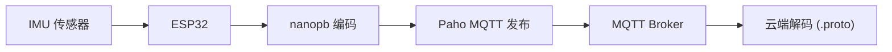

# nanopb 与 IoT 数据序列化

## Protocol Buffers 基础

Protocol Buffers 是 Google 的跨语言序列化格式。在嵌入式领域，nanopb 是标准 C 实现。

### Wire 格式

```
每个字段: tag = (field_number << 3) | wire_type, 后跟变长编码的值
```

| Wire Type | 值 | Protobuf 类型 |
|-----------|-----|--------------|
| VARINT (0) | 变长整数 | int32/64, uint32/64, bool, enum |
| 64BIT (1) | 固定 8 字节 | fixed64, double |
| LENGTH_DELIMITED (2) | 长度前缀 | string, bytes, message, packed repeated |
| 32BIT (5) | 固定 4 字节 | fixed32, float |

### 变长编码 (Varint)

与 MQTT 剩余长度相同的编码：每字节 7 位数值 + 最高位延续标记。小正整数（如传感器时间戳）压缩性好。

## nanopb 架构

### 组件

```
.proto 文件 → protoc + nanopb_generator.py → .pb.h + .pb.c → 编译进固件
```

运行时库仅 4 个文件：`pb.h`, `pb_encode.c/h`, `pb_decode.c/h`, `pb_common.c/h`

### 生成结构体示例

```protobuf
message ImuReading {
    required uint32 timestamp = 1;
    repeated float accel = 2 [(nanopb).max_count = 3];
    optional float temperature = 3;
}
```

生成 C 结构体：
```c
typedef struct _ImuReading {
    uint32_t timestamp;
    size_t accel_count;          // repeated 字段的元素数
    float accel[3];              // max_count=3
    bool has_temperature;        // optional 字段的标志
    float temperature;
} ImuReading;
```

### 静态分配 — nanopb 的核心优势

三种分配策略，按字段控制：

| 策略 | 说明 | 需要 malloc? |
|------|------|-------------|
| `FT_STATIC` (默认) | 数据内联在结构体中 | ❌ |
| `FT_CALLBACK` | 应用函数按需处理 | ❌ |
| `FT_POINTER` | 指向堆分配的指针 | ✅ |

### 编码/解码

```c
// 编码 — 传感器到 MQTT
uint8_t buffer[128];
pb_ostream_t stream = pb_ostream_from_buffer(buffer, sizeof(buffer));

ImuReading msg = ImuReading_init_zero;
msg.timestamp = esp_timer_get_time() / 1000;
msg.accel_count = 3;
msg.accel[0] = ax; msg.accel[1] = ay; msg.accel[2] = az;

pb_encode(&stream, ImuReading_fields, &msg);
// stream.bytes_written 字节已编码

// 解码 — MQTT 到云端
ImuReading msg = ImuReading_init_zero;
pb_istream_t stream = pb_istream_from_buffer(rx_buffer, rx_len);
pb_decode(&stream, ImuReading_fields, &msg);
```

### 关键选项

| 选项 | 作用 |
|------|------|
| `max_size` | string/bytes 的最大字节数 |
| `max_count` | repeated 字段的最大元素数 |
| `fixed_length` | bytes 不加 size 包装 |
| `type: FT_CALLBACK` | 流式编码/解码 |

## ESP32/IMU 完整 IoT 数据链路



### 对比 JSON 的优势

对于典型 IMU 数据 (时间戳 + 3 轴加速度 + 3 轴陀螺仪 + 温度)：

| 格式 | 大小 | RAM 需求 |
|------|------|----------|
| JSON | ~150+ 字节 | malloc + 解析器 |
| nanopb | ~40 字节 | 静态分配 |
| 节省 | **~73%** | 零动态分配 |

## nanopb vs 其他序列化

| 格式 | 大小 | 需要模式 | 零拷贝 | 适合 MCU |
|------|------|---------|--------|---------|
| **nanopb** | ~30% | ✅ | ❌ | ✅ 最佳 |
| JSON | 100% (基线) | ❌ | ❌ | ❌ 体积大 |
| CBOR | ~70% | ❌ | ❌ | 中等 |
| FlatBuffers | ~40-60% | ✅ | ✅ | 好 (代码更大) |

nanopb 用字段号替代 JSON 的字符串 key → 体积减少 60-80%，且编译时强类型。

## MQTT + nanopb 组合模式

```c
// IoT 传感器任务的标准模式 (FreeRTOS)
void sensor_task(void *params) {
    uint8_t tx_buf[128];
    ImuData msg = ImuData_init_zero;

    while (1) {
        // 1. 读传感器
        read_imu(&msg);

        // 2. nanopb 序列化
        pb_ostream_t stream = pb_ostream_from_buffer(tx_buf, sizeof(tx_buf));
        pb_encode(&stream, ImuData_fields, &msg);

        // 3. MQTT 发布
        MQTTPublish(&client, "sensor/imu", tx_buf,
                    stream.bytes_written, QOS1, 0);

        vTaskDelay(pdMS_TO_TICKS(10));  // 100Hz
    }
}
```

## 与 SlimeVR 协议的关系

用户已有的 SlimeVR 协议知识：

| 维度 | SlimeVR UDP 协议 | MQTT + nanopb |
|------|-----------------|---------------|
| 传输 | UDP (无连接) | TCP (可靠) |
| 序列化 | 自定义大端序二进制 | Protobuf 标准格式 |
| 寻址 | IP:Port | Topic (更灵活) |
| QoS | 无 (UDP 丢包) | 0/1/2 (可控) |
| 适用场景 | 局域网高频追踪 (100Hz+) | 广域网 IoT 遥测 (1-10Hz) |
