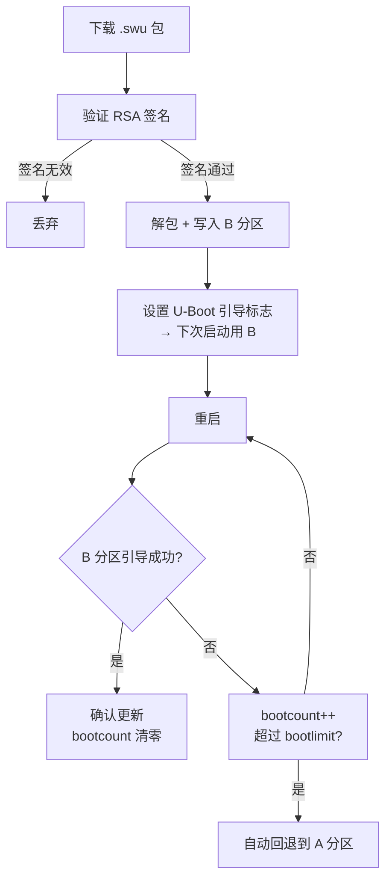

# SWUpdate 嵌入式 Linux OTA

> SWUpdate 是嵌入式 Linux 最广泛使用的开源 OTA 更新框架（GPL-2.0, 1841 Star, Stefano Babic 维护）。Yocto Project 和 Buildroot 官方集成组件。核心哲学：**确认能跑起来才切过去**——不是"下载然后覆盖"，而是双分区原子替换 + 自动回退。

## 1. 与 MCU OTA 的本质区别

| | MCU IAP (bare metal) | SWUpdate (Linux) |
|---|---------------------|-------------------|
| 存储 | Flash 分区 (Boot+App+Download) | A/B 完整系统分区 (各 4GB+) |
| 回退 | 手动或简单标志位 | U-Boot bootcount 自动回退 |
| 更新粒度 | 单个固件 .bin | rootfs + kernel + U-Boot + DTB + MCU/FPGA |
| 签名 | 可选 CRC/MD5 | RSA 公钥强制验证 |
| 脚本 | 无 | 内置 Lua 解释器 |
| 服务端 | 串口/蓝牙/USB 本地 | HTTP / hawkBit 远程 |
| 增量 | 差分包 (少数方案) | librsync delta update |

> Bare metal MCU 的 IAP/OTA 方案见 [嵌入式软件/MCU 固件升级 IAP OTA 实战](../../知识/嵌入式软件/MCU%20固件升级%20IAP%20OTA%20实战.md)。

## 2. 核心机制：双副本 (Dual-Copy)



**关键不变量**：在确认 B 分区能成功引导之前，A 分区原封不动。以下任何一步失败都不会导致变砖：

- 下载中断 → A 分区完好，再来一次
- 签名不符 → 丢弃 .swu，不写入
- 写 Flash 时断电 → B 分区未标记为可引导，U-Boot 继续从 A 启动
- B 分区引导崩溃 → bootcount 机制切回 A

U-Boot 实现：

```c
// U-Boot 环境变量
bootcount = 0        // 每次启动自动递增
bootlimit = 3        // 连续失败 N 次后切换
altbootcmd = ...     // 回退到备用分区的引导命令
```

## 3. .swu 包结构

一个 `.swu` 文件是 **cpio** 压缩包：

```
update.swu
├── sw-description          # 描述文件（更新什么、怎么装）
├── rootfs.ext4.gz          # 根文件系统镜像
├── kernel.itb              # 内核 + DTB FIT 镜像
├── u-boot.bin              # (可选) 引导加载程序
├── mcu-firmware.bin        # (可选) 协处理器固件
└── sw-description.sig      # (可选) RSA 签名文件
```

### sw-description 示例

```
software =
{
    version = "1.1.0";
    hardware-compatibility: ["rev1.0", "rev1.1"];

    images: (
        {
            filename = "rootfs.ext4.gz";
            device = "/dev/mmcblk0p2";
            type = "raw";
            compressed = "zlib";
        },
        {
            filename = "kernel.itb";
            device = "/dev/mmcblk0p1";
            type = "raw";
        }
    );

    scripts: (
        {
            filename = "pre-install.lua";
            type = "lua";
        }
    );
}
```

| 字段 | 说明 |
|------|------|
| `version` | 语义版本，SWUpdate 比较新旧版本决定是否安装 |
| `hardware-compatibility` | **防止推到错误的硬件**——不匹配直接拒绝 |
| `images[].device` | 目标块设备或 MTD 分区 |
| `images[].type` | `raw` (裸写)、`ubivol` (UBI 卷)、`uboot` (U-Boot 环境) 等 |
| `images[].compressed` | `zlib` / `zstd` / 无 |

## 4. 更新目标：不只是 rootfs

| 目标 | 说明 | type 值 |
|------|------|---------|
| rootfs | 完整根文件系统 | `raw` / `ubivol` |
| Linux 内核 | FIT 镜像或 zImage | `raw` / `uboot` |
| U-Boot | 引导加载程序 | `uboot` |
| Device Tree | 设备树二进制 | `raw` |
| MCU 固件 | 通过自定义 handler | `raw` + shell 脚本 |
| FPGA 比特流 | 通过自定义 handler | `raw` + shell 脚本 |
| U-Boot 环境变量 | 批量修改引导参数 | `uboot` |

## 5. Lua 钩子 — 自定义更新逻辑

SWUpdate 内置 Lua 解释器，暴露 `pre_install()` 和 `post_install()` 两个标准钩子：

```lua
-- 更新前检查电池
function pre_install()
    local battery = read_battery_mv()
    if battery < 3300 then
        swupdate.error("电池电量不足，取消更新")
        return 1       -- 非零 = 中止更新
    end
    return 0           -- 零 = 继续
end

-- 更新后备份校准数据
function post_install()
    swupdate.copyfile("/dev/mtd3", "/data/calib-backup.bin")
end
```

Lua 运行在 SWUpdate 进程内，不需要额外启动脚本解释器。

## 6. 安全：双层保护


| 层 | 技术 | 密钥存储 |
|----|------|----------|
| **签名** (强制) | RSA 私钥签名 → 设备公钥验证 | 公钥编译进 SWUpdate 或存于 U-Boot 环境 |
| **加密** (可选) | AES-256-CBC 对称加密 | TPM / CAAM (i.MX) / OP-TEE 安全存储 |
| **TLS 库** | OpenSSL / mbedTLS / WolfSSL | 三选一，编译时确定 |

> 签不过的 .swu 直接丢弃，不安装——不是"弹个警告"，是根本不解包。

## 7. 增量更新 (Delta Update)

基于 **librsync** — 只传输新旧版本之间的差异块：

```
全量: 200MB rootfs → 4G 网络传输 200MB → 写 Flash 200MB
增量: 200MB rootfs → librsync 计算差异 (5-20MB) → 传输 5-20MB → 设备端用旧版本 + 差异重建 200MB
```

对 4G/低带宽 IoT 设备至关重要。注意：增量只在旧 rootfs 没有全量改动时有效——如果整个文件系统被重新生成（Yocto 全量重编），差异可能接近全量。

## 8. 构建集成

### Yocto

```bitbake
# local.conf
IMAGE_INSTALL:append = " swupdate"
```

加上 `meta-swupdate` 层后自动打包进固件。`meta-swupdate-boards` 提供树莓派和 BeagleBone 参考配置。

### Buildroot

```bash
make menuconfig
# Target packages → System tools → [*] swupdate
```

### 独立编译

```bash
git clone https://github.com/sbabic/swupdate
make menuconfig   # Kconfig 风格配置界面
make
```

## 9. 局限

| 局限 | 说明 | 对策 |
|------|------|------|
| **无内置服务端** | 需自建 HTTP 或对接 hawkBit | 静态文件服务器即可；hawkBit 免费开源 |
| **仅 Linux 用户空间** | 不能给 bare metal MCU 做 OTA | MCU 用 MCUBoot / ESP OTA |
| **双分区占空间** | 8GB eMMC 实际可用 4GB | 增量更新可缓解（不全量写入） |
| **需 U-Boot 配合** | bootcount/bootlimit 依赖 U-Boot | 硬件定型前务必留出双分区 |

## 10. 选型决策

```
用 SWUpdate:
  ✅ Yocto/Buildroot 构建的嵌入式 Linux
  ✅ eMMC/SD 卡存储，>1GB
  ✅ 需要远程可靠更新 + 防变砖回退
  ✅ 需要更新多个组件 (rootfs + kernel + U-Boot + MCU)

不用 SWUpdate:
  ❌ Bare metal MCU → 见 MCU IAP/OTA 页
  ❌ 纯 Android/Linux 桌面 → GNOME Software / fwupd
  ❌ 存储 <128MB 且不能双分区 → ramdisk rootfs + 全量下载
```

## 相关页面

- [嵌入式软件/MCU 固件升级 IAP OTA 实战](../../知识/嵌入式软件/MCU%20固件升级%20IAP%20OTA%20实战.md) — Bare metal MCU 固件升级方案
- [嵌入式软件/嵌入式固件开发流程](../../知识/嵌入式软件/嵌入式固件开发流程.md) — 固件开发的完整生命周期
